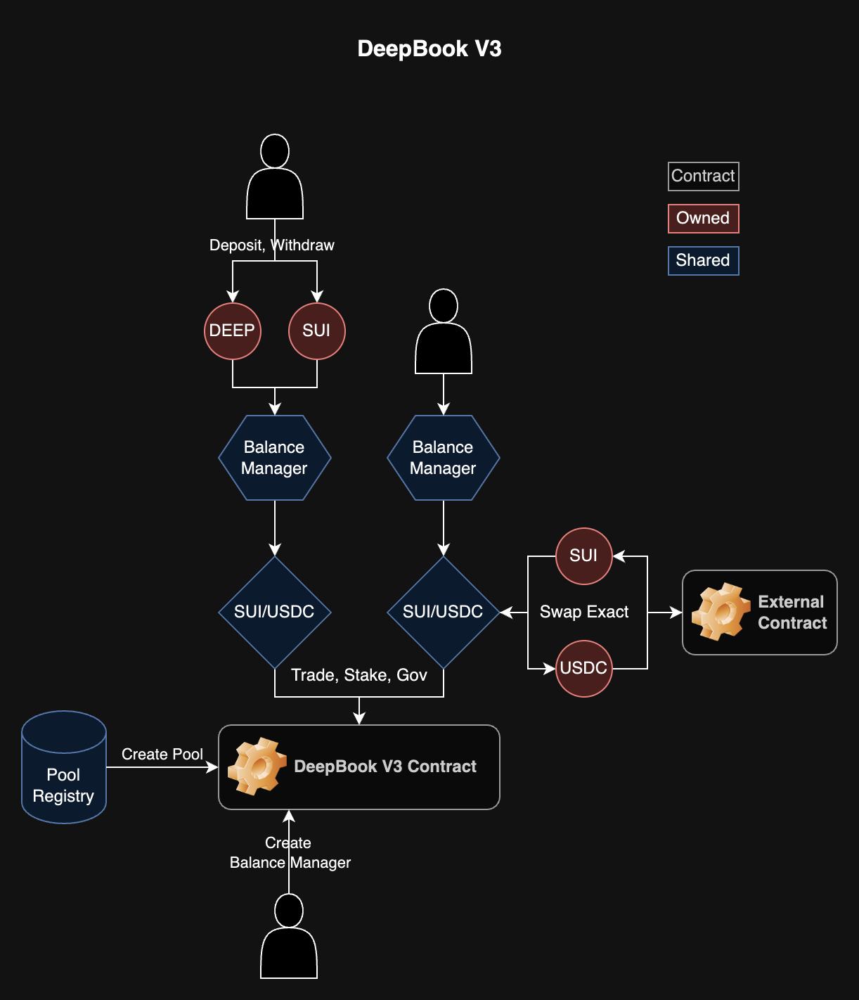

# DeepBook V3

DeepBook V3 is a next generation decentralized central limit order book (CLOB) built on Sui. It leverages Sui's parallel execution and low transaction fees to bring a highly performant, low latency exchange on chain. DBv3 comes with brand new features including flashloans, governance, improved account abstraction, and enhancements to the existing matching engine. With the addition of the DEEP token, staked takers can trade with fees as low as 0.25 bps / 2.5 bps on stable and volatile pairs, while allowing staked makers to earn rebates. Checkout the full whitepaper on [deepbook.tech](https://deepbook.tech).

## DeepBook V3 Information

- [Package and Pools](https://docs.google.com/document/d/1uK4MNqYa0LdhVqBD4KqOcWG1N1nNNe3JwbeUZc1kH1I)
- [Contract Documentation](https://docs.sui.io/standards/deepbookv3)
- [SDK Documentation](https://docs.sui.io/standards/deepbookv3-sdk)
- [Example SDK Usage](https://github.com/MystenLabs/ts-sdks/tree/main/packages/deepbook-v3/examples)
- [Whitepaper](https://cdn.prod.website-files.com/65fdccb65290aeb1c597b611/66059b44041261e3fe4a330d_deepbook_whitepaper.pdf)
- [Rust SDK(Unofficial)](https://github.com/hoh-zone/sui-deepbookv3)

## DeepBook Architecture

## Balance Manager

The `BalanceManager` is a shared object that holds all balances of a single account. It has one owner and can have up to 1000 traders. When creating a `BalanceManager`, the sender of the transaction becomes the owner. The owner can add or remove traders. The owner cannot be changed.
The owner can deposit and withdraw funds from the `BalanceManager` as well as place orders, stake, and more. A trader cannot deposit and withdraw funds, but can do everything else. All actions are shared between owner/traders. For example, one trader can cancel an order placed by another trader within the same `BalanceManager`.
With exception to swaps, all interactions with DeepBook will require a `BalanceManager` as one of its inputs. When orders are matched, funds will be transferred to / from the `BalanceManager`. A single `BalanceManager` can be used between all pools.

## Pool

`Pool` is made up of three distinct parts: Book, State and Vault. These parts define the flow for the different types of actions that can be performed on DeepBook.

1.  Book - manages reading and writing to the order book. It fills orders and places orders into the order book.
2.  State - the most complex: maintains individual user data, overall volumes, historic volumes, and governance.
3.  Vault - the least complex: settles users funds after action execution.

Users can place, modify and cancel limit / market orders. These actions will require a funded `BalanceManager` with the appropriate amount of base and quote tokens as well as DEEP tokens for trading fees. DBv3 also supports direct swaps, allowing users as well as protocols building on top of DBv3 to place market orders with `Coin` objects as inputs drectly and receive `Coin` objects as outputs.

## $DEEP

### Trading Fees

In the initial release, all pool creation will be permissioned and DEEP tokens will be required to pay for trading fees. In the future upgrades, these restrictions will be removed, but usage of the DEEP token will still be incentivized. Both takers and makers will pay fees in DEEP, but makers with enough staked DEEP tokens will be eligible for rebates at the end of every epoch. Excess DEEP accumulated by all pools will be burned on a regular basis.
DEEP/SUI and DEEP/USDC pools will be launched and whitelisted. Whitelisted pools have 0% trading fees. This allows users to easily obtain DEEP tokens to pay for trading fees in non DEEP pools.

### DEEP Staking & Governance

DEEP tokens can be staked in individual pools, granting the staker access to governance. If the amount of DEEP tokens staked is greater than the pool's stake required, then that user will be able to reap additional benefits from the pool. These benefits include halved trading fees after reaching a trade volume requirement, as well as maker rebates. During every epoch, staked users can submit proposals to change three parameters: taker fees, maker fees, and stake required. If the proposal passes quorum, 1/2 of all current stake, then its effects will be live from the next epoch and onwards.
