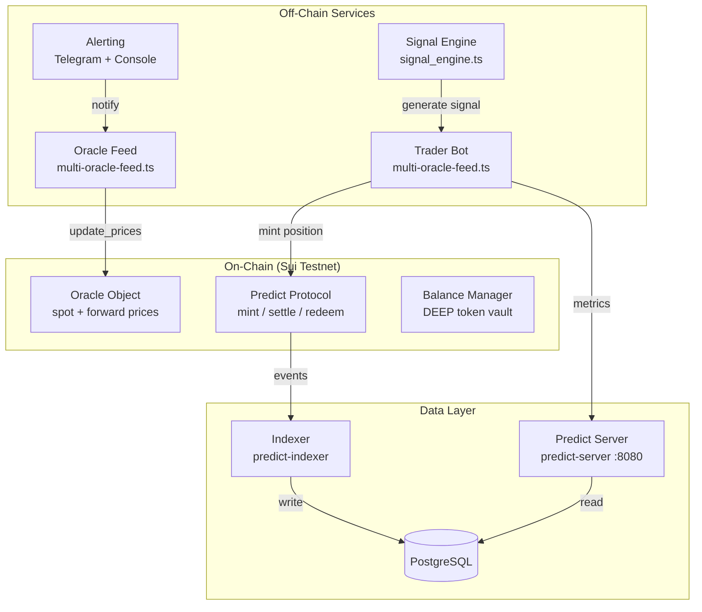

# DeepBook V3 — Predict Protocol

[](https://github.com/MystenLabs/deepbookv3/actions/workflows/move_test.yml)
[](https://github.com/MystenLabs/deepbookv3/actions/workflows/rust.yml)
[](https://github.com/MystenLabs/deepbookv3/actions/workflows/deploy-predict.yml)
[](https://github.com/MystenLabs/deepbookv3/actions/workflows/predict-bench.yml)
[](https://github.com/MystenLabs/deepbookv3/actions/workflows/backtest.yml)
[](LICENSE)
[](https:// sui.io)

> On-chain prediction markets built on DeepBook V3. Trade price direction (UP/DOWN) for BTC, ETH, and DEEP using Black-Scholes-inspired oracles and a multi-signal trading engine.

## Architecture


```mermaid
flowchart TB
    subgraph OffChain["Off-Chain Services"]
        OE[Oracle Feed<br/>multi-oracle-feed.ts]
        SE[Signal Engine<br/>signal_engine.ts]
        TR[Trader Bot<br/>multi-oracle-feed.ts]
        AL[Alerting<br/>Telegram + Console]
    end

    subgraph OnChain["On-Chain (Sui Testnet)"]
        OR[Oracle Object<br/>spot + forward prices]
        PR[Predict Protocol<br/>mint / settle / redeem]
        BM[Balance Manager<br/>DEEP token vault]
    end

    subgraph DataLayer["Data Layer"]
        PG[(PostgreSQL)]
        IDX[Indexer<br/>predict-indexer]
        API[Predict Server<br/>predict-server :8080]
    end

    OE -->|update_prices| OR
    SE -->|generate signal| TR
    TR -->|mint position| PR
    PR -->|events| IDX
    IDX -->|write| PG
    API -->|read| PG
    AL -->|notify| OE
    TR -->|metrics| API
```

## How It Works

### 1. Oracle System

Each market (BTC, ETH, DEEP) has an on-chain **Oracle** that stores:
- **Spot price** — current market price (Binance/Bybit)
- **Forward price** — theoretical forward via cost-of-carry model
- **SVI parameters** — simplified volatility surface for options pricing
- **Staleness threshold** — maximum age before requiring an update

Oracles auto-rotate every 8 hours. A 15-minute buffer before expiry triggers rotation to a fresh oracle.

### 2. Signal Engine

The trading bot uses a multi-factor signal engine:

| Component | Weight | Description |
|-----------|--------|-------------|
| RSI (14-period) | 25% | Wilder's smoothing, overbought/oversold |
| EMA Crossover (9/21) | 25% | Trend confirmation |
| Momentum (5-period ROC) | 20% | Price momentum |
| Volume Profile | 10% | Relative volume confirmation |
| Volatility Filter (ATR) | 10% | Penalizes high-volatility regimes |
| ML Ensemble | 10% | Gradient boosting prediction |

**Position sizing** uses the Kelly Criterion with a 25% safety fraction and session-based multipliers (US > EU > Asian > Off-hours).

### 3. Trading Flow

```
Cycle (every 60s):
  for each market (BTC, ETH, DEEP):
    1. Validate oracle state
    2. If UPDATING → update prices on-chain
    3. If FRESH/TRADE_READY → generate signal → mint position
    4. If EXPIRED → rotate oracle
    5. Settle expired positions
    6. Claim winning positions
    7. Emit metrics
```

### 4. Risk Management

- **Max position size**: Kelly Criterion caps at 50% of balance
- **Session filter**: Reduced size during low-liquidity sessions
- **Confidence threshold**: Signals below 0.05 confidence are skipped
- **Claim retry limit**: 3 attempts before marking position as FAILED
- **Staleness guard**: Double-threshold check before trade execution

## Quick Start

### Docker (Recommended)

```bash
# Clone and configure
git clone https://github.com/MystenLabs/deepbookv3.git
cd deepbookv3
cp .env.example .env  # Fill in your keys

# Start all services
docker compose -f docker-compose.predict.yml up -d
```

Services:
- **Oracle**: feeds prices on-chain
- **Indexer**: ingests events to PostgreSQL
- **Server**: REST API on `:8080`
- **Trader**: autonomous signal → trade execution

### Local Development

```bash
# Install dependencies
pnpm install

# Run oracle feed
pnpm run start:oracle

# Run predict server
cargo run -p deepbook-predict-server -- --database-url postgres://postgres@localhost/predict
```

### API Endpoints

| Endpoint | Description |
|----------|-------------|
| `GET /api/v1/vaults` | List all vaults |
| `GET /api/v1/oracles` | List all oracles |
| `GET /api/v1/positions/:manager_id` | User positions |
| `GET /api/v1/events/minted?trader=` | Mint events |
| `GET /api/v1/events/redeemed?owner=` | Redeem events |
| `GET /api/v1/metrics` | Prometheus metrics |

## Monitoring

### Prometheus Metrics

Available at `/api/v1/metrics`:

| Metric | Type | Description |
|--------|------|-------------|
| `predict_oracle_updates_total` | counter | Total oracle price updates |
| `predict_trades_executed_total` | counter | Total trades executed |
| `predict_trades_failed_total` | counter | Total failed trades |
| `predict_positions_open` | gauge | Currently open positions |
| `predict_positions_settled_total` | counter | Total settled positions |
| `predict_positions_claimed_total` | counter | Total claimed positions |
| `predict_rpc_requests_total` | counter | Total RPC requests to Sui |

### Alerting

Configure Telegram alerts by setting environment variables:

```env
TELEGRAM_BOT_TOKEN=your_bot_token
TELEGRAM_CHAT_ID=your_chat_id
```

Alerts fire on:
- Oracle rotation failures
- Trade execution errors
- Low SUI/DEEP balance warnings
- Settlement failures

## Project Structure

```
├── packages/
│   └── predict/              # Move contracts
│       ├── sources/
│       │   ├── oracle.move          # Oracle price feed
│       │   ├── predict.move         # Core prediction logic
│       │   ├── predict_manager.move # Position management
│       │   ├── registry.move        # Oracle registry
│       │   ├── vault/               # Token vault
│       │   ├── accounting/          # PnL accounting
│       │   └── market_key/          # Market key definitions
│       └── tests/                  # Move unit tests
├── crates/
│   ├── predict-server/       # Rust REST API + Prometheus
│   ├── predict-indexer/      # Sui event indexer
│   └── predict-schema/       # Database schema
├── scripts/
│   ├── services/
│   │   ├── multi-oracle-feed.ts     # Main trading loop (dynamic config)
│   │   ├── multi-oracle-service.ts  # Oracle management
│   │   ├── signal_engine.ts         # Multi-factor signal generation
│   │   ├── validation-engine.ts     # Position tracking & settlement
│   │   ├── backtest.ts              # Historical backtesting engine
│   │   ├── alerting.ts              # Alert system (console + file)
│   │   └── telegram-alerting.ts     # Telegram notifications
│   └── config/
│       ├── constants.ts        # Network-specific IDs
│       ├── markets.json        # Dynamic market configuration
│       └── market-config.ts    # Config loader
├── docker/                   # Dockerfiles for all services
└── docker-compose.predict.yml
```

## Move Contract Details

### Key Functions

| Module | Function | Description |
|--------|----------|-------------|
| `oracle` | `update_prices` | Update spot & forward prices |
| `oracle` | `update_svi` | Update volatility surface |
| `oracle` | `activate` | Activate an oracle |
| `predict` | `mint` | Mint an UP/DOWN position |
| `predict` | `settle` | Settle expired oracle |
| `predict` | `redeem` | Claim winning position |
| `registry` | `create_oracle` | Create new oracle with grid config |

### Position Lifecycle

```
MINTED → OPEN → SETTLED → CLAIMABLE → CLAIMED
                   ↓
                FAILED (if claim fails 3x)
```

## Testing

```bash
# Move tests
sui move test --path packages/predict --gas-limit 100000000000

# Rust tests
cargo nextest run -E 'package(deepbook-indexer)'

# Backtest (fetches historical data from Binance)
pnpm run backtest BTC 10000 --days 7
pnpm run backtest ETH 5000 --days 30

# Gas benchmarks
# Triggered automatically on push to main via predict-bench.yml
```

### Backtesting Results

The backtest engine simulates the signal engine against historical 15m candles with:
- **Stop-loss / Take-profit** (3% / 5%)
- **Kelly Criterion** position sizing
- **Confidence threshold** filtering (15% minimum)
- **Session-aware** multipliers

Output includes: win rate, Sharpe ratio, max drawdown, profit factor, and trade log.

## Dynamic Market Configuration

Markets are configured in `scripts/config/markets.json`. To add a new market:

```json
{
  "asset": "SUI",
  "oracleEnvKey": "SUI_ORACLE_ID",
  "quoteAssetEnvKey": "DEEP_TYPE",
  "minStrikeEnvKey": "SUI_MIN_STRIKE",
  "tickSizeEnvKey": "SUI_TICK_SIZE",
  "defaults": {
    "minStrike": "1000000000",
    "tickSize": "10000000"
  },
  "enabled": true
}
```

Then set the corresponding env vars and restart the oracle feed. No code changes needed.

## Security

See [SECURITY.md](SECURITY.md) for key management, operational security, and vulnerability reporting.

## Contributing

See [CONTRIBUTING.md](CONTRIBUTING.md) for development setup, code style, and PR guidelines.

## DeepBook V3 Information

- [Contract Documentation](https://docs.sui.io/standards/deepbookv3)
- [SDK Documentation](https://docs.sui.io/standards/deepbookv3-sdk)
- [Whitepaper](https://cdn.prod.website-files.com/65fdccb65290aeb1c597b611/66059b44041261e3fe4a330d_deepbook_whitepaper.pdf)

## License

Apache 2.0 — see [LICENSE](LICENSE)
