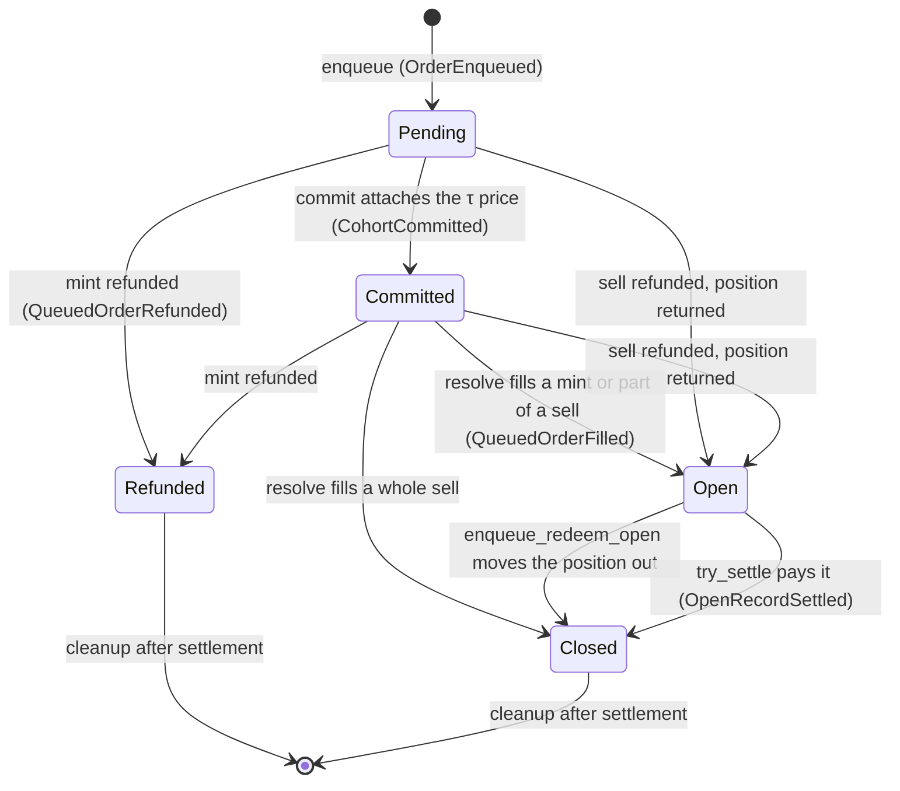

# Delayed execution

From package version 4, Predict fills mints and early sells after a short delay, 800 ms at launch, instead of inside the trader's own transaction. A trader places an order with its limits and its money. The order waits in its market's queue until Pyth Lazer publishes its signed price for the order's price time, τ. Anyone can then attach that price and fill the order, or refund it. This page describes how orders queue, commit, and resolve, what a filled order becomes, how refunds work, how settlement pays and cleans up the queue, and the policy that governs all of it.

The immediate paths this replaces are described in [markets and positions](./markets-and-positions.md). The trust assumptions and failure modes are in [risks](../risks.md#delayed-execution). Decision identifiers such as DX-13 refer to the delayed-execution decision records.

## Why orders wait

An immediate trade prices at the on-chain Pyth spot of its own transaction. That spot reaches the chain a moment after the price moved on faster venues, so a trader who watches those venues can know the fill price is stale before sending the trade. A queued order is priced at Pyth's signed price for a fixed instant after it is placed. Nobody picks that instant or that price, and by τ the price already reflects what the trader could see when placing the order.

## The cutover

`ProtocolConfig.version_watermark` is also the delayed-execution cutover (DX-21). Package version 4 compiles `current_version!() == 4`, and the cutover is reached once an admin runs `bump_version_watermark` from it.

- Every `enqueue_*` call aborts `ECutoverNotReached` until the watermark reaches `current_version!()`. The bump also retires every older package version, so no package that knows nothing about the queue can run while an order waits.
- From the cutover, `mint_exact_quantity`, `mint_exact_amount`, `mint_exact_cost`, and `redeem_live` keep their signatures and abort `EDelayedExecutionRequired`. Before it they still execute immediately.
- `redeem_settled` and `redeem_settled_permissionless` are unchanged. They pay positions that immediate mints left in accounts before the cutover. A v4 fill never enters an account, so they never pay one.
- The mint quotes (`quote_mint`, `quote_mint_for_account`, `quote_mint_exact_cost_for_account`) still run. They price an immediate mint at the live mark with a congestion surcharge, so they estimate a queued fill rather than reproduce it.
- The delayed-execution policy must exist before any order. `init_delayed_execution_policy` writes it with the compiled defaults. Until then enqueue, commit, and resolve abort `EPolicyNotInitialized`.
- `finish_flush` accepts only flush operators in package version 4, so the flush keeper's address goes on the [flush-operator allowlist](#the-flush-operator-allowlist) before the keeper moves to it.

The watermark only moves up, so the cutover cannot be undone.

## Who calls what

A trader, or a session acting for the trader, places orders. Everything after placement is open to anyone: `commit`, `resolve`, `refund`, `rebalance_expiry_cash`, `try_settle`, and `cleanup` (DX-5). The protocol's fill keeper normally runs all of them, but it has no special rights. Only an admin can change the policy, refund orders by ID, or edit the flush-operator allowlist, and only a flush operator can finish an LP flush.

## Records and statuses

Each market keeps one `OrderBook` in a dynamic field under its `ExpiryMarket`, created by the market's first order. The placing trader pays its storage. Each order is one `QueuedOrder` record, keyed by a sequential `u64` record ID. A record ID is not the packed `u256` order ID of a position.

| Status | Code | Meaning | Leaves the status by |
| --- | --- | --- | --- |
| Pending | 0 | Waiting for its cohort's price | Commit, or a refund |
| Committed | 1 | Priced, waiting for resolve | A fill or a refund |
| Open | 2 | Holds a position: a filled mint, the rest of a partial sell, or a refunded sell | An early sell, or the settlement payout |
| Refunded | 3 | A refunded mint | `cleanup` after settlement |
| Closed | 4 | Its position was sold, moved to a sell, or paid at settlement | `cleanup` after settlement |
| RefundDue | 5 | Reserved. Nothing sets it in v4. A record holding it is refunded with its stored reason | A refund |



Pending, Committed, and RefundDue records are unfinished. Refunded and Closed records are finished (DX-25). An Open record is neither: it no longer waits, but it is a live position until it is sold or paid.

The kind codes are `0` exact quantity, `1` exact amount, `2` exact cost, and `4` early sell of an Open record. Code `3` is reserved and never used, so no later kind reuses it. Status, kind, and reason codes are never renumbered. New codes may be added later, so consumers must tolerate codes they do not know.

## Placing an order

Four entrypoints place orders. Each takes account auth, the Propbook registry, and the canonical Pyth and Block Scholes objects, and returns the new record ID.

| Entrypoint | Sizing at τ | Trader limits |
| --- | --- | --- |
| `enqueue_exact_quantity` | Exactly `quantity` | `max_cost` caps the all-in cost, `max_probability` caps the entry probability |
| `enqueue_exact_amount` | The largest lot-rounded quantity whose premium fits `max_premium` | `min_quantity`, and `max_cost` caps the all-in cost |
| `enqueue_exact_cost` | The largest lot-rounded quantity whose all-in cost fits `max_cost` | `min_quantity` |
| `enqueue_redeem_open` | `close_quantity` of an Open record | `min_probability` and `min_proceeds` |

Every queued mint requires a finite `max_cost`: zero and `u64::MAX` abort `EMintCostCapRequired`. This differs from the immediate `mint_exact_quantity`, which accepted `u64::MAX` as no cap.

Placement runs these steps in order, and an abort charges nothing:

1. **Gates.** The version gate (so the emergency freeze blocks placement), the cutover, and the policy. For mints, the trading pause and the market's mint pause. Then the atomic flush snapshot stage. An early sell is open during both pauses.
2. **Queue checks.** The stuck gate (`EQueueStuck`), the side's capacity (`EQueueFull`), and the account's waiting-order cap in this market (`EAccountOrderCap`). See [Queue limits](#queue-limits).
3. **Timing.** The order gets its τ, deadline, and cutoff. τ must fall before the cutoff (`EPastCutoff`).
4. **Source record (sells only).** The source record must be Open (`ERecordNotOpen`, also for a missing ID) and belong to the placing account (`ENotRecordOwner`).
5. **Volatility snapshot.** Placement validates the oracle inputs as a live pricer does and copies the Block Scholes spot, forward, and SVI into the order. It requires `use_pyth_spot_for_forward` (`pricing::EPythForwardRequired`) and an SVI no older than `svi_max_age_ms`. It does not require a fresh on-chain Pyth spot (DX-4). See [pricing and oracles](./pricing-and-oracles.md#queued-orders).
6. **Budget and fee.** A mint needs a finite `max_cost` (`EMintCostCapRequired`) and an available balance above the order fee (`EFeeNotCovered`). Its budget is `min(max_cost, available − order_fee)`, and an exact-quantity mint also caps it at `quantity`, because a fill never costs more than its quantity. A sell needs a balance of at least the order fee and escrows nothing else. Its `close_quantity` must be at least `min_sell_quantity`, and a partial sell must leave at least that much (`EBelowMinSell`).
7. **The t₀ dry run.** Placement quotes the order at the placement clock with the same predicate resolve uses, without subsidy. An order that would already be refunded for its limits or for admission aborts `EOrderFailsLimits`. A sell above the held quantity fails here too.
8. **Spare cash (mints only).** The mint's [cash need](#pool-cash-for-queued-orders) must fit the market's spare cash (`EInsufficientMarketCash`). Other waiting orders are not counted (DX-6). Sells skip this check.
9. **Pins (mints only).** Placement creates both finite boundary nodes of the range in the payout tree if they are missing, and pins them. A resolve fill therefore never creates a node. The payout tree's node cap still applies here.
10. **Append.** The budget and the order fee move into queue escrow, the record is stored, and `OrderEnqueued` reports it with the market's cash, required cash, and waiting cash need after the call.

An early sell moves the whole position out of its source record into the new record and marks the source Closed (DX-14). `OrderEnqueued.source_record_id` names the source. There is no cancel: once placed, an order fills or is refunded.

### τ, cohorts, deadline, and cutoff

τ is the last tick of the policy's Pyth channel at or before `t₀ + delay_ms`, where t₀ is the Sui clock of the placing transaction. τ is never below the market's last τ. Two pushes can move it later:

- If the market's previous order used another channel, τ moves to the first tick of the new channel after the last τ, so one cohort never mixes channels.
- If τ is at or below the newest committed τ, it moves to the next tick after it, so no order joins a price already on chain and a committed cohort never grows.

A cohort is all the orders in a market that share one τ. Orders that land within one tick share one signed update and one commit. A cohort also shares one deadline and one channel. Each order stores its own τ, deadline, and channel, so a later policy change reaches only new orders.

The deadline is `min(τ + stall_timeout_ms, expiry)`, never earlier than the market's last deadline. An order that joins an existing cohort takes that cohort's deadline. At or past its deadline an order can only be refunded in full (DX-9). τ and the deadline never decrease along record IDs.

The cutoff is `expiry − max(no_trade_window_ms, stall_timeout_ms + 5_000)`. An order whose τ is at or past the cutoff aborts `EPastCutoff`. Every deadline therefore falls at least 5 seconds before expiry, and every waiting order is due before the market can settle.

Launch runs at the compiled 800 ms delay and a 10-second no-trade window, which an admin sets over its 2-second compiled default. On the 200 ms channel with the 5-second stall timeout, τ then falls 600 to 800 ms after placement, the deadline falls 5 seconds after τ, and the cutoff is 10 seconds before expiry, so new orders stop about 11 seconds before expiry.

## Commit

`commit` attaches verified Pyth Lazer prices to waiting cohorts. Each update must come from the current Pyth Lazer package's verifier earlier in the same PTB. Their order in the call does not matter, and an update that matches no waiting cohort is skipped. A repeated commit changes nothing.

A cohort accepts one update: the one stamped exactly τ on the cohort's own channel (DX-1). The order's feed in it must carry a price generated at or after τ. `pyth_price_buffer_ms` switches a backup tick on or off. While it is above zero and the clock is at least `gap_wait_ms` past τ, a cohort also accepts the update stamped one tick of its own channel after τ. The buffer is not a window, and the setter keeps it at zero or exactly one tick. The default is zero, so only the exact τ update counts. The backup always follows the cohort's stored channel, so a later change of the policy channel cannot widen the choice of price.

A cohort commits whole or not at all. Commit prices every Pending record before it writes any. An empty price or update time, a price generated before τ, or a price that does not normalize to a pricing-safe spot leaves the whole cohort waiting for its deadline refund (DX-10). A cohort at or past its deadline is never committed. A cohort without a price never holds back another cohort (DX-24).

Commit aborts when the caller passes an update the queue cannot read: the order's feed is missing (`EPythFeedMissing`), the price, exponent, or update-time property was not requested (`EPythPropertyNotRequested`), the feed claims an update time after the envelope that carries it (`EGenerationAfterEnvelope`), or the envelope is not a whole millisecond (`EUpdateDoesNotMatchQueue`).

Committing a mint reserves its fee subsidy: `min(subsidy_bound × fee_incentive_subsidy_rate, the market's incentive balance)` moves from the incentive balance into queue escrow. `subsidy_bound` is the t₀ quote's trading fee, capped at the order's budget, so one order cannot soak up a market's incentives (DX-18). The subsidy rate is read at commit.

Commit emits `CohortCommitted`. It uses Pyth Lazer's v1 `Update` type, which Pyth has deprecated but still serves. A settled market returns without change.

## Resolve

`resolve(market, config, max_orders, clock, ctx)` fills or refunds committed orders from the market's own cash. It walks cohorts in τ order and loads only cohorts that are committed or past their deadline. A cohort still waiting for its price is skipped without loading a record. Within a cohort it visits records in placement order. Every visited record counts against `max_orders`, finished and missing ones included, so one call stays inside Sui's per-transaction object limit. It returns how many orders it finished, and it returns 0 on a settled market.

For each record:

- An order at or past its deadline is refunded with reason 5, never filled.
- A Committed order is priced at its committed tick. Resolve rebuilds a pricer from the order's own volatility snapshot, re-anchored on the committed Pyth price and rolled to the tick. The trading fee is charged at the tick, not at the resolve transaction's clock, and no congestion surcharge applies.
- An order that fails at its tick is refunded with the reason it failed on, before anything moves. Resolve never aborts on a value that depends on τ (DX-12).
- A fill must leave market cash at or above required cash. An order the market cannot cover is refunded with reason 8 and its fee returned, and resolve moves on to the next order. Fills never draw on the pool.

Orders usually fill in the order they were placed, but not always. Each cohort is priced and filled on its own, and a caller holding two updates can commit and resolve a later cohort before an earlier one (decided 10-08). Each order keeps its own τ price, so fill order changes only which order reaches scarce market cash first.

**A mint fill** pays from the order's escrow. Market cash receives the premium, the trading fee net of any referral share, the used subsidy, and the order fee. The inventory-impact charge goes into its reserve. The builder fee and the referral share leave for their addresses. Unused subsidy returns to the market's incentive balance, and unused budget returns to the trader's receive address. The record becomes Open, holding the new position. Resolve emits the unchanged `OrderMinted`, with `penalty_fee` 0, and `QueuedOrderFilled`.

**A sell fill** pays the trader the redeem value plus the inventory-impact rebate, less the trading and builder fees. The order fee and the trading fee stay in market cash. A full close marks the record Closed. A partial close leaves the record Open, holding the replacement position, which keeps the original root ID and open time. Resolve emits the unchanged `LiveOrderRedeemed`, with `penalty_fee` 0, and `QueuedOrderFilled`. A boundary that a waiting mint pins survives the close.

## Open records

A v4 fill never enters the trader's account (DX-13). It stays in the market's queue as an Open record owned by the placing account. The record holds the position's packed order ID, its root ID, and its open time. The position itself sits in the market's payout tree like any other, so it is backed, valued in NAV, and settled the same way.

An Open record leaves the Open status in one of two ways:

- **Sold early.** `enqueue_redeem_open` sells some or all of it before the cutoff. The whole position moves into the sell's own record, and the source record becomes Closed. The sell's record holds the rest after a partial fill, and it becomes Open again if the sell is refunded. After any sell, the trader's position therefore lives under the sell's record ID.
- **Paid at settlement.** The `try_settle` payout phase pays it in cash (see [Settlement and cleanup](#settlement-and-cleanup)).

`quote_redeem_open(market, wrapper, config, pricer, record_id, close_quantity, clock)` returns a `RedeemQuote` for a prospective early sell. It prices the close at a live `Pricer` from `load_live_pricer`, with the wrapper account's builder code, the way a queued sell fills, but with the trading fee at the clock instead of at a committed tick. `proceeds` is before the order fee and carries no congestion surcharge. It changes nothing. It has no version, freeze, trade-window, or Pyth-freshness gate, only the pricer binding (`EWrongPricer`). It aborts `ERecordNotOpen` for a missing or non-Open record, and it does not check that the account owns the record.

Position reads such as `live_order_value` and `settled_order_payout` take the packed order ID, which `queued_order(record_id)` returns.

## Refunds

Every refund goes through one routine. It pays from queue escrow and never aborts. It returns the budget to the trader's receive address, returns or keeps the order fee by reason, and returns any reserved subsidy to the market's incentive balance. A refunded mint becomes Refunded. A refunded sell returns to Open, holding its position. The routine emits `QueuedOrderRefunded`, plus `EscrowShortfall` when escrow held less than the record was owed.

| Reason | Code | When | Order fee |
| --- | --- | --- | --- |
| Limits | 1 | The order misses its own limits at its tick | Kept, into market cash |
| Admission | 2 | A mint fails admission at its tick, or the order cannot be priced at it | Kept, into market cash |
| No price | 3 | Reserved, unused in v4 | Returned |
| Missing node | 4 | A pinned payout-tree node is missing at the fill. Placement pins both nodes, so this is a backstop | Returned |
| Deadline | 5 | The order reached its deadline unfinished, or settlement refunded it | Returned |
| Freeze | 6 | Reserved, unused in v4 | Returned |
| Admin | 7 | `admin_refund` | Returned |
| No cash | 8 | Market cash could not cover the fill | Returned |

A mint misses its limits when its size is zero or below `min_quantity`, when an exact-quantity order's probability is above `max_probability`, or when its all-in cost is above `min(max_cost, budget)`. A sell misses its limits when its probability is below `min_probability` or its proceeds are below `min_proceeds`. A mint fails admission when its range cannot be priced, leaves the entry-probability band, misses the minimum premium, or costs more than its maximum payout (DX-17).

Three calls refund waiting orders:

- `resolve` refunds as described above.
- `refund(market, config, max_orders, clock, ctx)` refunds waiting orders at or past their deadline with reason 5. It walks cohorts in τ order and stops at the first one not yet due, since deadlines never decrease. Every visited record counts against `max_orders`. It returns how many it refunded, and 0 without aborting when none is due.
- `admin_refund(market, config, admin_cap, record_ids, clock, ctx)` refunds the listed waiting orders at once with reason 7, wherever they sit in the queue. Missing and finished IDs are skipped.

A RefundDue record keeps its stored reason on every path. When `refund`, `admin_refund`, or `resolve` refunds a mint, they also remove its boundary nodes if the nodes are empty and no other waiting order pins them.

Escrow always equals the unfinished orders' budgets, order fees, and reserved subsidies, so a shortfall means bookkeeping drift. The routine still finishes the record. It pays in seniority order: the budget first, then a returned order fee, then the reserved subsidy, then a kept fee. `EscrowShortfall` reports what the record was owed and what escrow paid.

## Queue limits

- **Capacity.** `mint_capacity` and `sell_capacity` bound unfinished mints and sells per market. A full side aborts `EQueueFull`, and the other side still accepts orders. The first resolve or refund that finishes an order frees a slot. Lowering a capacity below the current count only blocks new orders.
- **Per-account cap.** `per_account_cap` bounds one account's unfinished orders in one market (`EAccountOrderCap`).
- **Stuck gate.** Placement aborts `EQueueStuck` while an uncommitted cohort is at least `stuck_threshold_ms` past its τ and no later cohort is committed, or while two or more uncommitted cohorts are each that far past their τ (DX-11). A single missing tick does not stop new orders while later cohorts are priced. Orders resume once commits move again, or once the stale cohorts are refunded at their deadlines. `queue_stuck` reads the same check.
- **Cutoff and minimum sell size.** See [Placing an order](#placing-an-order).

## Pool cash for queued orders

Spare cash is market cash minus required cash. Each order records its cash need, the most its fill could take out of spare cash:

```text
exact quantity:        ceil(quantity × (1 − min_entry_probability)) + 1
premium or all-in:     ceil((budget + 1) × (1 / min_entry_probability − 1)) + 1
early sell:            ceil(close_quantity × (1 − backing_buffer_lambda)) + 1
```

An exact-amount mint uses `min(max_premium, budget)` as its budget, since it buys no more than its premium cap allows.

Placement checks a mint's own cash need against spare cash. Nothing is reserved while the order waits. The market keeps a running total, `waiting_cash_need`. `rebalance_expiry_cash` funds a live market to at least required cash plus that total, and its sweep never takes the market below it (DX-8). Anyone can call it, and the contract sets the level. The fill keeper calls it after each new order. A market can still run short when pool idle or the market's allocation runs out, and resolve then refunds the orders it cannot cover with reason 8. See [liquidity and NAV](./liquidity-and-nav.md#pool--expiry-cash-flow).

Queue escrow sits outside market cash, NAV, and backing. A waiting order adds nothing to the pool mark until it fills.

## Settlement and cleanup

`try_settle` settles an expired market and pays its Open records, one phase per call (DX-19). Anyone can call it, and it never aborts because of a queued order.

1. **Refund phase.** While orders still wait, refund them with reason 5, visiting at most `settle_refund_batch` records per call, and return false. A RefundDue order keeps its stored reason. These refunds skip node pruning, and their `QueuedOrderRefunded` events carry `sender` `@0x0`, because settlement has no transaction context.
2. **Settle phase.** Record the settlement price as before: exact Pyth, or exact Block Scholes after the grace period. Then close the queue and move any leftover queue escrow into market cash, with `QueueEscrowSwept`. This call pays nothing.
3. **Payout phase.** From the payout cursor, visit at most `settle_payout_batch` records per call. Each Open record is paid its settled payout from market cash, zero for a loser, marked Closed, and reported with `OpenRecordSettled`. The payout goes to the account's receive address and joins account custody on the account's next balance operation. A record the market cannot pay stays Open with `OpenRecordPayoutSkipped` for a later upgrade to pay, and the walk moves on.

`MarketPayoutsCompleted` is emitted once: from the call that moves the payout cursor to the last record, or from the settling call of a market without a queue. `try_settle` returns true once the market is settled and the walk is complete. Keepers stop on that event or on `payout_progress`. Before the policy exists, the compiled default batch sizes apply.

The batch bounds come from Sui's limit of 1,000 dynamic-object loads per transaction. A settlement refund loads two children, the record and the account's per-market row, so the refund batch is capped at 450. A payout visit loads one, so the payout batch is capped at 900. Both leave 100 loads for the `OrderBook` and other fixed reads. A larger batch could exceed the limit on every call and leave the market unable to settle, which would also block LP valuation.

`cleanup(market, config, record_ids, clock, ctx)` deletes Refunded and Closed records of a settled market (`EMarketNotSettled` before settlement). Anyone can call it, and the caller keeps the storage rebate. It skips missing IDs and other statuses, and emits `QueuedOrdersCleaned` only when it deleted a record. Open records are never deleted. A later `rebalance_expiry_cash` returns the settled market's spare cash to the pool.

## Pauses and the freeze

- **Trading pause and market mint pause.** They block queued mints only. Early sells, commit, resolve, refunds, and settlement keep running.
- **Emergency freeze.** It halts enqueue, commit, resolve, `try_settle`, and the policy setters, so nothing fills and no Open record is paid. `refund`, `admin_refund`, and `cleanup` check only the version floor and keep working, so a waiting order is still refunded at its deadline (DX-20).
- **Flush snapshot stage.** Enqueue and resolve abort inside the atomic snapshot transaction, as other trades do.

## The delayed-execution policy

`DelayedExecutionPolicy` lives in a dynamic field on `ProtocolConfig` once `init_delayed_execution_policy` writes it. Three admin setters change it, and every write emits `DelayedExecutionPolicyUpdated` with the complete policy. None of them is gated on an open LP valuation, so a stalled flush cannot block them (DX-22).

| Field | Default | Bound | What it does |
| --- | --- | --- | --- |
| `delay_ms` | 800 | 0 to 5,000 | The latest τ may fall after placement |
| `pyth_channel` | `3` (`fixed_rate@200ms`) | `2` (`fixed_rate@50ms`) or `3` | The tick grid for new orders' τ |
| `stall_timeout_ms` | 5,000 | 2,000 to 10,000 | Time from τ to the deadline |
| `stuck_threshold_ms` | 1,500 | 50 to 10,000, and at least one tick | When the stuck gate refuses new orders |
| `gap_wait_ms` | 2,000 | 50 to 10,000 | How long past τ before a backup tick is allowed |
| `pyth_price_buffer_ms` | 0 | 0 or exactly one tick of the policy channel | Switches the backup tick on or off |
| `svi_max_age_ms` | 60,000 | 1 to 120,000 | The oldest SVI an enqueue accepts |
| `mint_capacity` | 100 | 1 to 300 | Unfinished mints per market |
| `sell_capacity` | 100 | 1 to 300 | Unfinished sells per market |
| `per_account_cap` | 5 | 1 to 300, and at most the smaller capacity | Unfinished orders per account per market |
| `min_sell_quantity` | One position lot | Positive whole lots, at most an order's maximum quantity | The smallest early sell and the smallest remainder |
| `order_fee` | 0.02 USDC | 0 to 1 USDC | The flat fee per order |
| `settle_refund_batch` | 450 | 1 to 450 | Records one `try_settle` call visits while refunding |
| `settle_payout_batch` | 900 | 1 to 900 | Records one `try_settle` call visits while paying |

Times are milliseconds and USDC amounts are base units. The table lists compiled defaults, which are also the launch settings. Launch runs `no_trade_window_ms` on `ProtocolConfig`, which also bounds the cutoff, at 10 seconds.

- `set_delayed_execution_timing` sets the delay, stall timeout, stuck threshold, gap wait, price buffer, channel, and SVI age together, so the relational rules are checked on the final state. The channel must be a fixed-rate Lazer channel (`EUnsupportedPythChannel`). The buffer must be zero or one tick, the stuck threshold at least one tick, and `pyth_price_buffer_ms < stuck_threshold_ms <= gap_wait_ms < stall_timeout_ms` (`EInvalidDelayedExecutionTiming`). `gap_wait_ms < stall_timeout_ms` leaves commit room to take a backup tick before the deadline refund.
- `set_delayed_execution_limits` sets both capacities, the per-account cap, the minimum sell, and both settle batches. The per-account cap may not exceed the smaller capacity (`EInvalidDelayedExecutionLimits`).
- `set_order_fee` sets the order fee.

Each field also has its own bound error in `config_constants`. The 300 capacity ceiling keeps a full commit of 300 mints and 300 sells inside Sui's per-transaction object limit.

Waiting orders keep the τ, deadline, channel, and order fee from their placement. Commit reads the buffer and the gap wait when it runs, so a change to those also reaches cohorts already waiting. `delayed_execution_policy(config)` returns the policy, or `none` before it is initialized.

## The flush-operator allowlist

In package version 4, only an address on the flush-operator allowlist may call `plp::finish_flush` (`protocol_config::ENotFlushOperator`). LP fills move idle cash, so restricting who completes a flush keeps idle predictable for the keeper that funds markets for queued orders. The allowlist is a dynamic field on `ProtocolConfig` and starts empty, which rejects every caller. `add_flush_operator` is admin-only and version-gated. `remove_flush_operator` is admin-only and bypasses the version gate, so an admin can revoke an operator under the emergency freeze. Both emit `FlushOperatorUpdated`, and `is_flush_operator` reads the allowlist. Starting a flush still needs a `PoolValuationCap`, and `value_expiry` stays permissionless. See [liquidity and NAV](./liquidity-and-nav.md#the-flush-is-privileged-not-permissionless).

## Reads

| Read | Returns |
| --- | --- |
| `expiry_market::queued_order(market, record_id)` | One record, or `none` for a missing or deleted ID |
| `queue_heads(market)` | `(resolve_head, next_id, last_tau_ms, last_committed_tau_ms)` |
| `payout_progress(market)` | `(payout_cursor, next_id)`. The payout walk is finished when they are equal |
| `waiting_cohorts(market)` | The cohort count, the oldest uncommitted τ, and the oldest uncommitted τ above the newest committed τ |
| `queue_stuck(market, config, clock)` | Whether placement would refuse a new order as stuck now |
| `pending_counts(market)` | `(pending_mints, pending_sells)` |
| `waiting_orders(market, account_id)` | The account's unfinished orders in this market |
| `oldest_unfinished_tau_ms(market)` | τ of the oldest cohort with an unfinished order |
| `spare_cash(market)` | Market cash above required cash |
| `waiting_cash_need(market)` | The summed cash need of unfinished orders |
| `payout_tree_node_count(market)` | The payout tree's node count, pinned zero nodes included |
| `min_entry_probability(market)` | The snapshotted minimum entry probability, for cash-need sizing |
| `protocol_config::delayed_execution_policy`, `is_flush_operator`, `version_watermark` | The policy, allowlist membership, and the watermark that marks the cutover |

`order_queue` exposes getters for every record field and for every status, kind, and reason code, so the SDK and indexer never hard-code numbers. A market without an `OrderBook` reads as an empty queue.

## Errors

| Module | Error | Raised by |
| --- | --- | --- |
| `expiry_market` | `EDelayedExecutionRequired` | A retired immediate mint or `redeem_live` after the cutover |
| `expiry_market` | `EQueueStuck`, `EQueueFull`, `EAccountOrderCap` | Placement refused by the [queue limits](#queue-limits) |
| `expiry_market` | `EPastCutoff` | Placement with τ at or past the cutoff |
| `expiry_market` | `EFeeNotCovered` | A balance that cannot pay the order fee (mints need more than the fee) |
| `expiry_market` | `EOrderFailsLimits` | An order the t₀ dry run would refund |
| `expiry_market` | `EInsufficientMarketCash` | A mint whose cash need exceeds spare cash |
| `expiry_market` | `EBelowMinSell` | A sell, or a sell's remainder, below `min_sell_quantity` |
| `expiry_market` | `ERecordNotOpen`, `ENotRecordOwner` | Selling or quoting a record that is not Open, or selling another account's record |
| `expiry_market` | `EGenerationAfterEnvelope`, `EPythFeedMissing`, `EPythPropertyNotRequested`, `EUpdateDoesNotMatchQueue` | `commit` given an update the queue cannot read |
| `expiry_market` | `EMintCostCapRequired` (existing) | A queued mint with a zero or unlimited `max_cost` |
| `expiry_market` | `EMarketNotSettled` (existing) | `cleanup` before settlement |
| `protocol_config` | `EPolicyNotInitialized`, `EPolicyAlreadyInitialized` | A queue flow or setter before `init_delayed_execution_policy`, or a second init |
| `protocol_config` | `EInvalidDelayedExecutionTiming`, `EInvalidDelayedExecutionLimits`, `EUnsupportedPythChannel` | The relational setter checks |
| `protocol_config` | `EFlushOperatorAlreadyAdded`, `EFlushOperatorNotFound`, `ENotFlushOperator` | The flush-operator allowlist |
| `protocol_config` | `ECutoverNotReached` | Placement before the cutover |
| `config_constants` | `EInvalidDelayMs`, `EInvalidStallTimeoutMs`, `EInvalidStuckThresholdMs`, `EInvalidGapWaitMs`, `EInvalidPythPriceBufferMs`, `EInvalidSviMaxAgeMs`, `EInvalidMintCapacity`, `EInvalidSellCapacity`, `EInvalidPerAccountCap`, `EInvalidMinSellQuantity`, `EInvalidOrderFee`, `EInvalidSettleRefundBatch`, `EInvalidSettlePayoutBatch` | One single-value bound per policy field |
| `pricing` | `EPythForwardRequired` | Placement while `use_pyth_spot_for_forward` is off |
| `strike_payout_tree` | `ENodeMissing` | A backstop for a fill over a missing node, which resolve checks first and refunds instead |

A settled market is not an error for commit or resolve: they return without change.

## Events

| Event | Module | Emitted by |
| --- | --- | --- |
| `OrderEnqueued` | `order_events` | Each `enqueue_*`, with the request, timing, volatility snapshot, escrow, and the market's cash, required cash, and waiting cash need after the call |
| `CohortCommitted` | `order_events` | `commit`, once per cohort, with the price as magnitude and sign, the tick, and the sender |
| `QueuedOrderFilled` | `order_events` | `resolve`, next to the unchanged `OrderMinted` or `LiveOrderRedeemed` |
| `QueuedOrderRefunded` | `order_events` | Every refund, with the reason and what was returned. `sender` is `@0x0` for settlement refunds |
| `EscrowShortfall` | `order_events` | A refund that escrow could not pay in full |
| `QueuedOrdersCleaned` | `order_events` | `cleanup`, when it deleted at least one record |
| `QueueEscrowSwept` | `order_events` | The settling `try_settle` call, when leftover queue escrow moved into market cash |
| `OpenRecordSettled` | `order_events` | The `try_settle` payout walk, once per Open record it pays, with `payout` 0 for a loser |
| `OpenRecordPayoutSkipped` | `order_events` | The `try_settle` payout walk, once per Open record it cannot pay |
| `MarketPayoutsCompleted` | `order_events` | The `try_settle` call that finishes the payout walk, once per market |
| `DelayedExecutionPolicyUpdated` | `config_events` | `init_delayed_execution_policy` and every policy setter, with the complete policy |
| `FlushOperatorUpdated` | `config_events` | `add_flush_operator` and `remove_flush_operator` |

`OrderEnqueued`, `QueuedOrderFilled`, and `QueuedOrderRefunded` carry the market's cash, required cash, and waiting cash need after the call, so a keeper can track spare cash from events alone (DX-23). `CohortCommitted`, `QueuedOrderFilled`, and `QueuedOrderRefunded` carry the transaction sender, so monitoring sees fills by third parties.
