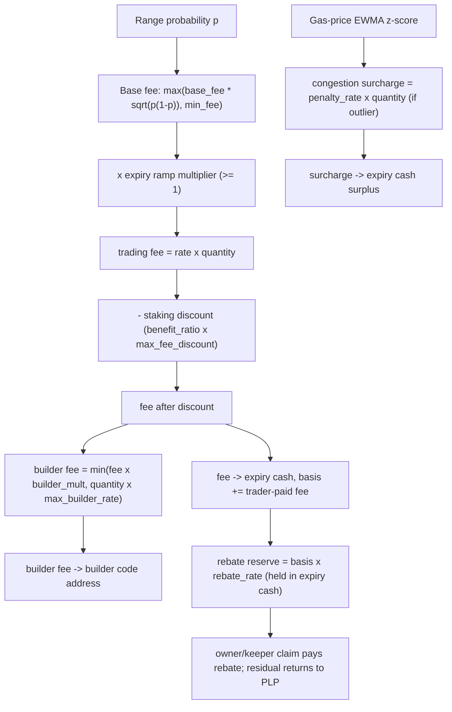

# Fees and rebates

Every Predict trade — a mint or a live redeem — carries a trading fee, and may also carry a builder fee and a congestion surcharge. The trading fee itself is shaped by an expiry ramp and reduced by a staking discount. Active DEEP stakers earn a discount on the trading fee. A portion of trader-paid trading fees is held on-chain as a trading-loss **rebate reserve** — part of the expiry's cash-backing invariant — and settled rebates are resolved through owner-auth or app-auth keeper claim flows. This page describes each component, the reasoning behind it, and how they combine into the cash a trader pays or receives.

All fees are denominated in DUSDC (6 decimals), the settlement asset, and all ratios use Predict's 1e9 fixed-point scaling (`1_000_000_000` = 1.0 = 100%). For the actual configured rates and bounds, see [../design/configuration.md](../design/configuration.md); this page describes the mechanisms, not the numbers.

This page covers **per-trade** fees. The pool itself charges no LP-side fee. PLP supply and withdraw use a certified numerical-error bid/ask—upper NAV for supply, lower NAV for withdraw—not a fee or configurable spread; see [liquidity and NAV](./liquidity-and-nav.md).

## Where fees come from

Predict prices a range contract at its range probability `p` — the model's estimate that the settlement price lands inside the order's strike range (see [pricing-and-oracles.md](./pricing-and-oracles.md)). The trading fee is charged on top of that probability and is proportional to the order's `quantity`. A fee charged at mint is added to the all-in execution price; a fee charged at live redeem is withheld from the payout. The fee is collected into the expiry's DUSDC cash custody (`ExpiryCash`), and the trader-paid portion is recorded in the trader's Predict account data.

The fee is computed in `StrikeExposureConfig`, which each expiry snapshots at creation so that later admin changes do not reprice contracts already trading. The composition, in the order the protocol applies it, is:

```text
base_fee_rate   = max( base_fee * sqrt(p * (1 - p)) , min_fee )
ramped_rate     = base_fee_rate * expiry_fee_multiplier(time_to_expiry)   (>= base_fee_rate)
trading_fee     = ramped_rate * quantity

fee_after_disc  = trading_fee - trading_fee * (benefit_ratio * max_fee_discount)   (staking)
builder_fee     = min( fee_after_disc * builder_fee_multiplier , quantity * max_builder_fee_rate )
congestion_fee  = penalty_rate * quantity                    (only when gas is a high outlier)
```

The base trading fee, the expiry ramp, and the staking discount together set the **fee rate** a trader pays. The builder fee is an **add-on** computed from the (post-discount) fee. The congestion surcharge is a separate per-unit add-on driven by network state, not by the contract's probability. The trading-loss rebate is funded out of trader-paid trading fees and paid back later, so it lowers a losing trader's *net* cost without changing what is charged at trade time.

The intermediate fixed-point rate calculations round down. The final conversion of the trading-fee rate and congestion-penalty rate into a DUSDC amount rounds upward, changing a non-integral component by at most one raw DUSDC atom; integral charges are unchanged. Builder fees remain derived from the integer post-discount trading fee, so advancing that fee by one atom can also advance the builder component at its own integer threshold.

## 1. Base trading fee — a variance (Bernoulli) fee

A range contract settling inside or outside its range is a Bernoulli outcome with success probability `p`. The variance of that outcome is `p · (1 − p)`, and its standard deviation is `sqrt(p · (1 − p))`. The base fee is proportional to that standard deviation:

```text
raw_fee_rate = base_fee * sqrt(p * (1 - p))
```

The fee is largest at `p = 0.5`, where the outcome is most uncertain and the contract carries the most two-sided risk, and shrinks toward the edges. At `p = 0` or `p = 1` the contract is certain and the variance term is zero, so the raw fee is zero. This ties the fee to how much risk the contract actually transfers to liquidity providers rather than to a flat percentage of notional.

Because the raw fee vanishes at the edges, a floor keeps near-certain contracts from trading effectively free:

```text
base_fee_rate = max( raw_fee_rate , min_fee )
```

As `p → 0` or `p → 1`, the base fee rate approaches `min_fee`; in the interior it rises with the variance term. `min_fee` is a per-unit rate, so a contract pays at least `min_fee · quantity` (the floor is applied before the expiry ramp, so inside the ramp window the effective minimum is higher).

Mint admission gates the raw entry probability `p` against the configured `[min_entry_probability, max_entry_probability]` band before fees are applied. The fee is still charged on top of the net premium, but it no longer rescues otherwise too-small or too-large probabilities into the admission range.

## 2. Expiry fee ramp

As an expiry approaches, the remaining time for an LP to hedge or for a contract to revalue shrinks, while last-minute trades concentrate risk against the pool. The expiry ramp lifts the fee over a final window before expiry:

```text
phase      = (expiry_fee_window_ms - time_to_expiry) / expiry_fee_window_ms
multiplier = 1.0 + (expiry_fee_max_multiplier - 1.0) * phase
fee_rate   = base_fee_rate * multiplier
```

Outside the window (`time_to_expiry ≥ expiry_fee_window_ms`) the multiplier is exactly 1.0 and the ramp is inert. Inside the window the multiplier rises **linearly** from 1.0 toward `expiry_fee_max_multiplier` as expiry approaches. Setting `expiry_fee_max_multiplier` to 1.0 disables the ramp entirely. Both the window length and the peak multiplier are configured per expiry (snapshotted at creation).

The ramp applies identically to mints and live redeems, since both create or unwind risk against the pool in the final window.

## 3. Builder fee add-on

Front-ends and aggregators that route order flow to Predict can attach a **builder code** to a Predict account. When an account carries a builder code, each of its trades pays an additional builder fee on top of the trading fee:

```text
builder_fee = min( fee_after_discount * builder_fee_multiplier , quantity * max_builder_fee_rate )
```

The builder fee is a fixed multiple (`builder_fee_multiplier`) of the trader's actual trading fee — the fee *after* the staking discount, so a discounted trade also pays a proportionally smaller builder fee. It is capped at `max_builder_fee_rate · quantity` so that a high variance fee cannot push the builder cut to an unbounded share of notional. An account with no builder code pays no builder fee.

The builder fee is split off the trader's payment and routed to the builder code's own object address using Sui's accumulator-based fund custody on the `BuilderCode` object — the DUSDC accumulates against the code object's address balance, and the code's owner can later claim all settled builder fees in a single call. The owner is fixed at creation and is the only address that can claim. For the object model and custody mechanism, see [../design/architecture.md](../design/architecture.md).

The builder fee is **not** part of the trading-fee basis used for the loss rebate, and it never enters the pool's revenue — it belongs entirely to the builder.

## 4. Congestion surcharge (gas-price EWMA)

Predict mirrors DeepBook core's gas-price penalty: trades placed during abnormal network congestion pay a surcharge. Each `ExpiryMarket` maintains an exponentially-weighted estimate (`EwmaState`) of the on-chain gas price — a smoothed mean and variance — folding the current transaction's gas price in on every trade:

```text
mean'     = alpha * gas + (1 - alpha) * mean
variance' = (1 - alpha) * variance + alpha * (gas - mean)^2
```

The estimate updates at most once per millisecond, and the squared deviation is taken against the pre-update mean. On the first observation (variance still zero) the variance is seeded directly from the squared deviation. The surcharge fires only when the current gas price is a high statistical outlier:

```text
z_score = (gas - mean) / sqrt(variance)
surcharge = penalty_rate * quantity   if  enabled and z_score > z_score_threshold,  else 0
```

The penalty is zero unless it is enabled, variance has accumulated, and the current gas price sits above the smoothed mean by more than `z_score_threshold` standard deviations. The surcharge is a flat per-unit add-on (`penalty_rate · quantity`), independent of the contract's probability. The penalty is **disabled by default**; `alpha`, `z_score_threshold`, and `penalty_rate` are admin-tunable and shared across markets, while each market evolves its own `EwmaState`.

Unlike core, the surcharge is computed against the **pre-trade** estimate: the trade is charged first, then its gas observation folds into the mean/variance (`predeploy/response-policies.md` RP-9). Judging each trade against the prior distribution is the standard anomaly-test order, and it makes the on-chain quote surface exact — `quote_mint`/`quote_mint_for_account` return the same penalty a same-state, same-gas-price mint charges.

One accepted weakness: because the first observation seeds the variance directly, a market's first post-creation trade made at an extreme gas price inflates the variance estimate and can suppress the surcharge for subsequent traders until the EWMA re-converges. The surcharge is congestion hygiene, not a solvency control, so poisoning it costs an attacker an extreme-gas transaction to save other people a fee.

The congestion surcharge is handled differently from the trading fee in the cash flow. It is withdrawn from the trader (at mint) or withheld from the payout (at redeem), but it then rides into the expiry's cash as **surplus**: it is not part of the rebate fee basis, it earns no builder cut, and it is excluded from the trader's recorded gross-paid. It compensates liquidity providers for transacting during congestion rather than being a fee on the contract itself.

## 5. Staking fee discount

Holding active DEEP stake on a Predict account earns a discount on the trading fee. The discount scales with stake along a two-segment benefit curve defined in `StakeConfig`:

```text
benefit_ratio rises linearly 0 -> 0.5 over   active_stake in [0, lower_benefit_power]
benefit_ratio rises linearly 0.5 -> 1.0 over active_stake in [lower_benefit_power, upper_benefit_power]
benefit_ratio = 1.0                          for active_stake >= upper_benefit_power
```

`benefit_ratio` is a fraction in `[0, 1]`. The fee discount is that ratio applied to a fixed maximum discount cap:

```text
discount_fraction = benefit_ratio * max_fee_discount
fee_after_discount = trading_fee - trading_fee * discount_fraction
```

`max_fee_discount` is an upgrade-required constant (a fixed cap on how much of the fee can be discounted); the two `*_benefit_power` thresholds are admin-tunable. At full stake the discount reaches the cap; below `upper_benefit_power` it is proportionally smaller. The discount applies to the **trading fee** (already including the expiry ramp), and because the builder fee is computed from the post-discount fee, staking also shrinks the builder fee. The congestion surcharge is not discounted.

### Lazy epoch rollover

Newly staked DEEP becomes `inactive_stake` and only counts as `active_stake` in a later epoch. The rollover is **lazy**: `roll_active_stake` moves inactive into active the first time the account is touched in a new epoch, guarded so it is a no-op within the same epoch. Every fee- or rebate-bearing flow (mint, live redeem, rebate claim) rolls stake before reading `active_stake`, so the discount always reflects stake that has been active since the start of the current epoch. Stake added this epoch does not earn a same-epoch discount.

## 6. Trading-loss rebate

Predict reserves a fraction of trader-paid trading fees on-chain so net-losing traders can be rebated after settlement. Claims have two paths: the account owner can call `claim_trading_loss_rebate`, and a keeper can call `claim_trading_loss_rebate_permissionless` using Predict app-auth while `PredictApp` remains authorized in the account registry. Either path can resolve an account's settled rebate once that account has no open positions in the expiry. The claim pays the rebate from expiry cash into account custody and returns any unearned reserve to PLP idle through the normal expiry-cash accounting path.

### How the reserve accrues (on-chain)

When a trader-paid trading fee is collected, `ExpiryCash` adds that amount to `unresolved_trading_fees_paid`. The rebate reserve owed at any time is a configured fraction of that basis:

```text
rebate_reserve = unresolved_trading_fees_paid * trading_loss_rebate_rate
```

The expiry's required cash backing is `payout_liability + rebate_reserve`, so released LP cash and surplus are always computed net of the reserve still owed. The congestion surcharge, builder fee, and any incentive-funded fee subsidy are excluded from this basis — only the trader-paid trading fee counts. A claim decrements this unresolved basis for the resolved account, so the expiry's rebate reserve shrinks as settled claims are processed.

### How a rebate is resolved on-chain

The data a claim needs is maintained on-chain: each account's Predict app data tracks a per-expiry `ExpiryTradingSummary` of `trading_fees_paid` (trader-paid trading fees only), gross cash paid to the expiry for positions, gross cash received from the expiry, and its open-position count. The claim model is:

```text
gross_profit     = max(0, gross_received_from_expiry − gross_paid_to_expiry)
resolved_reserve = trading_fees_paid * trading_loss_rebate_rate
eligible_rebate  = max(0, resolved_reserve − gross_profit)
rebate_amount    = eligible_rebate * benefit_ratio(active_stake)
```

The rebate is offset by any profit, so only net-losing traders are eligible: a profitable trader has `gross_profit ≥ resolved_reserve`, so `eligible_rebate` is zero. A losing trader is owed a portion of the fees they paid, scaled by their active-stake benefit ratio — the same benefit curve that drives the fee discount, but with **no separate staking cap** (the rebate's size is bounded entirely by `trading_loss_rebate_rate`). Resolution can happen once **all** of an account's positions in the expiry are closed. Liquidated orders clear with zero order payout, but they are not excluded from this expiry-level rebate calculation; their trader-paid fees and gross cash paid remain part of the account's normal settled PnL and fee basis.

If `rebate_amount` is less than `resolved_reserve`, the residual reserve is returned to PLP idle and may materialize as terminal expiry profit, split between the protocol reserve and LPs by the configured protocol profit share. Zero-owed claims are allowed so a keeper can sweep accounts without reverting a batch just because one account has nothing to claim.

## How the components combine

The full flow for a single trade:



Cash routing at trade time:

| Component | Charged on | Destination | In rebate basis? | Earns builder cut? |
|---|---|---|---|---|
| Trading fee | mint price / redeem payout | expiry cash (LP + protocol) | Trader-paid portion | — |
| Staking discount | reduces the trading fee | (reduces what is charged) | — | — |
| Builder fee | add-on to trading fee | builder code address | No | — |
| Congestion surcharge | add-on / withheld | expiry cash surplus | No | No |
| Trading-loss rebate | funded from trader-paid trading fees | reserved on-chain; claimed on-chain after settlement | (drawn from reserve) | No |

At **mint**, the trader's withdrawal is `net_premium + trading_fee + builder_fee + congestion_surcharge`. The `mint_exact_quantity` entrypoint's `max_cost` argument caps this full withdrawal; callers that accept any final cost can pass `std::u64::max_value!()`. Its `max_probability` argument separately caps the quoted per-contract probability before fees. The `mint_exact_amount` entrypoint instead fixes the `net_premium` budget, capped to the account's available DUSDC before sizing, and pays trading fees, builder fees, and congestion surcharge on top. At **live redeem**, the trading fee, builder fee, and surcharge are withheld from the gross redeem amount, each capped so the payout cannot go negative (the trading fee is capped at the redeem amount, the builder fee at what remains after the fee, the surcharge at what remains after both). At **settled redeem**, the winning payout is paid in full with no per-trade fee; the trading-loss rebate is claimed separately after all of that account's expiry positions are closed.

## Related reading

- [pricing-and-oracles.md](./pricing-and-oracles.md) — how the range probability `p` that drives the base fee is formed.
- [leverage-and-floor.md](./leverage-and-floor.md) — why trading and builder fees are transaction costs, not part of the contract floor.
- [liquidity-and-nav.md](./liquidity-and-nav.md) — the cash-backing invariant that holds the rebate reserve, and how fee revenue reaches LPs.
- [liquidation.md](./liquidation.md) — how a leveraged order is closed when it falls below its floor.
- [../design/configuration.md](../design/configuration.md) — the configured fee rates, ramp window, builder and congestion parameters, stake thresholds, and rebate rate.
- [../design/architecture.md](../design/architecture.md) — the `BuilderCode` object and accumulator-address fund custody.
