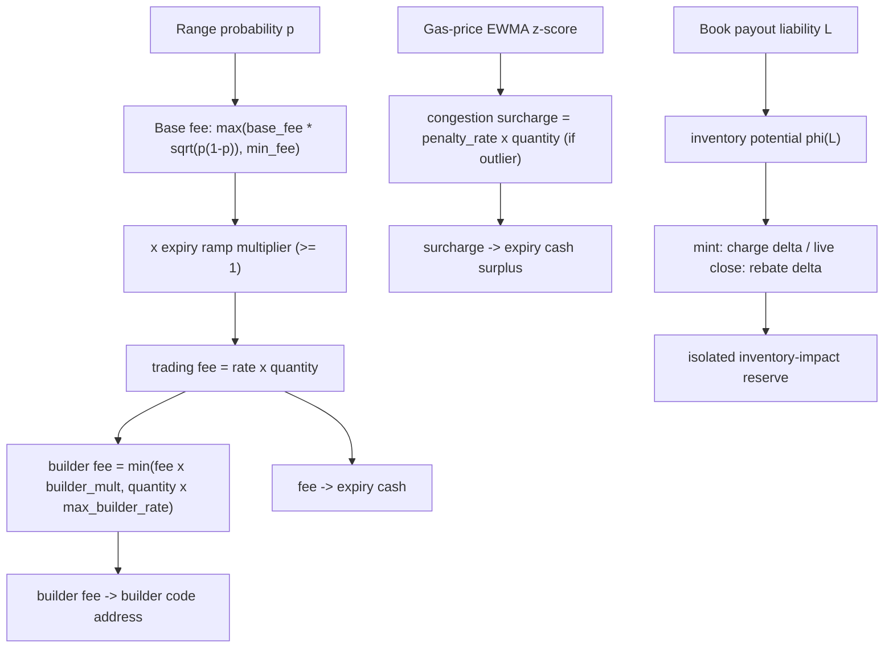

# Fees and rebates

Every Predict trade — a mint or a live redeem — carries a trading fee, and may also carry a builder fee and a congestion surcharge. A market may additionally run an isolated **inventory-impact charge/rebate**: risk-increasing mints pay into a dedicated escrow and voluntary risk-reducing live closes receive the matching decrease from it. The trading fee itself is shaped by an expiry ramp. This page describes each component, the reasoning behind it, and how they combine into the cash a trader pays or receives.

Every trader pays the same fee for the same contract. Predict has no fee tiers, no staking programme, and no loss rebate: the trading fee is a function of the contract and the market, never of who is trading it.

All fees are denominated in DUSDC (6 decimals), the settlement asset, and all ratios use Predict's 1e9 fixed-point scaling (`1_000_000_000` = 1.0 = 100%). For the actual configured rates and bounds, see [../design/configuration.md](../design/configuration.md); this page describes the mechanisms, not the numbers.

This page covers **per-trade** fees. The pool also charges an LP-side **exit** fee: PLP supply and withdraw are still priced at one exact pool-wide mark with no band or spread, and a flat rate is charged on top of that mark — on withdrawals only, as shipped. See [the LP fee](#the-lp-supplywithdraw-fee) below and [./liquidity-and-nav.md](./liquidity-and-nav.md).

## Where fees come from

Predict prices a range contract at its range probability `p` — the model's estimate that the settlement price lands inside the order's strike range (see [pricing-and-oracles.md](./pricing-and-oracles.md)). The trading fee is charged on top of that probability and is proportional to the order's `quantity`. A fee charged at mint is added to the all-in execution price; a fee charged at live redeem is withheld from the payout. The fee is collected into the expiry's DUSDC cash custody (`ExpiryCash`), and the trader-paid portion is recorded in the trader's Predict account data.

The fee is computed in `StrikeExposureConfig`, which each expiry snapshots at creation so that later admin changes do not reprice contracts already trading. The composition, in the order the protocol applies it, is:

```text
base_fee_rate   = max( base_fee * sqrt(p * (1 - p)) , min_fee )
ramped_rate     = base_fee_rate * expiry_fee_multiplier(time_to_expiry)   (>= base_fee_rate)
trading_fee     = ramped_rate * quantity

builder_fee     = min( trading_fee * builder_fee_multiplier , quantity * max_builder_fee_rate )
congestion_fee  = penalty_rate * quantity                    (only when gas is a high outlier)
```

The base trading fee and the expiry ramp together set the **fee rate** a trader pays. The builder fee is an **add-on** computed from that fee. The congestion surcharge is a separate per-unit add-on driven by network state, not by the contract's probability.

## 1. Base trading fee — a variance (Bernoulli) fee

A range contract settling inside or outside its range is a Bernoulli outcome with success probability `p`. The variance of that outcome is `p · (1 − p)`, and its standard deviation is `sqrt(p · (1 − p))`. The base fee is proportional to that standard deviation:

```text
raw_fee_rate = base_fee * sqrt(p * (1 - p))
```

The fee is largest at `p = 0.5`, where the outcome is most uncertain and the contract carries the most two-sided risk, and shrinks toward the edges. At `p = 0` or `p = 1` the contract is certain and the variance term is zero, so the raw fee is zero. This ties the fee to how much risk the contract actually transfers to liquidity providers rather than to a flat percentage of notional.

Because the raw fee vanishes at the edges, a floor keeps near-certain contracts from trading effectively free:

```text
base_fee_rate = max( raw_fee_rate , min_fee )
```

As `p → 0` or `p → 1`, the base fee rate approaches `min_fee`; in the interior it rises with the variance term. `min_fee` is a per-unit rate, so a contract pays at least `min_fee · quantity` (the floor is applied before the expiry ramp, so inside the ramp window the effective minimum is higher).

Mint admission gates the raw entry probability `p` against the configured `[min_entry_probability, max_entry_probability]` band before fees are applied. The fee is still charged on top of the net premium, but it no longer rescues otherwise too-small or too-large probabilities into the admission range.

## 2. Expiry fee ramp

As an expiry approaches, the remaining time for an LP to hedge or for a contract to revalue shrinks, while last-minute trades concentrate risk against the pool. The expiry ramp lifts the fee over a final window before expiry:

```text
phase      = (expiry_fee_window_ms - time_to_expiry) / expiry_fee_window_ms
multiplier = 1.0 + (expiry_fee_max_multiplier - 1.0) * phase
fee_rate   = base_fee_rate * multiplier
```

Outside the window (`time_to_expiry ≥ expiry_fee_window_ms`) the multiplier is exactly 1.0 and the ramp is inert. Inside the window the multiplier rises **linearly** from 1.0 toward `expiry_fee_max_multiplier` as expiry approaches. Setting `expiry_fee_max_multiplier` to 1.0 disables the ramp entirely. Both the window length and the peak multiplier are configured per expiry (snapshotted at creation).

The ramp applies identically to mints and live redeems, since both create or unwind risk against the pool in the final window.

## 3. Builder fee add-on

Front-ends and aggregators that route order flow to Predict can attach a **builder code** to a Predict account. When an account carries a builder code, each of its trades pays an additional builder fee on top of the trading fee:

```text
builder_fee = min( trading_fee * builder_fee_multiplier , quantity * max_builder_fee_rate )
```

The builder fee is a fixed multiple (`builder_fee_multiplier`) of the trader's trading fee. It is capped at `max_builder_fee_rate · quantity` so that a high variance fee cannot push the builder cut to an unbounded share of notional. An account with no builder code pays no builder fee.

The builder fee is split off the trader's payment and routed to the builder code's own object address using Sui's accumulator-based fund custody on the `BuilderCode` object — the DUSDC accumulates against the code object's address balance, and the code's owner can later claim all settled builder fees in a single call. The owner is fixed at creation and is the only address that can claim. For the object model and custody mechanism, see [../design/architecture.md](../design/architecture.md).

The builder fee never enters the pool's revenue — it belongs entirely to the builder.

## 4. Congestion surcharge (gas-price EWMA)

Predict mirrors DeepBook core's gas-price penalty: trades placed during abnormal network congestion pay a surcharge. Each `ExpiryMarket` maintains an exponentially-weighted estimate (`EwmaState`) of the on-chain gas price — a smoothed mean and variance — folding the current transaction's gas price in on every trade:

```text
mean'     = alpha * gas + (1 - alpha) * mean
variance' = (1 - alpha) * variance + alpha * (gas - mean)^2
```

The estimate updates at most once per millisecond, and the squared deviation is taken against the pre-update mean. On the first observation (variance still zero) the variance is seeded directly from the squared deviation. The surcharge fires only when the current gas price is a high statistical outlier:

```text
z_score = (gas - mean) / sqrt(variance)
surcharge = penalty_rate * quantity   if  enabled and z_score > z_score_threshold,  else 0
```

The penalty is zero unless it is enabled, variance has accumulated, and the current gas price sits above the smoothed mean by more than `z_score_threshold` standard deviations. The surcharge is a flat per-unit add-on (`penalty_rate · quantity`), independent of the contract's probability. The penalty is **disabled by default**; `alpha`, `z_score_threshold`, and `penalty_rate` are admin-tunable and shared across markets, while each market evolves its own `EwmaState`.

Unlike core, the surcharge is computed against the **pre-trade** estimate: the trade is charged first, then its gas observation folds into the mean/variance (`predeploy/response-policies.md` RP-9). Judging each trade against the prior distribution is the standard anomaly-test order, and it makes the on-chain quote surface exact — `quote_mint`/`quote_mint_for_account` return the same penalty a same-state, same-gas-price mint charges.

One accepted weakness: because the first observation seeds the variance directly, a market's first post-creation trade made at an extreme gas price inflates the variance estimate and can suppress the surcharge for subsequent traders until the EWMA re-converges. The surcharge is congestion hygiene, not a solvency control, so poisoning it costs an attacker an extreme-gas transaction to save other people a fee.

The congestion surcharge is handled differently from the trading fee in the cash flow. It is withdrawn from the trader (at mint) or withheld from the payout (at redeem), but it then rides into the expiry's cash as **surplus**: it earns no builder cut. It compensates liquidity providers for transacting during congestion rather than being a fee on the contract itself.

## Inventory-impact charge and rebate

Inventory impact is an optional, path-independent transfer layered **on top of** the normal fee system. It is not trading-fee revenue, does not earn a builder cut, and is not a sponsor subsidy. `inventory_impact_max_rate` ships at `0`, so the mechanism is inert until an admin enables it for future markets. Each market freezes the configured rate and uses its cadence `max_expiry_allocation` as the immutable impact scale `B`; changing either template later cannot reprice its live book. The maximum valid rate is `1_000_000_000` (1.0, or 100%).

### Step 1: measure the book's payout liability

Let:

- `M` be the largest summed net payout at any one settlement price;
- `T` be the sum of every live order's payout (`quantity`);
- `lambda` be `backing_buffer_lambda`.

The existing live reserve liability is:

```text
L = M + lambda * (T - M)
```

A candidate range does not necessarily move `M` by its full net payout. The payout tree therefore reads the current maximum inside the range and in its complement in `O(log n)`, computes the exact prospective `M` and `T`, and evaluates the complete liability formula before and after the trade. Evaluating both complete states matters for integer arithmetic: rounding only the incremental buffer could miss a one-atom carry already accumulated in `lambda * (T-M)`. This charges overlapping exposure more than a cold disjoint range when it raises the book's worst settlement point.

### Step 2: map liability to one book-level potential

For maximum marginal rate `r_max` and scale `B`:

```text
phi(L) = r_max * L^2 / (2 * B)                  when L <= B
phi(L) = r_max * B / 2 + r_max * (L - B)        when L > B
```

Below `B`, the marginal rate rises linearly from zero to `r_max`: at 25% utilization the marginal rate is 25% of `r_max`; at 100% utilization it reaches `r_max`. Above `B`, it stays capped instead of growing without bound. On chain, `phi` is defined by one exact sequence of round-down fixed-point operations. Both directions evaluate that same integer function.

### Step 3: charge or rebate only the potential change

```text
mint charge       = phi(L_after)  - phi(L_before)
live-close rebate = phi(L_before) - phi(L_after)
```

This state-function construction is the key safety property. Splitting a trade, closing it in pieces, or cycling through ranges only creates intermediate terms that cancel. For any sequence that returns the book to the same state, total inventory charges equal total inventory rebates exactly, including integer rounding. A probability-local multiplier would not have this property: changing another range could change the price/rate used on exit and make a cross-range cycle profitable.

Mint charges remain inside `ExpiryCash` but are earmarked in `inventory_impact_reserve`. Required cash includes the earmark and free cash/NAV excludes it. A live close can spend only this reserve. Settlement releases whatever remains into ordinary expiry surplus, because no live close can occur afterward.

This design adapts established ideas rather than claiming a new optimal market-making model: convex cost functions price trades by differences of a global state function ([Abernethy, Chen, and Vaughan](https://arxiv.org/abs/1011.1941); [Othman et al.](https://www.cs.cmu.edu/~sandholm/www/liquidity-sensitive%20AMMs%20via%20homogeneous%20risk%20measures.wine11.pdf)), Synthetix integrates a linear skew curve so execution is path invariant ([SIP-279](https://sips.synthetix.io/sips/sip-279/)), and GMX computes price impact from the change between pre- and post-trade imbalance powers ([GMX fees](https://docs.gmx.io/docs/trading/fees/)). Predict's exact choice of `L`, the cap at `B`, and its integer rounding are protocol-specific adaptations, not results those sources prove optimal for range digitals.

## Inventory-skew charge and rebate

Inventory skew is a second isolated transfer, layered on top of the fee system and independent of inventory impact. Where impact prices how much of the expiry's reserve a position ties up, skew prices how *uneven* the book's payouts are across settlement prices — which impact cannot see, because `L` moves the same way whether a trade flattens the book or fills an idle corner. `inventory_skew_rate` ships at `0`, so the mechanism is inert until an admin enables it for future markets.

### The statistic

Let `W(S)` be the payout the pool owes if the market settles at tick `S`. Over a window of `N` ticks centred on the market's reference tick:

```text
skew = sqrt( sum(W^2)/N - (sum(W)/N)^2 )
```

the standard deviation of the payout profile. It is `0` exactly when the pool owes the same at every price in the window, and largest when the profile is concentrated. The protocol keeps `sum(W)` and `sum(W^2)` as running totals, folded on every mint and close, so no trade walks the tick ladder.

### The window

The half-width is a fraction of the reference tick. A tick is a raw price divided by `tick_size`, so a fraction of the tick is the same fraction of price — one configured value spans every underlying and price level. That fraction is then scaled by `sqrt(cadence_period / one_day)`, so a window covers the same number of standard deviations at every cadence and a new cadence needs no new configuration. The window freezes with the reference tick: a moving window would score the two legs of a round trip against different domains.

A window narrower than a single tick leaves nothing to average over and reads `0`. Skew over a handful of settlement outcomes is undefined, and no charge is the safe response.

### Charge and rebate

```text
adjustment = rate * ( skew(after) - skew(before) )
```

signed. A mint that flattens the book is **rebated**; a close that unbalances it is **charged**. This is the only Predict adjustment whose direction is data rather than lifecycle, so both the mint and close events carry a charge and a rebate field, at most one of which is nonzero.

Because the adjustment is the change in one book-level statistic, splitting a trade, closing in pieces, and cycling across ranges all telescope exactly. And because standard deviation is unchanged by adding the same payout everywhere, buying **every** outcome at once — a guaranteed payout — scores exactly zero and earns no rebate. That closes the only trade a rebate could otherwise fund for free.

A mint has no outbound payment leg, so a rebate reduces the withdrawal rather than paying the trader. A rebate larger than everything else the mint owes aborts rather than clamping, since a clamp would move the statistic without crediting the trader the difference.

Charges sit in `skew_reserve`, excluded from free cash and NAV, released into ordinary surplus at settlement. Cumulative collections equal the current statistic by construction, so a rebate can never exceed what the same book already paid in.

## How the components combine

The full flow for a single trade:


```mermaid
flowchart TD
    P[Range probability p] --> BF["Base fee: max(base_fee * sqrt(p(1-p)), min_fee)"]
    BF --> RAMP["x expiry ramp multiplier (>= 1)"]
    RAMP --> FEE[trading fee = rate x quantity]
    FEE --> BUILD["builder fee = min(fee x builder_mult, quantity x max_builder_rate)"]
    GAS[Gas-price EWMA z-score] --> CONG["congestion surcharge = penalty_rate x quantity (if outlier)"]
    FEE --> COLLECT[fee -> expiry cash]
    BUILD --> BUILDER[builder fee -> builder code address]
    CONG --> SURPLUS[surcharge -> expiry cash surplus]
    L[Book payout liability L] --> PHI["inventory potential phi(L)"]
    PHI --> IMPACT["mint: charge delta / live close: rebate delta"]
    IMPACT --> IRESERVE[isolated inventory-impact reserve]
```

Cash routing at trade time:

| Component | Charged on | Destination | Earns builder cut? |
|---|---|---|---|
| Trading fee | mint price / redeem payout | expiry cash (LP + protocol) | — |
| Builder fee | add-on to trading fee | builder code address | — |
| Congestion surcharge | add-on / withheld | expiry cash surplus | No |
| Inventory impact | mint add-on / live-close credit | isolated expiry escrow; residual becomes surplus at settlement | No |
| Inventory skew | signed on either side | separate isolated escrow; residual becomes surplus at settlement | No |

At **mint**, the trader's withdrawal is `premium + trading_fee + builder_fee + congestion_surcharge + inventory_impact_charge`. The `mint_exact_quantity` entrypoint's `max_cost` argument caps this full withdrawal; callers that accept any final cost can pass `std::u64::max_value!()`. Its `max_probability` argument separately caps the quoted per-contract probability before fees. The `mint_exact_amount` entrypoint instead fixes the `premium` budget, capped to the account's available DUSDC before sizing, and pays the ordinary fees and inventory-impact charge on top; its own `max_cost` argument caps that full withdrawal and is required — zero aborts, and no value disables it. At **live redeem**, the account receives `gross_redeem_amount + inventory_impact_rebate - trading_fee - builder_fee - congestion_surcharge`; `min_proceeds` protects that final net amount. At **settled redeem**, the winning payout is paid in full with no per-trade or inventory-impact rebate.

## The LP supply/withdraw fee

Everything above is charged on a *trade*. The pool charges one further fee on *LP exit*: a flat rate applied to the DUSDC leg of every executed fill, admin-tunable within a hard `0..5%` envelope.

The two legs carry **independent rates**, and they ship asymmetric:

| Leg | Config | Ships at |
| --- | --- | --- |
| Supply (entry) | `plp_supply_fee_rate` | **0** — entry is not taxed |
| Withdraw (exit) | `plp_withdraw_fee_rate` | **20 bps** |

An exit concentrates the pool's outstanding risk on whoever stays: the liabilities the pool has written do not shrink when an LP leaves, so the same risk is carried on a smaller base and risk per dollar rises for the remaining holders. NAV pays the exiting LP the mark, which is the expected value; it does not charge them for the variance they hand to everyone else. That is what the exit fee prices. A deposit moves risk the other way — it dilutes risk per dollar and is a benefit to the pool's health — so the supply leg ships at zero, and the knob exists only to keep that reversible without a package upgrade.

Each leg is charged on the DUSDC side at its own rate, frozen once per flush alongside the mark (never inside it):

- **Supply** — the fee, if one is ever set, is deducted from the escrowed DUSDC *before* shares are priced, so only the remainder buys PLP. The full escrow still joins pool idle; the fee is simply DUSDC that no new shares were issued against. At the shipped rate of zero a deposit mints its full pro-rata share.
- **Withdraw** — the fee is withheld from the marked payout, so the requester receives the net. The full escrowed PLP is burned either way.

Both legs leave the charge inside the pool, so it accrues to PLP holders pro-rata rather than to the protocol reserve.

That has a consequence worth stating for the leg that actually charges: a withdrawer who is *not* fully exiting is still a holder afterwards, so they recapture their own post-withdrawal share of what they just paid. A **full** exit pays the fee in full; a partial exit pays `F × (1 − post_withdrawal_share)`. The deviation from the nominal rate is largest for an exit that leaves the holder owning a large share of the pool, and vanishes as the exit approaches a full one. That is the right direction — the charge bites hardest on the exit that concentrates the most risk, and least on the LP who stays exposed — but it means the effective rate is not the nominal rate for every exit, which matters when calibrating it (`predeploy/open-items.md` P-27). The same identity would apply to a supply fee, which is one more reason entry ships at zero. Rounding is up, to the pool, consistent with the protocol's dust policy.

Two consequences worth stating plainly:

- **Request limits are net of the fee.** `min_plp_out` and `min_dusdc_out` are compared against the post-fee result, so a limit means "what I actually receive", not the pre-fee quote. A caller sizing a limit should read the relevant leg's rate off `ProtocolConfig` and price accordingly.
- **Only executed fills are charged.** A request that is cancelled by its owner, refunded as non-executable at the mark, or still queued after a limit miss pays nothing.

The fee is deliberately separate from the mark. The mark stays the exact pool-wide NAV used in both directions; the fee is applied after it. This is what distinguishes it from the superseded uncertainty-band withdrawal fee of the approximate-NAV design, which distorted the mark itself.

## Related reading

- [pricing-and-oracles.md](./pricing-and-oracles.md) — how the range probability `p` that drives the base fee is formed.
- [liquidity-and-nav.md](./liquidity-and-nav.md) — the cash-backing invariant and how fee revenue reaches LPs.
- [../design/configuration.md](../design/configuration.md) — the configured fee rates, ramp window, and builder and congestion parameters.
- [../design/architecture.md](../design/architecture.md) — the `BuilderCode` object and accumulator-address fund custody.
