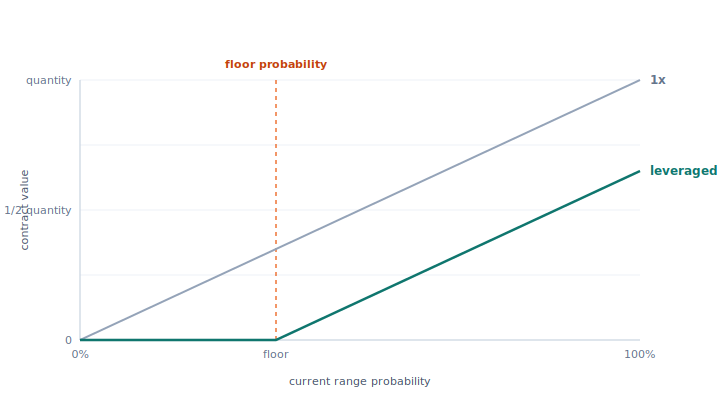
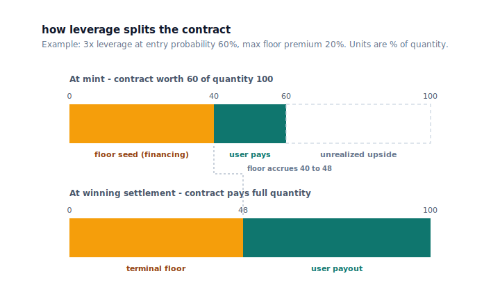
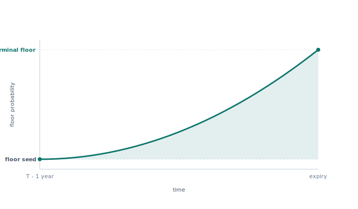
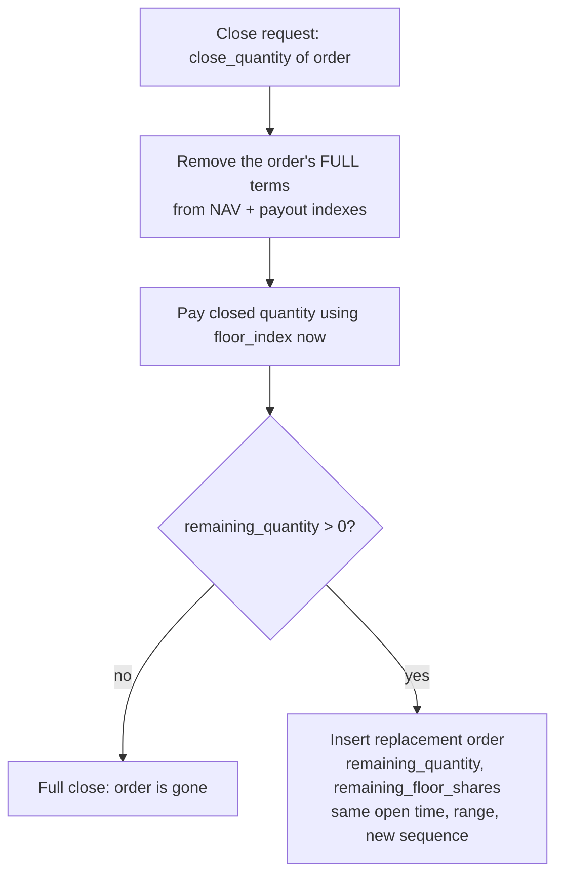

# Leverage and the floor

Predict models leverage as a transformation of the contract being traded, not as a contract paired with a separate debt ledger. A leveraged order is a vanilla range digital plus two modifications: the pool finances part of the premium, and the holder sells the pool a knock-out. The financing is embedded in the payoff as a deterministic, time-varying *floor* subtracted from the same range payoff; the knock-out extinguishes the contract if its value decays to the floor-derived knock-out level. A 1x order is the special case where the floor is zero and no knock-out exists.

This document explains the 1x payoff, the leveraged payoff with its floor, why a floor is the right model for leverage, what the structure is in standard options terms, how the floor index ramps as expiry approaches, how mint admission is gated, how the floor applies at live redeem, and how settlement pays out. For when and how an under-collateralized order is removed, see [liquidation](./liquidation.md); for the objects that hold the cash and positions, see [architecture](../design/architecture.md).

## The 1x range payoff

A Predict order is a European cash-or-nothing binary option on whether the oracle's settlement price lands inside a strike range `(lower, higher]` — a range digital, equivalent to a digital call spread over the two boundary strikes. A 1x order pays like the plain digital:

```text
live_value   = quantity × probability(range)
settled_value = quantity   if settlement is inside the range, else 0
```

`quantity` is the contract's notional — the digital's fixed cash payout — denominated in 6-decimal DUSDC quote units and a multiple of the lot size. `probability(range)` is the live range probability quoted from the SVI surface (see [pricing and oracles](./pricing-and-oracles.md)), expressed in Predict's 1e9 fixed-point scale where `1_000_000_000` is probability 1. For an undiscounted digital, the premium per unit notional and the risk-neutral probability of the event are the same number, so Predict quotes and stores the probability directly. At settlement the range probability collapses to 0 or 1, so the contract is worth either the full `quantity` or nothing.



## The leveraged payoff and its floor

A leveraged order adds a deterministic floor to the same contract:

```text
live_value = quantity × probability(range) − floor_at(now),  clamped at 0
```

The floor is the value the contract must cover before the holder owns anything. If the current range value is at or below the floor, the holder's value is zero: the order is economically exhausted and is eligible to be liquidated, because there is no remaining user value to redeem. For 1x orders the floor is always zero, which recovers the 1x payoff exactly.

The contract is easiest to reason about in probability terms, but the implementation works in amount terms because cash movement, NAV, payout backing, and settlement are all amount-denominated. The floor is therefore stored and applied as a DUSDC amount, not as a probability.

## Why a floor models leverage

Leverage lets a holder take larger exposure for a smaller upfront payment. Rather than recording the unpaid premium as external debt against the holder, Predict embeds it into the contract as a floor.

At mint, the protocol computes:

```text
entry_value     = entry_probability × quantity
net_premium     = entry_value / leverage
financed_amount = entry_value − net_premium
```

The holder pays `net_premium` (plus fees) and owns the contract's upside above the floor. `financed_amount` is the slice of the full premium (`entry_value`) the pool funds at mint. It is not a discount — it is a loan embedded in the contract, and the floor is the accreting balance of that loan, repaid out of the contract's own value before the holder receives anything.



This is *limited-recourse* financing: the floor can only ever consume that one order's own value or payout, capped at it. There is no margin call against the holder's other assets and no shared debt pool. A leveraged order that falls below its floor is simply worth zero to its holder; it never produces a negative balance the protocol must chase. Trading fees and builder fees are transaction costs paid at the trade boundary, not part of the contract floor, and do not enter the floor invariants (see [fees and rebates](./fees-and-rebates.md)).

## The structure in options terms

A leveraged order decomposes into three standard pieces:

1. **A vanilla range digital** of notional `quantity` — the same contract a 1x order holds.
2. **Embedded premium financing.** The pool funds `financed_amount` of the full premium. The balance accretes along the floor index (the same role a borrow index plays in a money market) and is repaid out of the contract's own value at close, settlement, or knock-out — never from the holder's other assets.
3. **A sold knock-out.** The holder writes the pool a knock-out: the contract is extinguished, with zero rebate, when its gross value falls to the knock-out level `floor_amount / liquidation_ltv` (see [liquidation](./liquidation.md)).

Together these make a leveraged position a **down-and-out digital with an accreting barrier** — the same structure as a turbo warrant or knock-out certificate, with the floor playing the financing level and the liquidation threshold playing the knock-out barrier, applied to a digital rather than a delta-one underlying. By knock-out/knock-in parity (`vanilla = knock-out + knock-in`), holding the knock-out version means the holder has given up exactly the paths where the contract dips through the barrier and later recovers.

Two precision points. First, the upfront discount is the financing, not the price of the surrendered knock-in: the holder pays `full premium / leverage` mechanically, and the financed remainder is owed back with accrual. The knock-out is what makes that loan safe — limited-recourse — for the pool, and the residual value forfeited at knock-out is the pool's compensation for gap risk. Second, the holder's claim `max(0, quantity × probability − floor)` is a call on the digital package struck at the accreting financing balance — the classic levered-equity-as-call identity. Live closes pay exactly that intrinsic value; the knock-out extinguishes the claim while it is still slightly in the money, which is the LTV buffer the pool keeps.

## The floor index and floor shares

The financing cost grows over time, so the floor rises deterministically as expiry approaches. Each expiry's `StrikeExposure` snapshots a `StrikeExposureConfig` (a copy of the global template taken at market creation, so later admin changes do not reprice live markets — see [configuration](../design/configuration.md)). That config defines a single floor-index curve shared by every floor-bearing order in the expiry.

The floor index starts at 1.0 and ramps to a terminal value over a fixed window before expiry. With `phase = elapsed_in_window / window`:

```text
floor_index(t) = 1 + (terminal_floor_index − 1) × phase²
```

The window length is the protocol constant `leverage_floor_window_ms` (one 365-day year). If the expiry is a full window or more away, `phase` is 0 and the index stays at 1.0. Inside the window the index rises with the square of elapsed phase — slow at first, accelerating toward expiry — reaching `terminal_floor_index` at `t ≥ expiry`. `terminal_floor_index` is admin-tunable per expiry; the default and bounds live in [configuration](../design/configuration.md).



Because every order in an expiry uses the same index curve but opens at a different time, the protocol normalizes each order's floor into **floor shares**, anchored to the index at its open time:

```text
floor_shares  = financed_amount / floor_index(opened_at)
floor_at(t)   = floor_shares × floor_index(t)
terminal_floor = floor_shares × terminal_floor_index
```

`floor_shares` is the order's stable, time-independent floor measure — a scaled debt balance, in money-market terms. Multiplying it by the index at any later time gives that order's floor amount then; multiplying by the terminal index gives the floor it owes at settlement. Orders carry different `floor_shares` because they differ in quantity, entry probability, leverage, and open time, but they all evaluate against one curve. This is the same role a borrow index plays — the financing cost compounds deterministically over time — except the value is part of the contract's payoff function rather than a separate borrow position.

## Order terms

`Order` is the validated, typed view over a packed `order_id`. The packed ID is the single source of truth at protocol boundaries; internal flows decode it into `Order`. It stores only the durable contract terms needed after mint:

| Packed term | Meaning |
| --- | --- |
| quantity (in lots) | order size; on-chain quantity is `quantity_lots × lot_size` |
| floor_shares | normalized floor measure; `0` for a 1x order |
| opened_at | open timestamp, in milliseconds, anchoring `floor_index(opened_at)` |
| lower / higher tick | absolute strike ticks for the range `(lower, higher]` (`0` = `neg_inf`, `pos_inf_tick` = `pos_inf`) |
| sequence | expiry-local tiebreaker assigned at mint |

`is_leveraged()` is exactly `floor_shares > 0`: leverage is detectable from the stored floor alone. Mint-only inputs — entry probability, the chosen leverage multiplier, the net premium, and fee policy — are **not** stored in the order. They are inputs to mint admission and to deriving `floor_shares`, but they do not survive in the packed ID. This keeps mint-admission policy out of structural order validation, so a future change to leverage tiers or price thresholds can never retroactively invalidate an already-packed order.

`StrikeExposure` interprets an `Order` against the floor-index schedule to derive the current floor amount, the terminal floor, the terminal payout, and the conservative max-live backing payout, recovering raw strike bounds from the order's ticks (through the market's `tick_size`) only at the pricing/settlement boundary (see [markets and positions](./markets-and-positions.md)). The split keeps packed order identity at the boundary while internal flows operate on validated values.

The packed layout is also reused as a deterministic liquidation priority key; see [Liquidation priority](#liquidation-priority).

## Mint admission

Minting quotes the live entry probability, computes the mint economics, validates them, derives `floor_shares`, and inserts the order into the expiry's live indexes. Beyond the price-band check on the all-in execution price (entry probability plus the live trade fee), mint admission enforces three leverage-specific gates.

### Price-tiered leverage caps

The chosen leverage must be one of the discrete set **1x, 1.5x, 2x, 2.5x, 3x** (in 1e9 scale, `1_000_000_000` … `3_000_000_000`). Higher leverage is only permitted at higher entry probabilities, because the closer entry probability is to zero, the thinner the upside wedge above any floor:

- Below the 1x-only price threshold (`leverage_one_x_only_price_threshold`): leverage must be 1x.
- Below the 2x-max price threshold (`leverage_two_x_max_price_threshold`): leverage is capped at 2x.
- At or above that threshold: leverage may go up to the protocol maximum (3x).

These thresholds are protocol constants; see [configuration](../design/configuration.md).

### The entry-value gate

```text
net_premium = entry_value / leverage  ≥  min_net_premium
entry_value > financed_amount / liquidation_ltv   (when financed_amount > 0)
```

The net premium must clear a minimum so dust orders are rejected. The entry-value gate rejects any leveraged order whose entry value would already sit at or below the expiry's snapshotted liquidation threshold — that is, an order that would be immediately liquidatable the moment it was minted. `liquidation_ltv` is the expiry's snapshotted floor-to-value ratio (see [liquidation](./liquidation.md) and [configuration](../design/configuration.md)).

### The terminal-floor gate

```text
terminal_floor < quantity × liquidation_ltv
```

Evaluated against the terminal index, the order's floor at expiry must stay strictly below `quantity × liquidation_ltv`. Because the settlement payout to a winner is `quantity − terminal_floor`, this guarantees a winning leveraged contract can never owe a negative payout and still leaves the configured liquidation buffer intact at expiry. Trading and builder fees are not floor value and do not enter this check.

After admission, the expiry indexes the same contract two ways: NAV terms for live valuation, and payout terms for live backing and settled liability (see [Two indexed views](#two-indexed-views-nav-versus-payout-backing)).

## Live redeem

Live redeem closes some or all of an order's quantity at the current range probability, then applies the floor to exactly the closed slice:

```text
gross_redeem  = probability(range) × close_quantity
removed_floor = removed_floor_shares × floor_index(now)
redeem_amount = gross_redeem − min(gross_redeem, removed_floor)
```

The floor deduction is limited to the closed quantity's share of the floor, and the `min(...)` clamps the result at zero: if the closed slice is below its floor, the holder receives nothing. Both products round down, so any rounding loss is at most one fixed-point unit and falls on the holder, never the pool. The trade fee is recovered separately from the quoted price.

A **partial close is handled as cancel-and-replace**, not as an in-place shrink:



The order's full mint-time terms are removed from the live indexes first, then the surviving quantity is re-inserted as a fresh replacement order. The replacement preserves the original open time, strike range, and the proportional remainder of `floor_shares` (`remaining_floor_shares = old_floor_shares − removed_floor_shares`), so the remaining exposure keeps the original contract's floor schedule. Removing the full terms and re-inserting exact survivor terms — rather than subtracting only the closed slice — keeps the payout index's residual bit-for-bit equal to what settlement later recomputes for that order, because round-down multiplication over a split is sub-additive and a naive subtraction would leave the residual one unit short. Fees apply only to the closed quantity; the replacement is re-indexed without a new mint or redeem fee.

## Settlement

Settlement is cash settlement: the digital's outcome is binary, so the payout is deterministic from the order's stored floor shares and the expiry's terminal index:

```text
losing order:  payout = 0
winning order: payout = quantity − terminal_floor
                      = quantity − (floor_shares × terminal_floor_index)
```

A losing order (settlement outside its range) pays nothing. A winning order pays its quantity net of its terminal floor; the terminal floor is computed with round-down multiplication, so the winner absorbs at most one unit of rounding. The terminal-floor gate at mint guarantees this difference is positive. Because the outcome is binary, the expiry can materialize its total final payout liability once from the payout index, then redeem each settled order against that cached liability — the reserve seeded for an order is exactly the payout it later claims, so the running liability can never underflow.

## Two indexes: the payout tree and the liquidation book

Predict stores only the atomic values each index needs. The active contracts of an expiry live in two indexes — a payout tree keyed by strike tick, and a liquidation book sorted by packed order ID — and live NAV is read by combining them.

### Payout tree (NAV linear term, cash backing, settled liability)

`StrikePayoutTree` keys finite interval boundaries by absolute tick and tracks, per order interval, atomic terms that answer three questions:

- **NAV linear term.** `walk_linear` walks the whole tree, prices each distinct boundary tick once through the resolved pricer, and returns `Σ_orders quantity × P(strike)` — the **exact** range-probability value of every open contract. There is no piecewise-linear curve or sampling band; the tree's per-boundary quantity prefixes make one walk cost work proportional to the number of distinct boundaries, not the number of orders.
- **Live cash backing.** `live_backing_payout` = `quantity − floor_at(opened_at)` is a conservative upper bound on an order's future live payout, and `max_live_backing_payout` gives an instant O(1) cash-backing requirement (the maximum summed payout at any single settlement price) without scanning the tree or reading a clock. It deliberately does **not** reuse the terminal floor: before expiry the live floor is lower than the terminal floor, so terminal payout would *understate* live backing. Using the open-index floor (the smallest floor the order ever has) makes the backing term at least as large as any future live payout for that order.
- **Settled liability.** `terminal_payout` = `quantity − terminal_floor` is the exact settled liability; once the settlement price is passively recorded, the tree sums the terminal-payout prefix that the price activates.

### Liquidation book (NAV floor correction, liquidation priority)

`LiquidationBook` holds the expiry's active **leveraged** orders, sorted by packed order ID. Beyond selecting liquidation candidates (see [Liquidation priority](#liquidation-priority)), it supplies the floor offset that turns the tree's linear term into NAV. The exact live liability is

```text
exact_live_liability = walk_linear − correction_value,  floored at 0
correction_value     = Σ_(active leveraged) min(quantity × range_price, floor_shares × floor_index(now))
```

The correction is the per-order floor offset, scanned exactly over the active leveraged set: each order's floor offsets only its own range value, capped at it (`min(...)`). Capping per order is what makes the subtraction **limited-recourse** — an exhausted order's unconsumed floor can never offset another order's value. Each `min` rounds within fixed point; the final liability is `saturating_sub`-floored so a degenerate underwater book values at zero rather than aborting. The expiry's `current_nav` is then `free_cash − exact_live_liability`; see [liquidity and NAV](./liquidity-and-nav.md).

## Liquidation priority

The active-order index stores leveraged orders sorted by their packed `order_id`, and the liquidation scan checks the front first, so priority is encoded directly in the packed layout's high bits — no separate mutable ranking structure is needed.

- **Primary key — larger quantity first.** Quantity occupies the highest field and is stored as the complement `U32_MASK − quantity_lots`, so a larger quantity produces a smaller stored key and sorts to the front.
- **Secondary key — larger floor shares first.** `floor_shares` occupies the next field and is stored as the complement `U64_MASK − floor_shares`, so among equal quantities the larger floor is visited first.

Quantity-first (rather than leverage-first) ordering was chosen because off-chain simulation replay showed it captured more liquidatable value within a bounded scan budget on the sampled long-run backlog. The scan is budgeted and policy-driven; see [liquidation](./liquidation.md) for the economic liquidation condition and the bounded-scan mechanics.

## Design rules

- Model leverage as part of the contract payoff (a deterministic floor), not as an external debt overlay. 1x is the zero-floor case of the same payoff.
- Keep contract floors limited-recourse: a floor offsets only its own order's value or payout, capped at it.
- Store only atomic terms that cannot be cheaply derived (quantity, floor shares, open time, strike ticks, sequence); derive everything else at the leaf that needs it.
- Keep mint-only policy (entry probability, leverage, net premium) out of the packed order and out of structural validation, so policy changes never invalidate existing orders.
- Use the packed `order_id` only at entry, exit, and storage boundaries; use the typed `Order` internally.
- Keep settlement payout exact and live backing conservative. Do not let terminal-floor math drive live backing, because before expiry the live floor is smaller and terminal payout understates live liability.
- Keep the NAV floor offset per-order and limited-recourse: subtract each order's floor against only its own range value, capped at it, so an exhausted order can never offset another's value.
