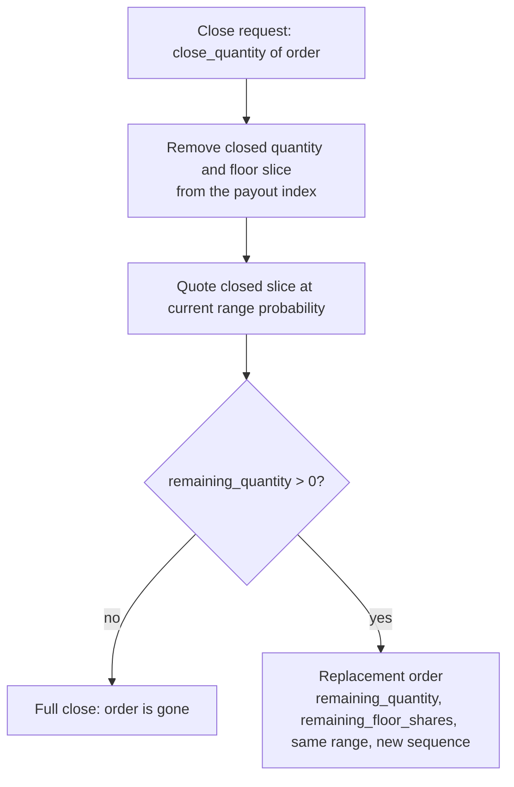

# Leverage and the floor

Predict models leverage as a transformation of the contract being traded, not as a
contract paired with a separate debt ledger. A leveraged order is still one range
digital written by the pool, but the pool finances part of the entry premium and
the holder's payoff is reduced by a static floor. If the contract's gross value
falls to the floor-derived knock-out level, the order can be liquidated with zero
order payout. A 1x order is the special case where the floor is zero and no knock-out
exists.

This document explains the 1x payoff, the leveraged payoff with its floor, mint
admission, live redeem, settlement, and the indexes that make the accounting
exact. For when and how an under-collateralized order is removed, see
[liquidation](./liquidation.md); for the objects that hold the cash and positions,
see [architecture](../design/architecture.md).

## The 1x range payoff

A Predict order is a European cash-or-nothing binary option on whether the
oracle's settlement price lands inside a strike range `(lower, higher]` -- a range
digital, equivalent to a digital call spread over the two boundary strikes. A 1x
order pays like the plain digital:

```text
live_value    = quantity * probability(range)
settled_value = quantity   if settlement is inside the range, else 0
```

`quantity` is the contract's notional -- the digital's fixed cash payout --
denominated in 6-decimal DUSDC quote units and a multiple of the lot size.
`probability(range)` is the live range probability quoted from the SVI curve
(see [pricing and oracles](./pricing-and-oracles.md)), expressed in Predict's
1e9 fixed-point scale where `1_000_000_000` is probability 1. At settlement the
range probability collapses to 0 or 1, so the contract is worth either the full
`quantity` or nothing.


## The leveraged payoff and its floor

A leveraged order adds a static floor to the same contract:

```text
live_value = max(0, quantity * probability(range) - floor_shares)
```

`floor_shares` is the code name for the order's static floor amount `F`; it is not
a time-indexed debt share. The floor is the value the contract must cover before
the holder owns anything. If the current range value is at or below the floor, the
holder's value is zero: the order is economically exhausted and is eligible to be
liquidated. For 1x orders the floor is always zero, which recovers the 1x payoff
exactly.

The contract is easiest to reason about in probability terms, but the
implementation works in amount terms because cash movement, NAV, payout backing,
and settlement are all amount-denominated. The floor is therefore stored and
applied as a DUSDC amount, not as a probability.

## Why a floor models leverage

Leverage lets a holder take larger exposure for a smaller upfront payment. Rather
than recording the unpaid premium as external debt against the holder, Predict
embeds it into the contract as a floor.

At mint, the protocol computes:

```text
S               = 1_000_000_000
entry_value     = floor(entry_probability * quantity / S)
net_premium     = ceil(entry_value * S / leverage)
floor_shares    = financed_amount = entry_value - net_premium
```

`entry_probability` and `leverage` are 1e9-scaled integers; `entry_value`,
`net_premium`, and `floor_shares` are raw DUSDC atoms. The staged rounding is
part of the contract: entry value rounds down first, net premium then rounds up,
and the floor is the exact integer complement.

The holder pays `net_premium` plus fees and owns the contract's upside above the
floor. `financed_amount` is the slice of the full premium (`entry_value`) the pool
funds at mint. It is not a discount; it is premium financing embedded in the
contract and repaid only out of that contract's own value before the holder
receives anything.

This is limited-recourse financing: the floor can only ever consume that one
order's own value or payout, capped at it. There is no margin call against the
holder's other assets and no shared debt pool. Trading fees and builder fees are
transaction costs paid at the trade boundary, not part of the contract floor, and
do not enter the floor invariants (see [fees and rebates](./fees-and-rebates.md)).

## The structure in options terms

A leveraged order decomposes into three standard pieces:

1. **A vanilla range digital** of notional `quantity` -- the same contract a 1x
   order holds.
2. **Embedded premium financing.** The pool funds `financed_amount` of the full
   premium. The static floor is repaid out of the contract's own value at close,
   settlement, or knock-out, never from the holder's other assets.
3. **A sold knock-out.** The holder writes the pool a knock-out: the contract is
   extinguished with no order payout when its gross value falls to the knock-out
   level `floor_shares / liquidation_ltv` (see
   [liquidation](./liquidation.md)).

Together these make a leveraged position a down-and-out digital with a static
financing floor. By knock-out/knock-in parity (`vanilla = knock-out + knock-in`),
holding the knock-out version means the holder has given up the paths where the
contract dips through the barrier and later recovers.

## Order terms

`Order` is the validated, typed view over a packed `order_id`. The packed ID is
the single source of truth at protocol boundaries; internal flows decode it into
`Order`. It stores only the durable contract terms needed after mint:

| Packed term | Meaning |
| --- | --- |
| quantity (in lots) | order size; on-chain quantity is `quantity_lots * lot_size` |
| floor_shares | static floor amount; `0` for a 1x order |
| lower / higher tick | absolute strike ticks for the range `(lower, higher]` (`0` = `neg_inf`, `pos_inf_tick` = `pos_inf`) |
| sequence | expiry-local tiebreaker assigned at mint |

`is_leveraged()` is exactly `floor_shares > 0`: leverage is detectable from the
stored floor alone. Mint-only inputs -- entry probability, the chosen leverage
multiplier, the net premium, and fee policy -- are not stored in the order. They
are inputs to mint admission and to deriving `floor_shares`, but they do not
survive in the packed ID. This keeps mint-admission policy out of structural order
validation, so a future change to admission caps or price thresholds can never
retroactively invalidate an already-packed order.

Leveraged orders use the same structural range rules as 1x orders: any valid
`(lower_tick, higher_tick]` range is allowed except the full-open range
`(neg_inf, pos_inf)`.

The packed layout is also reused as a deterministic liquidation priority key; see
[Liquidation priority](#liquidation-priority).

## Mint admission

Minting quotes the live entry probability, computes the mint economics, validates
them, derives `floor_shares`, and inserts the order into the expiry's live
indexes. Beyond the admission band on the raw entry probability (fees are charged
on top and excluded from the bound), mint admission enforces leverage-specific
gates.

### Dynamic admission cap

Leverage is continuous in 1e9 fixed-point scale: any `leverage >= 1x` is
structurally valid, but it must be no greater than the probability-sensitive
admission cap:

```text
risk_curve = p * (1 + k) / (p + k)
admitted_leverage_cap = 1 + (max_admission_leverage - 1) * risk_curve
```

where `p` is the entry probability, `max_admission_leverage` is snapshotted into
the expiry at market creation, and `k` is an upgrade-required curve-shape
constant. Low-probability contracts get a cap closer to 1x; higher-probability
contracts approach the configured maximum smoothly. Actual liquidation still uses
the expiry's fixed `liquidation_ltv`; admission only decides whether the protocol
originates the requested leverage.

### The near-expiry no-leverage window

Within `no_leverage_window_ms` of expiry the curve above does not apply: the
admission cap is exactly 1x, so the protocol originates no leverage at all,
regardless of entry probability. Near expiry a contract's probability can move far
in a single tick, which can carry a leveraged order past its knockout before
liquidation can fire, leaving the gap with the LP.

The window is snapshotted into the expiry at market creation and is emitted on
`MarketCreated`; `0` disables the block. It gates origination only — an order
opened before the window keeps its leverage into expiry, and closing, liquidation,
and settlement are unaffected.

### The entry-value gate

```text
net_premium = ceil(entry_value * S / leverage) >= min_net_premium
floor_shares == 0
    or ceil(entry_value * liquidation_ltv / S) > floor_shares
```

The net premium must clear a minimum so dust orders are rejected. The entry-value
gate rejects any leveraged order whose entry value would already sit at or below
the expiry's snapshotted liquidation threshold -- that is, an order that would be
immediately liquidatable the moment it was minted. `liquidation_ltv` is the
expiry's snapshotted floor-to-value ratio (see
[liquidation](./liquidation.md) and [configuration](../design/configuration.md)).

After admission, the expiry indexes the same contract two ways: payout terms for
cash backing and settlement, and liquidation terms for the NAV floor correction.

## Live redeem

Live redeem closes some or all of an order's quantity at the current range
probability, then applies the floor to the closed slice:

```text
gross_redeem  = probability(range) * close_quantity
removed_floor = ceil(floor_shares * close_quantity / old_quantity)
redeem_amount = max(0, gross_redeem - removed_floor)
```

The floor deduction is limited to the closed quantity's share of the floor and is
rounded in the reserve-favoring direction. If the closed slice is below its floor,
the holder receives nothing. The trade fee is recovered separately from the quoted
price.

A partial close removes the closed slice from the payout index and creates a
replacement order for the remaining quantity:



The replacement preserves the original strike range and carries the proportional
remainder of `floor_shares`. The payout index does not need a full remove and
reinsert: after subtracting the closed quantity and floor slice, the residual
indexed atoms already match the survivor. Fees apply only to the closed quantity;
the replacement is not a new mint.

## Settlement

Settlement is cash settlement: the digital's outcome is binary, so the payout is
deterministic from the order's stored floor amount:

```text
losing order:  payout = 0
winning order: payout = quantity - floor_shares
```

A losing order (settlement outside its range) pays nothing. A winning order pays
its quantity net of its static floor. Because the outcome is binary, the expiry
can materialize its total final payout liability once from the payout index, then
redeem each settled order against that cached liability. The reserve seeded for an
order is exactly the net payout it later claims, so the running liability can
never underflow.

## Two indexes: the payout tree and the liquidation book

Predict stores only the atomic values each index needs. The active contracts of
an expiry live in two indexes -- a payout tree keyed by strike tick, and a
liquidation book sorted by packed order ID -- and live NAV is read by combining
them.

### Payout tree

`StrikePayoutTree` keys finite interval boundaries by absolute tick and tracks
each interval's aggregate `quantity` and `floor_shares`.

- **NAV linear term.** `walk_linear` walks the whole tree, prices each distinct
  boundary tick once through the resolved pricer, and returns
  `sum(quantity * P(strike))` -- the exact range-probability value of every open
  contract. The same walk fills a transaction-local price memo for every boundary
  it touches, so the leveraged correction scan can read range prices back without
  pricing each order again.
- **Reserve and settled liability.** The tree derives net payout as
  `quantity - floor_shares`. Its root summary gives the maximum summed net payout
  at any single settlement price for live backing, and settlement reads the same
  net-payout prefix at the settlement price.

### Liquidation book

`LiquidationBook` holds the expiry's active leveraged orders, sorted by packed
order ID. Beyond selecting liquidation candidates, it supplies the floor offset
that turns the tree's linear term into NAV:

```text
exact_live_liability = walk_linear - correction_value,  floored at 0
correction_value     = sum(active leveraged min(quantity * range_price, floor_shares))
```

The correction is scanned exactly over the active leveraged set, using the price
memo populated by `walk_linear`: each order's floor offsets only its own range
value, capped at it. Capping per order is what makes the subtraction
limited-recourse -- an exhausted order's unconsumed floor can never offset another
order's value. The expiry's `current_nav` is then `free_cash -
exact_live_liability`; see
[liquidity and NAV](./liquidity-and-nav.md).

## Liquidation priority

The active-order index stores leveraged orders sorted by their packed `order_id`,
and the liquidation scan checks the front first, so priority is encoded directly
in the packed layout's high bits -- no separate mutable ranking structure is
needed.

- **Primary key -- larger quantity first.** Quantity occupies the highest field
  and is stored as the complement `U32_MASK - quantity_lots`, so a larger quantity
  produces a smaller stored key and sorts to the front.
- **Secondary key -- larger floor shares first.** `floor_shares` occupies the next
  field and is stored as the complement `U64_MASK - floor_shares`, so among equal
  quantities the larger floor is visited first.

Quantity-first ordering was chosen because off-chain simulation replay showed it
captured more liquidatable value within a bounded scan budget on the sampled
long-run backlog. The scan is budgeted and policy-driven; see
[liquidation](./liquidation.md) for the economic liquidation condition and the
bounded-scan mechanics.

## Design rules

- Model leverage as part of the contract payoff, not as an external debt overlay.
  1x is the zero-floor case of the same payoff.
- Keep contract floors limited-recourse: a floor offsets only its own order's
  value or payout, capped at it.
- Store only atomic terms that cannot be cheaply derived: quantity, static floor
  amount, strike ticks, and sequence.
- Keep mint-only policy (entry probability, leverage, net premium) out of the
  packed order and out of structural validation, so policy changes never
  invalidate existing orders.
- Use the packed `order_id` only at entry, exit, and storage boundaries; use the
  typed `Order` internally.
- Keep the NAV floor offset per-order and limited-recourse: subtract each order's
  floor against only its own range value, capped at it, so an exhausted order can
  never offset another's value.
