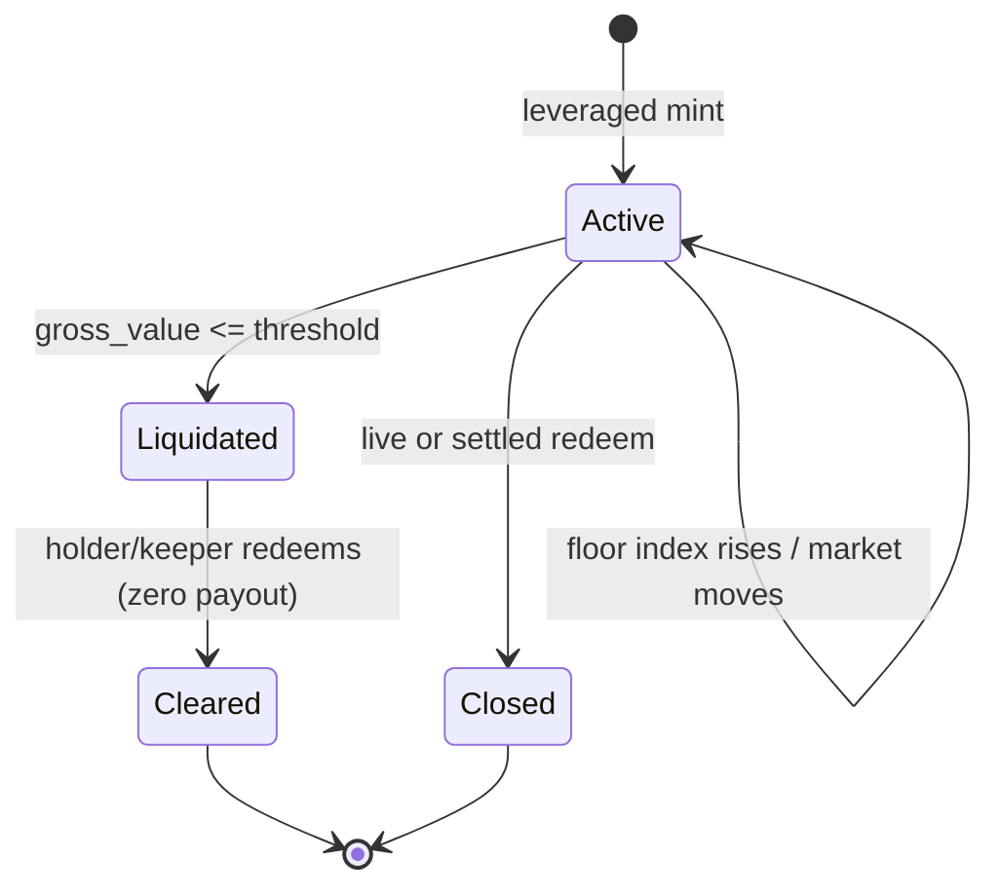

# Liquidation

Liquidation removes a leveraged Predict position whose live value has decayed to or below the value of its deterministic floor. It is a knockout, not an auction: the holder receives nothing beyond what they already paid, the position is struck from the live valuation indexes, and a tombstone remains until the holder's manager closes it. Only leveraged positions are subject to liquidation; an unleveraged (1x) position has no floor and cannot be liquidated. This document describes the trigger condition, the data structure that selects candidates, the bounded scan budgets, and what those bounds imply for liquidity providers.

For the contract model behind a position's floor and leverage, see [./leverage-and-floor.md](./leverage-and-floor.md). For LP exposure to bounded scans, see [../risks.md](../risks.md). Tunable parameters referenced below are defined in [../design/configuration.md](../design/configuration.md).

## Why only leveraged positions liquidate

Predict sells one option-like contract per position, not a spot contract plus a separate debt overlay. A position's live value is its range-probability value minus a deterministic floor, floored at zero. The floor is the share of the contract's notional that the pool funded on the holder's behalf when leverage was applied: at mint, the user contributes `entry_probability × quantity / leverage` and the pool seeds the remainder (`floor_seed_amount`) into LP backing. That seeded amount, normalized into `floor_shares` by the floor index at open and indexed by a rising floor-index schedule, is the floor the holder must eventually return to the pool.

A 1x position has `floor_seed_amount = 0`, hence `floor_shares = 0`. An `Order` is leveraged exactly when `floor_shares > 0`, and only leveraged orders are inserted into the liquidation index. The floor is limited-recourse to the order that created it: it can offset only that order's own live value, capped at that value. Once the live value falls to the floor, the holder's equity in the position is gone, and the pool's backing is exactly the floor it is owed. Liquidation closes the gap before the live value can fall *below* the floor, which would leave the pool under-recovered.

## The liquidation condition

For one active leveraged order, the liquidation check uses three quantities, all evaluated against the same fresh live oracle inputs:

- **gross value** — the position's probability-weighted live value, `gross_value = range_probability × quantity`, where `range_probability` is the live probability that settlement lands in the order's strike range (a 1e9-scaled fixed-point value).
- **current floor amount** — the floor the holder owes right now, `floor_amount = floor_shares × index_now`, where `index_now` is the floor index at the current timestamp. The floor index starts at 1.0 and ramps toward the snapshotted `terminal_floor_index` as expiry approaches, so the floor a leveraged holder owes grows over the life of the contract.
- **liquidation LTV** — a 1e9-scaled loan-to-value threshold snapshotted per expiry (`liquidation_ltv`), where a smaller value liquidates earlier.

The order is liquidated when

```
gross_value <= floor(floor_amount × 1e9 / liquidation_ltv)
```

The right-hand side is the liquidation threshold: the live value at which the floor reaches the configured fraction of the position's value. Multiplications and divisions here are Predict's 1e9 fixed-point operations that round down, so the threshold is `floor(floor_amount × 1e9 / liquidation_ltv)`. Because both the floor amount and the live value are recomputed from current oracle state at each check, a position becomes liquidatable through either a drop in `range_probability` (the market moving away from the order's range) or the natural rise of `index_now` toward terminal as expiry nears.

At mint, two related conditions keep a leveraged order solvent at entry. The same threshold relation is enforced in the opposite direction: entry must sit strictly above the liquidation threshold (`exposure_value > floor(floor_seed_amount × 1e9 / liquidation_ltv)`), where `exposure_value = entry_probability × quantity`. Separately, the terminal floor must stay strictly below the LTV-discounted terminal notional (`floor_shares × terminal_floor_index < quantity × liquidation_ltv`). A position therefore always begins solvent and only crosses the threshold later.

## What liquidation does

Liquidation is a pure knockout. When the condition holds, the protocol:

1. Marks the order liquidated in the liquidation index, removing it from the active candidate set and recording a tombstone (`liquidated_orders`).
2. Removes the order's full live-index terms from both NAV and payout backing, so it no longer contributes to live pool valuation.
3. Emits `OrderLiquidated`.

No payout is computed and no cash moves at liquidation time. The holder's `PredictManager` is not touched — liquidation does not know which manager holds the position, which is why `OrderLiquidated` carries no owner or manager field and consumers join it to the original `OrderMinted` by `order_id`. The tombstone persists until the holder (or any keeper, since the path is permissionless and pays nothing) redeems the worthless order: that step removes the position from the manager, clears the tombstone, and emits `LiquidatedOrderRedeemed` with a zero payout. A redeem that targets an already-liquidated order is short-circuited to this cleanup path in any market state, before any live or settled pricing runs.



## Permissionless liquidation

Anyone may run a liquidation pass; no capability or admin authority is required. A pass is gated only on the package version being allowed for the market, the protocol not being mid-valuation, the oracle and Pyth source matching the market, and the oracle being active. There are two entry shapes: a bounded pass that the caller hands a budget, and a single-order attempt by ID. Both re-derive the threshold from current oracle state and liquidate only orders that are genuinely under their floor; an order that is checked but still solvent is left untouched.

Liquidation passes are also folded into the hot trade paths. Mint and live redeem each run a bounded pass (sized by the `trade_liquidation_budget`) before they touch exposure, so ordinary trading continuously clears under-floor positions even if no dedicated keeper is active. A live redeem additionally re-checks whether its own target became liquidated during that pass and, if so, diverts to the zero-payout cleanup path.

## The liquidation book

The active index is a sorted store of leveraged order IDs (`LiquidationBook`). Order IDs are held in ascending order across bounded pages, and the priority an order should be checked at is encoded directly in the bits of its packed `order_id`. The front of the index is therefore the highest-priority candidate, with no separate mutable ranking to maintain: insertion keeps the list sorted, and selection reads from the front.

The packed `order_id` lays out its highest bits as the quantity field, then floor shares, then open time and the strike boundary indexes. Quantity and floor shares are stored as *complements* (`U32_MASK − quantity_lots`, `U64_MASK − floor_shares`), so larger values produce smaller packed keys and sort earlier. The resulting ascending order is, in priority order:

1. **larger quantity first** — bigger positions, which carry more pool risk, are checked before smaller ones;
2. **then larger floor shares** — among equal quantities, higher floor coverage has the higher liquidation threshold and more pool recovery at stake.

This ordering is a deterministic consequence of the encoding alone. The book never recomputes a health score to rank orders; it relies on the fact that the qualities that make an order worth checking first are baked into the same integer that identifies it.

The book also keeps a `passive_watermark`: the last order ID visited by the rolling passive scan, so that successive bounded passes advance through the tail of the index rather than re-checking the same orders.

## Bounded budgets

Every liquidation pass is bounded. A pass never scans the whole active set; it selects at most `budget` candidates and checks only those. Two budgets exist, both admin-tunable (see [../design/configuration.md](../design/configuration.md)):

- **`trade_liquidation_budget`** — the smaller budget spent on the inline pass that runs before each mint and live redeem.
- **`valuation_liquidation_budget`** — the larger budget spent before each active expiry's contribution to a full-pool live valuation, where solvency of the leveraged book matters most.

Within a single budget, candidates are drawn from two slices:

- **Head slice** — a fixed fraction of the budget (`budget / liquidation_head_scan_divisor`, rounded up) is always taken from the front of the index, i.e. the highest-priority orders. These large, high-risk positions are re-checked on every pass.
- **Passive slice** — the remaining budget continues a rolling scan from the `passive_watermark`, advancing through the rest of the index and wrapping back to the start of the tail. This guarantees that lower-priority orders are eventually visited over successive passes rather than being starved by the head slice.

Selecting candidates advances the passive watermark, so the scan makes forward progress across calls even when each individual pass is small.

## Consequence for valuation and LP exposure

Because scans are bounded, the protocol never proves in a single transaction that *every* leveraged order is above its floor. Aggregate live pool NAV is computed from aggregate floor accounting — the total floor shares valued at the current floor index, subtracted from aggregate position liability — which is only correct under the precondition that each active leveraged order is individually above its floor. If a position were allowed to fall *below* its floor and remain in the live indexes, aggregate subtraction would overstate recoverable value, because a floor can offset only its own order's value (limited recourse), not spill over to cover other positions.

The bounded-budget design holds that precondition by policy rather than by exhaustive per-valuation proof: the head slice continuously re-checks the largest positions, the passive slice sweeps the remainder over time, and the inline passes on every mint and redeem keep the book trimmed under normal flow. **Aggregate live NAV is therefore valid conditional on the health policy keeping leveraged orders above their floor.** In a regime where price moves faster than the budgeted passes can clear under-floor positions — for example a sharp move that pushes many large leveraged orders under simultaneously, or a starved market with no trading flow — the live NAV reported to liquidity providers can temporarily overstate recoverable value until subsequent passes catch up. This is the principal LP-facing risk of the bounded scan; it is covered in [../risks.md](../risks.md). Admin tuning of the two budgets and the liquidation LTV trades gas cost per pass against how tightly the floor invariant is maintained.

## Events

| Event | Emitted when | Notable fields |
| --- | --- | --- |
| `OrderLiquidated` | An order is removed by liquidation. | `expiry_market_id`, `order_id`, `quantity`, `gross_value` (live value checked against the threshold), `floor_amount` (current floor in DUSDC base units), `liquidation_ltv` (1e9-scaled threshold used). No owner/manager — join `order_id` to `OrderMinted`. |
| `LiquidatedOrderRedeemed` | A manager clears a liquidated tombstone (zero payout). | `expiry_market_id`, `predict_manager_id`, `order_id`, `position_root_id`, `owner`, `quantity_closed`. |

`OrderLiquidated` reports the live value and floor at the moment of the knockout; `LiquidatedOrderRedeemed` reports the later, separate act of the holder closing out the worthless position. The two are joined by `order_id` (and, across partial-close replacement chains, by `position_root_id`).
