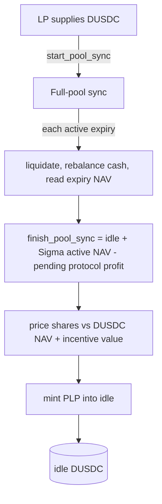

# Liquidity and NAV

The Predict pool is the counterparty to every market. Liquidity providers deposit DUSDC, receive PLP shares, and collectively back the payout liability of every active expiry. This page describes how that capital is held, how its net asset value (NAV) is computed, how it flows between the pool and individual expiries, how settlement profit is split between LPs and the protocol, and how incentives accrue to PLP holders. The recurring invariant is the solvency guarantee: each expiry always holds cash at least equal to its payout liability plus its rebate reserve.

For how markets, orders, and the strike grid work, see [markets and positions](./markets-and-positions.md). For the leverage floor that drives both pricing and NAV, see [leverage and the floor](./leverage-and-floor.md). For tunable values, see [configuration](../design/configuration.md). For trust assumptions and known caveats, see [risks](../risks.md).

## The pool vault

The pool is a single shared object, `PoolVault`. It owns:

- **idle DUSDC** (custodied in the accounting ledger) — LP-owned cash available for withdrawals and for funding expiries;
- a **protocol reserve** of DUSDC, excluded from PLP redemption (the protocol's share of materialized profit accumulates here);
- the **PLP treasury cap**, which mints and burns PLP shares;
- **staked DEEP** held in custody on behalf of managers (custodial, not LP-owned, not redeemable as PLP);
- **incentive balances** of SUI and DEEP, admin-deposited and LP-owned, that accrue to PLP holders over time;
- the **expiry accounting ledger** (`Ledger`), which custodies idle DUSDC, records the active-expiry set, the cash flow to and from each expiry, the aggregate profit basis, and the aggregate funding earmark that keeps the pool able to back every active market.

The pool does **not** own expiry-local state. Each expiry market (`ExpiryMarket`) owns its own trading cash, strike exposure, oracle binding, and risk state. The pool coordinates capital across expiries but delegates every expiry-local invariant to the expiry itself. The per-expiry funding cap is a separate policy value, stored in `ProtocolConfig` rather than in the ledger.

PLP is registered as a 6-decimal currency, matching DUSDC's 6 decimals. Fixed-point ratios throughout Predict use 1e9 scaling (`float_scaling`).

## PLP shares: supply and withdraw

PLP shares represent a pro-rata claim on the pool. They are minted when an LP supplies DUSDC and burned when an LP withdraws.

Both flows run against a **full-pool sync** — a transaction-local valuation pass (described below) that produces a fresh, single-point-in-time DUSDC value for the entire pool. The valuation is protected by a lock in `ProtocolConfig` (`valuation_in_progress`) so that no trading or admin change can mutate pool state mid-valuation.

The asymmetry between supply and withdraw pricing is deliberate:

- **Supply is priced against full-pool NAV** — the DUSDC NAV (idle DUSDC plus the NAV of every active expiry) plus the DUSDC-denominated value of the released incentive balances. A new depositor pays for the incentives' fair value, so they cannot dilute existing holders' in-kind claim on those incentives.
- **Withdraw is priced against a DUSDC-only NAV, minus a band fee.** The gross DUSDC payout is `dusdc_value × lp_amount / total_supply` (divide then multiply, rounding down); an **uncertainty-band withdrawal fee** is then deducted and retained in idle for remaining LPs (see below). The withdrawing LP's share of incentives is paid **in kind** (SUI and DEEP coins), not converted to DUSDC.

### Share math

Let `total_supply` be the PLP outstanding before the operation.

- **First supply (bootstrap):** when `total_supply == 0`, shares are minted 1:1 with the DUSDC paid. This requires the DUSDC side of NAV to be empty; incentives cannot exist before the first supply, because incentive deposits require existing PLP holders.
- **Subsequent supply:** `shares = payment × total_supply / pool_value`, where `pool_value` is the full-pool NAV (DUSDC value + incentive value). Pricing against the **total** NAV — not the DUSDC-only NAV — is what makes the depositor pay for the incentives they are buying into.
- **Withdraw:** `withdraw_amount = dusdc_value × lp_amount / total_supply`; the net payout (after the band fee below) is paid out of idle DUSDC. The payout draws only on **free** idle — idle above the active-allocation earmark, the pool's reserved backing for live markets — so a withdrawal that would dip into earmarked backing aborts (`EInsufficientActiveAllocationBacking`). Cash funded into expiries, and idle earmarked to back them, is not directly redeemable until it returns through rebalance or settlement.



### The withdrawal uncertainty-band fee

A withdrawal also pays a fee tied to how *uncertain* the pool's live valuation is at that moment. During the sync, each active expiry contributes an **uncertainty band** — the portion of its aggregate floor exposure that the bounded liquidation pass did not individually verify, capped at its unscanned range value (`min(D_max, unscanned_range)`). These sum to an `aggregate_band` for the pool.

The fee a withdrawing LP pays is:

```text
withdraw_fee = withdraw_fee_alpha × aggregate_band × (lp_amount / total_supply)
```

capped at the gross payout, where `withdraw_fee_alpha` is an admin-tunable multiplier (see [configuration](../design/configuration.md)). The fee is **retained in idle** — it is not paid out — so it accrues to the LPs who remain. The intent is symmetry with the supply side: supply prices shares against an upper-bound (optimistic) NAV so a depositor can never over-mint, and the withdraw fee charges a leaver for the unverified downside they would otherwise hand to remaining holders by exiting at that optimistic mark. The fee is zero when the book is fully verified (no unscanned under-floor exposure).

## Full-pool NAV

The pool's NAV is assembled by a hot-potato flow: `start_pool_sync` snapshots the set of active expiries, `sync_expiry` is called once per active expiry, and `finish_pool_sync` asserts that every expected expiry was processed before returning the value. Processing every active expiry exactly once is enforced by the flow, so the resulting NAV is internally consistent across all expiries at one point in time.

For each active expiry, `sync_expiry`:

1. If the expiry's oracle is **settled**, deactivates the expiry, sweeps its surplus cash back to the pool, materializes its terminal profit, and contributes **zero** active NAV.
2. Otherwise runs a bounded **liquidation pass** (a budgeted number of candidates, see [liquidation](./liquidation.md) and [configuration](../design/configuration.md)), **rebalances** the expiry's cash against the pool (described below), and reads the expiry's current pool NAV.

The pool's gross value is then:

```
gross_pool_value = idle_DUSDC + Σ active_expiry_NAV
```

and the LP-owned DUSDC value subtracts the **pending protocol-profit exclusion** — the protocol's share of profit that NAV has priced in but that has not yet been terminally materialized into the reserve. Incentive value is handled separately (priced in by supply, paid in-kind by withdraw) and is not part of the sync's DUSDC figure.

> The pending-profit subtraction has a documented underflow caveat flagged for audit: if active-expiry NAV falls (traders win) after LPs exited at a higher mark, the exclusion can exceed gross value and block supply/withdraw until NAV recovers. It is operationally mitigated by a permanent base PLP supply. See [risks](../risks.md).

### An active expiry's NAV

An active expiry's contribution to pool NAV is the cash it holds **in excess of what it must reserve**:

```
expiry_NAV = cash_balance − required_cash
required_cash = position_liability + rebate_reserve
```

The valuation aborts if `cash_balance < required_cash` — an expiry can never report a negative or unbacked NAV.

`position_liability` is the live value of all outstanding user positions, evaluated by the `StrikeNavMatrix` (the live strike-exposure index). The matrix computes:

```
live_value = aggregate_range_value − aggregate_floor_value
```

and **aborts if `aggregate_range_value < aggregate_floor_value`** rather than reporting a negative value (the aggregate-floor precondition below is what keeps this subtraction sound). The **range value** is the probability-weighted value of every minted interval, sampled against an adaptive piecewise-linear UP-price curve (`build_curve`) derived from the live SVI parameters and forward — see [pricing and oracles](./pricing-and-oracles.md). The matrix stores page-local prefix sums of quantity and strike-weighted quantity so a valuation read costs work proportional to the number of curve segments, not the number of orders. The **floor value** is `floor_shares × floor_index`, the aggregate deterministic floor across all leveraged contracts at the current time-varying floor index (see [leverage and the floor](./leverage-and-floor.md)). Aggregate NAV rounds the floor amount **down** so one-unit fixed-point dust cannot make a valuation abort, while per-order redeem and settlement floors stay exact.

#### The aggregate-floor precondition (load-bearing)

Subtracting one aggregate floor from one aggregate range value is only sound when **every leveraged order is individually above its own floor** before valuation. A floor is limited-recourse to the order that created it: it may offset only that order's value, capped at that value. If some order had already breached its floor, aggregate subtraction would let that order's excess floor cancel another order's value and **overstate** recoverable NAV.

This invariant is maintained by the surrounding health policy: the bounded liquidation pass runs **before** valuation in every sync, removing positions that have fallen to or below their floor. The matrix's `live_value` enforces the local guard `aggregate_range_value ≥ aggregate_floor_value` (aborting otherwise), but the protocol-level guarantee that aggregate subtraction is correct comes from liquidation keeping each order above its floor. See [liquidation](./liquidation.md) and [risks](../risks.md).

## Pool ↔ expiry cash flow

Idle pool cash is funded into expiries to back trading, and surplus is swept back. The policy lives entirely in the pool; the expiry only enforces its own backing on every cash move.

Each expiry has a **required cash** floor of `payout_liability + rebate_reserve`. The pool rebalances each active expiry toward a target derived from a **rebalance band** around that requirement:

- `target_cash = max(required_cash × (1 + band), expiry_cash_floor)`
- `sweep_threshold = max(required_cash × (1 + 2 × band), expiry_cash_floor)`

where `band` is `expiry_rebalance_pct` (a 1e9-scaled fraction) and `expiry_cash_floor` is a fixed minimum cash floor per expiry. The hysteresis between the top-up target and the higher sweep threshold prevents thrashing cash back and forth on small moves.

- **Top up:** if `cash_balance < target_cash`, the pool sends `target_cash − cash_balance`, capped by available idle DUSDC and by the expiry's remaining **funding room**.
- **Sweep:** if `cash_balance > sweep_threshold`, the pool pulls `cash_balance − target_cash` back to idle. The expiry only releases surplus above its own required backing — a sweep can never break solvency.

Funding room is bounded by a **per-expiry funding cap** (`max_expiry_funding`, admin-settable per expiry — see [configuration](../design/configuration.md)). The cap limits **net** funding (`sent − received`); every send checks that net funding stays within the cap. The cap bounds how much LP capital a single expiry can put at risk.

The pool also maintains a matching **earmark invariant**: idle DUSDC always covers the unfunded portion of every active expiry's cap, `idle ≥ Σ active (max_funding − net_funding)`. It is checked when an expiry is registered, when a cap is raised, on every funding move, and on every LP withdrawal. This guarantees the pool can fund each active market all the way to its cap from idle at any time — so an expiry never depends on a future sync to back positions it has already opened — and it is why earmarked idle is not LP-withdrawable. Registering a new market or raising a cap therefore requires enough free idle to back it.

Every cash movement is recorded in the ledger: `sent_to_expiry` accumulates into the profit-basis **debits**, `received_from_expiry` accumulates into the profit-basis **credits**. These running totals are how the pool tracks each expiry's P&L without scanning positions.

## Solvency guarantee

The custody leaf (`ExpiryCash`) enforces, on every operation, that:

```
cash_balance ≥ payout_liability + rebate_reserve
```

For a live market, `payout_liability` is the **sum of every open order's maximum future live payout** (a running per-order total). Because the reserve is the sum, a live redeem always lowers it by at least the cash it pays out, so paying any one winner can never breach the backing of the others — every open position is redeemable, in any order, without the expiry running dry. After settlement, `payout_liability` becomes the exact terminal payout at the settlement price. The pool-level earmark (above) guarantees the cash to meet this reserve is always available without leaning on a future sync.

- **Receiving cash** joins the funds without re-checking backing (receiving cash can only improve it).
- **Releasing surplus** to the pool requires cash to cover required backing *plus* the released amount — surplus is, by definition, only what is above the requirement.
- **Settled cash release** computes the terminal liability, asserts backing, and returns only the strict excess.

The `rebate_reserve` is the cash set aside for the trading-loss rebate, sized from the unresolved trading-fee basis (see [fees and rebates](./fees-and-rebates.md)). Because backing always includes both the payout liability and the rebate reserve, an expiry can always pay both its winners and its owed rebates. No flow lets cash drop below this line.

## Profit materialization at settlement

Profit is recognized only when it is **cash-backed and irreversible** — when an expiry settles (or returns residual rebate reserve) and cash actually flows back to the pool — not while a position is merely marked at a favorable price. Marked (unmaterialized) profit is reflected in NAV but its protocol share is held out via the pending-profit exclusion until terminal materialization.

The ledger tracks profit per expiry against a **watermark**:

- When an expiry begins terminal accounting, its watermark is set so that the normal received-delta path consumes profit. If the expiry ends in net loss (`sent > received`), that initial loss is added to `net_losses_to_fill`.
- Profit is the new cash received above the watermark. It first fills `net_losses_to_fill` (aggregate prior losses across all expiries that future profits must recover before any new profit counts), then the remainder is **materialized** and added to the profit-basis debits.

Materialized profit is split by a configured **protocol-reserve profit share** (`protocol_reserve_profit_share`, 1e9-scaled — see [configuration](../design/configuration.md)):

```
protocol_profit = floor(profit × protocol_reserve_profit_share)
lp_profit       = profit − protocol_profit
```

LP profit stays in idle DUSDC (raising NAV for all holders). Protocol profit is moved out of idle into the protocol reserve, leaving PLP NAV. The protocol reserve is excluded from PLP redemption. The cross-expiry `net_losses_to_fill` netting means the protocol only takes a cut of *aggregate* profit after prior losses are recovered — protocol revenue does not accrue while the pool is underwater on net.

## Incentives

Incentives are admin-deposited rewards (SUI and DEEP) that accrue to PLP holders. Each is held as an `IncentiveState` with a **linear vesting schedule** split into a `locked` (still-streaming) balance and a `released` (vested, claimable) balance.

- A deposit lands in `locked` and vests linearly into `released` over `[now, now + duration_ms]` (with `duration_ms` capped at `max_incentive_stream_ms`). Vesting advances on wall-clock time only, so an instant supply-then-withdraw cannot capture the still-locked remainder. A deposit onto a still-vesting schedule first vests the prior schedule to now (locking in its released portion), then re-stretches the unvested remainder plus the new deposit over a fresh window.
- A deposit requires existing PLP holders, so the first future supplier cannot capture the whole deposit.

**Only the released balance** participates in economics:

- **In NAV (priced into supply):** the released balance is valued in DUSDC from the asset's bound, fresh Pyth feed. The valuation **rounds up** (`ceil`), which marks incentive value conservatively high for share pricing — a new supplier never underpays for the incentives they are buying into. The same freshness bound the market path uses applies here; valuation happens inside the valuation window so the oracle read is gated like every other.
- **On withdraw (paid in-kind):** the withdrawing LP receives `lp_amount × released / total_supply` of each incentive coin (supply snapshotted before the burn, rounded down). The locked remainder stays for those who remain. No oracle is needed on the exit path — an in-kind slice is fair by construction — so a stale feed can never block a withdrawal.

The pricing asymmetry is intentional: incentives are priced into NAV (so depositors pay for them) but redeemed in kind (so a stale feed cannot block an exit and LPs receive the actual reward assets rather than a possibly-mispriced DUSDC conversion).

## DEEP staking custody

Separately from incentives, managers stake DEEP for trading benefits (fee discounts and a higher rebate share — see [fees and rebates](./fees-and-rebates.md)). The staked DEEP is held in custody by the pool, but it is **not** LP-owned and **not** part of NAV:

- Staking records the amount as inactive on the manager; it activates on the next epoch (lazily rolled by the trade/claim flows).
- Unstaking returns all staked DEEP (active and inactive) at any time with no penalty.

This DEEP balance is distinct from the LP-owned DEEP **incentive** balance. The same coin type serves two unrelated roles: custodial manager stake (returned to the manager) versus admin-funded LP reward (redeemed by PLP holders).

## The PoolSync valuation flow

The full-pool sync is a single transaction-local pass with a strict shape:

1. `start_pool_sync` acquires the valuation lock and snapshots the active-expiry set.
2. `sync_expiry` is called once per snapshotted expiry. Each call liquidates (bounded), rebalances cash, and accumulates the expiry's NAV — or deactivates and sweeps a settled expiry.
3. `finish_pool_sync` asserts the synced set equals the expected set, computes the DUSDC NAV (gross minus pending protocol-profit exclusion), and releases the lock.

`supply` and `withdraw` wrap this flow. `supply` values incentives **while the lock is still open** (so incentive oracle reads are gated identically to expiry reads), then finishes the sync, prices shares against the total NAV, and mints. `withdraw` finishes the sync for the DUSDC value, burns, pays DUSDC from idle, and claims the in-kind incentive slices. Because the whole valuation is one atomic transaction under the lock, supply and withdraw always price against a coherent snapshot of the entire pool.