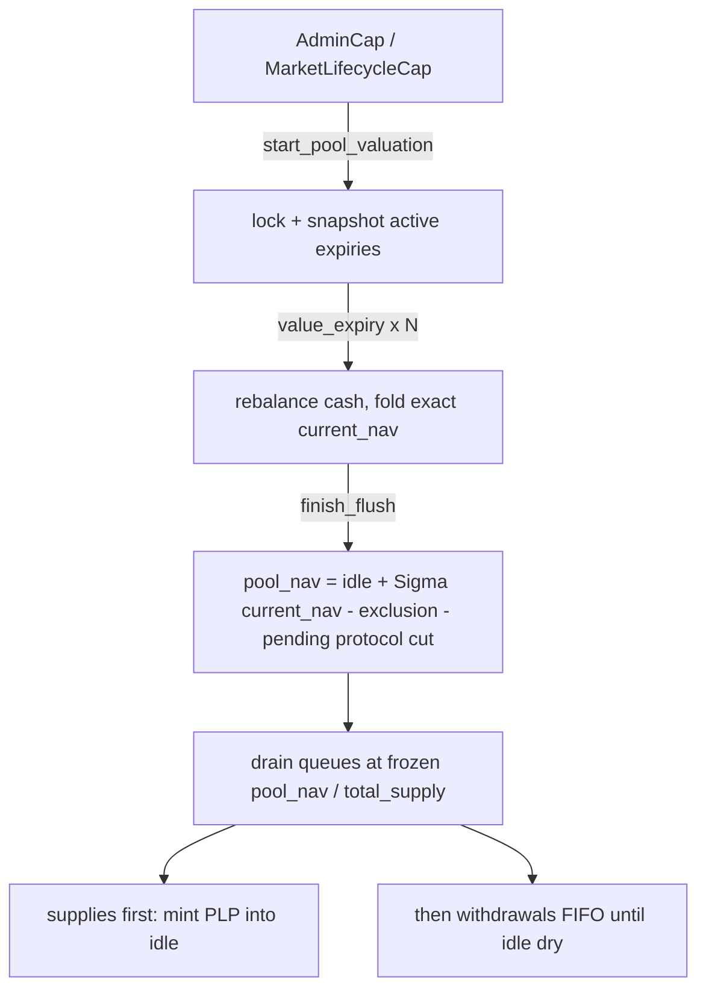

# Liquidity and NAV

The Predict pool is the counterparty to every market. Liquidity providers deposit DUSDC, receive PLP shares, and collectively back the payout liability of every active expiry. This page describes how that capital is held, how an expiry's exact net asset value (NAV) is computed, how liquidity enters and leaves through an **asynchronous** supply/withdraw flow, how a privileged daily flush prices and fills those requests at a single frozen mark, how cash flows between the pool and individual expiries, and how settlement profit is split between LPs and the protocol. The recurring invariant is the solvency guarantee: each expiry always holds cash at least equal to its payout liability plus its rebate reserve.

For how markets, orders, and absolute ticks work, see [markets and positions](./markets-and-positions.md). For the leverage floor that drives both pricing and NAV, see [leverage and the floor](./leverage-and-floor.md). For tunable values, see [configuration](../design/configuration.md). For trust assumptions and known caveats, see [risks](../risks.md).

## The pool vault

The pool is a single shared object, `PoolVault`. It owns:

- **idle DUSDC** (custodied in the accounting ledger) — LP-owned cash available for withdrawal fills and for funding expiries;
- a **protocol reserve** of DUSDC, excluded from PLP redemption (the protocol's share of materialized profit accumulates here);
- the **PLP treasury cap**, which mints PLP on supply fills and burns it on withdrawal fills during the flush;
- **staked DEEP** held in custody on behalf of managers (custodial, not LP-owned, not redeemable as PLP);
- the **expiry accounting ledger** (`Ledger`), which custodies idle DUSDC, records the active-expiry set, the cash flow to and from each expiry, and the aggregate profit basis;
- the **async LP request queues** — a supply queue escrowing DUSDC and a withdraw queue escrowing PLP — drained by the flush.

The pool does **not** own expiry-local state. Each `ExpiryMarket` owns its own trading cash, strike exposure, payout backing, and risk state. The pool coordinates capital across expiries but delegates every expiry-local invariant to the expiry itself.

PLP is registered as a 6-decimal currency, matching DUSDC's 6 decimals. Fixed-point ratios throughout Predict use 1e9 scaling (`float_scaling`).

> Reward incentives are **not** part of the pool. They moved to a separate staking contract; the `PoolVault` carries no SUI/DEEP incentive balance and no vesting state, and supply/withdraw pricing involves no incentive component. The DEEP held by the vault is purely the custodial trading stake described under [DEEP staking custody](#deep-staking-custody).

## Async supply and withdraw

LPs do not mint or burn PLP synchronously against a live valuation. Instead they **queue a request** that a later flush prices and fills at one pool-wide mark. This decouples the LP's transaction from the (privileged, oracle-reading) valuation, so an LP can never time their entry or exit against a self-supplied oracle snapshot.

- **`request_supply`** escrows a DUSDC payment and records the requesting `PredictManager` as the fill recipient. It is routed through the manager — not the tx signer — so a composing vault's own manager receives the minted PLP. It returns a queue index.
- **`request_withdraw`** escrows PLP and likewise records the manager recipient, returning a queue index.
- **`cancel_supply_request` / `cancel_withdraw_request`** let the manager owner reclaim the escrowed DUSDC or PLP at the returned index any time **before** the next flush processes it.

Each request must clear a minimum size (`min_supply_request` / `min_withdraw_request`). Escrowed funds sit in the queue until the flush drains them or the LP cancels.

## The flush: one frozen mark for both sides

A daily **flush** values the whole pool once and drains both queues against that single frozen mark. It is a transaction-local **hot potato** with a strict three-phase shape:

1. **`start_pool_valuation`** engages the valuation lock in `ProtocolConfig` and snapshots the set of active expiry markets into the potato (`PoolValuation`).
2. **`value_expiry`** is called once per snapshotted market. Each call rebalances that market's cash against the pool (top up / sweep, described below), then folds the market's NAV into a running total — a settled market contributes `0`; a live market contributes its exact `current_nav`.
3. **`finish_flush`** proves every snapshotted market was valued exactly once, computes the pool NAV, snapshots the share price once, drains both queues against it, releases the lock, and consumes the potato.

The potato has no abilities, so the sequence cannot be left half-finished: the only way to release the lock is to finish.

### The flush is privileged, not permissionless

Only a market-deployer's `MarketLifecycleCap` may **start** a flush (via `start_pool_valuation`), and the hot potato can be created **only** by starting one, so gating the start gates the whole flush. The root `AdminCap` flush path was removed — the flush is routine maintenance that should run on a revocable cap, not the irrevocable root cap; admin keeps a break-glass route by minting itself a lifecycle cap.

This is a deliberate audit decision (L8): the flush prices supply and withdraw against a live oracle, so leaving it permissionless would let anyone sandwich the mark with their own oracle update. The cap-holder is trusted not to manipulate the live oracle, which is the trust that makes the single frozen mark sound.

### Pool NAV and the single mark

`finish_flush` computes the LP-attributable pool NAV from the accumulated active-expiry total:

```
gross_pool_value = idle_DUSDC + Σ active_expiry current_nav
exclusion        = protocol_reserve_profit_share × max(0, (profit_credits + Σ current_nav) − profit_debits)
pool_nav         = max(0, gross_pool_value − exclusion − pending_protocol_profit)
```

Both subtracted terms are protocol profit not yet sitting in the reserve, in two phases:

- **`exclusion`** — the protocol's share of *unmaterialized* profit: gain NAV has priced in (via `current_nav`) but that has not yet terminally materialized into the reserve.
- **`pending_protocol_profit`** — a cut that *has* materialized but whose cash could not yet be moved to the reserve because idle was deployed in other markets; it is carried and realized on a later sweep (see [Profit materialization](#profit-materialization-at-settlement)).

The two are disjoint: the moment a cut materializes it leaves `exclusion` (its profit enters `profit_debits`) and, if not immediately movable, enters `pending_protocol_profit`. Incentive value is not part of this figure (incentives are out of the pool entirely).

`pool_nav` and the PLP `total_supply` are snapshotted **once** and passed to the drain for both queues. This single mark prices supply and withdraw identically:

- **Supply fill:** `shares = floor(amount × total_supply / pool_nav)`.
- **Withdraw fill:** `payout = floor(shares × pool_nav / total_supply)`.

There is **no band, no separate supply/withdraw pricing, and no optimistic/conservative stance.** Because the same mark must be fair in both directions, it must equal the *true* recoverable value — which it does, because each per-expiry `current_nav` is exact (see [An active expiry's exact NAV](#an-active-expirys-exact-nav)). This is the NAV-mark invariant: the supply mark must never undercount true value (or a supplier could over-mint and dilute incumbents), and a single exact mark satisfies it in both directions.



### Draining the queues

`drain_lp_requests` processes **supplies first, then withdrawals**, each bounded by its own operator-supplied budget — `supply_budget` / `withdraw_budget: Option<u64>`, where `None` drains that queue fully. The budgets are **independent**, so a supply backlog can never starve withdrawals, and the operator sizes them to the gas left after valuing the snapshotted markets:

- **Supplies pass (FIFO from the head).** Each request mints `supply_shares(amount, total_supply, pool_nav)` PLP and joins the escrowed DUSDC into idle. A request whose shares round to **zero** (dust) is refunded its DUSDC instead of minting — per-request failure isolation, not an abort that would revert the whole flush.
- **Withdrawals pass (FIFO until idle is dry).** Each request burns its escrowed PLP and pays `withdraw_dusdc(shares, total_supply, pool_nav)` DUSDC out of idle. A dust request that rounds to zero is refunded its PLP. If idle cannot cover the head request's payout, the drain **stops** and carries that request and every later one to the next flush — withdrawals are never partially filled or reordered to skip a too-large head.

Because supplies run before withdrawals, the DUSDC supplied this flush is available to pay this flush's withdrawals. Cash funded into expiries is not directly redeemable until it returns through rebalance or settlement, so a large exit can be bounded by idle and deferred — it cannot force-drain a live market.

Fills and refunds are delivered to each recipient manager through the **balance accumulator** (`send_funds`): the minted PLP, paid DUSDC, or refunded escrow accumulates against the manager's address balance, and the manager absorbs it lazily on its next capital operation. The flush never holds a manager reference; it only needs the recipient address recorded at request time.

## Full-pool NAV is exact, per expiry

The pool NAV above is just `idle + Σ current_nav`. The substance is `current_nav`, the **exact** live recoverable value of one expiry.

### An active expiry's exact NAV

`current_nav` is a pure read: free cash minus the exact per-order live liability, floored at zero.

```
current_nav = max(0, free_cash − exact_live_liability)
```

where:

- **`free_cash = cash_balance − rebate_reserve`** — the expiry's DUSDC net of the rebate it still owes.
- **`exact_live_liability = walk_linear − correction_value`**, floored at zero, is the exact mark-to-model liability of every open order:
  - **`walk_linear`** is `Σ_orders quantity × P(strike)` — the full payout-tree walk, pricing each distinct boundary tick exactly through the resolved pricer (no piecewise-linear curve, no sampling band; the interpolation tolerance is fixed at 0).
  - **`correction_value`** is `Σ_(leveraged orders) min(quantity × range_price, floor_shares × floor_index(now))` — the floor offset, scanned exactly over the active leveraged book.

Subtracting `correction_value` is the leveraged contracts' floor offset, applied per order: each leveraged order's floor offsets only its own range value, capped at it (limited recourse), so the floor of an exhausted order can never spill over to inflate another order's value. The leftover after the floor is the order's recoverable equity, and `free_cash − liability` is exactly the cash the pool keeps once every open contract is marked.

`current_nav` carries **no backing assert** — it is purely a valuation read. Backing is a separate, always-on invariant owned by the cash leaf (below) and proven on every trade; the `max(0, ·)` cash floor only marks a degenerate (underwater) market at zero, which is its correct limited-recourse value, never negative.

> This replaces the old approximate NAV entirely. There is no longer a verified/unscanned bucket split, no aggregate uncertainty band, and no uncertainty-band withdrawal fee — those belonged to the approximate-NAV world and are gone. NAV is now the exact per-order walk, and supply/withdraw share one exact mark.

### Past-expiry settlement liveness

`current_nav` loads a live `Pricer`, so it **aborts** for a market that has crossed its expiry. Before `value_expiry` chooses the live branch, it passively calls `ensure_settled`: if Propbook has an exact normalized Pyth spot at the expiry timestamp, the market records settlement, is swept off the active set, and contributes `0` to that flush's active NAV.

If that exact spot is not present, the market remains unsettled and the live branch still aborts. This is intentional, not a bug: there is no solvency-safe mark for an unsettled past-expiry market. The flush uses one mark for both supply and withdraw, so the mark must equal the settlement-dependent true value — substituting an approximation would either dilute incumbents on supply or overpay withdrawals.

## Pool ↔ expiry cash flow

Idle pool cash is funded into expiries to back trading, and surplus is swept back. The policy lives entirely in the pool; the expiry only enforces its own backing on every cash move. `rebalance_expiry_cash` is permissionless and standalone (callable at any cadence), and the same lock-free inner logic runs inside the flush's `value_expiry` before each market is valued.

Each expiry has a **required cash** floor of `payout_liability + rebate_reserve`. The pool rebalances each active expiry toward a target derived from a **rebalance band** around that requirement:

- `target_cash = max(required_cash × (1 + band), expiry_cash_floor)`
- `sweep_threshold = max(required_cash × (1 + 2 × band), expiry_cash_floor)`

where `band` is `expiry_rebalance_pct` (a 1e9-scaled fraction) and `expiry_cash_floor` is a fixed minimum cash floor per expiry. The hysteresis between the top-up target and the higher sweep threshold prevents thrashing cash back and forth on small moves.

- **Top up:** if `cash_balance < target_cash`, the pool sends `target_cash − cash_balance`, capped by available idle DUSDC and by the expiry's remaining **funding room**.
- **Sweep:** if `cash_balance > sweep_threshold`, the pool pulls `cash_balance − target_cash` back to idle. The expiry only releases surplus above its own required backing — a sweep can never break solvency.
- **Settled sweep:** a settled expiry is deactivated, its free cash returned, and its terminal profit materialized (see [Profit materialization](#profit-materialization-at-settlement)).

Funding room is bounded by the **per-expiry allocation cap** snapshotted from cadence config when the market is created. The cap limits **net** funding (`sent − received`); every send checks that net funding stays within the cap, bounding how much LP capital a single expiry can put at risk.

A freshly created expiry holds zero cash and is not mintable until its first top-up funds it — `mint` asserts backing but never pulls pool cash, so `rebalance_expiry_cash` is what makes a market mintable. The pool holds **no standing earmark** against the caps: each expiry's own cash covers its reserve, so a market never depends on a future top-up to pay what it already owes (settlement is fully funded from the market's floor — see the solvency guarantee below).

Every cash movement is recorded in the ledger: cash sent accumulates into the profit-basis **debits**, cash received accumulates into the profit-basis **credits**. These running totals are how the pool tracks each expiry's P&L without scanning positions.

## Solvency guarantee

The custody leaf (`ExpiryCash`) enforces, on every operation, that:

```
cash_balance ≥ payout_liability + rebate_reserve
```

For a live market, `payout_liability` is a **settlement floor plus a liquidity buffer**:

```
payout_liability = max_live_backing + backing_buffer_lambda × (Σ live_backing − max_live_backing)
```

The floor is `max_live_backing` — the maximum summed payout at any *single* settlement price (the payout tree's O(1) read); since exactly one price settles a market, the floor alone covers every possible settlement outcome in full. The buffer adds `backing_buffer_lambda` (default 25%) of the gap between that floor and the **sum** of every open order's maximum live payout, and is what funds *early* exits of positions that do not overlap the book's worst-case price point. A `backing_buffer_lambda` of 1.0 reproduces the fully summed reserve, under which every position is redeemable at its peak in any order. A live redeem that would push cash below the reserve aborts; the holder can close a smaller quantity, retry after the next rebalance or any offsetting flow, and is always paid in full at settlement. Closing a position releases its own share of the buffer, so exit liquidity cannot be monopolized. After settlement, `payout_liability` becomes the exact terminal payout at the settlement price, which is always at or below the floor.

- **Receiving cash** joins the funds without re-checking backing (receiving cash can only improve it).
- **Releasing surplus** to the pool requires cash to cover required backing *plus* the released amount — surplus is, by definition, only what is above the requirement.
- **Settled cash release** computes the terminal liability, asserts backing, and returns only the strict excess.

The `rebate_reserve` is `unresolved_trading_fees_paid × trading_loss_rebate_rate` — cash set aside for the trading-loss rebate (see [fees and rebates](./fees-and-rebates.md)). Because backing always includes both the payout liability and the rebate reserve, an expiry can always pay both its winners and its owed rebates. No flow lets cash drop below this line.

## Profit materialization at settlement

Profit is recognized only when it is **cash-backed and irreversible** — when an expiry settles and cash actually flows back to the pool — not while a position is merely marked at a favorable price. Marked (unmaterialized) profit is reflected in NAV but its protocol share is held out via the unmaterialized-profit exclusion until terminal materialization.

The ledger tracks profit per expiry against a **watermark**:

- When an expiry begins terminal accounting, its watermark is set so that the normal received-delta path consumes profit. If the expiry ends in net loss (`sent > received`), that initial loss is added to `net_losses_to_fill`.
- Profit is the new cash received above the watermark. It first fills `net_losses_to_fill` (aggregate prior losses across all expiries that future profits must recover before any new profit counts), then the remainder is **materialized** and added to the profit-basis debits.

Materialized profit is split by a configured **protocol-reserve profit share** (`protocol_reserve_profit_share`, 1e9-scaled):

```
protocol_profit = floor(profit × protocol_reserve_profit_share)
lp_profit       = profit − protocol_profit
```

LP profit stays in idle DUSDC (raising NAV for all holders). The protocol cut is realized from idle into the protocol reserve — but only up to the idle actually available. The cash backing a cut may have been swept to idle earlier and redeployed to fund other active markets, so the cut can exceed idle at the instant of settlement; the realizable portion moves immediately and any remainder is carried in `pending_protocol_profit`, drained on a later sweep that refills idle (a settled-market sweep, or a live market returning surplus). Carrying it keeps the settled sweep — and the pool flush that drives it — from ever aborting on the cash move, and the carried amount stays excluded from LP value (above) until it is moved, so LPs are neither over- nor under-credited. Realization is also subordinate to funding: a top-up that backs trader payouts is never starved to pay the protocol. The reserve is excluded from PLP redemption. The cross-expiry `net_losses_to_fill` netting means the protocol only takes a cut of *aggregate* profit after prior losses are recovered — protocol revenue does not accrue while the pool is underwater on net.

## DEEP staking custody

Managers stake DEEP for trading benefits (fee discounts and a higher rebate share — see [fees and rebates](./fees-and-rebates.md)). The staked DEEP is held in custody by the pool, but it is **not** LP-owned and **not** part of NAV:

- Staking records the amount as inactive on the manager; it activates on the next epoch (lazily rolled by the trade/claim flows).
- Unstaking returns all staked DEEP (active and inactive) at any time with no penalty.

This is the only DEEP the vault holds; there is no LP-owned DEEP incentive balance (incentives moved to a separate staking contract).
