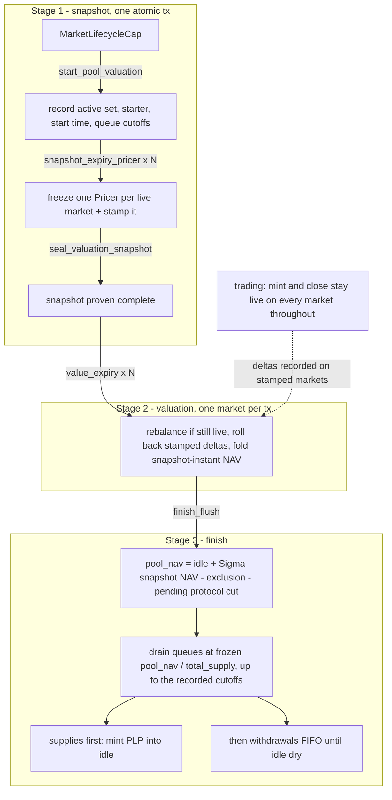

# Liquidity and NAV

The Predict pool is the counterparty to every market. Liquidity providers deposit DUSDC, receive PLP shares, and collectively back the payout liability of every active expiry. This page describes how that capital is held, how an expiry's exact net asset value (NAV) is computed, how liquidity enters and leaves through an **asynchronous** supply/withdraw flow, how a privileged periodic flush prices and fills those requests at a single snapshot-instant mark while trading stays live, how cash flows between the pool and individual expiries, and how settlement profit is split between LPs and the protocol. The recurring invariant is the solvency guarantee: each expiry always holds cash at least equal to its payout liability.

For how markets, orders, and absolute ticks work, see [markets and positions](./markets-and-positions.md). For tunable values, see [configuration](../design/configuration.md). For trust assumptions and known caveats, see [risks](../risks.md).

## The pool vault

The pool is a single shared object, `PoolVault`. It owns:

- **idle DUSDC** (custodied in the accounting ledger) — LP-owned cash available for withdrawal fills and for funding expiries;
- a **protocol reserve** of DUSDC, excluded from PLP redemption (the protocol's share of materialized profit accumulates here);
- the **PLP treasury cap**, which mints PLP on supply fills and burns it on withdrawal fills during the flush;
- the **expiry accounting ledger** (`Ledger`), which custodies idle DUSDC, records the active-expiry set, the cash flow to and from each expiry, and the aggregate profit basis;
- the **async LP request queues** — a supply queue escrowing DUSDC and a withdraw queue escrowing PLP — drained by the flush.

The pool does **not** own expiry-local state. Each `ExpiryMarket` owns its own trading cash, strike exposure, payout backing, and risk state. The pool coordinates capital across expiries but delegates every expiry-local invariant to the expiry itself.

PLP is registered as a 6-decimal currency, matching DUSDC's 6 decimals. Fixed-point ratios throughout Predict use 1e9 scaling (`float_scaling`).

> Reward incentives are **not** part of the pool. They moved to a separate staking contract; the `PoolVault` carries no SUI/DEEP balance and no vesting state, and supply/withdraw pricing involves no incentive component.

## Async supply and withdraw

LPs do not mint or burn PLP synchronously against a live valuation. Instead they **queue a request** that a later flush prices and fills at one pool-wide mark. This decouples the LP's transaction from the (privileged, oracle-reading) valuation, so an LP can never time their entry or exit against a self-supplied oracle snapshot.

- **`request_supply`** escrows a DUSDC payment, records the requesting account's receive address as the fill recipient, and stores `min_plp_out`, the minimum PLP the fill must deliver — measured **after** the supply/withdraw fee, so it bounds what the account actually receives. It is routed through the account — not just the tx signer — so a composing vault's own account receives the minted PLP. It returns a queue index.
- **`request_withdraw`** escrows PLP, records the account recipient, and stores `min_dusdc_out`, the minimum DUSDC the fill must deliver — measured **after** the supply/withdraw fee. It returns a queue index.
- **`cancel_supply_request` / `cancel_withdraw_request`** let the account owner reclaim the escrowed DUSDC or PLP at the returned index while no flush is in flight. Cancels are **gated during a flush**: once the snapshot lands, the frozen mark is on-chain readable, so an ungated cancel of an already-eligible request would be a free look at a stale price — keep the fill if the mark favors you, cancel if not. New requests stay ungated because the eligibility cutoff quarantines them to the next mark.

Each request must clear a minimum size (`min_supply_request` / `min_withdraw_request`). Escrowed funds sit in the queue until the flush fills or refunds the request, or the LP cancels it.

## The flush: one frozen mark for both sides

A periodic **flush** values the whole pool at one snapshot instant and attempts to drain both queues against that single frozen mark, filling only eligible heads. It runs in three stages, spanning as many transactions as it needs, and trading is **never** paused while it is in flight:

1. **Snapshot — one atomic transaction.** `start_pool_valuation` engages the cross-transaction valuation flag in `ProtocolConfig` and records the flush's frozen facts on the vault (`PoolValuation`): the active market set, the starter, the start time, and each LP queue's eligibility cutoff (its `next_index` — the drain later fills only requests submitted before this instant). One `snapshot_expiry_pricer` per market then freezes that market's oracle state as a `Pricer` and stamps the market, and `seal_valuation_snapshot` proves the set is complete. A `SnapshotStage` hot potato scopes all of this to the starting transaction, so every market's pricer is loaded at the same instant — the simultaneity that makes the single mark sound. A market already settled at snapshot time is recorded with no pricer and contributes `0`; an expired-but-unsettled market aborts the snapshot — settle it first, then start the flush.
2. **Valuation — resumable.** One `value_expiry` per transaction folds one market's SNAPSHOT-INSTANT NAV into the running total, reading no oracle: the frozen snapshot alone decides both the sweep-vs-value branch and the mark. A market frozen as settled is swept and contributes `0`. A still-live market is first rebalanced against the pool (top up / sweep, described below); one that expired mid-window is valued as-is at its frozen pre-expiry mark. The market's post-snapshot trades are rolled back through its stamp (next section) and the stamp is then cleared, so later trades run unrecorded. One market per transaction is a hard shape, never batched: a market's payout tree is capped at `max_payout_tree_nodes` boundary nodes — derived as Sui's 1,000-cached-object budget minus a 40-child reserve, 960 — so a single `value_expiry` always fits a transaction.
3. **Finish.** `finish_flush` proves every snapshotted market was valued exactly once, computes the pool NAV, snapshots the share price once, drains each LP queue only up to its recorded cutoff, releases the valuation flag, and retires the valuation.

Only the flush starter may value markets and finish: a third party can neither fold markets into an operator's flush nor finish it with zero drain budgets, retiring the mark with no fill. An abandoned flush is discarded (`abort_valuation`, below), never finished by a stranger.

PLP bounds live NAV work separately from the flush itself: each active expiry is stored with its expiry timestamp, and market registration rejects a new future market once the active pre-expiry count reaches the upgrade-required live-market cap. Expired or settled markets may still sit in the pool's active-expiry set until a rebalance or valuation pass sweeps them, but they no longer count against the live NAV cap because they do not use a live `current_nav` walk.

### Trading stays live: the valuation stamp and delta log

A snapshotted-but-not-yet-valued market carries a `ValuationStamp` naming its flush. Every mint and live close on it records two things on the stamp: the payout-tree range operation exactly as applied, and the measured deltas of the two cash rows NAV reads (the cash balance and the inventory-impact reserve). `value_expiry` reconstructs the snapshot-instant book exactly: the live tree is walked with each boundary's quantities rolled back through the recorded deltas — same per-boundary rounding, same monotonicity observation, with boundaries that exist only in the log priced directly — and the cash rows are rolled back by their measured deltas. Trades after a market's valuation are invisible to the already-recorded figure. Either way the semantics are as-of-snapshot: the mark LPs fill at is exactly the pool NAV at the snapshot instant.

The delta log is bounded: a market whose log reaches `max_valuation_log_ops` (admin-tunable, default 256) refuses further trades until its `value_expiry` lands or the flush is discarded — a bounded per-market degradation, and the cap's setter is deliberately not valuation-locked, so it can be raised mid-flush. The log adds compute to that market's valuation (one pricer evaluation per logged boundary), not object loads.

### What is gated during a flush

Gated while the valuation flag is engaged: the keeper cash flows (`rebalance_expiry_cash`, `sponsor_fee_incentives`), market creation, most config setters, and LP request **cancels** (see [Async supply and withdraw](#async-supply-and-withdraw) for why an ungated cancel would be a free look at the frozen mark). New LP requests are not gated — the eligibility cutoff quarantines them to the next mark. `try_settle` refuses only **stamped** markets: a per-market wait until that market's `value_expiry` clears the stamp (or the flush is aborted), not a pool-wide gate. The snapshot stage refuses to stamp an expired-unsettled market, so settlement is never due before a flush stamps a market — only an expiry landing mid-window waits.

### A stalled flush is bounded

A dead keeper stalls the flush; trading continues. The cost is queued LP fills waiting and the flush-set markets' settlement deferred. `abort_valuation_privileged` discards the in-flight valuation immediately on lifecycle authority; `abort_valuation` is permissionless once the flush has been in flight longer than `max_valuation_window_ms` (admin-tunable within 5 minutes–4 hours, default 1 hour). Abort discards the partial NAV — the frozen marks are sound only as a simultaneous set, so a later flush re-snapshots — while cash already moved by valuation rebalances stays moved (those are invariant-preserving per-market operations). Market stamps go stale and are lazily discarded by the next trade or settle attempt, so neither abort nor finish visits stamped markets.

The same window bounds the mark's staleness: fills execute at finish time against the snapshot-instant NAV, and the gap between snapshot and fill is operator-controlled, capped by the abort deadline.

### The flush is privileged, not permissionless

Only a market-deployer's `MarketLifecycleCap` may **start** a flush (via `start_pool_valuation`, on a registry-issued lifecycle proof), the snapshot stage cannot leave the starting transaction, and only the starter may value markets and finish — so gating the start gates the whole flush. The same lifecycle authority is what discards a flush immediately (`abort_valuation_privileged`). The root `AdminCap` flush path was removed — the flush is routine maintenance that should run on a revocable cap, not the irrevocable root cap; admin keeps a break-glass route by minting itself a lifecycle cap.

This is a deliberate audit decision (L8): the flush prices supply and withdraw against a live oracle, so leaving it permissionless would let anyone sandwich the mark with their own oracle update. The cap-holder is trusted not to manipulate the live oracle at the snapshot instant, which is the trust that makes the single frozen mark sound.

### Pool NAV and the single mark

`finish_flush` computes the LP-attributable pool NAV from the accumulated active-expiry total:

```
gross_pool_value = idle_DUSDC + Σ active_expiry snapshot_nav
exclusion        = protocol_reserve_profit_share × max(0, (profit_basis_credits + Σ snapshot_nav) − profit_basis_debits)
pool_nav         = max(0, gross_pool_value − exclusion − pending_protocol_profit)
```

where each `snapshot_nav` is that market's exact NAV at the flush's snapshot instant (the shape of `current_nav`, reconstructed through the stamp). Both subtracted terms are protocol profit not yet sitting in the reserve, in two phases:

- **`exclusion`** — the protocol's share of *unmaterialized* profit: gain NAV has priced in (via each market's snapshot NAV) but that has not yet terminally materialized into the reserve.
- **`pending_protocol_profit`** — a cut that *has* materialized but whose cash could not yet be moved to the reserve because idle was deployed in other markets; it is carried and realized on a later sweep (see [Profit materialization](#profit-materialization-at-settlement)).

The two are disjoint: the moment a cut materializes it leaves `exclusion` (its profit enters `profit_basis_debits`) and, if not immediately movable, enters `pending_protocol_profit`. Incentive value is not part of this figure (incentives are out of the pool entirely).

`pool_nav` and the PLP `total_supply` are snapshotted **once** and passed to the drain for both queues. This single mark prices supply and withdraw identically:

- **Supply fill:** `fee = ceil(amount × plp_supply_fee_rate)` (zero as shipped), then `shares = floor((amount − fee) × total_supply / pool_nav)`.
- **Withdraw fill:** `gross = floor(shares × pool_nav / total_supply)`, then `payout = gross − ceil(gross × plp_withdraw_fee_rate)`.

The fee is charged on the DUSDC leg *after* the mark, never inside it, and is retained by the pool — see [fees and rebates](./fees-and-rebates.md#the-lp-supplywithdraw-fee). The mark itself is unchanged by it.

There is **no band, no separate supply/withdraw pricing, and no optimistic/conservative stance.** Because the same mark must be fair in both directions, it must equal the *true* recoverable value — which it does, because each per-expiry mark is exact: `current_nav`'s shape evaluated on the snapshot-instant book (see [An active expiry's exact NAV](#an-active-expirys-exact-nav)). This is the NAV-mark invariant: the supply mark must never undercount true value (or a supplier could over-mint and dilute incumbents), and a single exact mark satisfies it in both directions.


```mermaid
flowchart TD
  subgraph S1[Stage 1 - snapshot, one atomic tx]
    CAP[MarketLifecycleCap] -->|start_pool_valuation| REC[record active set, starter, start time, queue cutoffs]
    REC -->|snapshot_expiry_pricer x N| FRZ[freeze one Pricer per live market + stamp it]
    FRZ -->|seal_valuation_snapshot| SEAL[snapshot proven complete]
  end
  subgraph S2[Stage 2 - valuation, one market per tx]
    SEAL -->|value_expiry x N| EXP[rebalance if still live, roll back stamped deltas, fold snapshot-instant NAV]
  end
  subgraph S3[Stage 3 - finish]
    EXP -->|finish_flush| NAV[pool_nav = idle + Sigma snapshot NAV - exclusion - pending protocol cut]
    NAV --> DRAIN[drain queues at frozen pool_nav / total_supply, up to the recorded cutoffs]
    DRAIN --> SUP[supplies first: mint PLP into idle]
    DRAIN --> WD[then withdrawals FIFO until idle dry]
  end
  TRADE[trading: mint and close stay live on every market throughout] -.->|deltas recorded on stamped markets| EXP
```

### Draining the queues

`lp_book::drain` fills only requests submitted before the flush's snapshot instant — each queue stops at its recorded eligibility cutoff, so younger requests wait for the next mark. It processes **supplies first, then withdrawals**, each bounded by its own operator-supplied budget — `supply_budget` / `withdraw_budget: Option<u64>`, where `None` makes that queue unbounded. The budgets are **independent**, so a supply backlog can never starve withdrawals, and the operator sizes them to the finish transaction's own gas:

- **Supplies pass (FIFO from the head).** Each executable request whose quote satisfies `min_plp_out` mints PLP on the deposit net of the fee and joins the **whole** escrowed DUSDC into idle, fee included — the fee is simply DUSDC no shares were issued against. A head supply whose mark or quote is non-executable — PLP price outside the executable band, zero-share output, or u64 overflow — is protocol-cancelled and refunded instead of aborting the flush; it counts against the supply budget because the queue head was processed. If the quote is executable but below `min_plp_out`, the request is protocol-cancelled and refunded on the spot for the same reason, spending one processed-budget unit, and the pass continues to the next request — a limit the mark cannot meet never holds the head. That is the shipped setting (`lp_request_limit_flush_attempts` = 1); if an admin raises it, a missing head instead stays queued and stops the supply pass for the flush, refunding on its final attempt. After the limit check, a supply is bounded by `max_lp_pool_value`: one larger than the remaining headroom fills up to the cap and keeps its unfilled balance escrowed at the head, and one with no room left waits untouched while the pass stops. Headroom is measured against the frozen mark plus the supplies already filled in this flush, so several requests that each fit cannot together exceed the cap, and it is handed out in queue order rather than to whichever request happens to fit. The cap is uncapped by default and applies to supplies only; withdrawals in the same flush drain afterwards and do not give back headroom, because the mark is frozen.
- **Withdrawals pass (FIFO until idle is dry).** Each executable request whose quote satisfies `min_dusdc_out` burns its escrowed PLP and pays the marked payout **less the fee** out of idle; the fee stays in idle while the full escrow is burned. A head withdrawal whose mark or quote is non-executable is protocol-cancelled and refunded, counting against the withdraw budget. If the quote is executable but below `min_dusdc_out`, the request is refunded and the pass continues, exactly as on the supply side. If the quote is valid and limit-satisfying but idle cannot cover the head request's payout, idle pays as much of it as it covers, the unfilled balance stays queued at the head, and the pass **stops** — withdrawals are never reordered to skip a too-large head, and a partially paid request keeps its position rather than going to the back of the line.

Because supplies run before withdrawals, the DUSDC supplied this flush is available to pay this flush's withdrawals. Cash funded into expiries is not directly redeemable until it returns through rebalance or settlement, so a large exit can be bounded by idle and deferred — it cannot force-drain a live market.

Fills and refunds are delivered to each recipient account through the **balance accumulator** (`send_funds`): the minted PLP, paid DUSDC, or refunded escrow accumulates against the account's receive address, and the account absorbs it lazily on its next capital operation. The flush never holds an account reference; it only needs the recipient address recorded at request time.

## Full-pool NAV is exact, per expiry

The pool NAV above is just `idle + Σ per-market NAV`. The substance is `current_nav`, the **exact** live recoverable value of one expiry; the flush folds the same quantity as of its snapshot instant by rolling each stamped market's post-snapshot trades back before the walk.

### An active expiry's exact NAV

`current_nav` is a pure read: free cash minus the exact per-order live liability, floored at zero.

```
current_nav = max(0, free_cash − live_marked_liability)
```

where:

- **`free_cash = cash_balance − inventory_impact_reserve`** — the expiry's DUSDC net of the isolated impact escrow it still owes. Inventory-impact escrow is not LP value while live.
- **`live_marked_liability = walk_linear`**, floored at zero, is the mark-to-model liability of every open order: `Σ_orders quantity × P(range)`, evaluated as the full payout-tree walk that prices each distinct boundary tick once through the resolved pricer. Every position is worth exactly its quantity times its range probability, so the walk carries no per-order correction term. (The flush's snapshot reconstruction is not such a term either: it rolls whole recorded trades back off the book before running the same walk.)

The aggregate is netted per boundary rather than summed per order, so it can differ from the per-order sum by boundary rounding; it is clamped at zero once, inside the walk. `free_cash − liability` is exactly the cash the pool keeps once every open contract is marked.

`current_nav` carries **no backing assert** — it is purely a valuation read. Backing is a separate, always-on invariant owned by the cash leaf (below) and proven on every trade; the `max(0, ·)` cash floor only marks a degenerate (underwater) market at zero, which is its correct limited-recourse value, never negative.

> This replaces the old approximate NAV entirely. There is no longer a verified/unscanned bucket split, no aggregate uncertainty band, and no uncertainty-band withdrawal fee — those belonged to the approximate-NAV world and are gone. NAV is now the exact per-order walk, and supply/withdraw share one exact mark. The flat exit fee charged on withdraw fills is not a revival of that band: it never enters the mark, and is applied to the DUSDC leg after the mark is computed (see [fees and rebates](./fees-and-rebates.md#the-lp-supplywithdraw-fee)).

### Past-expiry settlement liveness

A live `Pricer` cannot be loaded for a market that has crossed its expiry, so the flush's snapshot stage **refuses** an expired-but-unsettled market. Settlement is a separate transaction: the keeper calls `try_settle` before starting the flush, supplying the canonical exact-history Pyth and Block Scholes stores; Pyth is checked first, while Block Scholes is eligible only after the 30-second grace period. A market settled at snapshot time is frozen with no pricer, swept off the active set by its `value_expiry`, and contributes `0`. A market that expires mid-window is valued as-is at its frozen pre-expiry mark, and its settlement waits only for that one `value_expiry` to clear its stamp (or a flush abort) — `try_settle` refuses stamped markets, never the rest of the pool.

If the exact settlement spot is not present, the market remains unsettled and a flush cannot start over it. This is intentional, not a bug: there is no solvency-safe mark for an unsettled past-expiry market. The flush uses one mark for both supply and withdraw, so the mark must equal the settlement-dependent true value — substituting an approximation would either dilute incumbents on supply or overpay withdrawals.

## Pool ↔ expiry cash flow

Idle pool cash is funded into expiries to back trading, and surplus is swept back. The policy lives entirely in the pool; the expiry only enforces its own backing on every cash move. `rebalance_expiry_cash` is permissionless and standalone (callable at any cadence, blocked only while a flush is in flight), and the same inner logic runs inside the flush's `value_expiry` before each still-live market is valued — cash it moves is conserved between idle and the market row, so it cannot change the pool total the flush prices.

Each expiry has a **required cash** floor of `payout_liability + inventory_impact_reserve`. The pool rebalances each active expiry toward a target derived from a **rebalance band** around that requirement:

- `target_cash = max(required_cash × (1 + band), expiry_cash_floor)`
- `sweep_threshold = max(required_cash × (1 + 2 × band), expiry_cash_floor)`

where `band` is `expiry_rebalance_pct` (a 1e9-scaled fraction) and `expiry_cash_floor` is a fixed minimum cash floor per expiry. The hysteresis between the top-up target and the higher sweep threshold prevents thrashing cash back and forth on small moves.

- **Top up:** if `cash_balance < target_cash`, the pool sends `target_cash − cash_balance`, capped by available idle DUSDC and by the expiry's remaining **funding room**.
- **Sweep:** if `cash_balance > sweep_threshold`, the pool pulls `cash_balance − target_cash` back to idle. The expiry only releases surplus above its own required backing — a sweep can never break solvency.
- **Settled sweep:** settlement first releases the now-unclaimable inventory-impact earmark into ordinary expiry surplus. The expiry is then deactivated, all cash above settled payout liability is returned, and terminal profit from that returned cash is materialized (see [Profit materialization](#profit-materialization-at-settlement)).

Funding room is bounded by the **per-expiry allocation cap** snapshotted from cadence config when the market is created. The cap limits **net** funding (`sent − received`); every send checks that net funding stays within the cap, bounding how much LP capital a single expiry can put at risk.

A freshly created expiry holds zero cash and is not mintable until its first top-up funds it — `mint` asserts backing but never pulls pool cash, so `rebalance_expiry_cash` is what makes a market mintable. The pool holds **no standing earmark** against the caps: each expiry's own cash covers its reserve, so a market never depends on a future top-up to pay what it already owes (settlement is fully funded from the market's floor — see the solvency guarantee below).

Every cash movement is recorded in the ledger: cash sent accumulates into the profit-basis **debits**, cash received accumulates into the profit-basis **credits**. These running totals are how the pool tracks each expiry's P&L without scanning positions.

## Solvency guarantee

The custody leaf (`ExpiryCash`) enforces, on every operation, that:

```
cash_balance ≥ payout_liability + inventory_impact_reserve
```

For a live market, `payout_liability` is a **settlement floor plus a liquidity buffer**:

```
payout_liability = max_net_payout + backing_buffer_lambda × (Σ net_payout − max_net_payout)
```

The floor is `max_net_payout` — the maximum summed net payout at any *single* settlement price (the payout tree's O(1) read); since exactly one price settles a market, the floor alone covers every possible settlement outcome in full. The buffer adds `backing_buffer_lambda` (default 31%) of the gap between that floor and the **sum** of every open order's maximum net payout, and is what funds *early* exits of positions that do not overlap the book's worst-case price point. A `backing_buffer_lambda` of 1.0 reproduces the fully summed reserve, under which every position is redeemable at its peak in any order. A live redeem that would push cash below the reserve aborts; the holder can close a smaller quantity, retry after the next rebalance or any offsetting flow, and is always paid in full at settlement. Closing a position releases its own share of the buffer, so exit liquidity cannot be monopolized. After settlement, `payout_liability` becomes the exact settled payout at the settlement price, which is always at or below the floor.

- **Receiving cash** joins the funds without re-checking backing (receiving cash can only improve it).
- **Releasing surplus** to the pool requires cash to cover required backing *plus* the released amount — surplus is, by definition, only what is above the requirement.
- **Settled cash release** computes the terminal liability, asserts backing, and returns only the strict excess.

The independent `inventory_impact_reserve` is the cumulative inventory potential collected from mints minus rebates paid to voluntary live closes. It is excluded from NAV and pool sweeps, and the market additionally asserts `inventory_impact_reserve ≥ phi(current payout_liability)`. Exact state-function differences make equality hold for ordinary mint/close paths; liquidations can only leave a surplus. Settlement releases that residual earmark because the live-rebate path is no longer reachable. See [fees and rebates](./fees-and-rebates.md#inventory-impact-charge-and-rebate).

## Profit materialization at settlement

Profit is recognized only when it is **cash-backed and irreversible** — when terminal cash actually flows back to the pool from a settled expiry during the settled sweep — not while a position is merely marked at a favorable price. Marked (unmaterialized) profit is reflected in NAV but its protocol share is held out via the unmaterialized-profit exclusion until terminal materialization.

The ledger tracks profit per expiry against a **watermark**:

- When an expiry begins terminal accounting, its watermark is set so that the normal received-delta path consumes profit. If the expiry ends in net loss (`sent > received`), that initial loss is added to `net_losses_to_fill`.
- Profit is the new cash received above the watermark. It first fills `net_losses_to_fill` (aggregate prior losses across all expiries that future profits must recover before any new profit counts), then the remainder is **materialized** and added to the profit-basis debits.

Materialized profit is split by a configured **protocol-reserve profit share** (`protocol_reserve_profit_share`, 1e9-scaled):

```
protocol_profit = floor(profit × protocol_reserve_profit_share)
lp_profit       = profit − protocol_profit
```

LP profit stays in idle DUSDC (raising NAV for all holders). The protocol cut is realized from idle into the protocol reserve — but only up to the idle actually available. The cash backing a cut may have been swept to idle earlier and redeployed to fund other active markets, so the cut can exceed idle at the instant of settlement; the realizable portion moves immediately and any remainder is carried in `pending_protocol_profit`, drained on a later sweep that refills idle (a settled-market sweep, or a live market returning surplus). Carrying it keeps the settled sweep — and the pool flush that drives it — from ever aborting on the cash move, and the carried amount stays excluded from LP value (above) until it is moved, so LPs are neither over- nor under-credited. Realization is also subordinate to funding: a top-up that backs trader payouts is never starved to pay the protocol. The reserve is excluded from PLP redemption. The cross-expiry `net_losses_to_fill` netting means the protocol only takes a cut of *aggregate* profit after prior losses are recovered — protocol revenue does not accrue while the pool is underwater on net.
