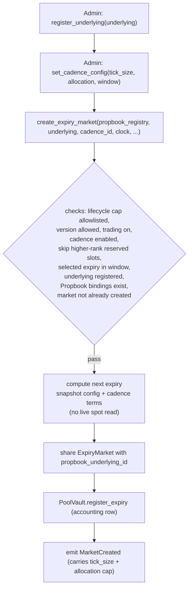
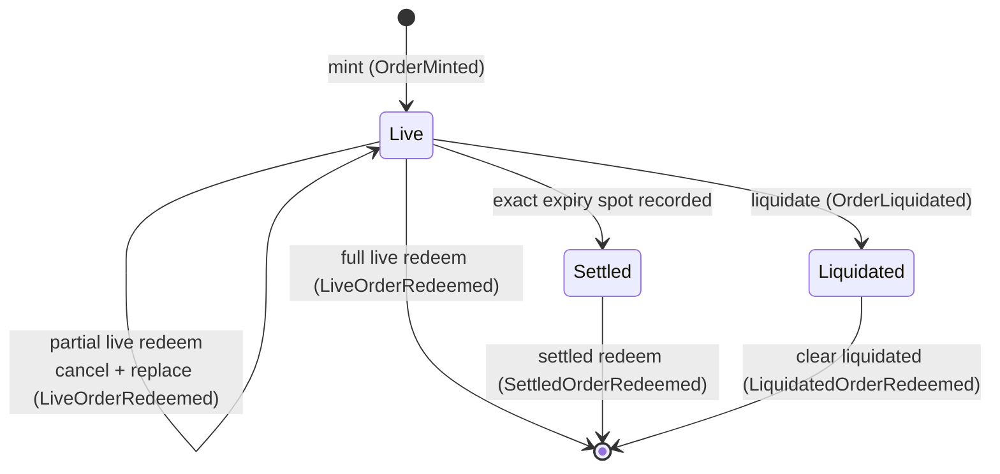

# Markets and positions

Predict is an on-chain protocol for European cash-settled binary options (digitals) on the Sui blockchain. Trading is organized into independent per-expiry markets: each market settles at one timestamp against one Pyth Lazer price feed, and every position in that market is a range digital — a contract that pays a fixed notional if the feed's price lands at expiry inside a chosen strike range, and zero otherwise. This document describes how a market comes into existence, the absolute-tick coordinate system every strike is expressed against, what a position is, where positions are tracked, and the lifecycle a position moves through from mint to redemption.

## Per-expiry markets

The protocol does not run a single continuous market. Instead, the `Registry` mints a fresh `ExpiryMarket` for each Propbook underlying and expiry timestamp. An `ExpiryMarket` is the hot shared object that owns trade execution for that expiry — its strike-exposure index, payout backing, DUSDC cash custody, and live NAV production. It does not own oracle data or snapshot oracle object IDs: it stores the `propbook_underlying_id`, and priced flows read the current canonical `propbook` feeds for that underlying on demand (see [pricing and oracles](./pricing-and-oracles.md)).

The `Registry` enforces uniqueness, admin approval, and cadence policy:

- A Propbook underlying must be **admin-approved** before Predict can build markets on it: `register_underlying` records approval for that `propbook_underlying_id`. The `propbook` feed objects themselves are created permissionlessly in `propbook`; Propbook owns source IDs and canonical source-to-underlying bindings.
- Admin configures each cadence with `tick_size`, `max_expiry_allocation`, and `window_size`. A zeroed cadence is disabled; an enabled cadence creates the next missing expiry inside its window and snapshots the configured tick/allocation terms into that market.
- **One `ExpiryMarket` per `(propbook_underlying_id, expiry)` pair.** `create_expiry_market` aborts if the registry already holds a market for that underlying and expiry.

### How a market is created

`create_expiry_market` performs the full setup atomically:

1. **Validate inputs before mutating.** The caller must present a `MarketLifecycleCap` on the registry's allowlist, the running package version must be allowed, global trading must be enabled, the underlying must be registered in Predict, and the requested cadence must be enabled. The market manager then scans forward from the cadence watermark/current-clock candidate, skips slots reserved for enabled higher-rank cadences, and requires the selected expiry to remain inside the cadence window and not already exist.
2. **Require current Propbook coverage.** The caller also passes Propbook's `OracleRegistry`; the registry asserts that Propbook currently has canonical Pyth and Block Scholes bindings for the supplied `propbook_underlying_id`. The market does **not** store those oracle object IDs, so a later Propbook rebind affects existing markets.
3. **Compute expiry and snapshot config.** The market manager picks the next missing expiry from the cadence watermark and current clock, then the `ExpiryMarket` snapshots its strike-exposure and cash config from `ProtocolConfig`, stores `propbook_underlying_id`, and snapshots the cadence `tick_size`. Pool accounting snapshots the cadence `max_expiry_allocation`. Creation needs **no live spot** — strikes are absolute ticks, so there is no grid to center on a price.
4. **Create, share, and register.** The `ExpiryMarket` is shared, registered with the pool vault as an active-expiry accounting row, and indexed by expiry in the registry.

The new `ExpiryMarket` starts with **zero DUSDC cash** and is **not mintable** until pool capital funds it through PLP rebalancing (see [liquidity and NAV](./liquidity-and-nav.md)). On success the protocol emits `MarketCreated`, carrying the expiry market id, pool vault id, `propbook_underlying_id`, expiry, `tick_size`, and `max_expiry_allocation`. The event carries `tick_size` — **not** a min/max strike — because the strike domain is the absolute tick ladder; indexers and SDKs derive raw strikes as `tick × tick_size`. The event also carries the immutable per-expiry pool allocation cap, since the cadence config that produced it can change later.

## Strikes are absolute integer ticks

Predict has **one canonical strike interpretation across the entire protocol: an absolute integer tick from zero, where `raw_strike = tick × tick_size`.** There is no second representation — no centered grid, no fixed-width band around spot, no boundary indices relative to a per-market origin. The tick `0` and the maximum tick are reserved as the open-ended sentinels; every other tick is a concrete strike.

This single interpretation is what lets the same tick mean the same price everywhere — at the public entrypoint, in the events, in the payout tree, in the liquidation book, and at settlement — without a per-market origin to translate against.

### Ticks and the ±infinity sentinels

A position's range is the half-open interval `(lower, higher]`, expressed as two strike **ticks**. At public entrypoints and in events the pair travels directly as two 24-bit ticks, `lower_tick` and `higher_tick`; an SDK converts raw strikes to ticks before submitting them. The only place the two ticks are packed into one integer is the durable order ID.

The sentinels live at the ends of the 24-bit tick domain:

- **Lower tick `0`** is the negative-infinity sentinel (`neg_inf`, raw value `0`): an open-ended lower bound.
- **Higher tick `pos_inf_tick`** (the maximum 24-bit value, `2²⁴ − 1`) is the positive-infinity sentinel (`pos_inf`, raw value `u64::MAX`): an open-ended higher bound.
- **Finite ticks** occupy the values in between (`1 … pos_inf_tick − 1`) and map to `tick × tick_size`.

Raw strikes are recovered from ticks only at the pricing and settlement boundary, through `range_codec::strikes_from_ticks`, which applies the sentinel mapping and the `tick × tick_size` multiplication. The ±infinity sentinels let a position express open-ended ranges — "price ends above 50k" or "price ends at or below 30k", i.e. plain digital calls and puts — without inventing artificial outer strikes. Settlement payout is determined by whether the settlement price falls inside `(lower, higher]`: an order pays zero when `settlement ≤ lower || settlement > higher`.

Cadence `tick_size` is validated when admin sets cadence config: it must be positive and inside the protocol tick-size bounds. Those bounds also keep the raw-strike multiplication (`tick × tick_size`) from overflowing given the 24-bit tick ceiling. The `order` module enforces range shape (`lower_tick < higher_tick`, non-empty, no fully-open `(−∞, +∞]` span; leveraged orders carry an extra one-sidedness rule) when the ticks are packed into an order ID — see [Positions](#positions-orders) and [leverage and the floor](./leverage-and-floor.md).

## Positions (orders)

A position is identified by a single packed `u256` **order ID**. It is an opaque handle: integrators pass it back to redeem, liquidate, or query a position, and treat it as a token. Internally the protocol decodes it into an `Order` view, the durable contract terms needed after mint:

| Encoded term | Meaning |
| --- | --- |
| `quantity` | Position size in DUSDC base units. Stored as a count of lots, so `position_lot_size` sets the granularity and the packed lot field bounds the maximum size. |
| `floor_shares` | Normalized leverage floor coverage. Zero for a 1x (unleveraged) order, positive for a leveraged one. See [leverage and the floor](./leverage-and-floor.md). |
| `opened_at_ms` | The timestamp the economic position was originally opened, preserved across partial-close replacements. Used only to reconstruct the floor schedule, not for market lifecycle decisions. |
| `lower_tick`, `higher_tick` | The position's strike range, as two absolute ticks (`0` = `neg_inf` lower, `pos_inf_tick` = `pos_inf` higher). |
| `sequence` | An expiry-local monotonic counter that makes each order ID unique within its market. |

The packed ID is the single source of truth at protocol boundaries; the bit layout is an implementation detail and is not part of the contract surface. Mint-only inputs that do not survive into the contract terms — entry probability, leverage tier, contribution, and fee policy — are deliberately **not** encoded. This separation matters for upgrades: mint-admission policy (for example, the leverage-tier rules) lives in config and validation, not in order decoding, so tightening admission policy in a later version can never retroactively invalidate an existing packed order ID.

Order IDs are scoped to their market: an ID alone does not carry expiry or market identity. A position is bound to a market only through the `(expiry_market_id, order_id)` key in the holder's `PredictManager`. Do not infer market facts from an order ID.

What an order represents economically: each position is one European cash-or-nothing range digital written by the pool. A contract's live (mark) value is its range probability value minus its deterministic floor — the accreting balance of the premium financing that leverage embeds — floored at zero; a 1x order is the special case with a zero floor. Leverage changes the contract's floor schedule over time rather than adding a separate debt overlay. Leverage is constrained to a discrete set — 1x, 1.5x, 2x, 2.5x, 3x (1e9-scaled) — and higher tiers are gated by entry probability at mint. The structural relationship between leverage, floor, payout, and liquidation is covered in [leverage and the floor](./leverage-and-floor.md); pricing and oracle inputs in [pricing and oracles](./pricing-and-oracles.md).

### Where positions are tracked

Positions live in a `PredictManager`, which wraps a DeepBook `BalanceManager` for DUSDC custody. The manager keeps a `positions` table keyed by `PositionKey { expiry_market_id, order_id }`; the stored value is the position's **root order ID** — the original mint's ID, carried forward unchanged across partial-close replacements so one economic position keeps a single stable handle even though its current order ID changes. The manager also keeps a per-expiry `ExpiryTradingSummary` (open-position count and trading-fees-paid) used for trading-loss-rebate resolution once all positions in an expiry are closed.

Trading is always mediated by a `PredictManager` plus a `PredictTradeProof`: minting and live redemption require a proof, which both authorizes the trade and routes the fee/net-premium deposit and withdrawal through the manager's inner balance-manager caps. The proof is generated by the manager owner or by a `PredictTradeCap` holder. The full capability model — the trade proof for mint/redeem, the deposit/withdraw caps that gate all capital movement, and sender-owned vs. self-owned managers — is documented in [architecture](../design/architecture.md).

## Position lifecycle

A position moves through mint, an optional live redeem (full or partial), and a terminal redeem or liquidation. Settlement is recorded passively by normal settled-branch flows (see [Settlement](#settlement-recorded)). Each transition emits exactly one order-domain event, keyed by `order_id` and joined to the position via `position_root_id`.

### Mint

`mint` creates a live position. It requires: the package version allowed for the market, per-market minting not paused, global trading enabled, no pool valuation in progress, a valid `PredictTradeProof`, current canonical Propbook feeds with a fresh surface, and enough expiry cash to back the post-mint payout liability plus rebate reserve. Leveraged mints additionally must satisfy leverage-tier policy, sit above the liquidation threshold at entry, and keep the order's terminal floor strictly below `quantity × liquidation_ltv`. The flow takes the `(lower_tick, higher_tick)` pair, quotes the entry range probability, derives the net premium and floor terms, allocates an `Order` (assigning the next expiry-local sequence), inserts it into the strike-exposure and liquidation indexes, and settles payment (net premium + trading fee + optional builder fee + EWMA congestion penalty). It emits **`OrderMinted`** and returns the order ID. Mint gating (surface freshness, mint pause, range validity) connects to [pricing and oracles](./pricing-and-oracles.md).

### Live redeem (full, or partial as cancel-and-replace)

While the market is active, `redeem` closes a position the caller has trade authority over, with a `close_quantity`:

- **Full close** (`close_quantity == quantity`): the order's full live-index terms are removed, the redeem amount is quoted at the current range probability net of the floor, fees and penalty are deducted, and the payout is deposited to the manager. No replacement is produced.
- **Partial close** (`close_quantity < quantity`): the protocol removes the order's *entire* live-index terms, then reinserts a **replacement** order for the remaining quantity (with proportionally reduced floor shares, a new sequence, and the original `opened_at_ms`). The replacement inherits the same `position_root_id`. Removing-and-reinserting the whole position — rather than subtracting only the closed slice — keeps the reinserted residual bit-exact with what settlement will later recompute, avoiding a one-ulp underflow.

Both paths emit **`LiveOrderRedeemed`** (carrying `quantity_closed`, `remaining_quantity`, and `replacement_order_id` when present). `redeem` first runs a bounded liquidation pass; if the targeted order was itself liquidated in that pass, it is cleared instead (see below). Live redeem requires the proof (`EProofRequiredForLiveRedeem` if absent).

### Settlement recorded

Settlement records the exact normalized Pyth spot at the market's expiry timestamp from Propbook exact timestamp history; see [pricing and oracles](./pricing-and-oracles.md). There is no public settle-only entrypoint. `redeem`, `redeem_settled`, pool rebalance, and pool valuation passively try to settle immediately before choosing settled vs live behavior. If the exact expiry spot is missing, the market remains unsettled and live pricing rejects the past-expiry market.

### Settled redeem

After settlement, a position is closed for its terminal payout. `redeem_settled` is permissionless — any keeper can sweep settled positions — and requires a full close. Payout is `quantity − floor(floor_shares × terminal_floor_index)` (rounded down), credited to the order's manager and zero when the settlement price lies outside `(lower, higher]`. It emits **`SettledOrderRedeemed`** with the settlement price and payout. Closing live (unsettled) risk through this path aborts, since that requires a proof.

### Liquidation

While the market is active, leveraged positions are subject to liquidation. `liquidate` runs a bounded pass over candidates (and `liquidate_order` targets one order); a position is liquidated when its probability-weighted gross value falls at or below its floor-derived threshold (`floor_amount / liquidation_ltv`). Both entrypoints take the current Propbook `PythFeed` and `BlockScholesFeed` objects, which `pricing::load_live_pricer` validates against Propbook's canonical binding for the market's underlying. Liquidation is permissionless, removes the order from live indexes, and **does not touch any `PredictManager`** — it emits **`OrderLiquidated`** (with no owner/manager fields, since they are unknown to the pass) and leaves a tombstone. The holder later clears the liquidated position through `redeem`/`redeem_settled`, which removes the manager position and emits **`LiquidatedOrderRedeemed`** with **zero payout**. Liquidation mechanics and thresholds are detailed in [leverage and the floor](./leverage-and-floor.md), [liquidation](./liquidation.md), and [risks](../risks.md).

## Object relationships at a glance

| Object | Owns | Created by | Sharing |
| --- | --- | --- | --- |
| `Registry` | Underlying approval, minimum tick sizes, expiry uniqueness, versions, pause caps, creation entrypoints | package init | shared |
| `PythFeed` (propbook) | One Pyth Lazer feed's global spot | `propbook` (permissionless) | shared |
| `BlockScholesFeed` (propbook) | One source id's per-expiry surfaces + exact timestamp history | `propbook` (permissionless) | shared |
| `ExpiryMarket` | Per-expiry exposure, payout backing, cash, NAV; Propbook underlying ID | `create_expiry_market` (one per underlying and expiry) | shared |
| `PredictManager` | DUSDC custody + positions keyed by `(expiry_market_id, order_id)` | `create_manager` / `create_self_owned_manager` | owned or shared |

For the capability model and trade authority, see [architecture](../design/architecture.md). For tunable parameters (tick size, leverage tiers, liquidation LTV, fee policy), see [configuration](../design/configuration.md).
