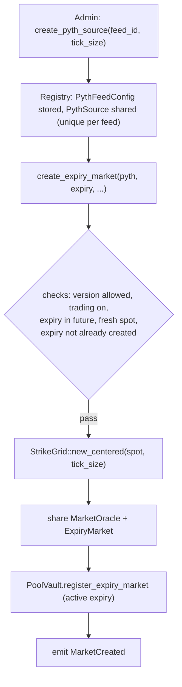
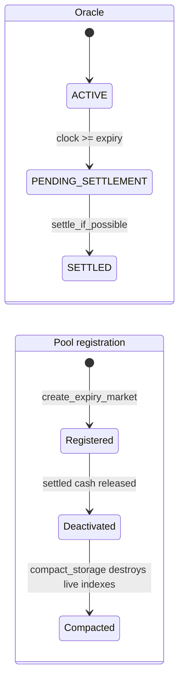

# Markets and positions

Predict is an on-chain protocol for option-like prediction contracts on the Sui blockchain. Trading is organized into independent per-expiry markets: each market settles at one timestamp against one Pyth Lazer price feed, and every position in that market is a contract whose payout depends on where the feed's price lands at expiry relative to a chosen strike range. This document describes how a market comes into existence, the geometry it imposes on strikes, what a position is, where positions are tracked, and the lifecycle a position moves through from mint to redemption.

## Per-expiry markets

The protocol does not run a single continuous market. Instead, the `Registry` mints a fresh market for each `(feed, expiry)` pair. Two objects are created together for one expiry:

- A `MarketOracle`, which owns the per-expiry oracle lifecycle: live spot/forward and SVI volatility data, the binding to its Pyth source, and the terminal settlement price once recorded.
- An `ExpiryMarket`, the hot shared object that owns trade execution for that expiry — its strike grid, exposure book, DUSDC cash custody, NAV production, and storage cleanup.

The `Registry` enforces two uniqueness invariants so markets never overlap or duplicate:

- One shared `PythSource` per Lazer feed ID. `create_pyth_source` rejects a second source for a feed that already has one. A feed must be admin-approved (have a registered `PythFeedConfig`, which also carries the admin-selected strike tick size) before any market can reference it.
- One `ExpiryMarket` per expiry timestamp. `create_expiry_market` aborts if the registry already holds a market for that expiry.

### How a market is created

`create_expiry_market` performs the full setup atomically:

1. **Validate inputs before mutating.** The running package version must be allowed, global trading must be enabled, and the expiry must be strictly in the future (`expiry > clock.timestamp_ms()`). The supplied `PythSource` must match the feed's registered config (same feed ID, same source object).
2. **Require a fresh spot.** The current Pyth spot must pass the freshness check; a market cannot be born around a stale price.
3. **Build the strike grid** centered on the current tick-floored spot, using the feed's configured tick size (see [Strike grid geometry](#strike-grid-geometry)).
4. **Choose a preallocation budget.** The number of dense grid ticks to preallocate is chosen from the time remaining to expiry — shorter-dated markets preallocate fewer ticks. This is a gas/storage tradeoff that does not affect contract terms.
5. **Create and share both objects.** The `MarketOracle` and `ExpiryMarket` are constructed (the `ExpiryMarket` snapshots its strike-exposure and cash config from `ProtocolConfig` at this moment), registered with the pool vault as an active expiry, and indexed by expiry in the registry.

The new `ExpiryMarket` starts with **zero DUSDC cash**. Pool capital enters only later, through PLP rebalancing (see [../overview.md](../overview.md)). On success the protocol emits `MarketCreated` (and a config-snapshot event) carrying the expiry market, oracle, pool vault, Pyth source, feed ID, expiry, and the grid's `min_strike`/`tick_size`/`max_strike`.

## Strike grid geometry

Each expiry has one validated, finite `StrikeGrid` (`min_strike`, `tick_size`, `max_strike`, `total_strikes`). The grid is the coordinate system every position's strike range is expressed against.

The grid is built centered on tick-floored spot:

- The number of ticks is a protocol-wide constant (`oracle_strike_grid_ticks`). The grid holds `total_strikes = ticks + 1` finite strikes.
- The center is the tick-floored spot. `min_strike = (spot/tick − ticks/2) × tick_size`, and `max_strike = min_strike + tick_size × ticks`. So the grid is a fixed-width band symmetric around spot at creation time.
- `tick_size` must be positive and a multiple of the oracle tick-size unit; `min_strike` must be positive and grid-aligned. The constructor rejects tick sizes too large or too small for the given spot, so the band always fits around spot.

A finite boundary is valid only if it is within `[min_strike, max_strike]` and aligned to the grid (`(strike − min_strike) % tick_size == 0`).

### Boundary indices and the ±infinity sentinels

A position's range is the half-open interval `(lower, higher]`. Boundaries are stored not as raw prices but as **boundary indices**, so an order ID is independent of the concrete strike values:

- Index `0` corresponds to the negative-infinity sentinel (`neg_inf`, the raw value `0`): an open-ended lower bound.
- Index `total_strikes + 1` corresponds to the positive-infinity sentinel (`pos_inf`, the raw value `u64::MAX`): an open-ended higher bound.
- A finite strike `s` maps to `finite_strike_index(s) + 1`, i.e. finite boundaries occupy the indices in between.

`assert_range_boundaries` requires `lower < higher` and a non-empty range, and forbids the fully open `(−∞, +∞]` range (which would cover the entire outcome space). The ±infinity sentinels let a position express open-ended ranges — "price ends above 50k" or "price ends at or below 30k" — without inventing artificial outer strikes. Settlement payout for a contract is determined by whether the settlement price falls inside `(lower, higher]`: `close_settled_order` pays zero when `settlement <= lower || settlement > higher`.

The `Order` module enforces the same shape on the packed index domain independently of any concrete grid: indices must be within the protocol-wide encodable bound (`oracle_strike_grid_ticks + 2`), `lower < higher`, and the full-span range is rejected. Leveraged orders carry an extra shape rule — see [Positions](#positions-orders) and [./leverage-and-floor.md](./leverage-and-floor.md).

## Positions (orders)

A position is identified by a single packed `u256` **order ID**. It is an opaque handle: integrators pass it back to redeem, liquidate, or query a position, and treat it as a token. Internally the protocol decodes it into an `Order` view, the durable contract terms needed after mint:

| Encoded term | Meaning |
| --- | --- |
| `quantity` | Position size in DUSDC base units. It is stored as a count of lots, so `position_lot_size` sets the granularity and the packed lot field bounds the maximum size. |
| `floor_shares` | Normalized leverage floor coverage. Zero for a 1x (unleveraged) order, positive for a leveraged one. See [./leverage-and-floor.md](./leverage-and-floor.md). |
| `opened_at_ms` | The timestamp the economic position was originally opened, preserved across partial-close replacements. Used only to reconstruct the floor schedule, not for market lifecycle decisions. |
| `lower_boundary_index`, `higher_boundary_index` | The position's strike range on the grid, as boundary indices. |
| `sequence` | An expiry-local monotonic counter that makes each order ID unique within its market. |

The packed ID is the single source of truth at protocol boundaries; the bit layout is an implementation detail and is not part of the contract surface. Mint-only inputs that do not survive into the contract terms — entry probability, leverage tier, contribution, and fee policy — are deliberately **not** encoded in the order ID. This separation matters for upgrades: mint-admission policy (for example, the leverage-tier rules) lives in config and validation, not in order decoding, so tightening admission policy in a later version can never retroactively invalidate an existing packed order ID.

Order IDs are scoped to their market: an ID alone does not carry expiry or market identity. A position is bound to a market only through the `(expiry_market_id, order_id)` key in the holder's `PredictManager`. Do not infer market facts from an order ID.

What an order represents economically: Predict sells one option-like contract per position. A contract's live value is its range probability value minus its deterministic floor value, floored at zero; a 1x order is the special case with a zero floor. Leverage changes the contract's floor schedule over time rather than adding a separate debt overlay. Leverage is constrained to a discrete set — 1x, 1.5x, 2x, 2.5x, 3x (1e9-scaled) — and higher tiers are gated by entry probability at mint. The structural relationship between leverage, floor, payout, and liquidation is covered in [./leverage-and-floor.md](./leverage-and-floor.md); pricing and oracle inputs in [./pricing-and-oracles.md](./pricing-and-oracles.md).

### Where positions are tracked

Positions live in a `PredictManager`, which wraps a DeepBook `BalanceManager` for DUSDC custody. The manager keeps a `positions` table keyed by `PositionKey { expiry_market_id, order_id }`; the stored value is the position's **root order ID** — the original mint's ID, carried forward unchanged across partial-close replacements so one economic position keeps a single stable handle even though its current order ID changes. The manager also keeps a per-expiry `ExpiryTradingSummary` (open-position count and aggregate cash flows) used for trading-loss-rebate resolution once all positions in an expiry are closed.

Trading is always mediated by a `PredictManager` plus a `PredictTradeProof`: minting and live redemption require a proof, which both authorizes the trade and routes the fee/contribution deposit and withdrawal through the manager's inner balance-manager caps. The proof is generated by the manager owner or by a `PredictTradeCap` holder. The full capability model — owner-direct vs. cap-delegated authority, self-owned managers, deposit/withdraw caps — is documented in [../design/architecture.md](../design/architecture.md).

## Position lifecycle

A position moves through mint, an optional live redeem (full or partial), settlement, and a terminal redeem or liquidation. Each transition emits exactly one order-domain event, keyed by `order_id` and joined to the position via `position_root_id`.

### Mint

`mint` creates a live position. It requires: the package version allowed for the market, per-market minting not paused, global trading enabled, a valid `PredictTradeProof`, a live and fresh oracle, and enough expiry cash to back the post-mint payout liability plus rebate reserve. Leveraged mints additionally must satisfy leverage-tier policy, sit above the liquidation threshold at entry, and keep the order's terminal floor strictly below `quantity × liquidation_ltv`. The flow quotes the entry range probability, derives the user contribution and floor terms, allocates an `Order` (assigning the next expiry-local sequence), inserts it into the live exposure and liquidation indexes, and settles payment (contribution + trading fee + optional builder fee + EWMA congestion penalty). It emits **`OrderMinted`** and returns the order ID. Mint gating (oracle freshness, mint pause, grid validity) connects to [./pricing-and-oracles.md](./pricing-and-oracles.md).

### Live redeem (full, or partial as cancel-and-replace)

While the market is active, `redeem` closes a position the caller has trade authority over, with a `close_quantity`:

- **Full close** (`close_quantity == quantity`): the order's full live-index terms are removed, the redeem amount is quoted at the current range probability net of the floor, fees and penalty are deducted, and the payout is deposited to the manager. No replacement is produced.
- **Partial close** (`close_quantity < quantity`): the protocol removes the order's *entire* live-index terms, then reinserts a **replacement** order for the remaining quantity (with proportionally reduced floor shares, a new sequence, and the original `opened_at_ms`). The replacement inherits the same `position_root_id`. Removing-and-reinserting the whole position — rather than subtracting only the closed slice — keeps the reinserted residual bit-exact with what settlement will later recompute, avoiding a one-ulp underflow.

Both paths emit **`LiveOrderRedeemed`** (carrying `quantity_closed`, `remaining_quantity`, and `replacement_order_id` when present). `redeem` first runs a bounded liquidation pass; if the targeted order was itself liquidated in that pass, it is cleared instead (see below). Live redeem requires the proof (`EProofRequiredForLiveRedeem` if absent).

### Settlement recorded

The `MarketOracle` derives its status from the clock and settlement state: **ACTIVE** before expiry, **PENDING_SETTLEMENT** once `clock.timestamp_ms() >= expiry` but no settlement price is recorded yet, and **SETTLED** once a terminal price is stored (status codes `STATUS_ACTIVE`, `STATUS_PENDING_SETTLEMENT`, `STATUS_SETTLED`). Settlement is recorded by an oracle operator holding the `MarketOracleCap` calling `settle_if_possible` (or as a side effect of an oracle price update), which finalizes a valid post-expiry source price while the market is pending — Pyth is preferred, with Block Scholes as the fallback source. Settlement is the terminal, irreversible transition; settled markets accept no new live risk.

### Settled redeem

After settlement, a position is closed for its terminal payout. `redeem_settled` is permissionless — any keeper can sweep settled positions — and requires a full close. Payout is `quantity − floor(floor_shares × terminal_floor_index)` (rounded down), credited to the order's manager and zero when the settlement price lies outside `(lower, higher]`. It emits **`SettledOrderRedeemed`** with the settlement price and payout. Closing live (unsettled) risk through this path aborts, since that requires a proof.

### Liquidation

While the market is active, leveraged positions are subject to liquidation. `liquidate` runs a bounded pass over candidates (and `liquidate_order` targets one order); a position is liquidated when its probability-weighted gross value falls at or below its floor-derived threshold (`floor_amount / liquidation_ltv`). Liquidation is permissionless, removes the order from live indexes, and **does not touch any `PredictManager`** — it emits **`OrderLiquidated`** (with no owner/manager fields, since they are unknown to the pass) and leaves a tombstone. The holder later clears the liquidated position through `redeem`/`redeem_settled`, which removes the manager position and emits **`LiquidatedOrderRedeemed`** with **zero payout**. Liquidation mechanics and thresholds are detailed in [./leverage-and-floor.md](./leverage-and-floor.md) and [../risks.md](../risks.md).

### Compaction

`compact_storage` is the final, privileged cleanup for a settled market (gated by the `MarketOracleCap` because index destruction returns storage rebates). It caches the terminal settled liability, then destroys the dense live exposure indexes. After compaction the expiry retains only the cash needed to back the remaining settled payout and rebate liability; free LP cash returns to the pool through PLP rebalancing, which also unregisters the expiry from the pool's active set. The pool tracks expiry lifecycle on its side — an expiry is **registered** (added to `active_expiry_markets`) when the market is created, **deactivated** (removed from the active set) when its settled cash is released, and effectively **compacted** once its dense state is destroyed.

## Object relationships at a glance

| Object | Owns | Created by | Sharing |
| --- | --- | --- | --- |
| `Registry` | Feed/expiry uniqueness, versions, pause caps, creation entrypoints | package init | shared |
| `PythSource` | One Lazer feed binding | `create_pyth_source` (one per feed) | shared |
| `MarketOracle` | Per-expiry oracle data + settlement | `create_expiry_market` | shared |
| `ExpiryMarket` | Per-expiry grid, exposure, cash, NAV, cleanup | `create_expiry_market` (one per expiry) | shared |
| `PredictManager` | DUSDC custody + positions keyed by `(expiry_market_id, order_id)` | `create_manager` / `create_self_owned_manager` | owned or shared |

For the capability model and trade authority, see [../design/architecture.md](../design/architecture.md). For tunable parameters (tick size, leverage tiers, grid ticks, liquidation LTV, fee policy, preallocation windows), see [../design/configuration.md](../design/configuration.md).