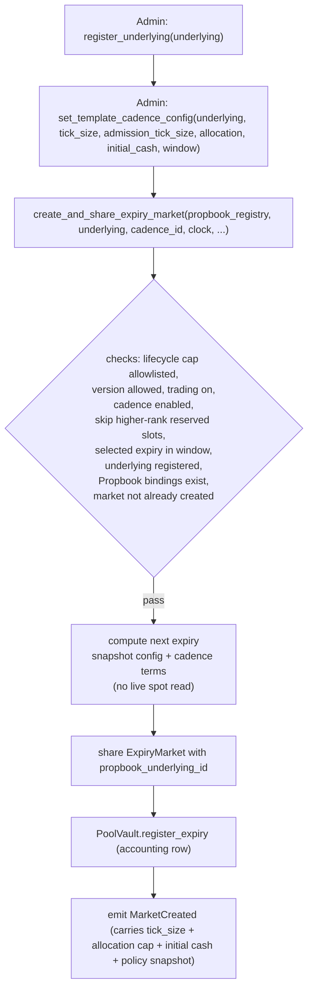
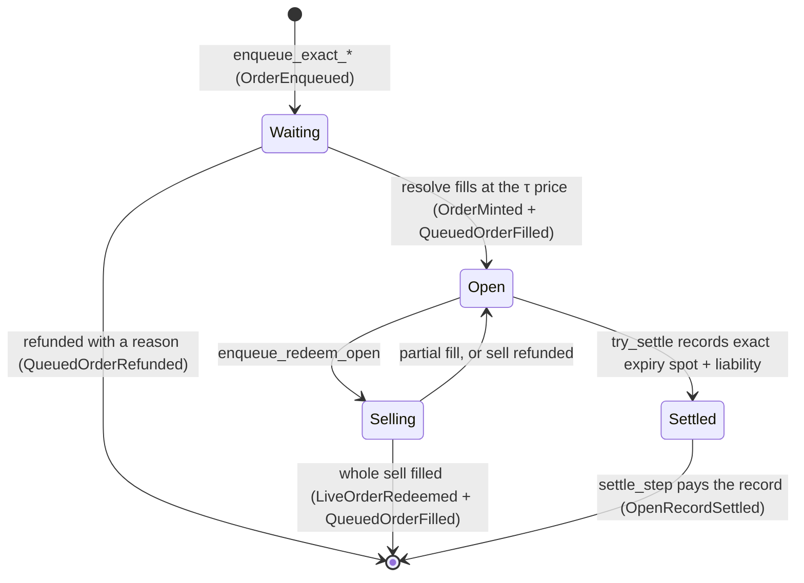

# Markets and positions

Predict is an on-chain protocol for European cash-settled binary options (digitals) on the Sui blockchain. Trading is organized into independent per-expiry markets: each market settles at one timestamp against one Pyth Lazer price feed, and every position in that market is a range digital — a contract that pays a fixed notional if the feed's price lands at expiry inside a chosen strike range, and zero otherwise. This document describes how a market comes into existence, the absolute-tick coordinate system every strike is expressed against, what a position is, where positions are tracked, and the lifecycle a position moves through from mint to redemption.

## Per-expiry markets

The protocol does not run a single continuous market. Instead, the `Registry` mints a fresh `ExpiryMarket` for each Propbook underlying and expiry timestamp. An `ExpiryMarket` is the hot shared object that owns trade execution for that expiry — its strike-exposure index, payout backing, USDC cash custody, and live NAV production. It does not own oracle data or snapshot oracle object IDs: it stores the `propbook_underlying_id`, and priced flows read the current canonical `propbook` feeds for that underlying on demand (see [pricing and oracles](./pricing-and-oracles.md)).

The `Registry` enforces uniqueness, admin approval, and cadence policy:

- A Propbook underlying must be **admin-approved** before Predict can build markets on it: `register_underlying` records approval for that `propbook_underlying_id`. The `propbook` feed objects themselves are created permissionlessly in `propbook`; Propbook owns source IDs and canonical source-to-underlying bindings.
- Admin configures each underlying's cadence with `tick_size`, `max_expiry_allocation`, `initial_expiry_cash`, and `window_size`. A zeroed cadence is disabled; an enabled cadence creates the next missing expiry inside its window and snapshots the configured tick/allocation/cash-target terms into that market. When the market is registered with the pool, PLP caps the number of active pre-expiry markets that can require live NAV valuation in one flush.
- **One `ExpiryMarket` per `(propbook_underlying_id, expiry)` pair.** `create_and_share_expiry_market` aborts if the registry already holds a market for that underlying and expiry.

### How a market is created

`create_and_share_expiry_market` performs the full setup atomically:

1. **Validate inputs before mutating.** The caller must present a `MarketLifecycleCap` on the registry's allowlist, the running package version must be allowed, global trading must be enabled, the underlying must be registered in Predict, and the requested cadence must be enabled. The market manager then scans forward from the cadence watermark/current-clock candidate, skips slots reserved for enabled higher-rank cadences, and requires the selected expiry to remain inside the cadence window and not already exist.
2. **Require current Propbook coverage.** The caller also passes Propbook's `OracleRegistry`; the registry asserts that Propbook has current canonical bindings for Pyth spot, BS spot, and the selected expiry's BS forward/SVI feeds for the supplied `propbook_underlying_id`. The market does **not** store those oracle object IDs.
3. **Compute expiry and snapshot config.** The market manager picks the next missing expiry from the cadence watermark and current clock, then the `ExpiryMarket` snapshots its strike-exposure and cash config from `ProtocolConfig`, stores `propbook_underlying_id`, and snapshots the cadence `tick_size`. Pool accounting snapshots the cadence `max_expiry_allocation` and `initial_expiry_cash`; the market also freezes `max_expiry_allocation` as the inventory-impact scale. Creation needs **no live spot** — strikes are absolute ticks, so there is no grid to center on a price.
4. **Create, share, and register.** The `ExpiryMarket` is shared, registered with the pool vault as an active-expiry accounting row, and indexed by expiry in the registry.

The new `ExpiryMarket` starts with **zero USDC cash** and is **not mintable** until pool capital funds it through PLP rebalancing (see [liquidity and NAV](./liquidity-and-nav.md)) and its queue exists in the order-flow companion. Anyone can create that queue with `queue::create_and_share`, and the fill keeper does so right after creating the market (see [delayed execution](./delayed-execution.md#records-and-statuses)). On success the protocol emits `MarketCreated`, carrying the expiry market id, pool vault id, `propbook_underlying_id`, expiry, `tick_size`, `max_expiry_allocation`, `initial_expiry_cash`, and the immutable policy snapshot applied to that expiry (`backing_buffer_lambda`, fee bounds, entry-probability bounds, expiry-fee ramp terms, and `inventory_impact_max_rate`). The event carries `tick_size` — **not** a min/max strike — because the strike domain is the absolute tick ladder; indexers and SDKs derive raw strikes as `tick × tick_size`. The event also carries the immutable per-expiry pool allocation cap/impact scale, initial cash target, and policy because the cadence and protocol template configs that produced them can change later.

```mermaid
flowchart TD
  A["Admin: register_underlying(underlying)"] --> B["Admin: set_template_cadence_config(underlying, tick_size, admission_tick_size, allocation, initial_cash, window)"]
  B --> C["create_and_share_expiry_market(propbook_registry, underlying, cadence_id, clock, ...)"]
  C --> D{"checks: lifecycle cap allowlisted,<br/>version allowed, trading on,<br/>cadence enabled,<br/>skip higher-rank reserved slots,<br/>selected expiry in window,<br/>underlying registered,<br/>Propbook bindings exist,<br/>market not already created"}
  D -->|pass| E["compute next expiry<br/>snapshot config + cadence terms<br/>(no live spot read)"]
  E --> F["share ExpiryMarket with propbook_underlying_id"]
  F --> G["PoolVault.register_expiry (accounting row)"]
  G --> H["emit MarketCreated (carries tick_size + allocation cap + initial cash + policy snapshot)"]
```

## Strikes are absolute integer ticks

Predict has **one canonical strike interpretation across the entire protocol: an absolute integer tick from zero, where `raw_strike = tick × tick_size`.** There is no second representation — no centered grid, no fixed-width band around spot, no boundary indices relative to a per-market origin. The tick `0` and the maximum tick are reserved as the open-ended sentinels; every other tick is a concrete strike.

This single interpretation is what lets the same tick mean the same price everywhere — at the public entrypoint, in the events, in the payout tree, and at settlement — without a per-market origin to translate against.

### Ticks and the ±infinity sentinels

A position's range is the half-open interval `(lower, higher]`, expressed as two strike **ticks**. At public entrypoints and in events the pair travels directly as two 30-bit ticks, `lower_tick` and `higher_tick`; an SDK converts raw strikes to ticks before submitting them. The only place the two ticks are packed into one integer is the durable order ID.

The sentinels live at the ends of the 30-bit tick domain:

- **Lower tick `0`** is the negative-infinity sentinel (`neg_inf`, raw value `0`): an open-ended lower bound.
- **Higher tick `pos_inf_tick`** (the maximum 30-bit value, `2³⁰ − 1`) is the positive-infinity sentinel (`pos_inf`, raw value `u64::MAX`): an open-ended higher bound.
- **Finite ticks** occupy the values in between (`1 … pos_inf_tick − 1`) and map to `tick × tick_size`.

Raw strikes are recovered from ticks only at the pricing and settlement boundary, through `range_codec::strikes_from_ticks`, which applies the sentinel mapping and the `tick × tick_size` multiplication. The ±infinity sentinels let a position express open-ended ranges — "price ends above 50k" or "price ends at or below 30k", i.e. plain digital calls and puts — without inventing artificial outer strikes. Settlement payout is determined by whether the settlement price falls inside `(lower, higher]`: an order pays zero when `settlement ≤ lower || settlement > higher`.

Cadence `tick_size` is validated when admin sets cadence config: it must be positive and inside the protocol tick-size bounds. Those bounds also keep the raw-strike multiplication (`tick × tick_size`) from overflowing given the 30-bit tick ceiling. The `order` module enforces range shape (`lower_tick < higher_tick`, non-empty, no fully-open `(−∞, +∞]` span) when the ticks are packed into an order ID — see [Positions](#positions-orders).

## Positions (orders)

A position is identified by a single packed `u256` **order ID**. It is an opaque handle: integrators pass it back to redeem or query a position, and treat it as a token. Internally the protocol decodes it into an `Order` view, the durable contract terms needed after mint:

| Encoded term | Meaning |
| --- | --- |
| `quantity` | Position size in USDC base units. Stored as a count of lots, so `position_lot_size` sets the granularity and the packed lot field bounds the maximum size. |
| `lower_tick`, `higher_tick` | The position's strike range, as two absolute ticks (`0` = `neg_inf` lower, `pos_inf_tick` = `pos_inf` higher). |
| `sequence` | An expiry-local monotonic counter that makes each order ID unique within its market. |

The packed ID is the single source of truth at protocol boundaries; the bit layout is an implementation detail and is not part of the contract surface. Mint-only inputs that do not survive into the contract terms — entry probability, net premium, and fee policy — are deliberately **not** encoded. This separation matters for upgrades: mint-admission policy lives in config and validation, not in order decoding, so tightening admission policy in a later version can never retroactively invalidate an existing packed order ID.

Order IDs are scoped to their market: an ID alone does not carry expiry or market identity. A position is bound to a market only through the receipt that holds it, which names its market and lives in that market's queue record (an Open record), or, for a position from an immediate mint, through the `(expiry_market_id, order_id)` key in the holder's Predict app data on their account. Do not infer market facts from an order ID.

What an order represents economically: each position is one European cash-or-nothing range digital written by the pool. A contract's live (mark) value is `quantity × range_probability`; a winning position settles for its full `quantity`. Mint admission is gated by an entry-probability band and a minimum net premium. Pricing and oracle inputs are covered in [pricing and oracles](./pricing-and-oracles.md).

### Where positions are tracked

A position opened by a queued mint stays in its market. Each market has a `MarketQueue` in the order-flow companion package, `deepbook_predict_orders`, and a filled order stays there as an **Open record**: a queue record, keyed by a sequential `u64` record ID, owned by the placing account. The record holds Predict's `OrderReceipt` for the position, with its packed order ID, its root order ID, its open time, and its held quantity. A queued fill never enters the account. The record leaves the Open status when the trader sells it early or when settlement pays it (see [delayed execution](./delayed-execution.md#open-records)).

Positions minted by the immediate paths before the delayed-execution cutover live in Predict's app-data slot on the holder's account-package `Account`. The `AccountWrapper` is the shared object passed into Predict entrypoints. Once an `Auth` hot potato opens the wrapped account, Predict stores its local `PredictData` under the `PredictApp` namespace. That data keeps a `positions` table keyed by `PositionKey { expiry_market_id, order_id }`. The stored value is the position's **root order ID**: the original mint's ID, carried forward unchanged across partial-close replacements so one economic position keeps a single stable handle even though its current order ID changes. An Open record carries the same root ID for the same reason.

Trading and capital movement are mediated by `AccountWrapper` plus account `Auth`. Placing a queued mint or early sell, LP request/cancel flows, builder-code config, and the owner-auth settled exit consume owner auth (or an authorized app's auth, such as a Sessions wrapper). Committing, resolving, refunding, settling, and cleaning up queued orders need no account authority: Predict pays a fill's proceeds and a settled payout only to the receive address the receipt recorded at placement, and the companion returns escrow to the receive address its record holds. Keeper-style settled automation for legacy account positions uses Predict app-auth generated through the account registry, so `deauthorize_app<PredictApp>` disables that automation while the owner-auth exit path remains available. The full account and authorization model is documented in [architecture](../design/architecture.md).

## Position lifecycle

From package version 4, a position moves through a queued mint, an optional queued early sell (full or partial), and the settlement payout. Each order waits in its market's queue and fills at Pyth's signed price for its τ, the last tick of the policy's Pyth channel at or before a short delay after the order. Launch runs an 800 ms delay on the 200 ms channel, so τ falls 600 to 800 ms after the order. Anyone can attach that price (`commit`) and fill the order (`resolve`), and an order that cannot fill within its limits, admission rules, or the market's cash is refunded with a reason. [Delayed execution](./delayed-execution.md) owns the queue's mechanics: τ and cohorts, the deadline and cutoff, commit, resolve, refunds, settlement, and the policy.

```mermaid
stateDiagram-v2
  [*] --> Waiting: enqueue_exact_* (OrderEnqueued)
  Waiting --> Open: resolve fills at the τ price (OrderMinted + QueuedOrderFilled)
  Waiting --> [*]: refunded with a reason (QueuedOrderRefunded)
  Open --> Selling: enqueue_redeem_open
  Selling --> Open: partial fill, or sell refunded
  Selling --> [*]: whole sell filled (LiveOrderRedeemed + QueuedOrderFilled)
  Open --> Settled: try_settle records exact expiry spot + liability
  Settled --> [*]: settle_step pays the record (OpenRecordSettled)
```

### Queued mints

Three companion entrypoints queue a mint. Each escrows a budget plus a flat order fee and returns the new record ID. Sizing happens at τ, against the committed price. Every shape requires a finite `max_cost`: zero and `u64::MAX` abort `EMintCostCapRequired`.

- **`enqueue_exact_quantity`** buys exactly `quantity`. `max_cost` caps the all-in cost and `max_probability` caps the entry probability at τ. The escrowed budget is `min(max_cost, quantity, available − order_fee)`.
- **`enqueue_exact_amount`** fixes the premium budget. At τ it buys the largest lot-rounded quantity whose `premium` fits `max_premium`, and it must reach `min_quantity`. Fees and the inventory-impact charge are paid on top of the premium, so `max_cost` caps the full cost. It carries no `max_probability`, because `min_quantity` against the premium budget already bounds the price paid per contract.
- **`enqueue_exact_cost`** fixes the all-in budget. At τ it searches for the largest lot-rounded quantity whose all-in cost (premium plus trader-paid trading fee, builder fee, and inventory-impact charge) fits `max_cost`, probing the same cost computation the fill charges. If that fill would cost more than its maximum payout, a conservative search tries a smaller fill, and integer rounding can make it miss a larger admissible one ([RP-36](../../predeploy/response-policies.md#rp-36-all-in-budget-sizing-searches-the-charged-total-the-budget-fit-is-exact-to-one-lot-dbu-834)). `min_quantity` is the slippage guard: an adverse move between placement and τ arrives as fewer contracts, and a fill below the floor is refunded instead.

Admission dry-runs the order at the placement clock and aborts `EOrderFailsLimits` when it would already miss its limits or admission. At τ, Predict's fill quotes the entry range probability, derives the premium (the contract's full entry value), allocates an `Order` (assigning the next expiry-local sequence), inserts it into the strike-exposure index, and pays from the order's escrow. Admission is the same as for an immediate mint: the entry-probability band, the minimum premium, and an all-in cost no greater than the position's maximum payout. A fill must also leave market cash at or above required cash. The trading fee is charged at τ and no congestion surcharge applies (see [fees and rebates](./fees-and-rebates.md#queued-orders)). Predict emits **`OrderMinted`** with the separate `inventory_impact_charge` and the pricing provenance of the committed tick, and the companion emits `QueuedOrderFilled`. The record becomes Open.

`quote_mint`, `quote_mint_for_account`, and `quote_mint_exact_cost_for_account` preview a mint priced like a queued fill at the clock, with `penalty_fee` 0. `quote_mint_exact_cost_for_account` returns the fill a budget would buy and that fill's cost decomposition, the natural source for a `min_quantity` floor.

### Early sell (full, or partial)

`enqueue_redeem_open` queues a sell of `close_quantity` from an Open record the account owns, named by its record ID. The whole position moves from the source record into the sell's own record, and the source becomes Closed. `min_probability` floors the range probability at τ and `min_proceeds` floors the net USDC paid. `close_quantity` must be at least the policy's `min_sell_quantity`, and a partial sell must leave at least that much. The sell escrows only the order fee and is open during the trading and mint pauses. `quote_redeem_open` prices a prospective sell of a record at a live pricer.

At τ the sell fills at the range probability for the committed price, or it is refunded with a reason:

- **Full close** (`close_quantity` equals the held quantity): the order's live-index terms are removed and the record becomes Closed.
- **Partial close**: the closed slice is removed from the live indexes and a **replacement** order with a new sequence holds the rest. The sell's record stays Open, holding the replacement under the original root ID.
- **Refund**: the sell's record returns to Open, holding the whole position.

Both fills emit **`LiveOrderRedeemed`** (carrying `quantity_closed`, `remaining_quantity`, `replacement_order_id` when present, and the separate `inventory_impact_rebate`) and `QueuedOrderFilled`. The trader receives the gross redeem amount plus the inventory-impact rebate, minus the trading and builder fees.

### Settlement recorded

Settlement records an exact Propbook spot at the market expiry: Pyth first on every attempt, then the exact Block Scholes minute-boundary spot when Pyth remains unavailable at least 30 seconds after expiry (see [pricing and oracles](./pricing-and-oracles.md)). `try_settle` is the single permissionless transition and records the price plus terminal payout liability together. It reads nothing from the queue. `redeem_settled`, `redeem_settled_permissionless`, the queue's payout walk, pool rebalance, and pool valuation only consume the current phase, so transaction builders compose `try_settle` before them when settlement may be due. If neither exact source is usable, the market remains unsettled, standalone rebalance moves no cash, and live pricing rejects the past-expiry market.

### Settlement payout

After expiry, the companion's `settle_step` first refunds every order still waiting, in bounded batches. Once the market is settled, later calls pay every Open record in bounded batches. A winning record is paid its full `quantity` in cash to its receive address, a losing record closes at zero, and each emits **`OpenRecordSettled`** with its payout. A record the market cannot pay stays Open and emits `OpenRecordPayoutSkipped`. `MarketPayoutsCompleted` marks the end of the walk. Anyone may call `settle_step`, and the fill keeper runs it until the walk completes. Afterwards anyone may `cleanup` the market's finished records and keep their storage rebate.

### Settled redeem (positions from immediate mints)

`redeem_settled` and `redeem_settled_permissionless` are unchanged by delayed execution and pay positions that immediate mints left in accounts before the cutover. A queued fill never enters an account, so they never pay an Open record. `redeem_settled` is the owner-auth path. `redeem_settled_permissionless` is the keeper path that generates Predict app-auth through the account registry. Despite its name, the keeper path accepts only senders an admin has added to the settled-redeem keeper allowlist on `ProtocolConfig`. Any other sender aborts, and the payout still goes to the order's account. A settled close is always full, and the entrypoints take no quantity. Payout is the full `quantity`, credited to the order's account and zero when the settlement price lies outside `(lower, higher]`. They emit **`SettledOrderRedeemed`** with the payout, and `MarketSettled` carries the settlement price. Closing live (unsettled) risk through either settled path aborts. Removing every keeper or deauthorizing `PredictApp` disables the keeper path but does not prevent owners from redeeming their own settled positions.

### Retired immediate paths

Before package version 4, `mint_exact_quantity`, `mint_exact_amount`, and `mint_exact_cost` minted a live position inside the trader's own transaction at the current mark, and `redeem_live` closed one the same way. They priced on the live on-chain Pyth spot, charged the congestion surcharge, and kept the position in the account. In package version 4 they keep their signatures and abort `EDelayedExecutionRequired` at any watermark. The immediate exact-quantity mint accepted `std::u64::max_value!()` as an uncapped `max_cost`, which the queued mints refuse.

## Object relationships at a glance

| Object | Owns | Created by | Sharing |
| --- | --- | --- | --- |
| `Registry` | Underlying approval, cadence deployment configs (tick sizes, caps, windows), expiry uniqueness, pause caps, creation entrypoints (versioning lives on `ProtocolConfig.version_watermark`) | package init | shared |
| `PythFeed` (propbook) | One Pyth Lazer feed's global spot | `propbook` (permissionless) | shared |
| `BlockScholesValueStore` (propbook) | One underlying's ten recent BS spots, latest forwards keyed by signed series id, and exact minute-boundary spot history | `propbook` (admin-gated, once per underlying) | shared |
| `BlockScholesSVIStore` (propbook) | One underlying's latest BS SVI parameter sets, keyed by signed series id | `propbook` (admin-gated, once per underlying) | shared |
| `ExpiryMarket` | Per-expiry exposure, payout backing, cash, NAV; Propbook underlying ID, and the order-flow ledger of pins and waiting cash need | `create_and_share_expiry_market` (one per underlying and expiry) | shared |
| `MarketQueue` (`deepbook_predict_orders`) | One market's queued orders, their escrow and receipts, and its Open records | `queue::create_and_share` (one per market) | shared |
| `AccountWrapper` / `Account` | Account-package custody plus positions from immediate mints, keyed by `(expiry_market_id, order_id)` | `account_registry::new` / `new_self_owned` | shared wrapper |

For the capability model and trade authority, see [architecture](../design/architecture.md). For tunable parameters (tick size, entry-probability band, fee policy), see [configuration](../design/configuration.md).
