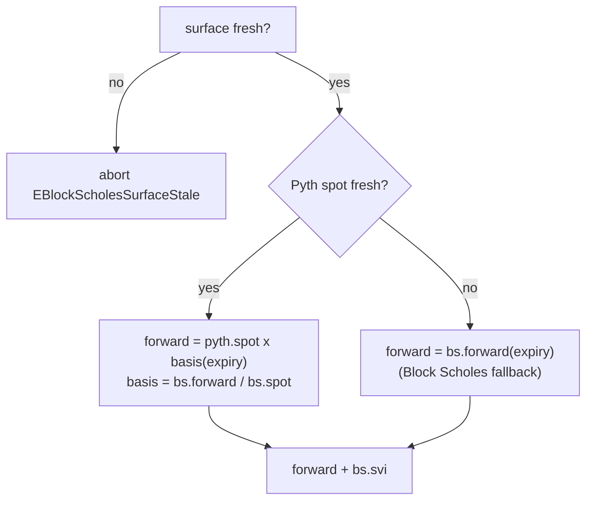

# Pricing and oracles

Predict prices its range digitals (binary options) off two independent oracle feeds and turns them into the live probabilities that drive minting, redemption, liquidation, and net asset value (NAV). The oracle feeds are **not** part of the Predict package: they live in a separate, Predict-unaware `propbook` package and are consumed read-only. This document describes those feeds, how Predict resolves a live forward from them, how a range probability is derived from the volatility surface, where live binding and freshness are enforced, and how ownership of those checks is split between Predict's market and pricing modules.

## Two standalone propbook feeds

Predict separates the *spot* of the underlying asset from the *shape of the implied distribution* around that spot, and reads each from a different `propbook` feed object. Both feeds are permissionless to update — a verified provider payload is its own provenance proof — and neither knows anything about Predict, markets, expiries, or positions.

| Input | propbook feed | What it carries | How Predict reads it |
| --- | --- | --- | --- |
| Spot price | `propbook::pyth_feed::PythFeed` | One global source-native Pyth payload per Pyth Lazer feed id, with both a publisher and an on-chain landing timestamp | `spot()`, `latest_observation()`, `freshness_timestamp_ms()` |
| Volatility surface + forward | `propbook::block_scholes_feed::BlockScholesFeed` | One feed per source id, holding per-expiry `{spot, forward, SVI, timestamps}` observations plus first-observed and official-settlement history | `spot(expiry)`, `forward(expiry)`, `svi(expiry)`, `surface_freshness_timestamp_ms(expiry)`, `has_expiry(expiry)` |

The `pricing` module is a stateless read layer over these feeds. It resolves them on demand, checks surface freshness, computes prices, and never mutates feed, pool, expiry, or position state.

### Pyth Lazer spot (`PythFeed`)

A `PythFeed` is bound to exactly one Pyth Lazer feed (identified by a `u32` feed id) and stores the latest source-native price payload for that feed — one global spot source, not a per-expiry value. Its permissionless `update_from_lazer` decodes a verified Lazer payload, finds the matching feed, reads its `(price, exponent)` pair, and stores the raw sign/magnitude fields. The source observation getters expose those raw fields; `spot()` is a positive-only convenience read that normalizes to Predict's 1e9 fixed-point scaling (`price_1e9 = magnitude × 10^(exponent + 9)`) and aborts if the source value is negative or otherwise cannot be represented as a positive Propbook spot.

Two timestamps are recorded on every accepted update, and the distinction is load-bearing:

- The **publisher timestamp** — the Lazer published-at time embedded in the verified payload (converted from microseconds to milliseconds, rounding up). This is when the data was *observed off-chain*.
- The **on-chain landing timestamp** — `clock.timestamp_ms()` captured when the update *landed on chain*.

An update is accepted only if its spot is positive and its publisher timestamp strictly advances the previously stored one and is not in the future relative to the on-chain clock — a stale or replayed payload aborts. *Freshness*, by contrast, is a read-time concern: `PythFeed::freshness_timestamp_ms()` returns the *conservative* of the two timestamps, `min(publisher, landing)`, so a value is only as fresh as its weaker timestamp. This guards both against old market data (a stale publisher timestamp) and against recently-published data that has been sitting unposted (a stale landing timestamp).

`PythFeed` deliberately does not decide whether Pyth is authoritative, derive a forward, or settle anything. It ingests, time-stamps, and exposes source facts plus positive-only convenience reads; freshness and feed binding are the consumer's responsibility.

### Block Scholes surface and forward (`BlockScholesFeed`)

One `BlockScholesFeed` exists per underlying. It holds a `Table` of per-expiry `Surface` rows; each `Surface` carries that expiry's `spot`, `forward`, `SVIParams`, and the publisher/landing timestamp pair for the row. Because spot and forward are written together in one update, the per-expiry **basis** = `forward / spot` is exact and contemporaneous. The basis is what lets Predict combine the high-frequency Pyth spot with the Block Scholes forward shape (see [Resolving the live forward](#resolving-the-live-forward)).

The surface is described by five SVI (stochastic volatility inspired) parameters in `SVIParams`:

| Param | Type | Role in `w(k)` |
| --- | --- | --- |
| `a` | `u64` | Added directly to total variance |
| `b` | `u64` | Scales the wing term |
| `rho` | `I64` (signed) | Multiplies `(k − m)` inside the wing term |
| `m` | `I64` (signed) | Subtracted from `k` (smile center offset) |
| `sigma` | `u64` | Enters under the square root with `(k − m)²` |

`rho` and `m` are signed because the wing tilt and smile-center offset can each point either direction; `a`, `b`, and `sigma` are unsigned variance quantities. `I64` is the signed fixed-point type from the shared `fixed_math` package (the renamed `predict_math`), a magnitude-plus-sign type with normalized zero. (The "Role" column describes each parameter's place in the variance formula below; the standard raw-SVI reading — `a` baseline variance, `b` wing slope, `rho` skew, `m` horizontal shift, `sigma` curvature — is consistent with it.)

A whole surface row (spot, forward, and SVI together) is written by one `update_from_bs` call carrying a single publisher timestamp, so the three age as a unit — there are no longer separate price and SVI write paths or separate staleness clocks. A push whose publisher timestamp does not advance the stored row is a clean no-op rather than an abort, so one transaction can update many expiries without an ordering race on a single expiry reverting the whole batch.

The feed validates source identity and records the source-native payload. It does not impose Predict's full pricing-safe envelope at ingest; Predict applies its own read-time checks before using the row for pricing.

The feed also folds each accepted update's spot into a **shared minute history** — the first observation per UTC minute, keyed by real-world time and shared across all of the underlying's expiries. Predict does not read it today; it is the terminal-price substrate that settlement-v2 will sample (see [Settlement is deferred](#settlement-is-deferred)).

## From SVI to a range probability

A Predict range contract pays a fixed notional if the asset's settlement price lands inside a strike interval. Its fair value is therefore the probability of that event read off the distribution the SVI surface encodes — the defining identity of an undiscounted digital, whose price per unit notional equals the risk-neutral probability of its payout event.

The derivation, conceptually:

1. **Forward and surface.** Take the resolved live forward `F` and the live `SVIParams` (see below).
2. **Total variance at a strike.** For a strike `K`, compute log-moneyness `k = ln(K / F)`, then evaluate the SVI total-variance function `w(k) = a + b·(rho·(k − m) + sqrt((k − m)² + sigma²))`. This expresses the smile as variance: how much dispersion is priced at that moneyness.
3. **One-sided (UP) tail probability.** Convert `(k, w)` into the option-pricing distance `d2 = −((k + w/2) / sqrt(w))` and take the standard normal CDF `N(d2)`. This is the probability the settlement price ends **at or above** `K` — the price of a one-sided "UP" claim struck at `K`, i.e. a cash-or-nothing digital call.
4. **Range probability by differencing.** Because the UP price is monotonically non-increasing in strike, the probability of landing in the half-open interval `(lower, higher]` is

       range_price = up_price(lower) − up_price(higher)

   the value of a contract that pays out only inside the range — a digital call spread — expressed as a 1e9-scaled probability.

The endpoints carry sentinel handling so open-ended ranges work without special-casing: a strike equal to `neg_inf` (the raw value `0`) has UP price `1.0` (the whole distribution is above it), and a strike equal to `pos_inf` (`u64::MAX`) has UP price `0`. A one-sided contract is the difference against the appropriate sentinel.

### Price-tail saturation

Because strikes are absolute integer ticks against a forward that can drift far outside the encodable strike ladder (see [markets and positions](./markets-and-positions.md)), the UP-price math must stay live in both deep tails rather than aborting. The strike/forward ratio is computed in `u128`, then both tails saturate to their limits:

- **Deep-ITM** (`strike ≪ forward`, the ratio rounds to `0`): UP price saturates to `1.0` (the `neg_inf` limit, `P(settle > strike) ≈ 1`).
- **Deep-OTM** (`strike ≫ forward`, the ratio exceeds `u64::MAX`): UP price saturates to `0` (the `pos_inf` limit).

Reaching either tail requires the forward to leave the entire encodable strike domain by orders of magnitude; saturating there keeps NAV, redeem, and liquidation reads live instead of bricking the whole market on an extreme price. The range-price differencing is likewise saturating, so a thin or far-OTM range with ~0 true probability and a 1-ulp fixed-point inversion prices `0` rather than aborting a legitimate trade.

The math runs in 1e9 fixed point throughout, using the `fixed_math` `I64` signed type for the intermediate signed quantities (`k`, `k − m`, `d2`) and guarding the real preconditions: positive forward, non-negative SVI wing term, and positive total variance.

> The full closed-form SVI and normal-CDF implementation, including the fixed-point `ln`, `sqrt`, and `normal_cdf` helpers, lives in the `pricing` and `fixed_math` modules. The formulas above are the model, not a reproduction of every rounding step.

## Resolving the live forward

Every live pricing path resolves a single `(forward, SVIParams)` tuple before pricing any strike. The Block Scholes **surface must be fresh** — a stale or missing surface row aborts pricing with `EBlockScholesSurfaceStale`, the one hard freshness gate. Given a fresh surface, the forward is resolved by whether the Pyth spot is fresh:

The rules:

- **Pyth spot is canonical for spot when fresh and usable.** When the Pyth spot is fresh, the live forward is rebuilt from it: `forward = pyth.spot() × basis(expiry)`. This anchors valuation to the highest-frequency price while still using Block Scholes for the forward shape.
- **A stale Pyth spot is a fallback, not an abort.** If the Pyth spot is stale, pricing falls back to `bs.forward(expiry)` directly. The protocol keeps pricing rather than halting, on the second feed's recent forward.
- **A fresh but unusable Pyth spot is not a fallback.** If Pyth is fresh but `pyth.spot()` aborts because the source-native value cannot be represented by Propbook's positive-only normalized spot helper, live pricing aborts. The fallback is specifically for stale Pyth data, not for a fresh canonical source producing invalid spot data.
- **The surface has no fallback.** The Block Scholes surface (spot + forward + SVI, one row) must be fresh either way; a stale surface blocks live pricing entirely.

Note the asymmetry: the volatility surface is mandatory and gated by a hard abort, while the Pyth spot is an optimization that degrades to the Block Scholes forward only when stale.

## Ownership: market binding/liveness vs. pricing freshness

Resolving a price touches three facts — *are these the current canonical Propbook feeds for this market's underlying*, *is this market still live for live pricing*, and *is the surface fresh* — and they are owned by different modules:

- **`expiry_market` owns market flow sequencing.** It stores `propbook_underlying_id` and the market expiry, then asks `pricing::load_live_pricer` for a `Pricer` before any live pricing-dependent mutation.
- **`pricing` owns the live pricing boundary.** It checks the passed `PythFeed` and `BlockScholesFeed` against Propbook's current canonical binding for the market's `propbook_underlying_id`, rejects a past-expiry live price, checks `block_scholes_surface_freshness_ms` against the surface timestamp (and the Pyth-spot freshness window for the fallback branch), applies Predict's pricing-safe surface envelope, and then runs the binary-pricing math.

This split keeps each guard with the module whose contract depends on it: the market owns the flow and market facts, while pricing is the only path from Propbook oracle objects into Predict business logic.

## Freshness and price bounds

`pricing` reads feed state on demand and validates it at read time rather than trusting a writer kept it fresh. The relevant bounds:

**Read-time freshness (`PricingConfig`, global).** Two admin-tunable maximum ages gate live pricing, each compared against the conservative `min(publisher, landing)` timestamp of its input:

- **Pyth spot freshness** (`pyth_spot_freshness_ms`) — how recent the Pyth spot must be to serve as canonical spot; past it, pricing falls back to the Block Scholes forward.
- **Block Scholes surface freshness** (`block_scholes_surface_freshness_ms`) — how recent the one surface row (spot + forward + SVI, written together) must be. This is a single collapsed window; the old separate price and SVI windows are gone, because the three values now age as one row.

A timestamp is fresh only if it is positive, not in the future, and within its max age. These thresholds are admin-tunable; see [configuration](../design/configuration.md).

**Read-time pricing envelope (Predict, not Propbook).** Propbook stores source facts. Predict's `pricing` module decides whether a surface is safe for Predict's fixed-point pricing math: `spot > 0`, `forward > 0`, bounded basis, bounded SVI inputs, `|rho| <= 1`, and sigma within Predict's accepted range.

**No writes during pool valuation.** The full-pool flush computes NAV against a frozen snapshot, so Predict's valuation lock blocks Predict trading and admin changes mid-valuation; see [liquidity and NAV](./liquidity-and-nav.md). The propbook feeds are independent objects and are not part of that lock — but the flush is privileged and the flush operator is trusted not to push the oracle mid-flush, which is the model that makes the single frozen mark sound (see the audit-L8 note in [liquidity and NAV](./liquidity-and-nav.md)).

**Min/max ask price bounds.** A raw probability near `0` or `1` must not translate into a degenerate tradeable price. These bounds live in `StrikeExposureConfig` (snapshotted per expiry from a global template), not in the pricing config: pricing produces the probability, and the mint-admission flow enforces the tradeable-price envelope. At mint, the order's all-in execution price (entry probability plus its fee) must lie within `[min_ask_price, max_ask_price]`. See [configuration](../design/configuration.md) for the bound values.

## Settlement is deferred

Settlement is **stubbed** and deferred to settlement-v2. A market never settles today: `expiry_market::is_settled()` always returns `false` and `settlement_price()` aborts `ENotImplemented`. The settled-redeem and settled-sweep paths remain in the code, gated on `is_settled()`, but are unreachable under the stub and kept for v2.

When settlement-v2 lands, it will read the terminal price from the propbook feeds' shared minute history — the per-minute spot snapshots both feeds already record — rather than from a Predict-side sampling buffer. Until then, the operator must not let an active market cross its expiry across a pool flush, because an unsettled past-expiry market can no longer be valued; this flush-liveness precondition is documented in [liquidity and NAV](./liquidity-and-nav.md).

For the trust assumptions behind each feed and the privileged flush operator, see [risks](../risks.md).
