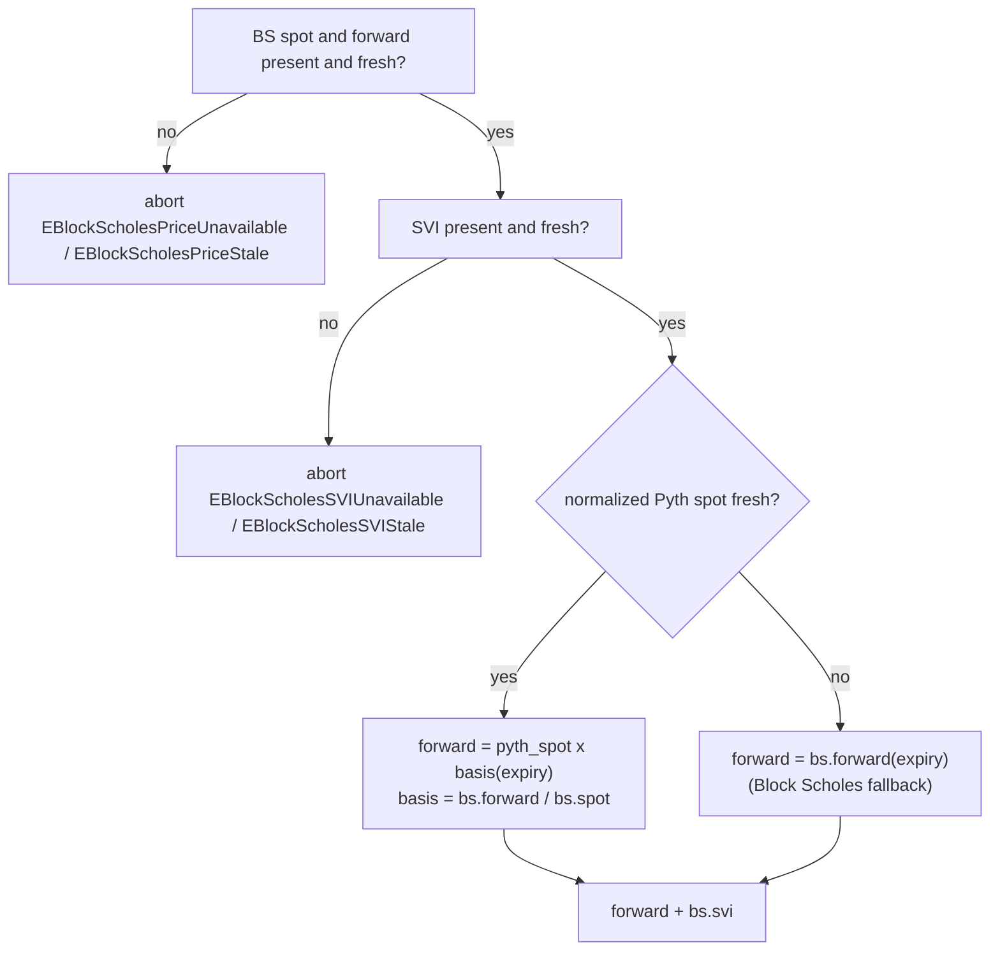

# Pricing and oracles

Predict prices its range digitals (binary options) off external Propbook feeds and turns them into the live probabilities that drive minting, redemption, liquidation, and net asset value (NAV). The oracle feeds are **not** part of the Predict package: they live in a separate, Predict-unaware `propbook` package and are consumed read-only. This document describes those feeds, how Predict resolves a live forward from them, how a range probability is derived from the SVI parameters, where live binding and freshness are enforced, and how ownership of those checks is split between Predict's market and pricing modules.

## Propbook feeds

Predict separates the *spot* of the underlying asset, the forward surface, and the SVI shape of the implied distribution into separate permanent `propbook` feed objects. Forward and SVI values are keyed by expiry inside those feeds. The feeds are permissionless to update — the design intent is that a verified provider payload is its own provenance proof (the current `block_scholes_oracle` payload is an unvalidated stub until the production verifier lands; see risks.md) — and none of them knows anything about Predict, markets, expiries, or positions.

| Input | propbook feed | What it carries | How Predict reads it |
| --- | --- | --- | --- |
| Spot price | `propbook::pyth_feed::PythFeed` | One global source-native Pyth payload per Pyth Lazer feed id, plus exact timestamp inserts | `normalized_spot()` and its `OracleRead` timestamp |
| Block Scholes spot | `propbook::block_scholes_spot_feed::BlockScholesSpotFeed` | One source-level BS spot stream plus exact timestamp inserts | `normalized_spot()` and its `OracleRead` timestamp |
| Block Scholes forward | `propbook::block_scholes_forward_feed::BlockScholesForwardFeed` | One source-level forward object with per-expiry streams plus exact timestamp inserts | `normalized_forward(expiry_ms)` and its `OracleRead` timestamp |
| SVI params | `propbook::block_scholes_svi_feed::BlockScholesSVIFeed` | One source-level SVI object with per-expiry streams plus exact timestamp inserts | `normalized_svi(expiry_ms)` and its `OracleRead` timestamp |

The `pricing` module is a stateless read layer over these feeds. It resolves them on demand, checks BS price and SVI freshness, computes prices, and never mutates feed, pool, expiry, or position state.

### Pyth Lazer spot (`PythFeed`)

A `PythFeed` is bound to exactly one Pyth Lazer feed (identified by a `u32` feed id) and stores the latest source-native price payload for that feed — one global spot source, not a per-expiry value. Its permissionless `update` decodes a verified Lazer payload, finds the matching feed, reads its `(price, exponent)` pair, and stores the raw sign/magnitude fields. Raw getters expose those fields; `normalized_spot()` is the Propbook-normalized read that converts to Predict's 1e9 fixed-point scaling (`price_1e9 = magnitude × 10^(exponent + 9)`) and returns `none` when no latest row exists or the raw value cannot produce a positive normalized spot.

Two timestamps are recorded on every accepted update, and the distinction is load-bearing:

- The **publisher timestamp** — the Lazer published-at time embedded in the verified payload (converted from microseconds to milliseconds, rounding up). This is when the data was *observed off-chain*.
- The **on-chain landing timestamp** — `clock.timestamp_ms()` captured when the update *landed on chain*.

The generic Propbook lane records a latest update only when the publisher timestamp is positive, not in the future relative to the on-chain landing time, and strictly advances the previous latest row. Future, zero, stale, or duplicate source timestamps are no-ops rather than aborts. Freshness is a read-time concern: Predict compares the `source_timestamp_ms` in the returned `OracleRead` against the current clock and the configured freshness window.

`PythFeed` deliberately does not decide whether Pyth is authoritative, derive a forward, or settle anything. It ingests, time-stamps, and exposes raw plus normalized source facts; freshness and feed binding are the consumer's responsibility.

### Block Scholes spot, forward, and SVI

Block Scholes data is split into three feed types. A `BlockScholesSpotFeed`, `BlockScholesForwardFeed`, and `BlockScholesSVIFeed` each exist once per BS source id. The forward and SVI feeds keep per-expiry rows internally, so the oracle objects are permanent while updates can target any expiry. The Propbook registry binds the source-level BS spot first, then binds the permanent forward/SVI surface pair with `bind_block_scholes_surface_to_underlying`, which asserts that the forward feed, SVI feed, and already-bound spot feed all share the same `bs_source_id`.

Predict uses the latest fresh BS spot and the latest fresh expiry forward to compute the **basis** = `forward / spot`. That basis lets Predict combine the high-frequency Pyth spot with the Block Scholes forward shape (see [Resolving the live forward](#resolving-the-live-forward)). The spot and forward are independent lanes, so they have independent timestamps, but both must be fresh under the BS price freshness window before Predict uses either one.

The SVI curve is described by five stochastic-volatility-inspired parameters in `SVIParams`:

| Param | Type | Role in `w(k)` |
| --- | --- | --- |
| `a` | `u64` | Added directly to total variance |
| `b` | `u64` | Scales the wing term |
| `rho` | `I64` (signed) | Multiplies `(k − m)` inside the wing term |
| `m` | `I64` (signed) | Subtracted from `k` (smile center offset) |
| `sigma` | `u64` | Enters under the square root with `(k − m)²` |

`rho` and `m` are signed because the wing tilt and smile-center offset can each point either direction; `a`, `b`, and `sigma` are unsigned variance quantities. `I64` is the signed fixed-point type from the shared `fixed_math` package (the renamed `predict_math`), a magnitude-plus-sign type with normalized zero. (The "Role" column describes each parameter's place in the variance formula below; the standard raw-SVI reading — `a` baseline variance, `b` wing slope, `rho` skew, `m` horizontal shift, `sigma` curvature — is consistent with it.)

SVI is its own per-expiry lane and has a looser freshness threshold than BS spot/forward. A push whose publisher timestamp does not advance its lane is a clean no-op rather than an abort, so one transaction can refresh multiple BS feeds without an ordering race on one non-advancing feed reverting the whole batch.

The feed validates source identity and records the source-native payload. It does not impose Predict's full pricing-safe envelope at ingest; Predict applies its own read-time checks before using the row for pricing.

The feed also exposes `insert_at` for exact timestamp history. Predict reads that history for terminal settlement through `normalized_spot_at(expiry)` (see [Settlement](#settlement)).

## From SVI to a range probability

A Predict range contract pays a fixed notional if the asset's settlement price lands inside a strike interval. Its fair value is therefore the probability of that event read off the distribution the SVI curve encodes — the defining identity of an undiscounted digital, whose price per unit notional equals the risk-neutral probability of its payout event.

The derivation, conceptually:

1. **Forward and SVI.** Take the resolved live forward `F` and the live `SVIParams` (see below).
2. **Total variance at a strike.** For a strike `K`, compute log-moneyness `k = ln(K / F)`, then evaluate the SVI total-variance function `w(k) = a + b·(rho·(k − m) + sqrt((k − m)² + sigma²))`. This expresses the smile as variance: how much dispersion is priced at that moneyness.
3. **One-sided (UP) tail probability.** Convert `(k, w)` into the option-pricing distance `d2 = −((k + w/2) / sqrt(w))`, then apply the SVI strike-skew adjustment to the digital price: `up_price(K) = clamp01(N(d2) − phi(d2)·w'(k)/(2·sqrt(w)))`, where `w'(k) = b·(rho + (k − m)/sqrt((k − m)² + sigma²))`. This is the smile-aware probability the settlement price ends **at or above** `K` — the price of a one-sided "UP" claim struck at `K`, i.e. a cash-or-nothing digital call.
4. **Range probability by differencing.** The probability of landing in the half-open interval `(lower, higher]` is the difference between the two one-sided digital prices, floored at zero so fixed-point dust or a clamped/non-monotone segment of the adjusted digital (reachable at any moneyness under an arbitrage-able SVI surface — predeploy open-items P-11) cannot abort a live quote:

       range_price = max(up_price(lower) − up_price(higher), 0)

   the value of a contract that pays out only inside the range — a digital call spread — expressed as a 1e9-scaled probability.

The endpoints carry sentinel handling so open-ended ranges work without special-casing: a strike equal to `neg_inf` (the raw value `0`) has UP price `1.0` (the whole distribution is above it), and a strike equal to `pos_inf` (`u64::MAX`) has UP price `0`. A one-sided contract is the difference against the appropriate sentinel.

### Price-tail saturation

Because strikes are absolute integer ticks against a forward that can drift far outside the encodable strike ladder (see [markets and positions](./markets-and-positions.md)), the UP-price math must stay live in both deep tails rather than aborting. The strike/forward ratio is computed in `u128`, then both tails saturate to their limits:

- **Deep-ITM** (`strike ≪ forward`, the ratio rounds to `0`): UP price saturates to `1.0` (the `neg_inf` limit, `P(settle > strike) ≈ 1`).
- **Deep-OTM** (`strike ≫ forward`, the ratio exceeds `u64::MAX`): UP price saturates to `0` (the `pos_inf` limit).

Reaching either tail requires the forward to leave the entire encodable strike domain by orders of magnitude; saturating there keeps NAV, redeem, and liquidation reads live instead of bricking the whole market on an extreme price. The range-price differencing is likewise saturating, so a thin or far-OTM range with ~0 true probability and a 1-ulp fixed-point inversion prices `0` rather than aborting a legitimate trade.

The math runs in 1e9 fixed point throughout, using the `fixed_math` `I64` signed type for the intermediate signed quantities (`k`, `k − m`, `d2`) and guarding the real preconditions: positive forward, non-negative SVI wing term, and positive total variance. The `min_svi_sigma` floor on `sigma` closes the non-negative-wing precondition (`ECannotBeNegative`); positive total variance (`EZeroVariance`) is a separate guard reachable with valid data only in the final moments before expiry, where total variance (σ²·T) rounds to zero in 1e9 fixed point — a recoverable liveness stop (the affected live-redeem / liquidation / NAV read succeeds once the market crosses into settlement), never a mispricing.

> The full closed-form SVI and normal-CDF/PDF implementation, including the fixed-point `ln`, `sqrt`, `normal_cdf`, and `normal_pdf` helpers, lives in the `pricing` and `fixed_math` modules. The formulas above are the model, not a reproduction of every rounding step.

## Resolving the live forward

Every live pricing path resolves a single `(forward, SVIParams)` tuple before pricing any strike. The BS spot/forward price inputs must be fresh, and the SVI params must be fresh under their own looser window. Given those BS inputs, the forward is resolved by whether the Pyth spot is fresh:

The rules:

- **Pyth spot is canonical for spot when fresh and usable.** When `normalized_spot()` returns a positive spot and its source timestamp is fresh, the live forward is rebuilt from it: `forward = pyth_spot × basis(expiry)`. This anchors valuation to the highest-frequency price while still using Block Scholes for the forward shape.
- **Missing, stale, or unusable Pyth spot falls back to Block Scholes.** If Pyth has no normalized latest spot, the normalized spot is non-positive/unrepresentable, or its source timestamp is stale, pricing falls back to the fresh `BlockScholesForwardFeed` value directly. The protocol keeps pricing rather than halting, on the second feed's recent forward.
- **Oversized normalized Pyth spot is still rejected.** A normalized Pyth spot above Predict's pricing envelope aborts with `EPythSpotInvalid`; this is a consumer-side fixed-point safety bound, not a Propbook validity rule.
- **The Block Scholes inputs have no fallback.** BS spot, BS forward, and SVI must be present and fresh either way. An absent input — never published, or a stored value that does not normalize (e.g. zero) — aborts with `EBlockScholesPriceUnavailable` (spot/forward) or `EBlockScholesSVIUnavailable` (SVI); a present-but-stale input aborts with `EBlockScholesPriceStale` or `EBlockScholesSVIStale`.

Note the asymmetry: the Block Scholes forward/SVI source set is mandatory and gated by hard aborts, while the Pyth spot is an optimization that degrades to the Block Scholes forward when absent, stale, or not positively normalizable.

## Ownership: market binding/liveness vs. pricing freshness

Resolving a price touches three facts — *are these the current canonical Propbook feeds for this market's underlying and expiry*, *is this market still live for live pricing*, and *are the required feed reads fresh* — and they are owned by different modules:

- **`expiry_market` owns market flow sequencing.** It stores `propbook_underlying_id` and the market expiry, then asks `pricing` for a live `Pricer` or an exact-history `ExactSpotRead` before consuming oracle-derived facts.
- **`pricing` owns the oracle-read boundary.** It checks passed Propbook feed objects against the current canonical bindings, issues `ExactSpotRead` for reference-tick and settlement lookups, and issues `Pricer` for live flows after enforcing pre-expiry liveness, freshness, and Predict's pricing-safe envelope.

This split keeps each guard with the module whose contract depends on it: the market owns the flow and market facts, while pricing is the only path from Propbook oracle objects into Predict business logic.

## Freshness and price bounds

`pricing` reads feed state on demand and validates it at read time rather than trusting a writer kept it fresh. The relevant bounds:

**Read-time freshness (`PricingConfig`, global).** Three admin-tunable maximum ages gate live pricing, each compared against the `source_timestamp_ms` of its normalized `OracleRead`:

- **Pyth spot freshness** (`pyth_spot_freshness_ms`) — how recent the Pyth spot must be to serve as canonical spot; past it, pricing falls back to the Block Scholes forward.
- **Block Scholes price freshness** (`block_scholes_price_freshness_ms`) — how recent the BS spot and expiry forward must be to compute the fallback forward and Pyth-reanchored basis.
- **Block Scholes SVI freshness** (`block_scholes_svi_freshness_ms`) — how recent the expiry SVI parameters must be. This window is intentionally looser than BS price freshness because SVI changes more slowly.

A timestamp is fresh only if it is positive, not in the future, and within its max age. These thresholds are admin-tunable; see [configuration](../design/configuration.md).

**Read-time pricing envelope (Predict, not Propbook).** Propbook stores source facts. Predict's `pricing` module decides whether the combined BS inputs are safe for Predict's fixed-point pricing math: `spot > 0`, `forward > 0`, bounded basis, bounded SVI inputs, `|rho| <= 1`, and sigma within Predict's accepted range.

**No writes during pool valuation.** The full-pool flush computes NAV against a frozen snapshot, so Predict's valuation lock blocks Predict trading and admin changes mid-valuation; see [liquidity and NAV](./liquidity-and-nav.md). The propbook feeds are independent objects and are not part of that lock — but the flush is privileged and the flush operator is trusted not to push the oracle mid-flush, which is the model that makes the single frozen mark sound (see the audit-L8 note in [liquidity and NAV](./liquidity-and-nav.md)).

**Min/max entry probability bounds.** A raw probability near `0` or `1` must not become an admitted mint just because the fee moves the all-in cash outlay away from the edge. These bounds live in `StrikeExposureConfig` (snapshotted per expiry from a global template), not in the pricing config: pricing produces the probability, and the mint-admission flow enforces the raw-probability envelope. At mint, `entry_probability` must lie within `[min_entry_probability, max_entry_probability]`. See [configuration](../design/configuration.md) for the bound values.

## Settlement

Terminal settlement uses Propbook's exact Pyth timestamp history, not a Predict-side sampling buffer. The market stores no settlement sample itself before expiry; the permissionless `expiry_market::try_settle` transition validates the supplied Pyth feed against Propbook's current canonical binding for the market's underlying and reads `pyth.normalized_spot_at(expiry)`.

If that exact normalized spot exists, the market records it and atomically materializes the exact terminal payout liability. If it does not, `try_settle` returns false and the market remains unsettled. Settled redeem, rebate claim, and pool sweep consume only the recorded state; a past-expiry live valuation still aborts rather than substituting an approximate mark. That liveness boundary is documented in [liquidity and NAV](./liquidity-and-nav.md).

The read is an **exact whole-millisecond lookup**, not an at-or-after scan: `normalized_spot_at(expiry)` is an equality lookup on the lane's exact-history table, and the only writer, `propbook::pyth_feed::insert_at`, accepts a verified Lazer print only when its signed publisher timestamp is exactly a whole millisecond (it aborts `EInsertTimestampNotExactMillisecond` otherwise) and keys it from that signed payload — so no keeper can forge or round a near-grid print onto the settling key. Two things make that exact key always producible for a real market. First, `market_manager::record_expiry_creation` requires the expiry to land on its cadence period (`expiry % cadence_period_ms == 0`), and every supported cadence period is a multiple of `constants::resolution_period_ms!()`. Second, the off-chain resolution relayer sources the settling print from **Pyth Lazer's exact-timestamp resolution endpoints**, which publish verified prints at exact, grid-aligned timestamps. Pool-flush liveness therefore depends on that relayer staying live (a prolonged outage leaves a past-expiry market unsettled and blocks the flush until it recovers), but not on any expiry-vs-cadence alignment luck — cadence-period alignment plus the resolution endpoints guarantee a print exists at exactly `expiry`.

For the trust assumptions behind each feed and the privileged flush operator, see [risks](../risks.md).
