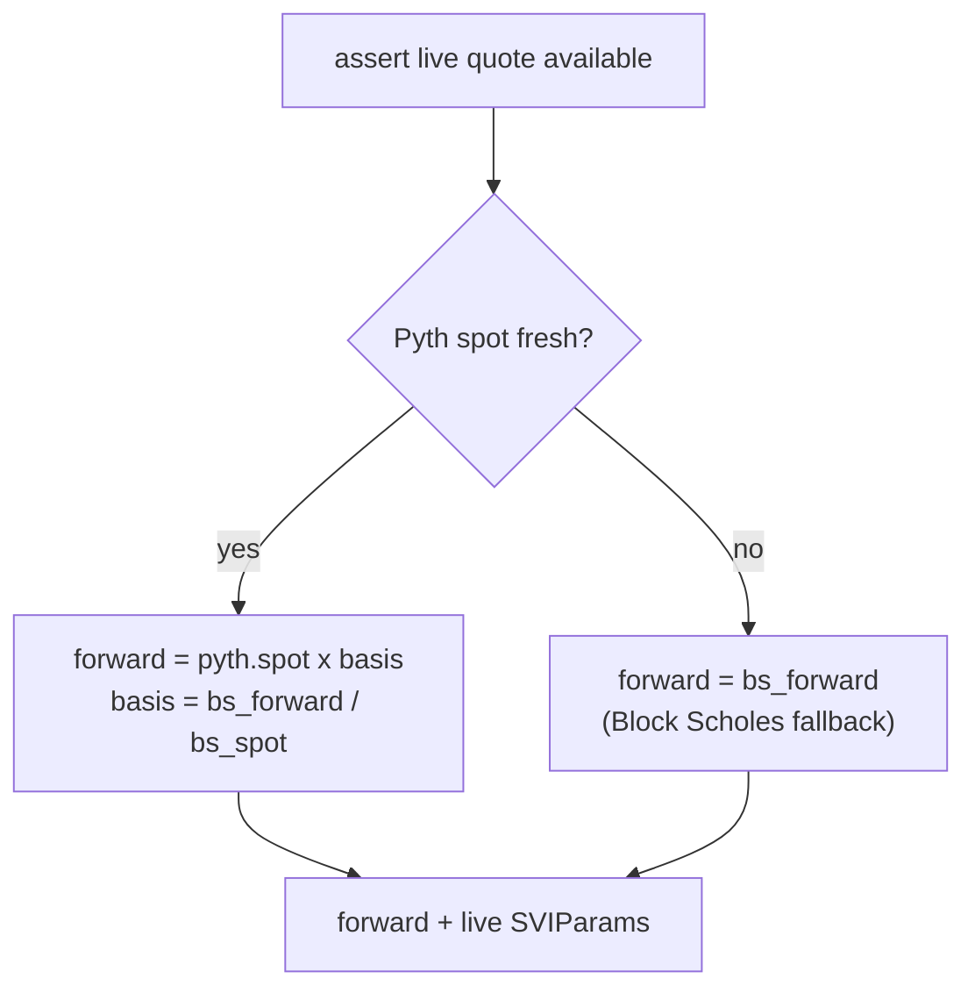
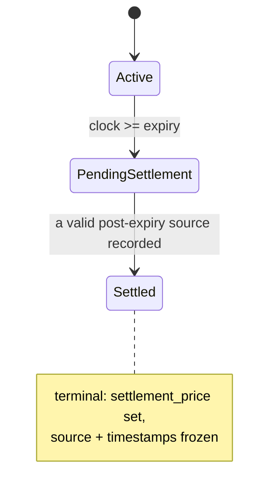

# Pricing and oracles

Predict prices binary range contracts off two independent oracle inputs and turns them into the live probabilities and valuation curves that drive minting, redemption, and net asset value (NAV). This document describes those inputs, how a range probability is derived from them, how the `pricing` module builds a one-sided UP-price curve for live NAV, how freshness and deviation bounds are enforced, and how a market reaches terminal settlement.

## Two oracle inputs

Predict separates the *spot* of the underlying asset from the *shape of the implied distribution* around that spot, and sources each from a different provider.

| Input | Provider | On-chain object | What it carries |
| --- | --- | --- | --- |
| Spot price | Pyth Lazer | `PythSource` | A single 1e9-normalized spot for one Lazer feed, with both a publisher timestamp and an on-chain landing timestamp |
| Volatility surface + forward basis | Block Scholes (an operator holding a `MarketOracleCap`) | `MarketOracle` | SVI volatility-smile parameters, a Block Scholes spot/forward pair, and their timestamps |

Each input lives in its own shared object and is updated by its own transaction. The `pricing` module is a stateless read layer: it resolves both objects on demand, validates them, and computes prices. It never mutates oracle, pool, expiry, or position state.

### Pyth Lazer spot (`PythSource`)

A `PythSource` is bound to exactly one Pyth Lazer feed (identified by a `u32` `feed_id`) and stores the latest normalized spot for that feed. An update decodes a verified Lazer payload, finds the matching feed, reads its `(price, exponent)` pair, and converts it to Predict's 1e9 fixed-point scaling (`price_1e9 = magnitude × 10^(exponent + 9)`). The decode rejects a missing feed, an unavailable price (Lazer returns no value when too few publishers contribute), and a negative price, since crypto spot is always positive.

Two timestamps are recorded on every accepted update, and the distinction is load-bearing:

- **`source_timestamp_ms`** — the *publisher* timestamp embedded in the verified Lazer payload (the Lazer published-at time, converted from microseconds to milliseconds, rounding up). This is when the data was *observed off-chain*.
- **`update_timestamp_ms`** — `clock.timestamp_ms()` captured when the update *landed on chain*.

An update is accepted only if its spot is positive, its `source_timestamp_ms` strictly advances the previously stored publisher timestamp (no stale or replayed payloads), and its `source_timestamp_ms` is not in the future relative to the on-chain clock. These are *acceptance* checks — they reject replayed, stale, or impossibly-future payloads at ingestion time. *Freshness* is a separate, read-time concern: every freshness check throughout Predict uses the *conservative* of the two timestamps — `min(source_timestamp_ms, update_timestamp_ms)` — so a value is only as fresh as its weaker timestamp. This guards against both old market data (a stale publisher timestamp) and data that, while recently published, has been sitting unposted (a stale landing timestamp).

`PythSource` deliberately does not decide whether Pyth is authoritative, derive a forward, or settle a market. It ingests, time-stamps, and exposes the raw spot; freshness and feed binding are the caller's responsibility.

### Block Scholes SVI parameters and forward (`MarketOracle`)

Each per-expiry `MarketOracle` holds the volatility surface and forward data written by an authorized Block Scholes operator. The surface is described by five SVI (stochastic volatility inspired) parameters stored in `SVIParams`:

| Param | Type | Role in `w(k)` |
| --- | --- | --- |
| `a` | `u64` | Added directly to total variance |
| `b` | `u64` | Scales the wing term |
| `rho` | `I64` (signed) | Multiplies `(k − m)` inside the wing term |
| `m` | `I64` (signed) | Subtracted from `k` (smile center offset) |
| `sigma` | `u64` | Enters under the square root with `(k − m)²` |

`rho` and `m` are signed (`I64`) because the wing tilt and the smile-center offset can each point either direction; `a`, `b`, and `sigma` are unsigned variance quantities. `I64` is Predict's magnitude-plus-sign signed type with normalized zero. (The "Role" column describes each parameter's place in the variance formula below, not a source-documented economic interpretation; the standard raw-SVI reading — `a` baseline variance, `b` wing slope, `rho` skew, `m` horizontal shift, `sigma` curvature — is consistent with that formula.)

Alongside the surface, `MarketOracle` stores a Block Scholes `spot` and `forward` in 1e9 scaling, from which it derives the **basis** = `forward / spot`. The basis lets Predict combine the canonical Pyth spot with the Block Scholes forward curve (see [Resolving live inputs](#resolving-live-inputs)).

The surface and the spot/forward pair are updated through two separate write paths, each carrying its own `source_timestamp_ms` (the operator's observation time) and stamping its own `update_timestamp_ms` (on-chain landing). SVI updates and price updates therefore age independently, and each has its own freshness threshold. Updating SVI does not refresh the price timestamp, and vice versa — keeping each staleness check honest. As with Pyth, each freshness check uses the conservative `min(source, update)` timestamp.

Write authorization is by `MarketOracleCap`: an oracle stores a set of authorized cap IDs, and any update must present a cap in that set. Caps are minted under the protocol `AdminCap`, can be registered or unregistered per oracle, and a cap holder can remove its own authorization. The per-oracle settlement-freshness, deviation, and basis bounds (below) are tunable through an admin-gated path on the oracle itself, distinct from the global template config.

## From SVI to a range probability

A Predict range contract pays out if the asset's settlement price lands inside a strike interval. Its fair value is therefore the probability of that event, read off the distribution that the SVI surface encodes.

The derivation, conceptually:

1. **Forward and surface.** Take the live forward `F` and the live `SVIParams`.
2. **Total variance at a strike.** For a strike `K`, compute log-moneyness `k = ln(K / F)`, then evaluate the SVI total-variance function `w(k)`. The implementation uses the raw-SVI form `w(k) = a + b·(rho·(k − m) + sqrt((k − m)² + sigma²))`, with the wing term `rho·(k − m) + sqrt((k − m)² + sigma²)` asserted non-negative before it is scaled by `b`. This expresses the smile as variance: how much dispersion is priced at that moneyness.
3. **One-sided (UP) tail probability.** Convert `(k, w)` into the option-pricing distance `d2 = −((k + w/2) / sqrt(w))` and take the standard normal CDF `N(d2)`. This is the probability the settlement price ends **at or above** `K` — the price of a one-sided "UP" claim struck at `K`.
4. **Range probability by differencing.** Because the UP price is monotonically non-increasing in strike, the probability of landing in the half-open interval `(lower, higher]` is

       range_price = up_price(lower) − up_price(higher)

   This is the value of a contract that pays out only inside the range, expressed as a 1e9-scaled probability.

The endpoints carry sentinel handling so open-ended ranges work without special-casing the caller: a strike equal to `neg_inf` (the value `0`) has UP price `1.0` (the whole distribution is above it), and a strike equal to `pos_inf` (`u64::MAX`) has UP price `0`. A one-sided contract is the difference against the appropriate sentinel.

The math runs in 1e9 fixed point throughout, using Predict's `I64` signed type for the intermediate signed quantities (`k`, `k − m`, `d2`) and guarding the real preconditions: positive forward, positive strike ratio, non-negative SVI wing term, and positive total variance.

> The full closed-form SVI and normal-CDF implementation, including the fixed-point `ln`, `sqrt`, and `normal_cdf` helpers, lives in the pricing and math modules. The formulas above are the model, not a reproduction of every rounding step.

## Resolving live inputs

Every live pricing path — a quote for a range, or a curve for valuation — first resolves a single `(forward, SVIParams)` tuple, and only after passing all freshness and lifecycle gates.

The rules:

- **Pyth spot is canonical for spot.** When the Pyth spot is fresh, the live forward is rebuilt from it: `forward = pyth_spot × basis`, where `basis = block_scholes_forward / block_scholes_spot`. This anchors valuation to the highest-frequency price while still using Block Scholes for the forward shape.
- **Block Scholes forward is the fallback.** If the Pyth spot is stale, pricing falls back to the Block Scholes forward directly. The protocol keeps pricing rather than halting, but only on a second oracle's recent forward.
- **SVI must be fresh either way.** The volatility surface has no fallback; a stale surface blocks live pricing entirely.

`assert_live_quote_available` is the gate every live path passes through. It requires that the supplied `PythSource` is the one bound to this `MarketOracle`, that the market is **active** (not expired or settled), and that the live Block Scholes oracle data is fresh.

## The valuation curve for live NAV

NAV for the LP-backed vault must value many strikes at once, every time the pool is valued. Pricing each strike independently with the full SVI evaluation would be expensive, so `pricing` builds a **piecewise-linear UP-price curve** over the strike interval that the valuation path interpolates between.

A `CurvePoint` is a `(strike, up_price)` pair. `build_curve` samples the curve adaptively:

1. Anchor the two endpoints (`min_strike`, `max_strike`), pricing each with the full SVI evaluation.
2. Repeatedly find the adjacent gap with the largest UP-price difference (the steepest, least-linear segment), bisect it, snap the midpoint down to a tick boundary, and price that strike. Bisection concentrates samples where the curve bends most, so linear interpolation between points stays accurate.
3. Stop after `curve_samples` (50) points, or earlier when no remaining gap is wider than one tick.

The curve relies on the same monotonicity the range price does: strikes stay ascending and UP price is non-increasing, both asserted during construction. Because the curve is built once per valuation from a single resolved `(forward, SVIParams)`, every strike in the pool is valued against one consistent oracle snapshot.

A live range contract's value derives from this curve as its range probability value minus its deterministic floor value, floored at zero. The floor schedule is the leverage mechanism; see [Leverage and the floor](./leverage-and-floor.md).

## Freshness, deviation, and price bounds

Pricing reads oracle state **on demand** and validates it at read time rather than trusting that a writer kept it fresh. The relevant bounds, and where they live:

**Read-time freshness (`PricingConfig`, global).** Three independent maximum ages gate live pricing, each compared against the conservative `min(source, update)` timestamp of its input:

- Pyth spot freshness — how recent the Pyth spot must be to serve as canonical spot (else fall back to the Block Scholes forward).
- Block Scholes price freshness — how recent the spot/forward must be to be usable.
- Block Scholes SVI freshness — how recent the volatility surface must be.

A timestamp is fresh only if it is positive, not in the future, and within its max age. These thresholds are admin-tunable; see [configuration](../design/configuration.md).

**Write-time deviation and basis bounds (`MarketOracleConfig`, per oracle).** When the Block Scholes operator pushes a new spot/forward, the oracle validates the push before storing it:

- **Basis in range.** The new `forward / spot` basis must lie within `[min_basis, max_basis]`, rejecting absurd forward/spot relationships.
- **Spot deviation.** The new spot may not move from the last stored spot by more than `max_spot_deviation` as a fraction of the previous spot — a circuit breaker against a single jumpy push.
- **Basis deviation.** The new basis may not move from the previous basis by more than `max_basis_deviation` as a fraction of the previous basis.

Each `MarketOracle` snapshots these bounds from a global template at creation and can be tuned per oracle through the oracle's admin-gated setter. Deviation checks only apply once there is a previous value to compare against (the first push has nothing to deviate from).

**Updates rejected during pool valuation.** Every oracle write — Pyth ingestion, Block Scholes spot/forward, and SVI — asserts the protocol is *not* mid-valuation. NAV is computed against a frozen oracle snapshot; allowing a write to land between the start and end of a valuation pass would let the curve and the priced strikes disagree. This is the read-side counterpart to building the curve from one resolved input.

**Min/max ask price bounds.** A raw probability near `0` or `1` must not translate into a degenerate tradeable price. These bounds live in `StrikeExposureConfig` (snapshotted per expiry from a global template), not in the oracle config: the oracle/pricing layer produces the probability, and the mint-admission flow enforces the tradeable price envelope. At mint, the order's execution price (the entry probability plus its fee) is required to lie within `[min_ask_price, max_ask_price]`. See [configuration](../design/configuration.md) for the bound values.

## Market lifecycle and settlement

A `MarketOracle` moves through three states, derived from its expiry and settlement fields against the current clock:

- **Active** — `clock < expiry` and not yet settled. Live quoting, SVI updates, and live valuation are allowed.
- **Pending settlement** — `clock >= expiry` but no settlement price recorded yet. Live SVI updates are no longer accepted (SVI is live-market-only), but spot/forward pushes still are, and they can trigger settlement.
- **Settled** — a terminal `settlement_price` has been recorded. The market is frozen; no further oracle writes are accepted.

### Recording the terminal settlement price

Settlement is triggered by an authorized operator, either as a side effect of a Block Scholes price push or via an explicit `settle_if_possible` call. Both go through the same internal logic, so the privileged path cannot record settlement under weaker checks than the price-push path. Settlement is also a first-writer-wins terminal transition: once recorded it never changes.

To settle, the oracle looks for a **valid post-expiry spot source**, preferring Pyth and falling back to Block Scholes:

- A **Pyth** source is valid when Pyth's freshness timestamp is within the per-oracle `settlement_freshness_ms` window *and* Pyth's publisher `source_timestamp_ms` is strictly after the market's `expiry` — i.e. the price actually reflects a post-expiry observation, not pre-expiry data that merely landed late.
- A **Block Scholes** source is valid under the same two conditions applied to the Block Scholes price timestamps.

If a valid source exists, the oracle records: the `settlement_price` (the chosen source's spot), the `settlement_source` code (Pyth or Block Scholes), the source's publisher timestamp, and the on-chain update timestamp. A settled event is emitted. If no source qualifies yet, settlement is a no-op and can be retried as fresh post-expiry data arrives.

Reading the terminal price enforces an additional invariant: the recorded `settlement_source_timestamp_ms` must be strictly greater than `expiry`. Even after the price is stored, any consumer that reads it through `settlement_price` re-checks that the price came from a genuinely post-expiry observation before it is used to compute payouts.

The settlement source preference — Pyth first, Block Scholes second — means the protocol settles on the higher-frequency, more independently verified feed whenever it is fresh post-expiry, and only relies on the operator-supplied price when Pyth is unavailable. For the trust assumptions behind each oracle and the failure modes of the deviation guards and operator authority, see [risks](../risks.md).