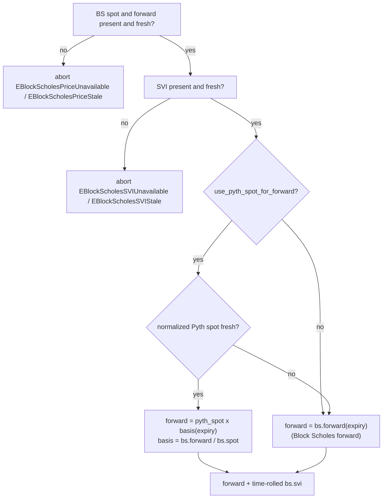

# Pricing and oracles

Predict prices its range digitals (binary options) off external Propbook feeds and turns them into the live probabilities that drive minting, redemption, liquidation, and net asset value (NAV). The oracle feeds are **not** part of the Predict package: they live in a separate, Predict-unaware `propbook` package and are consumed read-only. This document describes those feeds, how Predict resolves a live forward from them, how a range probability is derived from the SVI parameters, where live binding and freshness are enforced, and how ownership of those checks is split between Predict's market and pricing modules.

## Propbook feeds

Predict separates the *spot* of the underlying asset, the forward surface, and the SVI shape of the implied distribution into permanent `propbook` oracle objects. Updates are permissionless: a verified provider payload is its own provenance proof — Pyth through its on-chain verifier, Block Scholes through the `bs_oracle` signature verifier, whose batch types only it can mint — so the relayer that lands one is untrusted. None of these objects knows anything about Predict, markets, or positions.

| Input | propbook feed | What it carries | How Predict reads it |
| --- | --- | --- | --- |
| Spot price | `propbook::pyth_feed::PythFeed` | One global source-native Pyth payload per Pyth Lazer feed id, plus exact timestamp inserts | `normalized_spot()` and its `OracleRead` timestamp |
| Block Scholes spot + forward | `propbook::block_scholes_store::BlockScholesValueStore` | One per-underlying store of the latest spot and per-expiry forward observations, keyed by signed series id | `spot()` / `forward(expiry_ms)` and each read's `published_at_ms` |
| SVI params | `propbook::block_scholes_store::BlockScholesSVIStore` | One per-underlying store of the latest per-expiry SVI parameter sets, keyed by signed series id | `svi(expiry_ms)` and its `published_at_ms` |

The `pricing` module is a stateless read layer over these objects. It resolves them on demand, checks BS price and SVI freshness, computes prices, and never mutates oracle, pool, expiry, or position state.

### Pyth Lazer spot (`PythFeed`)

A `PythFeed` is bound to exactly one Pyth Lazer feed (identified by a `u32` feed id) and stores the latest source-native price payload for that feed — one global spot source, not a per-expiry value. Its permissionless `update` decodes a verified Lazer payload, finds the matching feed, reads its `(price, exponent, feedUpdateTimestamp)` fields, and stores the raw sign/magnitude fields. Raw getters expose those fields; `normalized_spot()` is the Propbook-normalized read that converts to Predict's 1e9 fixed-point scaling (`price_1e9 = magnitude × 10^(exponent + 9)`) and returns `none` when no latest row exists or the raw value cannot produce a positive normalized spot.

Two timestamps are recorded on every accepted update, and the distinction is load-bearing:

- The **generation timestamp** — the per-feed `feedUpdateTimestamp` embedded in the verified payload (converted from microseconds to milliseconds, rounding up). This is when Pyth *generated the price*, which is not the same as when the envelope carrying it was published: when Pyth has no new aggregate it carries the previous price forward under a newer envelope, and only `feedUpdateTimestamp` reveals the price's true age.
- The **on-chain landing timestamp** — `clock.timestamp_ms()` captured when the update *landed on chain*.

The generic Propbook lane records a latest update only when the generation timestamp is positive, not in the future relative to the on-chain landing time, and strictly advances the previous latest row. Future, zero, stale, or duplicate generation timestamps are no-ops rather than aborts — so a carried price leaves `latest` untouched and cannot renew Predict's freshness window. Freshness is a read-time concern: Predict compares the `source_timestamp_ms` in the returned `OracleRead` against the current clock and the configured freshness window.

Because that window is measured against generation time, a Pyth stall longer than `pyth_spot_freshness_ms` correctly expires the Pyth spot and live pricing falls back to the Block Scholes forward, rather than re-anchoring the forward on a frozen spot. That is the behaviour while `use_pyth_spot_for_forward` is set; with it clear there is no re-anchor for a stall to resurrect in the first place.

`PythFeed` deliberately does not decide whether Pyth is authoritative, derive a forward, or settle anything. It ingests, time-stamps, and exposes raw plus normalized source facts; freshness and feed binding are the consumer's responsibility.

### Block Scholes spot, forward, and SVI

Block Scholes data lives in two per-underlying stores. A `BlockScholesValueStore` holds the latest spot and per-expiry forward observations; a `BlockScholesSVIStore` holds the latest per-expiry SVI parameter sets. The Propbook registry creates the pair once, admin-gated, binds both stores to the exact provider base-asset spelling, and records their object ids as canonical for the underlying. Spot, forwards, and SVI enter through separate typed batch functions. Each function derives the canonical ids through the provider-owned `bs_sid` package from the oracle package and complete subscription descriptor; forward and SVI writes also prove their caller-supplied expiry witnesses through those derived ids. Predict checks the supplied objects against the registry binding and selects spot or an exact expiry through typed reads, which derive the same ids internally rather than trusting a caller-supplied series id.

Predict uses the latest fresh BS spot and the latest fresh expiry forward to compute the **basis** = `forward / spot`. That basis lets Predict combine the high-frequency Pyth spot with the Block Scholes forward shape (see [Resolving the live forward](#resolving-the-live-forward)). Spot and forward are independent series with independent clocks, but both must be fresh under the BS price freshness window before Predict uses either one.

The SVI curve is described by five stochastic-volatility-inspired parameters, stored source-native (`u128` magnitude-plus-sign) and narrowed to Predict's pricing widths where the `Pricer` is built:

| Param | Pricing type | Role in `w(k)` |
| --- | --- | --- |
| `a` | `I64` (signed) | Added directly to total variance |
| `b` | `u64` | Scales the wing term |
| `rho` | `I64` (signed) | Multiplies `(k − m)` inside the wing term |
| `m` | `I64` (signed) | Subtracted from `k` (smile center offset) |
| `sigma` | `u64` | Enters under the square root with `(k − m)²` |

`a`, `rho`, and `m` are signed because the baseline variance, wing tilt, and smile-center offset can each point either direction; `b` and `sigma` remain unsigned. `I64` is the signed fixed-point type from the shared `fixed_math` package (the renamed `predict_math`), a magnitude-plus-sign type with normalized zero. (The "Role" column describes each parameter's place in the variance formula below; the standard raw-SVI reading — `a` baseline variance, `b` wing slope, `rho` skew, `m` horizontal shift, `sigma` curvature — is consistent with it.)

SVI is its own per-expiry series and has a looser freshness threshold than BS spot/forward. Each stored observation carries the provider's two clocks directly: `published_at_ms` is the batch envelope time, advancing on every provider flush — the clock pricing freshness asserts against and the SVI roll-down anchors on — and `model_timestamp_ms` is the provider's calibration time, held fixed across republishes of an unchanged calibration and kept on the stored observation as calibration identity (trade events report the publish time pricing validated). The provider contract behind the anchor choice: the model timestamp is re-derived on the order of every 20 seconds, and an SVI publish whose model time is unchanged carries the same calibration already rolled down to its new publish time — duplicate SVI retransmission does not exist — so the published values always describe the horizon remaining from publish, and anchoring on the model time instead would apply the provider's roll a second time. Pricing halts only when envelopes stop arriving within the freshness window — a stopped transport — never merely because the calibration clock is quiet. A batch whose entries do not advance a series is a clean skip rather than an abort, so concurrent relayers and replayed batches cannot fail each other, roll a series' model data back, or move its stored envelope time backwards.

The stores validate the series id and record the source-native payload. They do not impose Predict's pricing-safe envelope at ingest; Predict applies its own read-time checks before using a row for pricing.

Terminal settlement reads exact Pyth history through `normalized_spot_at(expiry)` (see [Settlement](#settlement)); the Block Scholes stores keep latest values only.

## From SVI to a range probability

A Predict range contract pays a fixed notional if the asset's settlement price lands inside a strike interval. Its fair value is therefore the probability of that event read off the distribution the SVI curve encodes — the defining identity of an undiscounted digital, whose price per unit notional equals the risk-neutral probability of its payout event.

The derivation, conceptually:

1. **Forward and SVI.** Take the resolved live forward `F` and roll the current raw SVI tuple from its parameter timestamp to the current remaining time-to-expiry (see below).
2. **Total variance at a strike.** For a strike `K`, compute log-moneyness `k = ln(K / F)`, then evaluate the SVI total-variance function `w(k) = a + b·(rho·(k − m) + sqrt((k − m)² + sigma²))`. This expresses the smile as variance: how much dispersion is priced at that moneyness.
3. **One-sided (UP) tail probability.** Convert `(k, w)` into the option-pricing distance `d2 = −((k + w/2) / sqrt(w))`, then apply the SVI strike-skew adjustment to the digital price: `up_price(K) = clamp01(N(d2) − phi(d2)·w'(k)/(2·sqrt(w)))`, where `w'(k) = b·(rho + (k − m)/sqrt((k − m)² + sigma²))`. This is the smile-aware probability the settlement price ends **at or above** `K` — the price of a one-sided "UP" claim struck at `K`, i.e. a cash-or-nothing digital call.
4. **Range probability by differencing.** The probability of landing in the half-open interval `(lower, higher]` is the difference between the two one-sided digital prices, floored at zero so fixed-point dust or a clamped/non-monotone segment of the adjusted digital cannot abort a live quote. Block Scholes guarantees its published SVI surfaces are monotone and butterfly-arbitrage-free; Predict retains the active-book NAV guard as defense in depth (response policy RP-15):

       range_price = max(up_price(lower) − up_price(higher), 0)

   the value of a contract that pays out only inside the range — a digital call spread — expressed as a 1e9-scaled probability.

The endpoints carry sentinel handling so open-ended ranges work without special-casing: a strike equal to `neg_inf` (the raw value `0`) has UP price `1.0` (the whole distribution is above it), and a strike equal to `pos_inf` (`u64::MAX`) has UP price `0`. A one-sided contract is the difference against the appropriate sentinel.

### SVI remaining-time roll-down

The provider's SVI `a` and `b` values describe variance over the horizon that remained when the current tuple was published — for republications too, since a publish with an unchanged model time carries the calibration rolled to that publish (see the store-contract paragraph above). Let `T_published` be the stored observation's `published_at_ms` — the envelope time of the batch that last carried it — `T_expiry` the market expiry, and `t` the current Sui clock. Before evaluating any strike, Predict derives:

    remaining_ms = T_expiry - t
    anchor_tte_ms = T_expiry - T_published
    a_eff_1e18 = sign(a) × floor(abs(a) × 1e9 × remaining_ms / anchor_tte_ms)
    b_eff_1e18 = floor(b × 1e9 × remaining_ms / anchor_tte_ms)

The multiplications use `u256` intermediates and produce 1e18-scaled `u128` magnitudes; both magnitudes round down, so signed `a` rounds toward zero. `rho`, `m`, and `sigma` are copied unchanged. At the publish anchor the tuple is unchanged at 1e18 precision. An identical provider retransmit advances the stored envelope time, which re-anchors the roll-down: the provider re-asserted the tuple as current at that publish, so `a` and `b` again describe the horizon remaining from it. Between publishes, elapsed time reduces `a_eff` and `b_eff`; a feed whose envelopes stop arriving ages out of the SVI freshness window (keyed on the same envelope clock) and pricing halts. Live pricing is already forbidden at or after expiry.

The raw tuple must pass Predict's existing pricing envelope before roll-down. If fixed-point flooring makes the effective per-strike total variance non-positive before expiry, the existing `ENonPositiveVariance` quote guard aborts. This policy addresses the age of an unchanged variance-to-expiry tuple; it does not claim that the provider's near-expiry calibration is accurate.

### Price tails

Because strikes are absolute integer ticks against a forward that can drift far outside the encodable strike ladder (see [markets and positions](./markets-and-positions.md)), the UP-price math must stay live in both deep tails rather than aborting. Log-moneyness is therefore taken as a **difference of logarithms**, `k = ln(strike) - ln(forward)`, never as `ln` of a fixed-point ratio: forming `strike * 1e9 / forward` first floors the quotient to zero below a ratio of `1e-9` and past `u64` above `1.8e10`, destroying exactly the tails it is being asked about. `ln` is defined across the whole positive `u64` domain, so the difference stays well-conditioned over every representable pair (`|k| <= 44.4`).

Both tails still converge on their limits — `P(settle > strike) -> 1` deep-ITM and `-> 0` deep-OTM — but they are **computed**, reached through `d2`'s normal-CDF clamp, rather than asserted by a branch on the ratio. That distinction is load-bearing: the digital limits are exact only while total variance is small, so a branch returning them without reading the surface is wrong on a high-variance one, in either direction (`predeploy/response-policies.md` RP-28). The range-price differencing is still saturating, so a thin or far-OTM range with ~0 true probability and a 1-ulp fixed-point inversion prices `0` rather than aborting a legitimate trade.

Most of the math runs in 1e9 fixed point. The remaining-time roll-down is the exception: it produces `a_eff` and `b_eff` at `u128`/1e18 with `u256` intermediates, and total variance remains at 1e18 through the integer square-root input. `sqrt(w)` and `d2` return at 1e9 for the rest of the formula. Carrying the rolled values in the wider domain avoids discarding most of the signal on a short-dated surface — a five-minute market's total variance is only about ten raw units at 1e9, and `d2` is ill-conditioned in it. Everything outside that island — log-moneyness, the SVI geometry, the smile-slope correction, and the normal CDF/PDF — stays at 1e9. The signed intermediates use the `fixed_math` `I64` type (`rho`, `m`, `k`, `k − m`, `d2`) and guard the real preconditions: positive forward, non-negative SVI wing term, and positive total variance. The read-time envelope bounds raw `|a|` instead of rejecting negative `a`, then checks the raw analytical minimum variance `a + b·sigma·sqrt(1 − rho²)` is positive. That rejects source surfaces whose signed baseline over-offsets the SVI wing before any mint, redeem, liquidation, or NAV path can divide by `sqrt(w)`. The deep `ENonPositiveVariance` check remains the effective per-strike backstop, including when remaining-time roll-down floors a valid raw surface to non-positive variance before expiry.

For single order/range quotes, range-price differencing is saturating: if a clamped or non-monotone adjusted digital segment would make `up_price(lower) < up_price(higher)`, that order prices at zero rather than aborting the trade path. NAV valuation has an additional active-book check. The payout-tree walk caches finite boundary UP prices in ascending tick order; if an active market's current surface makes those cached UP prices increase over the active boundary set, the flush aborts with a non-monotone price-memo guard instead of netting a non-monotone surface into an overstated `current_nav`.

> The full closed-form SVI and normal-CDF/PDF implementation, including the fixed-point `ln`, `sqrt_down`, `normal_cdf`, and `normal_pdf` helpers, lives in the `pricing` and `fixed_math` modules. The formulas above are the model, not a reproduction of every rounding step.

## Resolving the live forward

Every live pricing path resolves a single `(forward, SVIParams)` tuple before pricing any strike. The BS spot/forward price inputs must be fresh, and the SVI params must be fresh under their own looser window. Given those BS inputs, the forward is resolved by the admin-set source selector and, when that selector is on, by whether the Pyth spot is fresh:

```mermaid
flowchart TD
    A[BS spot and forward present and fresh?] -- no --> X[abort EBlockScholesPriceUnavailable / EBlockScholesPriceStale]
    A -- yes --> S[SVI present and fresh?]
    S -- no --> Y[abort EBlockScholesSVIUnavailable / EBlockScholesSVIStale]
    S -- yes --> P{use_pyth_spot_for_forward?}
    P -- no --> D
    P -- yes --> B{normalized Pyth spot fresh?}
    B -- yes --> C["forward = pyth_spot x basis(expiry)<br/>basis = bs.forward / bs.spot"]
    B -- no --> D["forward = bs.forward(expiry)<br/>(Block Scholes forward)"]
    C --> E[forward + time-rolled bs.svi]
    D --> E
```

The rules:

- **`use_pyth_spot_for_forward` picks the formula.** This admin setting (default on) decides whether the Pyth spot enters live pricing at all. With it off, the forward is the fresh Block Scholes forward observation on every load, the Pyth spot is read but unused, and the two rules below do not apply. Calibration is what moves this setting. The two inputs trade off along axes that have not been measured against each other: the Block Scholes forward is the model's own forward, while the Pyth spot is the higher-frequency price and is also what settlement prints against. Neither the accuracy comparison nor the latency comparison is recorded under `predeploy/evidence/` yet, which is why the choice is a setting rather than a decision. See [configuration](../design/configuration.md) for how the setting is applied.
- **Pyth spot is canonical for spot when fresh and usable.** With the setting on, when `normalized_spot()` returns a positive spot and its source timestamp is fresh, the live forward is rebuilt from it: `forward = pyth_spot × basis(expiry)`. This anchors valuation to the highest-frequency price while still using Block Scholes for the forward shape.
- **Missing, stale, or unusable Pyth spot falls back to Block Scholes.** With the setting on, if Pyth has no normalized latest spot, the normalized spot is non-positive/unrepresentable, or its source timestamp is stale, pricing falls back to the fresh Block Scholes forward observation directly. The protocol keeps pricing rather than halting, on the second source's recent forward.
- **Oversized normalized Pyth spot is still rejected.** A normalized Pyth spot above Predict's pricing envelope aborts with `EPythSpotInvalid`; this is a consumer-side fixed-point safety bound, not a Propbook validity rule. It is only reached on the re-anchoring branch, since that is the only branch that uses the value.
- **The Block Scholes inputs have no fallback.** BS spot, BS forward, and SVI must be present and fresh under every setting. An absent input — never published, or a stored value that does not normalize (e.g. zero) — aborts with `EBlockScholesPriceUnavailable` (spot/forward) or `EBlockScholesSVIUnavailable` (SVI); a present-but-stale input aborts with `EBlockScholesPriceStale` or `EBlockScholesSVIStale`.
- **The Pyth source timestamp is snapshotted either way.** `Pricer` retains the source timestamp of the current normalized Pyth observation (`0` when there is no usable one) whether or not the forward used it, so trade events report the same oracle provenance under both settings.

Note the asymmetry: the Block Scholes forward/SVI source set is mandatory and gated by hard aborts, while the Pyth spot is an optimization — one that degrades to the Block Scholes forward when absent, stale, or not positively normalizable, and that an admin can switch off outright.

## Ownership: market binding/liveness vs. pricing freshness

Resolving a price touches three facts — *are these the current canonical Propbook feeds for this market's underlying and expiry*, *is this market still live for live pricing*, and *are the required feed reads fresh* — and they are owned by different modules:

- **`expiry_market` owns market flow sequencing.** It stores `propbook_underlying_id` and the market expiry, then asks `pricing` for a live `Pricer` or an exact-history `ExactSpotRead` before consuming oracle-derived facts.
- **`pricing` owns the oracle-read boundary.** It checks passed Propbook feed objects against the current canonical bindings, issues `ExactSpotRead` for reference-tick and settlement lookups, and issues `Pricer` for live flows after enforcing pre-expiry liveness, freshness, and Predict's pricing-safe envelope.

This split keeps each guard with the module whose contract depends on it: the market owns the flow and market facts, while pricing is the only path from Propbook oracle objects into Predict business logic.

## Freshness and price bounds

`pricing` reads feed state on demand and validates it at read time rather than trusting a writer kept it fresh. The relevant bounds:

**Read-time freshness (`PricingConfig`, global).** Three admin-tunable maximum ages gate live pricing, each compared against its observation's own clock (Pyth's normalized `source_timestamp_ms`; the Block Scholes reads' `published_at_ms` envelope time):

- **Pyth spot freshness** (`pyth_spot_freshness_ms`) — how recent the Pyth spot must be to serve as canonical spot; past it, pricing falls back to the Block Scholes forward. Only consulted while `use_pyth_spot_for_forward` is set.
- **Block Scholes price freshness** (`block_scholes_price_freshness_ms`) — how recent the BS spot and expiry forward must be to compute the fallback forward and Pyth-reanchored basis.
- **Block Scholes SVI freshness** (`block_scholes_svi_freshness_ms`) — how recently the SVI tuple must have been published; the same envelope clock anchors the remaining-time roll-down, so an unchanged retransmitted tuple stays usable and re-anchored for as long as the provider keeps publishing it. This window is intentionally looser than BS price freshness because SVI changes more slowly, and its configurable maximum is wider (120s vs 60s).

A timestamp is fresh only if it is positive, not in the future, and within its max age. These thresholds are admin-tunable; see [configuration](../design/configuration.md).

**Read-time pricing envelope (Predict, not Propbook).** Propbook stores source facts. Predict's `pricing` module decides whether the combined BS inputs are safe for Predict's fixed-point pricing math: `spot > 0`, `forward > 0`, bounded basis, bounded SVI magnitudes, `|rho| <= 1`, sigma within Predict's accepted range, and positive analytical minimum total variance. Negative SVI `a` is accepted when that minimum-variance condition still holds.

**No writes during pool valuation.** The full-pool flush computes NAV against a frozen snapshot, so Predict's valuation lock blocks Predict trading and admin changes mid-valuation; see [liquidity and NAV](./liquidity-and-nav.md). The propbook feeds are independent objects and are not part of that lock — but the flush is privileged and the flush operator is trusted not to push the oracle mid-flush, which is the model that makes the single frozen mark sound (see the audit-L8 note in [liquidity and NAV](./liquidity-and-nav.md)).

**Min/max entry probability bounds.** A raw probability near `0` or `1` must not become an admitted mint just because the fee moves the all-in cash outlay away from the edge. These bounds live in `StrikeExposureConfig` (snapshotted per expiry from a global template), not in the pricing config: pricing produces the probability, and the mint-admission flow enforces the raw-probability envelope. At mint, `entry_probability` must lie within `[min_entry_probability, max_entry_probability]`. See [configuration](../design/configuration.md) for the bound values.

## Settlement

Terminal settlement uses Propbook's exact Pyth timestamp history, not a Predict-side sampling buffer. The market stores no settlement sample itself before expiry; the permissionless `expiry_market::try_settle` transition asks `pricing::load_exact_spot_read` to validate the supplied Pyth feed against Propbook's current canonical binding and issue an `ExactSpotRead` for the market's expiry.

If that exact normalized spot exists, `try_settle` passes it to `StrikeExposure::record_settlement`, which records the terminal price and exact remaining payout liability together. If it does not, `try_settle` returns false and the market remains unsettled. Settled redeem, rebate claim, and pool sweep consume only the recorded state; a past-expiry live valuation still aborts rather than substituting an approximate mark. That liveness boundary is documented in [liquidity and NAV](./liquidity-and-nav.md).

The read is an **exact whole-millisecond lookup**, not an at-or-after scan: `normalized_spot_at(expiry)` is an equality lookup on the lane's exact-history table, and the only writer, `propbook::pyth_feed::insert_at`, accepts a verified Lazer print only when its signed publisher timestamp is exactly a whole millisecond (it aborts `EInsertTimestampNotExactMillisecond` otherwise) and keys it from that signed payload — so no keeper can forge or round a near-grid print onto the settling key. Two things make that exact key always producible for a real market. First, `market_manager::record_expiry_creation` requires the expiry to land on its cadence period (`expiry % cadence_period_ms == 0`), and every supported cadence period is a multiple of `constants::resolution_period_ms!()`. Second, the off-chain resolution relayer sources the settling print from **Pyth Lazer's exact-timestamp resolution endpoints**, which publish verified prints at exact, grid-aligned timestamps. Pool-flush liveness therefore depends on that relayer staying live (a prolonged outage leaves a past-expiry market unsettled and blocks the flush until it recovers), but not on any expiry-vs-cadence alignment luck — cadence-period alignment plus the resolution endpoints guarantee a print exists at exactly `expiry`.

For the trust assumptions behind each feed and the privileged flush operator, see [risks](../risks.md).
