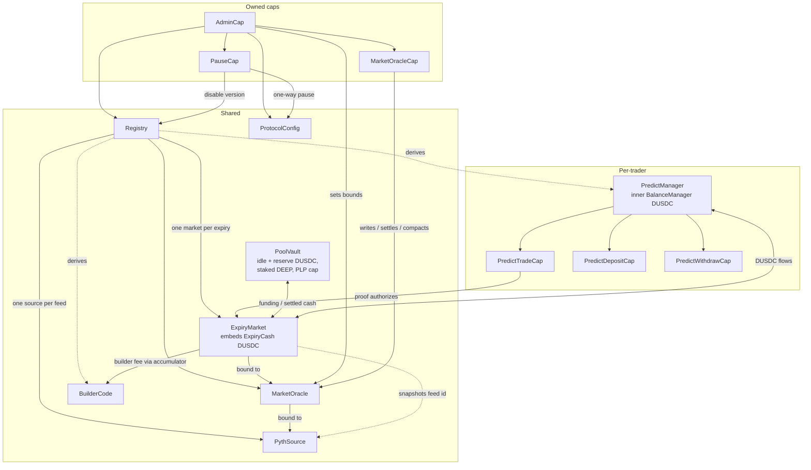

# Architecture

Predict is a per-expiry, range-based options protocol on Sui. Its on-chain state is split across a small set of long-lived shared objects, a per-trader account object with delegated capabilities, and a handful of governance and attribution capabilities. This document describes those objects, who owns which capital, the capability and authorization model, how version gating works, and the binding mesh that ties markets to their oracles. It documents how the system is structured, not how to call it; for the economics, see the [concepts](../concepts/) docs, and for tunable values see [configuration](./configuration.md).

## Object taxonomy

Sui distinguishes three object dispositions. Predict uses all three deliberately:

- **Shared objects** are usable by any transaction and passed by reference. Predict's protocol-wide and per-market state are shared so that any trader, LP, or keeper can interact with them.
- **Owned objects** belong to a single address and can only be used by that address's transactions. Predict's capabilities are owned objects, which is how delegated authority is granted and held.
- **Derived objects** are created at a deterministic address from a parent's `UID` plus a typed key (`derived_object::claim`). Predict derives `PredictManager` and `BuilderCode` from the registry's `UID`, so their addresses can be computed off-chain and uniqueness is enforced structurally.

The protocol is constructed at package publish: the `registry` module's `init` creates and shares the `Registry`, creates and shares the `ProtocolConfig`, and transfers a single `AdminCap` to the deployer. The `plp` module's `init` registers the PLP coin type and creates and shares the `PoolVault`. Per-expiry objects (`ExpiryMarket`, `MarketOracle`) and per-feed objects (`PythSource`) are created later through registry entrypoints.

## Shared objects

| Object | Module | Owns / holds | Created |
| --- | --- | --- | --- |
| `Registry` | `registry` | Pyth-feed configs, incentive-asset bindings, expiry uniqueness index, the authoritative `allowed_versions` set, allowed `PauseCap` IDs | package init |
| `ProtocolConfig` | `protocol_config` | All admin-tunable config structs, the `trading_paused` flag, the transaction-local valuation lock, per-expiry runtime controls (mint pause, max funding) | package init |
| `PoolVault` | `plp` | Idle LP-owned DUSDC, protocol-reserve DUSDC, custody of staked DEEP, the PLP `TreasuryCap`, pool cash-flow ledger, in-kind incentive balances (SUI, DEEP) | package init |
| `ExpiryMarket` | `expiry_market` | One expiry's trade execution, strike-exposure state, embedded `ExpiryCash` DUSDC custody, EWMA gas-price stats | per expiry |
| `MarketOracle` | `market_oracle` | One expiry's Block Scholes spot/forward/SVI data, settlement state, authorized writer-cap set, snapshotted oracle bounds | per expiry |
| `PythSource` | `pyth_source` | One Pyth Lazer feed's latest normalized spot and its source/landing timestamps | per feed |

The `Registry` is the protocol's index and governance anchor. It enforces one `PythSource` per Lazer feed ID, one `ExpiryMarket` per expiry timestamp, and holds the single authoritative `allowed_versions` set that the other shared objects mirror. It does not hold runtime trading state: pool accounting lives in `PoolVault`, per-expiry risk in `ExpiryMarket`, oracle data in `MarketOracle`, and positions in `PredictManager`.

`ProtocolConfig` is a separate shared object from `Registry`. It owns the global flow gates — `trading_paused` (blocks new risk creation) and `valuation_in_progress` (a transaction-local lock held while a full-pool NAV valuation is assembled) — and the admin-tunable config structs. Several of those are *template* configs: their current values are snapshotted into each new `ExpiryMarket` / `MarketOracle` at creation, so changing a template affects only future expiries, not live ones. See [configuration](./configuration.md).

`ExpiryMarket` is the hot object for one expiry. It embeds `ExpiryCash` (a `store`-only component, not its own object) which holds that expiry's working DUSDC and tracks the unresolved trading-fee basis used to reserve cash for loss rebates. The market never reaches into the pool directly; cash enters only via pool-driven rebalancing and leaves only via release back to the pool or as payouts/rebates to managers.

## DUSDC custody

DUSDC is the protocol's settlement currency and has 6 decimals. Custody is partitioned across three layers, each owned by the module responsible for it:

- **Per-trader funds** live inside each `PredictManager`'s inner `BalanceManager` (a DeepBook core object). Deposits, withdrawals, contributions, fees, and payouts all flow through this balance.
- **Per-expiry working cash** lives in each `ExpiryMarket`'s embedded `ExpiryCash`. It must always cover the expiry's payout liability plus the unresolved rebate reserve; the market re-asserts this backing invariant after every cash movement.
- **Pool capital** lives in `PoolVault`: `idle_balance` (LP-owned DUSDC available for withdrawals and expiry funding) and `protocol_reserve_balance` (protocol-owned profit, excluded from PLP redemption). The vault also custodies all staked DEEP and the LP-owned in-kind incentive balances (SUI, DEEP).

Money flows in one shape: `PoolVault.idle_balance` funds an expiry's `ExpiryCash` during sync rebalancing; traders' contributions and fees flow from a `PredictManager` into `ExpiryCash`; payouts and rebates flow from `ExpiryCash` back into a `PredictManager`; surplus and settled cash flow from `ExpiryCash` back to `PoolVault.idle_balance`. Builder fees are the one outflow that leaves this mesh entirely (see below).

## PredictManager and its capabilities

`PredictManager` is the per-trader account. It wraps an inner DeepBook `BalanceManager` for DUSDC custody and adds Predict-specific state: open positions keyed by `(expiry_market_id, order_id)`, per-expiry trading summaries (open-position count and gross cash flows used for rebate resolution), the sticky builder-code attribution, and the manager's staked-DEEP mirror (`active_stake` / `inactive_stake`, rolled forward lazily on the first interaction in a new epoch).

Authorization mirrors `BalanceManager`. There are two manager shapes, distinguished by who owns the inner `BalanceManager`:

- **Sender-owned** (`new`, derived at slot 0): the transaction sender is the inner `BalanceManager` owner and can deposit, withdraw, mint caps, and generate trade proofs directly without holding any cap.
- **Self-owned** (`new_self_owned`, derived at slot 1): the inner `BalanceManager`'s owner is set to the manager's own object-ID-as-address, which no transaction sender can ever match. The owner-direct paths are permanently unreachable, so the caps minted at construction are the only authority that will ever exist on this manager. This is for contracts (vaults, structured products) that do not want a deployer-key trust anchor. Creating one requires the `PredictApp` witness to have been authorized once on the DeepBook `Registry` via `authorize_app<PredictApp>`.

The manager exposes three delegated capabilities, all tracked in one `allow_listed` ID set so a single revoke path covers them:

| Capability | Grants | Notes |
| --- | --- | --- |
| `PredictTradeCap` | generate a `PredictTradeProof` to mint/redeem | owned object; concurrent proof generation risks equivocation, so high-frequency callers should trade as the owner |
| `PredictDepositCap` | deposit DUSDC for a non-owner | |
| `PredictWithdrawCap` | withdraw DUSDC for a non-owner | |

The inner `BalanceManager`'s own `DepositCap` and `WithdrawCap` are held inside `PredictManager` and never exposed. Every custody operation routes through them, so the inner `BalanceManager`'s owner check never fires from a Predict cap holder's call — the Predict-level cap check is the real gate.

### PredictTradeProof — ephemeral trade authorization

`PredictTradeProof` is a hot-potato proof (`has drop`, no `key`/`store`, so it cannot persist past the transaction). The manager owner generates one with `generate_proof_as_owner`, or a `PredictTradeCap` holder generates one with `generate_proof_as_trader`. It records the manager ID and the trader's address.

The proof is used by `mint` (which borrows it) and consumed by the live branch of `redeem` (which takes it by value). It does two things at once: it authorizes the trade for that manager (`validate_proof` aborts unless the proof's manager ID matches), and it authorizes routing the DUSDC withdraw (mint contribution + fees) and deposit (live payout) through the manager's inner caps. Because mint fees are withdrawn via the proof, the proof is required even for owner-initiated mints. `redeem` takes the proof by value; the live branch consumes it, while the settled and already-liquidated branches drop it (the proof has `drop`). `redeem_settled` takes no proof at all — settling a resolved order credits the order's own manager and any caller may run it, so it is permissionless; it aborts if asked to close a still-live order.

## Governance and attribution capabilities

| Capability | Module | Authority | Lifecycle |
| --- | --- | --- | --- |
| `AdminCap` | `admin` | global policy: all admin-tunable config, version enable/disable, mint pause caps, oracle writer caps, per-oracle bounds, incentive bindings, per-expiry funding caps | one, minted at init, transferred to deployer (multisig) |
| `MarketOracleCap` | `market_oracle` | write Block Scholes spot/forward/SVI data, finalize settlement, trigger `compact_storage` | minted by `AdminCap`; multiple may be authorized per oracle |
| `PauseCap` | `registry` | emergency kill switch: disable a version, force `trading_paused = true`, force per-market mint pause | minted/revoked by `AdminCap`; cannot unpause anything |
| `BuilderCode` | `builder_code` | claim accumulated builder fees | derived shared object; permanent owner |

**`AdminCap` is a dependency-leaf.** Modules that own admin-tunable state accept the `AdminCap` directly as a parameter rather than routing the mutation through `Registry`. `protocol_config` setters, `market_oracle` bound setters, `plp::set_max_expiry_funding`, and registry-owned flows all take `&AdminCap`. The cap is passed as an unused reference (`_admin_cap`); holding it is the authorization. `Registry` only owns flows that are genuinely registry-scoped: version management, `PauseCap` lifecycle, uniqueness-indexed creation (`create_pyth_source`, `create_expiry_market`), and incentive-asset bindings.

**`MarketOracleCap` is the Block Scholes/settlement writer.** Each `MarketOracle` holds a set of authorized cap IDs; only a cap in that set can push Block Scholes spot/forward/SVI data, settle, or compact. `AdminCap` registers and unregisters caps, and a cap holder can self-unregister. The per-oracle bounds (basis/deviation/settlement-freshness) are set by `AdminCap`, not by this cap. Because settlement can be finalized through this cap, the cap's freshness checks matter: settlement only finalizes from a source whose timestamp is past expiry and within the configured freshness window — see [pricing and oracles](../concepts/pricing-and-oracles.md) and [risks](../risks.md).

**`PauseCap` is the emergency brake.** `AdminCap` mints `PauseCap`s into the registry's `allowed_pause_caps` set for trusted operators. A valid `PauseCap` can disable a package version, force global trading pause, or force per-market mint pause — all one-way. Unpausing always requires `AdminCap`. The pause-cap mint and the version-disable paths intentionally bypass the version gate, so the kill switch stays available even when admin has misconfigured versions.

**`BuilderCode` attributes builder fees.** It is a derived shared object claimed from the registry per `(owner, index)` pair, with a permanent owner. A `PredictManager` can set a sticky `builder_code_id`; trades then add a builder fee (bounded by a per-quantity rate cap — see [fees and rebates](../concepts/fees-and-rebates.md)) and route it to the code's address. Custody uses Sui's accumulator-address mechanism: builder fees are sent to the `BuilderCode` object's address (`balance::send_funds`), accrue against the shared `AccumulatorRoot`, and the owner later withdraws the settled funds with `claim_all_builder_fees`. This keeps builder fees out of the pool/expiry custody mesh entirely.

## Capability and ownership diagram

## The binding mesh

A trade composes four objects — an `ExpiryMarket`, its `MarketOracle`, the bound `PythSource`, and a `PredictManager` — and the protocol must guarantee they belong together. The bindings are anchored at creation and re-checked at every use:

- **Feed → source.** `Registry.pyth_feed_configs` maps each Lazer feed ID to exactly one `PythSource` object ID (alongside that feed's strike tick size), so a feed cannot have two competing sources.
- **Source → oracle.** `create_expiry_market` validates the supplied `PythSource` against the registered config (matching both feed ID and source object ID), then creates the `MarketOracle` bound to that source's ID. The oracle stores `pyth_source_id` and asserts it (`assert_pyth_source`) on every Block Scholes write, settlement, and pricing read.
- **Oracle → market.** The same creation call creates the `ExpiryMarket` bound to the new oracle's ID and snapshots the Lazer feed ID. The market asserts the oracle binding (`assert_market_oracle`) before pricing, valuation, liquidation, and compaction, and additionally asserts the feed binding (`assert_pyth_feed`) on the flows that take a `PythSource` (pricing, valuation, liquidation, mint); compaction takes no `PythSource` and asserts only the oracle binding.
- **Market → pool.** `create_expiry_market` registers the new expiry in `PoolVault`'s active-expiry ledger and in `ProtocolConfig`'s per-expiry runtime config. Pool funding then enters the expiry only through PLP rebalancing during a full-pool sync; the expiry never pulls from the pool.
- **Manager → market.** Positions are keyed by `(expiry_market_id, order_id)` inside `PredictManager`, so an order minted by one expiry can only be redeemed against that same expiry's market and is authorized by a proof bound to that manager.

`ExpiryMarket` is the module that composes these objects, so it owns the cross-object binding checks; the leaf modules own only their local preconditions. This division — flow gates and bindings at the composing module, local invariants at the leaf — is the protocol's general validation rule.

## Version gating

Package upgrades are gated by a single authoritative set, `Registry.allowed_versions`, which lists the package versions permitted to mutate state. At publish it contains the current version; admin adds versions with `enable_version` and removes them with `disable_version`, which refuses to leave the set empty.

Because Sui shared objects are read and mutated independently, each gated shared object — `ExpiryMarket`, `MarketOracle`, `PythSource`, `PoolVault` — carries its own mirror of `allowed_versions`. The mirror is refreshed permissionlessly: the registry exposes one `sync_*` entry per object type that copies the registry's current set into the target. The underlying `set_allowed_versions` setters are package-internal and reachable only through those sync entries, so a user cannot inject an arbitrary version set into a mirror. Every mutating flow asserts the running package version is in its object's mirror before mutating; `ProtocolConfig.assert_trading_allowed` deliberately omits the version check, leaving it to each per-object flow that already mirrors the set. Version management itself (enable/disable, including the `PauseCap` disable) bypasses the gate so admin can always recover from a disabled state.

A `PauseCap` can disable a version one-way, which is the fastest kill switch: disabling the active version halts every gated flow at once until admin re-enables a version.

## Where this leads

- Tunable values, templates, and the snapshot-at-creation model: [configuration](./configuration.md).
- Admin powers, oracle trust, the settlement race, and version-disable risk: [risks](../risks.md).
- How prices and settlement are formed from `PythSource` and `MarketOracle`: [pricing and oracles](../concepts/pricing-and-oracles.md).
- How positions, fees, and the pool behave economically: [markets and positions](../concepts/markets-and-positions.md), [fees and rebates](../concepts/fees-and-rebates.md), [liquidity and NAV](../concepts/liquidity-and-nav.md).
