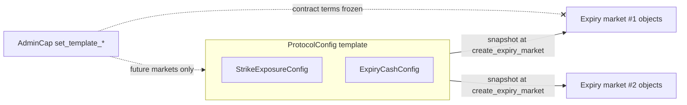

# Configuration

Predict's tunable policy lives in a small set of configuration structs, a single shared `ProtocolConfig` object, and a `Registry`. This document describes how a parameter change reaches the code that consumes it, why some parameters are frozen into per-expiry objects at creation while others are read live, and which authority can change what. It documents the configuration mechanism; it is not a function reference. For the protocol mechanics these parameters govern, see [../overview.md](../overview.md), [../concepts/leverage-and-floor.md](../concepts/leverage-and-floor.md), and [../risks.md](../risks.md).

## Two layers: admin-tunable values vs. upgrade-required constants

Every protocol parameter falls into one of two layers.

- **Admin-tunable values** are stored in config structs and changed at runtime through `AdminCap`-gated entrypoints. Each such value has a stored field, a `default_*` seed, and an `assert_*` validation helper colocated in the `config_constants` module. The default seeds the field at object creation; thereafter the stored field — not the default — is the live protocol value.
- **Upgrade-required constants** live in the `constants` module as macros and are read directly by the logic that needs them. Changing one requires a package upgrade and a version bump. These encode structural facts and hard protocol invariants that are not meant to drift at an admin's discretion.

`config_constants` is the single home for the admin-tunable layer's defaults, bounds, and validation. The `min_*`/`max_*` bounds defined there are themselves upgrade-required constants: they fix the envelope an admin setter may move within, and changing a bound is a package upgrade. An admin can tune a value anywhere inside its envelope; an admin cannot widen the envelope.

Some structural constants are real and stable enough to state directly:

- **1e9 fixed-point scaling** (`float_scaling`): `500_000_000` is 50%, `1_000_000_000` is 100%. Prices, probabilities, fee rates, ratios, and benefit fractions all use this scale.
- **DUSDC settlement asset has 6 decimals**; contract quantities are 6-decimal quote units, so `1_000_000` is one contract.
- **Position lot size** and **minimum mint-time net premium** are fixed constants, not admin-tunable.
- **The discrete leverage set** is exactly {1x, 1.5x, 2x, 2.5x, 3x}, expressed as 1e9-scaled multipliers. The leverage *tiers* (which probabilities permit which leverage) and the leverage floor window are upgrade-required constants, not config fields.
- **The minimum per-expiry allocation cap** is an upgrade-required floor. The actual per-expiry cap is admin-tuned per cadence and snapshotted into pool accounting when a market is created.
- **Market tick sizes** are admin-tuned per cadence and must be positive and within the protocol's overflow-safe bounds. There is no centered strike grid and no per-oracle tick-count constant — a strike is an absolute tick from zero (`raw_strike = tick * tick_size`) over the fixed 24-bit tick domain.
## Three classes of configuration

Beyond the tunable/constant split, the admin-tunable layer is organized by *when and where* a value is read. There are three classes.

### (A) Template configs — snapshotted into per-expiry objects at creation

`ProtocolConfig` owns the current global *template* for two config structs:

| Template (on `ProtocolConfig`) | Snapshotted into | Governs |
| --- | --- | --- |
| `StrikeExposureConfig` | `StrikeExposure` (embedded on the per-expiry `ExpiryMarket`) | Terminal floor index, liquidation LTV, backing-buffer lambda (fraction of the disjoint-book gap reserved for early exits; 1.0 = fully summed reserve), fee policy (base/min fee, Bernoulli scaling, expiry-fee ramp window and max multiplier), all-in mint price bounds |
| `ExpiryCashConfig` | `ExpiryCash` (embedded on the per-expiry `ExpiryMarket`) | Trading-loss rebate rate (fraction of aggregate expiry trading fees reserved for loss rebates) |

When `create_expiry_market` runs, the per-expiry object constructors snapshot each template into an independent copy stored inside the new object. From that moment the snapshot is decoupled from the template: a later admin change to a template updates the value future markets will snapshot, but it **does not** reach back through the template into any already-created market.

Both templates are **contract-term** templates: their snapshots have no per-object admin setter, so once a market is created its fee schedule, floor curve, liquidation LTV, backing-buffer lambda, and rebate rate are fixed for the life of the contract. Traders who minted under one set of terms keep those terms, and an admin cannot retroactively alter the economics of a live market. The setters are named with `template` (for example `set_template_base_fee`, `set_template_liquidation_ltv`) to make this "future-only" effect explicit at the call site. There is no template-class value an admin can move on a live market — the former settlement-freshness exception went away with the oracle extraction (settlement freshness now lives in the external feeds, not in a Predict template).

The contract-term snapshots are frozen by design: there is intentionally no admin path to re-template their economics on an existing market.

### (B) Live configs — read by their consumer at use time

Three config structs are read directly from `ProtocolConfig` at the moment they are needed, with no snapshot:

- **`PricingConfig`** — two freshness thresholds: Pyth spot freshness and Block Scholes *surface* freshness. The surface threshold is a single window covering the whole Block Scholes row (spot + forward + SVI are written together per update), collapsing what used to be separate price and SVI windows. `Pricing` reads these when resolving live probabilities for mint, redeem, liquidation, and the NAV flush; Pyth-stale falls back to the Block Scholes forward, while a stale surface is a hard abort. Because freshness is a protocol-safety concern rather than a contract term, every flow uses the current thresholds the instant it runs; an admin tightening freshness takes effect immediately and protocol-wide.
- **`EwmaConfig`** — the gas-price EWMA trade-penalty parameters (smoothing `alpha`, z-score threshold, per-unit penalty rate) plus an `enabled` master switch. The penalty is disabled by default. The evolving per-market `EwmaState` lives on `ExpiryMarket`; only the shared knobs live here, so a parameter change applies uniformly to every market's penalty computation.
- **`StakeConfig`** — the DEEP staking benefit curve thresholds (`lower_benefit_power`, `upper_benefit_power`). The benefit ratio rises linearly from 0 to half over `0..lower`, half to full over `lower..upper`, and caps at full above `upper`. That ratio scales the fixed maximum fee discount and applies directly as the loss-rebate share. Read live so that a benefit-curve change applies to all stakers at once.

The distinction from class (A) is deliberate: live configs govern protocol-wide safety and shared economics that should move atomically for everyone, whereas the contract-term template configs govern per-contract terms that must stay fixed for the contracts already written under them.

### (C) Global protocol knobs and per-expiry mint pause

`ProtocolConfig` also holds values that are neither snapshotted nor delegated to a sub-config struct.

**Global flow gates and scalars:**

- `trading_paused` — when true, blocks *new risk creation*. Exits, settlement cleanup, and valuation are intentionally not blocked by the trading pause; they are gated only by the valuation lock. `assert_trading_allowed` combines the not-paused check with the valuation lock.
- `valuation_in_progress` — a transaction-local lock held while a full-pool valuation is assembled. `begin_valuation`/`end_valuation` open and close it; while held, config mutations and new-risk flows abort. Most admin setters first assert the valuation lock is *not* in progress so that policy cannot shift mid-valuation.
- `protocol_reserve_profit_share` — the merged protocol-and-insurance reserve share used when aggregate expiry profit is materialized, in 1e9 scaling.
- `trade_liquidation_budget` — the total liquidation-candidate budget checked before mint and redeem flows. It bounds how much liquidation work a single trade flow performs. (There is no separate valuation-time budget: the NAV flush values each market exactly with no liquidation pass, so the former `valuation_liquidation_budget` is gone. The uncertainty-band withdraw fee and its `withdraw_fee_alpha` multiplier are likewise gone — the exact single-mark NAV has no uncertainty band to price.)

**Per-expiry mint pause:** `mint_paused` is a live `bool` field on each `ExpiryMarket`, read directly off the market object on the mint path. When true, new mints on that one expiry abort; the market's other flows (redeem) remain available. The admin sets and unsets it through `expiry_market::set_mint_paused` (version-gated), and a `PauseCap` holder can force it true one-way through `registry::pause_expiry_market_mint_pause_cap` (ungated, so the kill switch survives a version freeze).

The folded design: there are no standalone `fee_config`, `risk_config`, or `expiry_runtime_config` modules. The remaining scalar knobs live directly on `ProtocolConfig` with their defaults and bounds in `config_constants`. Readers should not look for those modules; this is the adopted shape.

## How a tunable value is validated

Every admin setter follows the same shape, which keeps creation-time and update-time validation on one path:

1. The setter asserts no valuation is in progress (for the global lock).
2. The new value is validated against its `assert_*` bound in `config_constants` (a single specific error code per value), so it lands inside the upgrade-required envelope.
3. Relational invariants that span more than one field are checked in the owning config setter, not in `config_constants`. For example, the all-in mint price setters require `min_ask_price < max_ask_price`, and the staking setter validates `lower` and `upper` together with `upper > 2 * lower` (which keeps the curve's `upper - lower` denominator positive and `lower > 0`).
4. The value is stored and a config event is emitted reflecting the new state.

The grouped EWMA setter still validates each field against its own
`config_constants` bound and then stores the updated policy together.

Defaults are applied only in the module that constructs the config; runtime logic treats config fields as plain numbers and never reads the `default_*` seeds. Bounds (`min_*`/`max_*`) may also be read directly by runtime logic when they intentionally serve as a hard floor or ceiling, but there are no config fields or getters for the bounds themselves.

Several bounds are tightened on purpose so a single bad admin call cannot quietly disable a safety mechanism: the expiry-fee max multiplier floors at 1x (the ramp can never reduce fees below base); the EWMA z-score threshold floors at one sigma and is capped so it cannot be set so high the penalty never fires; the EWMA penalty rate is capped to bound how punitive the surcharge can be. For the concrete defaults and envelopes, see the source `config_constants` module; this document deliberately does not hardcode numbers that drift.

## Registry tuning: underlyings and cadences

The `Registry` records admin-approved Propbook underlyings and owns cadence deployment config through its `MarketManager`. `register_underlying` is `AdminCap`-gated and records which Propbook underlyings Predict may create markets for. `set_cadence_config` is also `AdminCap`-gated and sets a cadence's `tick_size`, `max_expiry_allocation`, and `window_size` together. A zeroed cadence is disabled; an enabled cadence's tick size and allocation cap are snapshotted into each created market. There is no on-chain check that a cadence tick size matches the asset's price scale — sizing it is an operational responsibility, and a mismatch fails loud at the first mint (a strike outside the 24-bit tick domain cannot be encoded).
The `Registry` also owns the `PauseCap` / `MarketLifecycleCap` allowlists; the protocol version watermark lives on `ProtocolConfig` (below). The oracle/feed objects themselves are external (`propbook`); the registry only records which Propbook underlyings Predict may create markets for and the cadence policies used to create them.

## Versioning and pause governance

`ProtocolConfig.version_watermark` is a single monotonic floor: every version-gated flow asserts `current_version!() >= version_watermark` (`config.assert_version()`, threaded as the first line of each gated public entrypoint). There are no per-object version sets and no `sync_*` entrypoints — one central watermark replaces the former `Registry.allowed_versions` set and its `ExpiryMarket`/`PoolVault` mirrors. `protocol_config::bump_version_watermark` (admin-only) takes no target: it advances the floor to the running `current_version!()`, so admin can never set it above the deployed binary and brick the package, and retiring old versions requires running the bump from the upgraded package. The watermark is monotonic; a disabled running version is recovered by upgrading, not by lowering it. The setter itself is *not* version-gated. The external propbook feeds version themselves and are not part of this, so there is no oracle/Pyth-source sync.

A `PauseCap` is a revocable emergency capability the admin mints into `Registry.allowed_pause_caps`. Its holders can force global `trading_paused = true` and force `mint_paused = true` on a single expiry — both one-way. PauseCap operations bypass the version gate so the kill switch survives a version freeze, but they can only *engage* protections; unpausing requires the `AdminCap`. (The watermark itself is admin-only; PauseCaps no longer disable a version.)

## Governance: who can change what

| Authority | Can change |
| --- | --- |
| `AdminCap` (on `ProtocolConfig`) | All template values (future markets only), all live configs (`PricingConfig`, `EwmaConfig`, `StakeConfig`), `protocol_reserve_profit_share`, the `trade_liquidation_budget`, global `trading_paused`, the version watermark (`bump_version_watermark`) |
| `AdminCap` (on an `ExpiryMarket`) | Per-expiry `mint_paused` (set and unset) |
| `AdminCap` (on `Registry`) | Register a Propbook underlying, set cadence deployment configs, PauseCap mint/revoke, market-lifecycle-cap mint/revoke |
| `AdminCap` (on `PoolVault`) | Genesis-bootstrap the pool (`lock_capital`) |
| `PauseCap` (via `Registry`) | Force global trading pause, force per-expiry mint pause — both one-way (engage only) |
| `MarketLifecycleCap` (Registry allowlist) | Create expiry markets; also the sole authority to start the privileged pool flush (`start_pool_valuation`). No oracle-write or config authority |
| Permissionless | Cash rebalance, settled-market sweep, and liquidation keeper flows (subject to the valuation lock, not the trading pause); LP supply/withdraw requests and their cancellation |
| Upgrade only | Everything in the `constants` module: scaling, lot size, minimum net premium, leverage set and tiers, leverage floor window, the minimum per-expiry allocation cap, the 24-bit tick domain, and every `min_*`/`max_*` bound in `config_constants` |

All admin setters route through their owning module: global protocol policy through `protocol_config`, per-object policy through the object's own module, and only registry-owned concerns (pause caps, lifecycle caps, uniqueness, underlying admission, and cadence deployment policy) through `registry`. The privileged pool flush is started on `plp`. The embedded config struct setters themselves are package-internal; the public, capability-gated entrypoints are the only external surface for changing policy.

## Related reading

- [../concepts/pricing-and-oracles.md](../concepts/pricing-and-oracles.md) — how the `PricingConfig` freshness thresholds enter live probability resolution from the propbook feeds.
- [../concepts/leverage-and-floor.md](../concepts/leverage-and-floor.md) — the terminal floor index, liquidation LTV, and leverage tiers that `StrikeExposureConfig` governs.
- [./architecture.md](./architecture.md) — object model, the oracle extraction, and the async NAV/LP layer.
- [../risks.md](../risks.md) — operational and governance risk, including pause/version handling.
