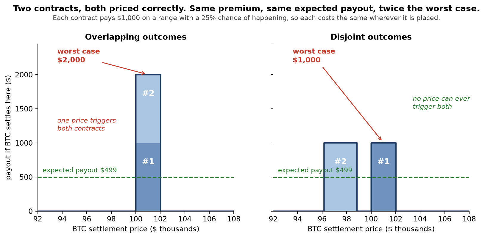
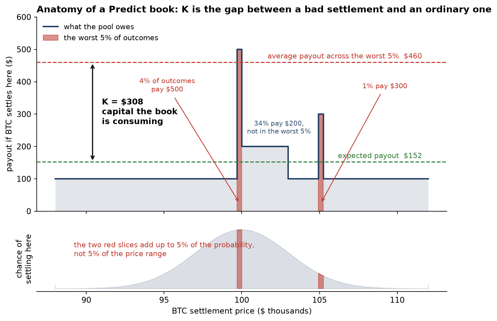
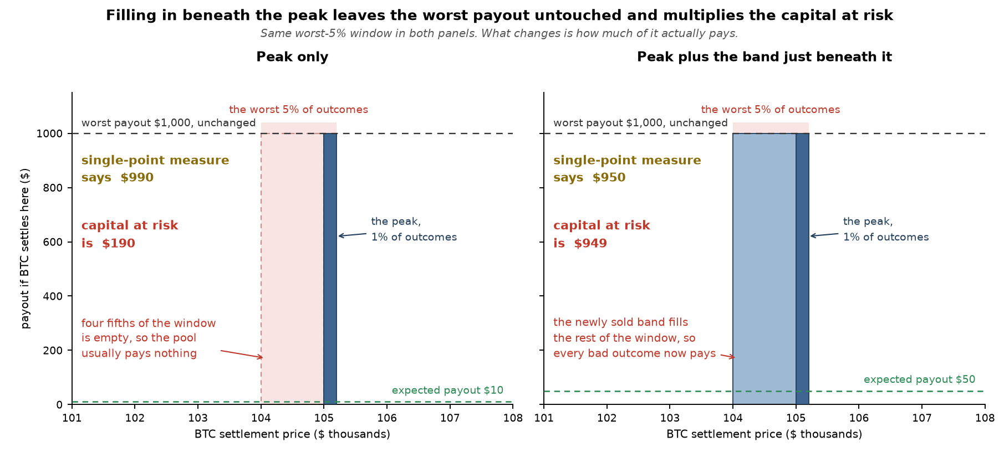
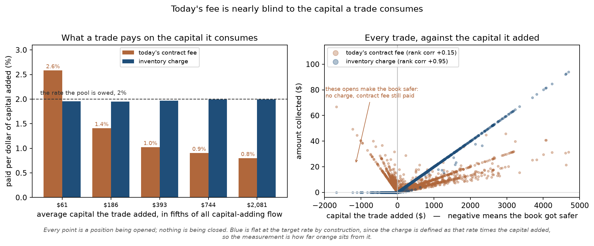
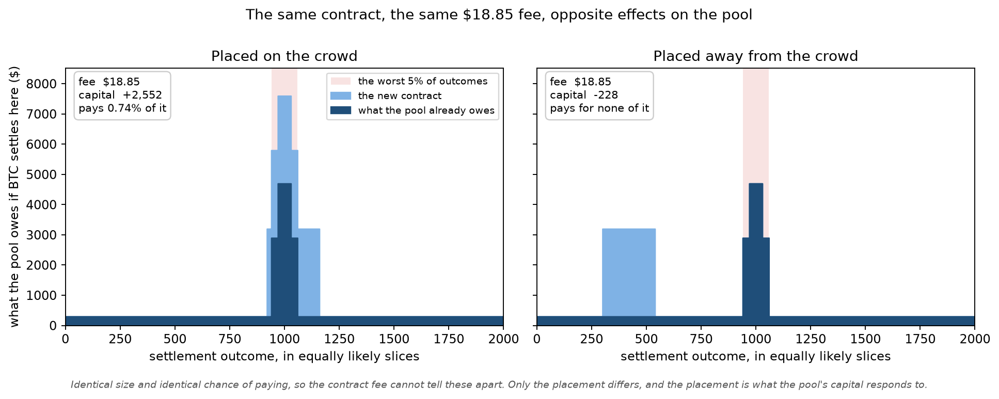
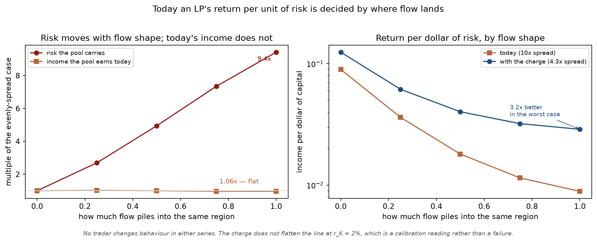
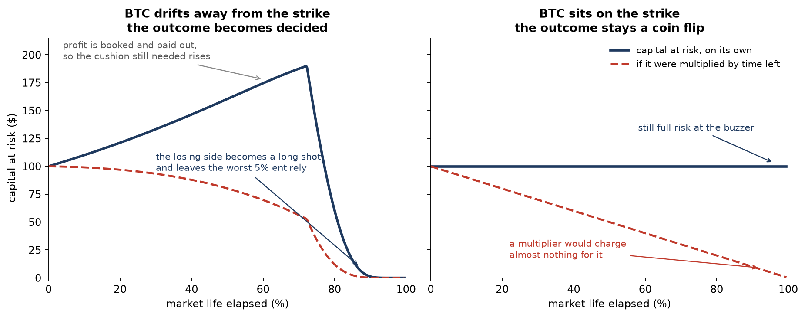

# Inventory impact reference

> **Status:** The current prototype is the 100-bucket coordinate with convex charging, an inline cell-array book, and a ratio pointer rematerialized against the live forward. The configured rate remains zero pending calibration.

## 0. Summary

Contract pricing funds expected payout and the ordinary fee compensates for adverse selection, but neither accounts for overlap with the existing book. Inventory impact charges for that concentration using the average payout in the worst 5% of outcomes minus expected payout. In generated flow, ordinary fee income changes by 6% while economic capital rises 9.4x from dispersed to fully clustered flow, producing a 10x spread in risk-adjusted return. At an illustrative, uncalibrated 2% maximum marginal rate, the mechanism narrows that spread to 4.3x without assuming a behavioural response.

## 1. What this is for

Every contract can be priced perfectly and the pool can still be undercompensated, *because fair pricing values contracts one at a time*, not how they combine. LPs carry the risk of warehousing a set of potentially overlapping payouts.

Take two contracts, each priced exactly right. If they pay on overlapping outcomes, one settlement price can trigger both and the pool owes the sum of the payouts. If they pay on disjoint outcomes, at most one can ever trigger, and the pool's worst case is the larger of the two payouts rather than the total. The premium collected is identical in both cases. The risk is not, and the difference comes purely from *where* the contracts sit.



Inventory impact is the pricing term that charges for that difference. It is a property of the book rather than of any contract in it.

## 2. Objective

The objective is risk-adjusted return:

```text
risk-adjusted return = fee income / economic capital
```

Fee income includes the ordinary contract fee and any inventory-impact charge. Premium is excluded because it funds expected settlement payout rather than expected profit.

Economic capital is the payout in the worst 5% of outcomes above the expected payout already funded by premium. It measures tail risk for compensation; the separate payout-liability reserve guarantees settlement solvency and funds early exits.

The ordinary fee compensates for adverse selection but is insensitive to contract placement. Inventory impact adds fee income when a trade increases economic capital.

## 3. Choosing how to measure the capital

Economic capital is calculated as expected shortfall minus expected payout. A trader pays premium equal to the contract's expected payout under the pricing measure, so that layer of the book arrives prefunded. `K` measures the additional payout in the 5% tail above that funded expectation. It is a compensation coordinate; the maximum-payout reserve remains the solvency coordinate.

Variance does not work as the target because it charges a book as much for an unusually good outcome as an unusually bad one. A book of binary payoffs only loses on one side, so penalising the upside prices risk the pool does not face.

## 4. The formula

```text
K = average(payout maxima of the five worst 1%-probability buckets) - E
```

`K` is the capital at risk from section 3. `E` is what the book is expected to pay under *today's* probabilities. Section 9 says how those five bucket maxima are read from the cell array at quote time.



The dark line is what the pool owes at each settlement price. The red slices are the worst 5% of outcomes. They are picked by probability rather than by width, which is why two thin slices count while the wide $200 band does not. `K` is the gap between the average payout across those slices and the expected payout.

Four choices inside the formula each rule out a simpler alternative.

**Why a 5% tail rather than the single worst payout.** The worst payout answers a different question, which is whether every outcome can be paid at all, and the protocol already tracks that separately for solvency (appendix A). Sizing compensation against an outcome that essentially never happens over-charges for risk the pool does not really carry.

**Why the five buckets are averaged, not summed.** Buckets are mutually exclusive settlement outcomes, and exactly one of them happens. Summing would charge the pool for paying out on several events that cannot co-occur.

**Why the expected payout is subtracted.** Without it, a book that owes $1,000 at every settlement price scores $1,000 of risk. The pool collected roughly $1,000 selling that complete coverage and faces no uncertainty at all. The subtraction is what makes a fully funded book score zero.

**Why not just the single worst payout minus the expected payout.** That version reads one settlement price, so it cannot tell how many bad outcomes sit near the worst one.

Take a book with a tall narrow peak covering 1% of settlement prices, and let someone sell the band just beneath that peak across the next 4%.



Capital at risk rises five-fold, from $190 to $949, because the worst 5% goes from mostly empty to fully paying. The single-point measure moves the other way, from $990 to $950, so under a non-refundable charge the trade is free. Filling in beneath the peak cannot raise the worst payout, but it does raise the expected payout, so that measure can only fall. The trade needs no adversarial intent, since selling the band around a crowded strike while avoiding the strike itself is ordinary behaviour.

Therefore a single-point coordinate does not detect this increase in tail width.

## 5. Measurement

The simulation represents the settlement distribution with 2,000 equal-probability cells and computes economic capital directly from that fine grid rather than from the 100-bucket on-chain estimator. Each generated market has 200 trades, range widths drawn from 0.5%, 1%, 2%, 5%, 10%, and 20% of probability mass, and lognormally distributed quantities with a $1,000 median. A clustering parameter controls the probability that a trade lands near one shared market location rather than independently across the settlement line. The per-trade analysis uses 16 seeds; the flow-shape sweep uses eight seeds at clustering values from 0 to 1. The model works in probability space, so the results do not assume a particular volatility surface. There is no production flow to replay, and the absolute results remain conditional on the generated width, quantity, thickness, and clustering distributions.

### Ordinary fee targeting

For each trade, the simulation records the change in economic capital and the ordinary fee collected. Capital-increasing trades are sorted into fifths by added capital, and each fifth's fees are divided by the capital it adds.



Economic capital added rises 34-fold from the bottom fifth to the top, while the ordinary fee per dollar of added capital falls from 2.6% to 0.8%. Across individual trades, the Spearman rank correlation between the ordinary fee and added capital is 0.15.

The following comparison holds contract quantity and payout probability fixed and changes only its placement in the book.



The contract has the same quantity and one-in-eight payout probability in both placements, so its ordinary fee is $18.85. Placed on the existing concentration, it adds $2,552 of economic capital and the fee equals 0.74% of that increment. Placed in a less exposed region, it reduces economic capital by $228 after accounting for the premium collected.

### Effect on the objective



A contract's ordinary fee depends only on its quantity and payout probability, never on where it lands. As flow concentrates, ordinary fee income rises 6% while economic capital rises 9.4x. `R` therefore spans **10x** across the generated flow shapes, from 0.090 when flow is dispersed to 0.009 when it is fully clustered.

At an illustrative maximum marginal rate of 2%, the inventory charge narrows that spread to 4.3x and raises `R` in the fully clustered case by 3.2x. Neither series assumes a trader changes behaviour.

The 2% input is not a proposed rate. It leaves the clustered book undercompensated relative to the dispersed book. Calibration remains open; one candidate criterion is the rate that equalises `R` across flow shapes.

## 6. How the coordinate becomes a price

`K` is a state, not a charge. It says how much economic capital the book is consuming under the current snapshot. The charge is the positive change in a convex potential over `K`:

```text
phi(K) = r_max * K^2 / (2B)          for K <= B
phi(K) = phi(B) + r_max * (K - B)    for K > B
charge  = max(0, phi(K_after) - phi(K_before))
```

`r_max` is the maximum marginal inventory-charge rate, not the LP's realised return. Once `K >= B`, a trade that adds one dollar of measured economic capital pays `r_max` dollars. Below `B`, the marginal rate rises linearly from zero to `r_max`.

`B` is the economic-capital scale at which one market reaches the maximum marginal rate. Both `K` and `B` are in capital dollars, which makes `r_max` a dimensionless marginal rate rather than an arbitrary coefficient. The values of `B` and `r_max` remain to be calibrated.

The [matched-income comparison](../../simulations/inventory_impact_value_ceiling.ipynb) tested a flat marginal-capital charge as a simpler alternative. Across 100, 200, and 400-trade books, convexity reduced the risk-adjusted-return spread by 27–28% relative to flat charging at the same aggregate inventory income. At 200 trades, flat produced a 5.25x spread and convex produced 3.81x. Convexity also charged the largest transitions more, which is the mechanism producing the stronger compensation where flow is concentrated. The convex form is therefore the current prototype target.

The charge is a difference of two potential values, so slicing a risk-increasing transition collects the same total. Negative moves receive no rebate; a path that first lowers risk and later restores it can collect more, never less.

## 7. Relation to textbook inventory skew

The goal is the same one a market maker solves. Avellaneda and Stoikov shift the reservation price (quoted mid price) by an amount proportional to inventory, volatility, and time remaining, for the reason section 1 gives: the fair mid does not compensate for warehousing.

This design generalises that in three ways.

1. **Inventory is a shape, not a number.** A market maker holds some quantity and leans the quote the other way. The pool owes different amounts depending on where BTC settles, so there is no single quantity to lean against, only the payout shape the figures above draw.
2. **Variance becomes a tail measure**, for the reason in section 3.
3. **There is no mechanical time-to-expiry multiplier.** `K` changes when the settlement distribution changes, including as uncertainty resolves near expiry. Multiplying it by time remaining would discount that risk a second time.

The third one is the least obvious, so here it is drawn.



Both panels are the same book, one that owes $300 if BTC settles below the strike and $100 if above. On the left BTC walks away from the strike, so a settlement below it turns into a long shot and finally drops out of the worst 5% altogether, taking `K` to zero before the clock runs out. On the right BTC never leaves the strike, the market is a coin flip until the last second, and `K` never falls at all.

The dashed line applies a mechanical time-to-expiry multiplier to `K`. It understates the left panel after the coordinate has already responded to the probability change, and it approaches zero in the right panel while the market still carries its full tail risk.

An explicit capital-time charge is a separate mechanism. For annual capital hurdle `h` and remaining term `t` in years, linear rent on one dollar of incremental capital is `h * t`. At annual hurdles from 20% to 100%, one hour of rent is 0.0023% to 0.0114% of capital, and one minute is 1/60 of those amounts. These terms are small relative to percent-scale concentration charges at the current 1m-to-1h expiries, so v1 omits them. A later version can add a snapshotted cadence-level capital-time rate without changing the grid or `K`; it would require the same split-resistance and path-dependence tests as the existing potential.

A market maker applies the skew to its quote; this design applies it as a fee.

## 8. Why there is no rebate

A trade that lowers `K` has economic value because it releases economic capital. V1 does not rebate that value. At 1m-to-1h expiries there is no direct hedge for a prediction range, so the rebate would have to change the behaviour of a directional trader rather than attract a near-riskless rebalancer. The expected response was not sufficient to justify the additional production state and accounting.

Sliding the dollar rungs with the live forward also changes the basis on which `K` is measured. Refunding a prior charge under a newer forward would not reverse the original priced transition; preserving reversibility would require snapshot-bound per-position credit or equivalent accounting. That machinery was removed so the pointer can follow spot without an escrow extract.

The resulting charge is conservative and path-dependent. Repositioning can pay a new charge without receiving credit for the capital released by the close. This is an accepted v1 tradeoff, not a claim that risk-reducing flow has no value.

## 9. Mechanics

The coordinate is built from a payout book and a probability cut. The payout book records what the pool owes if settlement lands at each price. The probability cut records which of those prices are the worst 5% of outcomes under the frozen SVI shape. The cut is stored as `strike / forward` ratios and rematerialized against the live forward on every quote.

### The cell array is the book

The market stores a 2,048-cell geometric lattice inline. Each cell holds the payout the book currently owes if settlement lands in that cell. The lattice is laid down once, on an empty book, around the first quantile ladder: uniformly spaced in log price, a bit wider than the 1st-to-99th percentile span so later spot drift still has cells to land in. Spacing in the log of price, rather than in strike, keeps every cell the same width as a fraction of the forward, so a 1% probability bucket sees the same number of cells — and the same resolution — wherever spot has moved inside the span. It is never re-cut. Re-cutting it would mean re-binning the whole book, which is the tree read the array exists to avoid.

A mint or close snaps its strike range to the nearest cell edges and adds or removes its quantity from those cells immediately. Two order boundaries that fall inside one cell collapse into one. That is the whole incremental path. There is no stored per-bucket maximum waiting to be patched.

### The 100 buckets are only a probability cut

An authenticated caller supplies the 99 interior boundaries as `strike / forward` ratios. The contract multiplies them by the pricer's own forward, adds the two open ends, prices each boundary once, and refuses the cut unless every bucket holds 1% of probability to within one basis point. The ratios are what make the cut land: a strike's probability depends only on its ratio to the forward, so the same ladder verifies however far spot moved between the caller pricing it and the transaction executing. As absolute prices it would not. A 1%-probability bucket is about two basis points of the forward wide, which spot covers in under a second.

The stored cut is the 99 ratios. A quote multiplies them by the live forward, snaps those dollar rungs onto the same cell lattice, and reads bucket maxima there. The cells keep moving with every trade. There is no later keeper transaction that rewrites the pointer: when the forward moves, ATM is `k = 1` again on the next quote. A quote that asks "what is the max in bucket 17?" scans whichever cells now sit under `ratio_17 × F_live`.

### How the five worst buckets are found

This join happens on every mint or close quote.

Every bucket already holds 1% of probability along the ratio axis, so the worst 5% of outcomes is just the five buckets with the largest payout maxima. There is no second probability integral at quote time, and "worst" means highest payout: all 100 slices are equally likely by construction. The protocol:

1. For **every** one of the 100 buckets, not only the ones the trade overlaps, rematerialize `ratio × F_live` and snap those dollar rungs onto the cell lattice.
2. Take the largest cell value in that range. If the candidate trade overlaps some of those cells, add or remove its quantity there for the *after* number; untouched buckets keep their current max. That is done without mutating the array.
3. Keep the five largest of those 100 numbers, average them, and subtract `E`. That is `K`. Charge the positive difference of the convex potential. Negative moves receive no rebate.

The trade only changes the maxima of buckets it overlaps. The top five is still taken across the whole book, because a close can drop a current tail bucket and a previously sixth-highest untouched bucket has to enter.

The probability cut does not store payouts. It stores a pointer into the array: each bucket remembers the cell index its left and right boundaries snapped to. "Take the max" means walk those cells and read them. There is no second table of maxima.

A toy book with ten cells might look like this after a few trades:

```text
cells:              [0, 0, 100, 100, 250, 250, 40, 40, 0, 0]
bucket 17 covers:                ^^^^  ^^^^
```

This quote wrote "bucket 17 starts at cell 4 and ends at cell 6" because those are the cells under `ratio_17 × F_live`. The quote then does `max(250, 250) = 250`. If the candidate trade would add 50 to cells 3 through 5, the *after* maximum for that bucket is `max(300, 300) = 300`, still without writing anything. The other 99 buckets get the same scan. Only then are the five largest of the 100 kept and averaged.

A later quote at a different forward rematerializes the same ratios and may find that bucket 17 now covers cells 5 through 7.

### Two kinds of probability

The 1% mass check prices the *quantile boundaries* at initialize. Quote-time `E` does not reuse that stored increment blindly. A quote re-integrates the cell profile under the frozen SVI at the live forward — a walk of the piecewise-constant cells against the survival function, one digital price per distinct snapped boundary rather than one per cell — and the transition then moves `E` by `quantity` times the probability of the snapped cell span.

Those two groupings floor at different points, so a close subtracts saturating, and a close that empties the array clears `E` outright. Residual rounding can only overstate `K`.

### Why an array is enough, and why the tree is not used

`K` is already an average of five range maxima over 1% buckets. It does not need the payout tree's per-strike precision. The array is a coarse substitute sized for that: 2,048 cells, about 0.4 basis points each at the three-hour horizon the grid lane runs on, with median per-trade charge error against a tree read of 1.6% or better through 90% of market life. NAV cannot take that bargain. The frozen mark has to equal exact recoverable value, so the flush still walks the payout tree.

Walking the tree is what hits the 1,000-node wall. Each distinct strike is a dynamic-field child, and the per-transaction object-cache ceiling sits at the same 1,000 nodes the tree is allowed to reach. A market at its permitted maximum therefore cannot be valued by reading that tree in one transaction. The array lives inline in the market object — 16 KB, zero children — so a quote loads no payout-tree nodes at all. That removes the ceiling by construction rather than by tuning. The flush still has the problem, because it still needs the exact tree.

### The keeper owns initialize, not a cadence

The contract will not invent a ladder. A lifecycle-cap holder has to submit the 99 ratios once, on an empty book. That is the only keeper cut.

The keeper prices the current SVI, emits the ratio ladder, and sends `initialize_inventory_grid` on the tick a far market is rolled, before the market is advertised. One order landing first makes the market permanently un-griddable, because initialization requires an empty book and there is no bulk import from the tree. Later ticks do not re-cut: dollar rungs are `ratio × F_live` on the quote itself. Near-expiry markets that cannot invert a 1% ladder stay un-gridded until a later tick can.

### Why the pointer is ratios

A grid stored as creation-time dollar strikes goes stale because spot moves. The 1%–99% band of a one-day market can be 60k–62k at freeze and 65k five minutes later; every live range then sits in the open top bucket, or, on a freeze-once weighted measure, in zero-mass cells. Holding the 99 rungs as `strike / forward` and rematerializing them at quote time keeps ATM at `k = 1` without a keeper transaction.

Time still runs out. The settlement distribution narrows with the square root of time remaining, so a creation-time *shape* can still be too wide near expiry. That is smile stickiness, not spot. The table below measured a *dollar* freeze-once against a live re-cut; the ratio pointer removes the spot column of that gap, not the decay column.

A *dollar* freeze-once, which is what the table measured, fails that way. Measured as delivered compensation on risk-adding trades:

| Refresh policy | Price-taking flow | Selective flow, best of six |
| --- | --- | --- |
| Live grid, the discretization ceiling | 1.016 | 0.992 |
| Freeze once at creation | 0.962 | 0.654 |
| Freeze at creation but 1.5x wider | 1.025 | 0.715 |
| Every 25% of market life | 0.992 | 0.812 |
| Every 10% of market life | 1.007 | 0.894 |
| Every 5% of market life | 1.009 | 0.925 |

Freezing once holds up against flow that arrives blind, because the errors go both ways and cancel. It fails against traders who pick their moment. The boundaries and live spot are both on chain, so finding an underpriced trade takes no private information. Cutting the grid wider at creation does not help, because a wider grid is still centred in the wrong place.

Read the gap between the two columns, not the average. How selective real flow will be is unobservable, so the rate cannot be calibrated to cover it.

The ratio pointer removes the spot column of that gap. Smile decay can still unbalance the 1% rungs on a long market; that remaining column is not a keeper cadence.

A cut still has to land soon after it is priced at initialize. Only the surface's time decay can invalidate a ladder now, and that costs about 3,300 of the 100,000 mass tolerance per second on a market a few hours out, so a submission has tens of seconds of budget. Held as prices it had under one second, which no amount of submitting faster would have fixed.

## Appendix A: why payout liability `L` is the wrong coordinate

`L = M + λ(T − M)`, where `M` is the maximum payout at any single settlement price, `T` is the aggregate maximum summed across positions, and `λ` is the backing-buffer fraction, default 0.25. `L` is correct and unchanged for what it was built to do, which is guaranteeing every settlement outcome can be paid and funding early exits. Nothing here argues for removing it.

Measured against the four axioms of a coherent risk measure, `L` satisfies three. It is monotone, positively homogeneous, and subadditive. It fails only *translation invariance*, because it carries no cash term, so premium collected never reduces it. The first two failures below are that single omission seen at the whole-book level and at the margin.

- **A fully funded book looks maximally risky.** `L` counts gross payout without subtracting contract value paid in, so a book owing $1,000 at every settlement price scores $1,000 of risk despite facing no uncertainty.

- **It never credits the premium a position brings in, so it cannot price a trade negatively.** `M` does rank placement correctly. A pile-on onto the current worst point raises `L` by its full quantity, while a disjoint range raises it only by `λ`. But `T` grows either way, so `L` can only rise. Against a book peaking at $2,000, a disjoint $1,000 range is billed +$250 even though it leaves the worst settlement payout unchanged and improves the pool's capital position by $300.

- **It contains no settlement probabilities.** The risk question is how likely the pool actually has to pay. Two contracts with the same payout but different probabilities are not equally risky, and the likelier one should cost more. `L` sees only payout size, so it ranks them the same.

- **Its diversification credit operates only at the peak.** All of `L`'s placement sensitivity lives in `M`, so any addition that fails to establish a new worst point is priced identically wherever it lands, and `L` cannot distinguish a book losing badly at one outcome from one losing across a wide band.

- **Its scale and rate are not denominated in investor capital.** The old `B` was the per-market expiry cap, a write-capacity limit in liability dollars, so the fee level and the point where the marginal rate saturates could not be tuned independently, and neither corresponded to a return on capital.

- **It does not respond to changing settlement probabilities.** `L` is a pure function of gross book state, so the same payout profile has the same score whether its tail is still plausible or has become remote. A signed `L`-based potential also makes an open-then-close round trip net to zero. The non-refundable `K` charge removes that free round trip; explicit capital-time rent remains outside v1.

- **Using it for both jobs conflates backing with compensation.** `L` exists to size a reserve, so reusing it as the fee coordinate charges takers for reserve growth rather than for created risk.

These failures matter more on some books than others. The [admission-coordinate ladder](../../simulations/inventory_impact_cap_ladder.ipynb) tuned every candidate to refuse the same volume and graded each on actual capital at risk. Used as an admission *cap*, `L` matched the full grid coordinate across every tested setting, because ordinary generated flow never builds the fully funded book that exposes the centering defect. The ranking reverses once books fill in. When enough flow is wide that mean payout reaches about half of peak, the centered coordinate removes roughly 5% more capital at the same volume cost.

