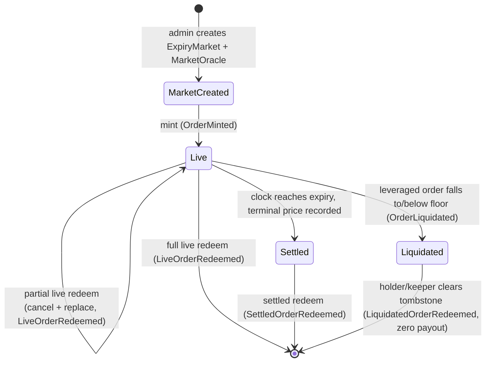

# Overview

Predict is an on-chain protocol for European cash-settled binary options (digitals) on the Sui blockchain. Trading is organized into independent per-expiry markets: each market settles once, at one timestamp, against one price feed, and every position is a range digital — a contract that pays a fixed notional if the feed's price lands at expiry inside a chosen strike range, and zero otherwise. Leverage is built into each contract as embedded premium financing — a deterministic, rising floor — plus a knock-out, rather than as separate debt, and a single LP-backed pool writes every contract.

This page gives the whole mental model fast and routes onward. For one-line technical definitions of every term, see the [glossary](./glossary.md); for the trust assumptions and known limitations behind every claim here, read [risks](./risks.md).

## What Predict is

A Predict position is a **European cash-or-nothing binary option** on whether the settlement price lands inside a strike range `(lower, higher]` — a *range digital*, equivalent to a digital call spread (long a digital call struck at `lower`, short one struck at `higher`); the open-ended ranges are plain digital calls and puts. A plain (1x) position pays its full `quantity` — its notional — if settlement is inside the range and `0` otherwise. Its mark value before settlement is the range's model probability times its notional: for a digital, the price per unit notional *is* the risk-neutral probability of the event.

Leverage transforms that same contract with two modifications: embedded premium financing and a sold knock-out. The holder pays only the net premium (`full premium / leverage`) upfront; the unpaid remainder is financed by the pool and embedded in the payoff as a deterministic, time-varying **floor** — an accreting financing balance the contract must cover before the holder owns anything above it. The floor rises deterministically toward a terminal value as expiry approaches, and the contract is extinguished — knocked out, with zero rebate — if its value decays to the floor-derived knock-out level. Economically a leveraged position is a down-and-out digital structured like a turbo warrant. A 1x order is the special case where the floor is zero, recovering the plain range payoff exactly.

This is *limited-recourse* financing. A leveraged order's floor can only ever consume that one order's own value or payout, capped at it. There is no margin call against the holder's other assets and no shared debt pool. An order that falls to or below its floor is simply worth zero to its holder and is knocked out (liquidated); it never produces a negative balance the protocol must chase.

Prices come from two oracles. A Pyth Lazer feed supplies the canonical spot; a Block Scholes operator supplies an SVI volatility surface and a forward basis. The protocol builds a forward (spot times basis) and derives each range's probability by differencing a one-sided UP-price curve off the SVI surface. Every live price is validated for freshness at read time. A market settles from the first valid post-expiry price — Pyth preferred, Block Scholes as fallback — and that single number is final.

The pool (`PoolVault`) is the counterparty. Liquidity providers deposit DUSDC and receive PLP shares; the pool funds each active expiry's working cash and absorbs trader P&L. Each expiry holds its own cash and must always cover its payout liability plus its trading-loss rebate reserve.

## Core on-chain objects

| Object | Role | Sharing |
| --- | --- | --- |
| `Registry` | Feed/expiry uniqueness, version set, pause caps, creation entrypoints | shared |
| `ProtocolConfig` | Admin-tunable config, `trading_paused`, the valuation lock, per-expiry runtime controls | shared |
| `PoolVault` | Idle + reserve DUSDC, PLP treasury cap, staked-DEEP custody, incentives, expiry ledger | shared |
| `ExpiryMarket` | One expiry's strike grid, exposure book, embedded `ExpiryCash` DUSDC, NAV, cleanup | shared, one per expiry |
| `MarketOracle` | One expiry's Block Scholes SVI/forward data and terminal settlement | shared, one per expiry |
| `PythSource` | One Lazer feed's latest normalized spot and timestamps | shared, one per feed |
| `PredictManager` | Per-trader DUSDC custody + positions, staking mirror, builder attribution | owned or shared |
| `BuilderCode` | Accrues and claims builder fees for order-flow routers | derived shared |

Capabilities are owned objects: `AdminCap` (global policy), `MarketOracleCap` (Block Scholes writer / settlement), `PauseCap` (one-way emergency brake), and the per-manager `PredictTradeCap` / `PredictDepositCap` / `PredictWithdrawCap`. Detail in [architecture](./design/architecture.md).

## Market and position lifecycle

An admin registers a feed and creates one `ExpiryMarket` + `MarketOracle` per expiry. The market opens with zero cash; pool capital enters only later through PLP rebalancing. A position moves through mint, optional live redeem, settlement, and a terminal redeem or liquidation. Each transition emits one order-domain event.

- **Mint** is the pool writing a new contract to the buyer: it creates a live position, quotes the entry probability (the premium per unit notional), derives the net premium and leverage floor, and settles payment (net premium + trading fee + optional builder fee + optional congestion surcharge). Leveraged mints must satisfy price-tiered leverage caps, sit above the liquidation threshold at entry, and keep their terminal floor below `quantity × liquidation_ltv`.
- **Live redeem** is a sell-to-close at the current mark: it closes some or all of a position at the current range probability, net of the floor on the closed slice. A partial close is handled as cancel-and-replace: the full order is removed from the live indexes and the survivor re-inserted with the same open time and a proportional remainder of the floor.
- **Settlement** is the terminal, irreversible transition: once a valid post-expiry price is recorded it is never overwritten. Settled markets accept no new live risk.
- **Settled redeem** is cash settlement: it pays a winning (in-range) position `quantity − terminal_floor` (zero outside the range), is permissionless, and requires a full close.
- **Liquidation** removes a leveraged order whose live value has decayed to or below its floor-derived knock-out level. It is a permissionless, bounded-budget knock-out with zero rebate that touches no manager and leaves a tombstone the holder later clears for zero payout.
- **Compaction** destroys a settled market's dense indexes and returns free LP cash to the pool.

## Guarantees in plain language

These properties are designed in and hold by construction; their boundaries are detailed in [risks](./risks.md).

- **Cash always backs payouts and rebates.** Each expiry's `ExpiryCash` enforces, on every cash movement, that its balance is at least its payout liability plus its unresolved trading-loss rebate reserve. Surplus above that line is the only cash the pool may sweep. An expiry can always pay both its winners and its owed rebates.
- **A market settles once.** Settlement records a single terminal price the first time a valid post-expiry source exists, from Pyth if fresh and otherwise from Block Scholes. It is first-writer-wins and immutable — no averaging, TWAP, or dispute window, and no admin path overwrites it.
- **Leverage floors are limited-recourse.** A floor offsets only its own order's value or payout, capped at it. There is no shared debt and no recourse to a holder's other assets; a leveraged order that breaches its floor is worth zero, never negative.
- **Monetary math rounds in the protocol's favor.** Payouts, live redeems, and the aggregate NAV floor all round down, so sub-unit dust accrues to the protocol rather than against its solvency. Reserved backing is recomputed with the same round-down formulas at mint, partial close, and settlement, so a payout can never exceed the cash reserved to back it.
- **Live valuation is conditional on a healthy book.** Pool NAV subtracts one aggregate floor from one aggregate range value, which is sound only when every leveraged order is individually above its floor. The bounded liquidation passes that run before each valuation maintain that precondition; this is a policy guarantee, not an exhaustive per-valuation proof. See [liquidation](./concepts/liquidation.md) and [risks](./risks.md).

## Where to go next

**Concepts — how the protocol works:**

- [Glossary](./glossary.md) — every term technically defined and mapped to its standard options / structured-product name and code identifier.
- [Markets and positions](./concepts/markets-and-positions.md) — per-expiry markets, the strike grid and ±infinity sentinels, what an order is, and the full lifecycle.
- [Leverage and the floor](./concepts/leverage-and-floor.md) — the financing-plus-knock-out structure, the floor index and floor shares, mint admission, and settlement payout.
- [Pricing and oracles](./concepts/pricing-and-oracles.md) — Pyth spot, the Block Scholes SVI surface, range-probability derivation, freshness, and settlement.
- [Fees and rebates](./concepts/fees-and-rebates.md) — the variance-based trading fee, expiry ramp, builder fee, congestion surcharge, staking discount, and loss rebate.
- [Liquidation](./concepts/liquidation.md) — the trigger condition, the priority-encoded liquidation book, bounded scan budgets, and what they imply for LPs.
- [Liquidity and NAV](./concepts/liquidity-and-nav.md) — the pool, PLP supply/withdraw, full-pool NAV, pool↔expiry cash flow, profit materialization, and incentives.

**Design — how the protocol is built:**

- [Architecture](./design/architecture.md) — the on-chain objects, DUSDC custody layers, the capability and authorization model, the binding mesh, and version gating.
- [Configuration](./design/configuration.md) — the tunable-vs-constant split, template snapshots versus live configs, and who can change what.

**Risks:**

- [Risks and limitations](./risks.md) — oracle and admin trust, settlement and leverage risk, LP risk, rounding, bounded-liquidation keeper dependence, and pre-deployment maturity caveats.