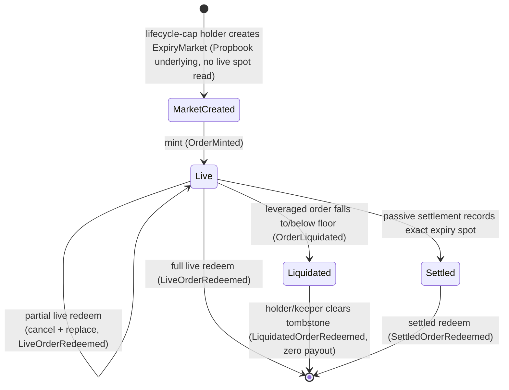

# Overview

Predict is an on-chain protocol for European cash-settled binary options (digitals) on the Sui blockchain. Trading is organized into independent per-expiry markets: each market settles once, at one timestamp, against one price feed, and every position is a range digital — a contract that pays a fixed notional if the feed's price lands at expiry inside a chosen strike range, and zero otherwise. Leverage is built into each contract as embedded premium financing — a deterministic, rising floor — plus a knock-out, rather than as separate debt, and a single LP-backed pool writes every contract.

This page gives the whole mental model fast and routes onward. For one-line technical definitions of every term, see the [glossary](./glossary.md); for the trust assumptions and known limitations behind every claim here, read [risks](./risks.md).

## What Predict is

A Predict position is a **European cash-or-nothing binary option** on whether the settlement price lands inside a strike range `(lower, higher]` — a *range digital*, equivalent to a digital call spread (long a digital call struck at `lower`, short one struck at `higher`); the open-ended ranges are plain digital calls and puts. A plain (1x) position pays its full `quantity` — its notional — if settlement is inside the range and `0` otherwise. Its mark value before settlement is the range's model probability times its notional: for a digital, the price per unit notional *is* the risk-neutral probability of the event.

Leverage transforms that same contract with two modifications: embedded premium financing and a sold knock-out. The holder pays only the net premium (`full premium / leverage`) upfront; the unpaid remainder is financed by the pool and embedded in the payoff as a deterministic, time-varying **floor** — an accreting financing balance the contract must cover before the holder owns anything above it. The floor rises deterministically toward a terminal value as expiry approaches, and the contract is extinguished — knocked out, with zero rebate — if its value decays to the floor-derived knock-out level. Economically a leveraged position is a down-and-out digital structured like a turbo warrant. A 1x order is the special case where the floor is zero, recovering the plain range payoff exactly.

This is *limited-recourse* financing. A leveraged order's floor can only ever consume that one order's own value or payout, capped at it. There is no margin call against the holder's other assets and no shared debt pool. An order that falls to or below its floor is simply worth zero to its holder and is knocked out (liquidated); it never produces a negative balance the protocol must chase.

### Strikes are absolute integer ticks

There is **one canonical strike representation across the whole protocol — absolute integer ticks**. A strike is an integer `tick`, and its raw price is always `raw_strike = tick × tick_size`, where `tick_size` is fixed per expiry. There is no second representation: no centered grid and no boundary indices. The public API, order IDs, the payout tree, the liquidation book, and the exposure index all operate over ticks; raw strikes are reconstructed only at the pricing/settlement boundary. A range is the tick pair `(lower_tick, higher_tick)`, carried directly at public entrypoints and events; the open-ended ends are the two sentinel ticks (`lower_tick = 0` is `−∞`, `higher_tick = pos_inf_tick` is `+∞`). Only the durable order ID packs the two ticks into one integer.

Because the tick domain is absolute and fixed in advance, **market creation reads no live spot** — a new expiry market just records its `tick_size` (the `MarketCreated` event carries `tick_size` and `max_expiry_allocation`, not a min/max strike). The pricing math saturates instead of aborting in the deep tails: a strike far below the forward prices to ~1.0 and far above to 0, so no live quote ever fails on an extreme strike.

### Prices come from external feeds

Live prices come from two standalone, Predict-unaware feeds in the **propbook** package. A `PythFeed` holds one global source-native spot payload per Pyth Lazer feed id, updated permissionlessly from a verified Lazer payload and exposed through a normalized spot read. A `BlockScholesFeed` holds, per source id and expiry, a **surface** of `{spot, forward, SVI volatility, timestamps}` written by a trusted off-chain operator. Predict builds a forward and differences each range's probability off the SVI surface: when the normalized Pyth spot is fresh and usable it uses `forward = spot × basis(expiry)`; when the Pyth spot is absent, unusable, or stale it falls back to the surface's own forward. Either way the **surface must be fresh** — a stale surface is the one hard pricing abort. Propbook stores source facts; Predict validates the pricing-safe envelope at read time.

### Settlement is passive

Terminal settlement records the exact normalized Pyth spot at the market's expiry timestamp from Propbook exact timestamp history. There is no standalone public settle entrypoint: normal flows that branch on settlement — settled redeem and pool cash rebalance / flush valuation — first try to record settlement passively. If the exact expiry spot is not present yet, the market remains unsettled and any live-pricing path past expiry aborts rather than inventing a substitute mark (see [risks](./risks.md)).

The pool (`PoolVault`) is the counterparty. Liquidity providers deposit DUSDC and receive PLP shares; the pool funds each active expiry's working cash and absorbs trader P&L. Each expiry holds its own cash and must always cover its payout liability plus its trading-loss rebate reserve.

## Core on-chain objects

| Object | Role | Sharing |
| --- | --- | --- |
| `Registry` | Feed/expiry uniqueness, version set, pause + lifecycle caps, creation entrypoints | shared |
| `ProtocolConfig` | Admin-tunable config, `trading_paused`, the valuation lock, per-expiry runtime controls | shared |
| `PoolVault` | Idle + reserve DUSDC, PLP treasury cap, staked-DEEP custody, expiry ledger, the LP supply/withdraw queues | shared |
| `ExpiryMarket` | One expiry's tick grid, exposure book, embedded `ExpiryCash` DUSDC, exact `current_nav`, cleanup | shared, one per expiry |
| `PredictManager` | Per-trader DUSDC custody + positions, staking mirror, builder attribution | owned or shared |
| `BuilderCode` | Accrues and claims builder fees for order-flow routers | derived shared |

Oracle data is **not** a Predict object: the `PythFeed` and `BlockScholesFeed` shared objects are owned by the separate `propbook` package. Predict markets store a Propbook underlying ID; live pricing validates passed feed objects against Propbook's current canonical bindings for that underlying.

Capabilities are owned objects: `AdminCap` (global policy, plus genesis-bootstrapping the pool), `MarketLifecycleCap` (market creation and the sole authority to start the pool flush), `PauseCap` (one-way emergency brake), and the per-manager `PredictTradeCap` / `PredictDepositCap` / `PredictWithdrawCap`. Block Scholes updates are submitted through propbook, not Predict. Detail in [architecture](./design/architecture.md).

## Market and position lifecycle

An admin registers a Propbook underlying, and a lifecycle-cap holder creates one `ExpiryMarket` per underlying and expiry. The market opens with zero cash; pool capital enters only later through the rebalancer during a flush. A position moves through mint, optional live redeem, and either knock-out (liquidation) or terminal settlement. Each transition emits one order-domain event.

- **Mint** is the pool writing a new contract to the buyer: it creates a live position, quotes the entry probability (the premium per unit notional), derives the net premium and leverage floor, and settles payment (net premium + trading fee + optional builder fee + optional congestion surcharge). The buyer's range is the tick pair `(lower_tick, higher_tick)`. Leveraged mints must satisfy price-tiered leverage caps, sit above the liquidation threshold at entry, and keep their terminal floor below `quantity × liquidation_ltv`.
- **Live redeem** is a sell-to-close at the current mark: it closes some or all of a position at the current range probability, net of the floor on the closed slice. A partial close is handled as cancel-and-replace: the full order is removed from the live indexes and the survivor re-inserted with the same open time and a proportional remainder of the floor.
- **Liquidation** removes a leveraged order whose live value has decayed to or below its floor-derived knock-out level. It is a permissionless, bounded-budget knock-out with zero rebate that touches no manager and leaves a tombstone the holder later clears for zero payout.
- **Settlement and settled redeem** are the terminal, irreversible transition — paying a winning (in-range) position `quantity − terminal_floor` and zero otherwise. Settlement is passive: the first normal flow that needs a settled branch records the exact Propbook Pyth spot at expiry if it is available.
- **Settled sweep** deactivates a settled market from the pool's active set, returns free LP cash to idle, and materializes terminal profit.

## Liquidity is asynchronous

Liquidity providers do not transact against a live pool price. They **queue** requests: `request_supply` escrows DUSDC and `request_withdraw` escrows PLP, each routed through the LP's manager and cancellable until it is filled. A periodic **flush** then values the whole pool once and settles every queued request at that single frozen mark. The flush is a transaction-local hot potato — `start_pool_valuation` → one `value_expiry` per active market → `finish_flush` — and it is **privileged**: only a market deployer's `MarketLifecycleCap` may start one, so the mark cannot be timed by an adversary against a manipulated oracle. The mark itself, `pool_nav = idle + Σ current_nav`, is **exact** (each `current_nav` is the true per-expiry recoverable value, with no approximation band), so the one mark that prices both supplies and withdrawals equals true NAV in both directions. Fills are delivered to each manager through the balance accumulator and absorbed lazily on the manager's next capital op. See [liquidity and NAV](./concepts/liquidity-and-nav.md).

## Guarantees in plain language

These properties are designed in and hold by construction; their boundaries are detailed in [risks](./risks.md).

- **Cash always backs payouts and rebates.** Each expiry's `ExpiryCash` enforces, on every cash movement, that its balance is at least its payout liability plus its unresolved trading-loss rebate reserve. Surplus above that line is the only cash the pool may sweep. An expiry can always pay both its winners and its owed rebates.
- **Leverage floors are limited-recourse.** A floor offsets only its own order's value or payout, capped at it. There is no shared debt and no recourse to a holder's other assets; a leveraged order that breaches its floor is worth zero, never negative.
- **Monetary math rounds in the protocol's favor.** Payouts, live redeems, and the per-expiry backing reserve all round down, so sub-unit dust accrues to the protocol rather than against its solvency. Reserved backing is recomputed with the same round-down formulas at mint and partial close, so a payout can never exceed the cash reserved to back it.
- **The LP mark is exact and unforgeable.** A flush prices PLP supply and withdraw at one mark equal to the pool's exact recoverable NAV, and only a privileged operator can start a flush. A supplier can never over-mint and dilute incumbents, and the mark cannot be timed against a manipulated oracle.
- **Live valuation is conditional on a healthy book.** Each market's `current_nav` subtracts the leveraged book's exact floor correction from the range value, which is sound only when every leveraged order is individually above its floor. The bounded liquidation pass that runs before each market is valued maintains that precondition; this is a policy guarantee, not an exhaustive per-valuation proof. See [liquidation](./concepts/liquidation.md) and [risks](./risks.md).

## Where to go next

**Concepts — how the protocol works:**

- [Glossary](./glossary.md) — every term technically defined and mapped to its standard options / structured-product name and code identifier.
- [Markets and positions](./concepts/markets-and-positions.md) — per-expiry markets, the absolute tick grid and ±infinity sentinels, what an order is, and the full lifecycle.
- [Leverage and the floor](./concepts/leverage-and-floor.md) — the financing-plus-knock-out structure, the floor index and floor shares, mint admission, and settlement payout.
- [Pricing and oracles](./concepts/pricing-and-oracles.md) — the propbook Pyth and Block Scholes feeds, range-probability derivation, freshness, and the forward fallback.
- [Fees and rebates](./concepts/fees-and-rebates.md) — the variance-based trading fee, expiry ramp, builder fee, congestion surcharge, staking discount, and loss rebate.
- [Liquidation](./concepts/liquidation.md) — the trigger condition, the priority-encoded liquidation book, bounded scan budgets, and what they imply for LPs.
- [Liquidity and NAV](./concepts/liquidity-and-nav.md) — the pool, the async supply/withdraw queues, the privileged flush, exact `current_nav`, pool↔expiry cash flow, profit materialization, and DEEP staking custody.

**Design — how the protocol is built:**

- [Architecture](./design/architecture.md) — the on-chain objects, DUSDC custody layers, the capability and authorization model, the binding mesh, and version gating.
- [Configuration](./design/configuration.md) — the tunable-vs-constant split, template snapshots versus live configs, and who can change what.

**Risks:**

- [Risks and limitations](./risks.md) — the privileged-flush trust assumption, exact timestamp settlement liveness, propbook feed trust, LP risk, rounding, bounded-liquidation keeper dependence, and pre-deployment maturity caveats.
