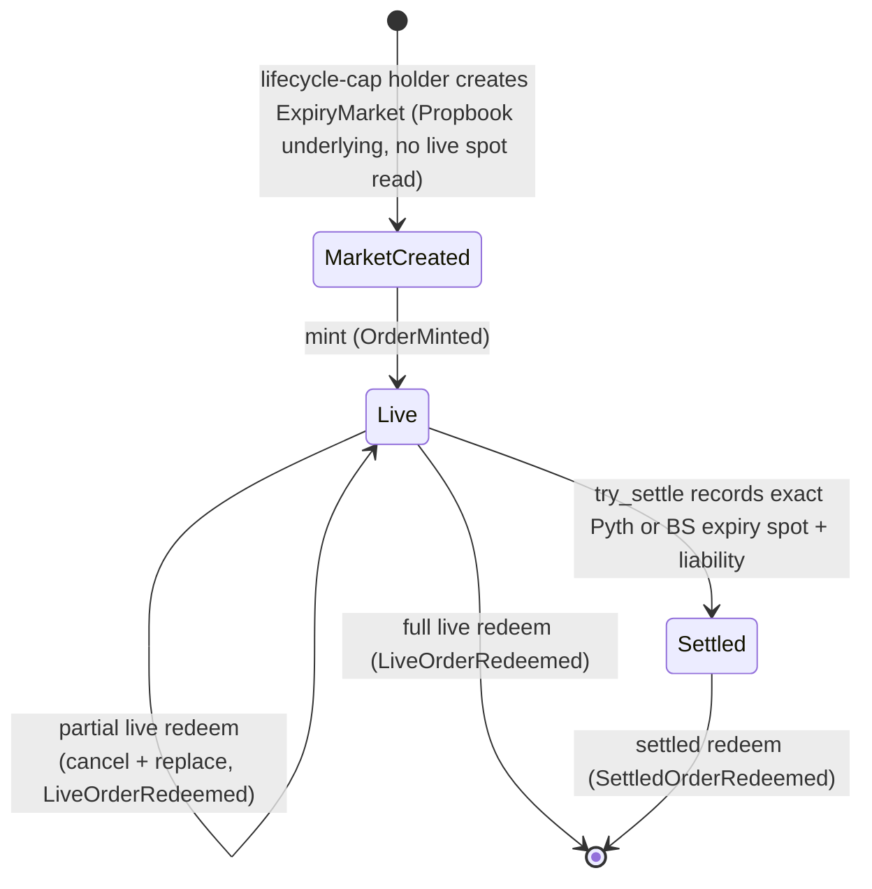

# Overview

Predict is an on-chain protocol for European cash-settled binary options (digitals) on the Sui blockchain. Trading is organized into independent per-expiry markets: each market settles once, at one timestamp, against one price feed, and every position is a range digital — a contract that pays a fixed notional if the feed's price lands at expiry inside a chosen strike range, and zero otherwise. Every position is 1x — quantity is the notional, quantity is the maximum payout — and a single LP-backed pool writes every contract.

This page gives the whole mental model fast and routes onward. For one-line technical definitions of every term, see the [glossary](./glossary.md); for the trust assumptions and known limitations behind every claim here, read [risks](./risks.md).

## What Predict is

A Predict position is a **European cash-or-nothing binary option** on whether the settlement price lands inside a strike range `(lower, higher]` — a *range digital*, equivalent to a digital call spread (long a digital call struck at `lower`, short one struck at `higher`); the open-ended ranges are plain digital calls and puts. A plain (1x) position pays its full `quantity` — its notional — if settlement is inside the range and `0` otherwise. Its mark value before settlement is the range's model probability times its notional: for a digital, the price per unit notional *is* the risk-neutral probability of the event.

### Strikes are absolute integer ticks

There is **one canonical strike representation across the whole protocol — absolute integer ticks**. A strike is an integer `tick`, and its raw price is always `raw_strike = tick × tick_size`, where `tick_size` is fixed per expiry. There is no second representation: no centered grid and no boundary indices. The public API, order IDs, the payout tree, and the exposure index all operate over ticks; raw strikes are reconstructed only at the pricing/settlement boundary. A range is the tick pair `(lower_tick, higher_tick)`, carried directly at public entrypoints and events; the open-ended ends are the two sentinel ticks (`lower_tick = 0` is `−∞`, `higher_tick = pos_inf_tick` is `+∞`). Only the durable order ID packs the two ticks into one integer.

Because the tick domain is absolute and fixed in advance, **market creation reads no live spot** — a new expiry market just records its `tick_size` and snapshots the future-market policy from `ProtocolConfig` (the `MarketCreated` event carries `tick_size`, `max_expiry_allocation`, `initial_expiry_cash`, and the immutable policy snapshot, not a min/max strike). The pricing math saturates instead of aborting in the deep tails: a strike far below the forward prices to ~1.0 and far above to 0, so no live quote ever fails on an extreme strike.

### Prices come from external feeds

Live prices come from standalone, Predict-unaware feeds in the **propbook** package. A `PythFeed` holds one global source-native spot payload per Pyth Lazer feed id, updated permissionlessly from a verified Lazer payload and exposed through a normalized spot read. Block Scholes data is split into permanent source-level spot, forward, and SVI feeds; the forward and SVI feeds store per-expiry rows. Predict builds a forward and differences each range's probability off the SVI curve. Which source builds that forward is an admin setting (`use_pyth_spot_for_forward`, default on): with it on, a fresh usable normalized Pyth spot gives `forward = spot × basis(expiry)` and an absent, unusable, or stale Pyth spot falls back to the BS forward feed; with it off, the BS forward feed is always used directly. BS spot/forward must be fresh under the price window, and SVI must be fresh under its looser window. Propbook stores source facts; Predict validates the pricing-safe envelope at read time.

### Settlement is explicit

Terminal settlement is one permissionless public transition, `expiry_market::try_settle`. It checks the exact normalized Pyth spot at the market expiry first; if Pyth is unavailable at least 30 seconds after expiry, it may use the exact Block Scholes minute-boundary spot. The transition immediately caches the terminal price and corresponding payout liability, while `MarketSettled` records the source. Settled redeem, pool cash rebalance, and flush valuation consume recorded state without reading an oracle. If neither exact source is usable, `try_settle` returns false, standalone rebalance moves no cash, and any live-pricing path past expiry aborts rather than inventing a substitute mark (see [risks](./risks.md)).

The pool (`PoolVault`) is the counterparty. Liquidity providers deposit DUSDC and receive PLP shares; the pool funds each active expiry's working cash and absorbs trader P&L. Each expiry holds its own cash and must always cover its payout liability.

## Core on-chain objects

| Object | Role | Sharing |
| --- | --- | --- |
| `Registry` | Feed/expiry uniqueness, cadence deployment configs, pause + lifecycle caps, creation entrypoints (versioning lives on `ProtocolConfig.version_watermark`) | shared |
| `ProtocolConfig` | Admin-tunable config, `trading_paused`, the valuation lock, per-expiry runtime controls | shared |
| `PoolVault` | Idle + reserve DUSDC, PLP treasury cap, expiry ledger, the LP supply/withdraw queues | shared |
| `ExpiryMarket` | One expiry's tick grid, exposure book, embedded `ExpiryCash` DUSDC, exact `current_nav`, cleanup | shared, one per expiry |
| `AccountWrapper` / `Account` | Account-package custody plus Predict app data: positions, builder attribution | shared wrapper |
| `BuilderCode` | Accrues and claims builder fees for order-flow routers | derived shared |

Oracle data is **not** a Predict object: the `PythFeed`, `BlockScholesValueStore`, and `BlockScholesSVIStore` shared objects are owned by the separate `propbook` package. Predict markets store a Propbook underlying ID; live pricing validates passed oracle objects against Propbook's current canonical bindings for that underlying and then reads the expiry's forward and SVI series from the stores.

Capabilities are owned objects: `AdminCap` (global policy, plus genesis-bootstrapping the pool), `MarketLifecycleCap` (market creation and the sole authority to start the pool flush), and `PauseCap` (one-way emergency brake). User/account authority comes from the account package: owner `Auth` gates live trading and direct account actions, while Predict app-auth gates permissionless settled automation. Block Scholes updates are submitted through propbook, not Predict. Detail in [architecture](./design/architecture.md).

## Market and position lifecycle

An admin registers a Propbook underlying, and a lifecycle-cap holder creates one `ExpiryMarket` per underlying and expiry. The market opens with zero cash; pool capital enters only later through the rebalancer during a flush. A position moves through mint, optional live redeem, and terminal settlement. Each transition emits one order-domain event.

```mermaid
stateDiagram-v2
  [*] --> MarketCreated: lifecycle-cap holder creates ExpiryMarket (Propbook underlying, no live spot read)
  MarketCreated --> Live: mint (OrderMinted)
  Live --> Live: partial live redeem<br/>(cancel + replace, LiveOrderRedeemed)
  Live --> [*]: full live redeem (LiveOrderRedeemed)
  Live --> Settled: try_settle records exact Pyth or BS expiry spot + liability
  Settled --> [*]: settled redeem (SettledOrderRedeemed)
```

- **Mint** is the pool writing a new contract to the buyer: it creates a live position, quotes the entry probability (the premium per unit notional), derives the net premium, and settles payment (net premium + trading fee + optional builder fee + optional congestion surcharge). The buyer's range is the tick pair `(lower_tick, higher_tick)`.
- **Live redeem** is a sell-to-close at the current mark: it closes some or all of a position at the current range probability. A partial close removes the closed slice from the payout index and creates a replacement order with the remaining quantity.
- **Settlement and settled redeem** are the terminal, irreversible transition — paying a winning (in-range) position its full `quantity` and zero otherwise. Anyone may call `try_settle`; ordinary settled consumers require that transition to have succeeded already.
- **Settled sweep** deactivates a settled market from the pool's active set, returns free LP cash to idle, and materializes terminal profit.

## Liquidity is asynchronous

Liquidity providers do not transact against a live pool price. They **queue** requests: `request_supply` escrows DUSDC with a `min_plp_out` fill limit and `request_withdraw` escrows PLP with a `min_dusdc_out` fill limit, each routed through the LP's account and cancellable while pending, except during an in-flight flush (the frozen mark is on-chain readable mid-flush, so a cancel then would be a free look at a stale price). A periodic **flush** then values the whole pool at one snapshot instant and fills the queued heads submitted before that instant at that single frozen mark. A head whose quote misses its limit is refunded by that same flush and the drain moves on, exactly as a non-executable head is, so every head is resolved when it is reached — the attempt count behind that is admin-tunable and ships at one; withdrawals can still carry when idle is insufficient. The flush is staged — an atomic snapshot transaction (`start_pool_valuation` → one `snapshot_expiry_pricer` per active market → `seal_valuation_snapshot`) freezes every market's pricer at one instant, then one `value_expiry` per market per transaction folds each market's snapshot-instant NAV, then `finish_flush` drains the queues — and it is **privileged**: only a market deployer's `MarketLifecycleCap` may start one, so the mark cannot be timed by an adversary against a manipulated oracle. Trading never waits on a flush: trades on a snapshotted market record their book deltas, and its valuation rolls them back to the snapshot instant. The mark itself, `pool_nav = idle + Σ snapshot_nav`, is **exact** (each `current_nav` is the true per-expiry recoverable value, with no approximation band), so the one mark that prices both supplies and withdrawals equals true NAV in both directions. Fills are delivered to each account's receive address through the balance accumulator and absorbed lazily on the account's next capital op. See [liquidity and NAV](./concepts/liquidity-and-nav.md).

## Guarantees in plain language

These properties are designed in and hold by construction; their boundaries are detailed in [risks](./risks.md).

- **Cash always backs payouts.** Each expiry's `ExpiryCash` enforces, on every cash movement, that its balance is at least its payout liability plus its inventory-impact escrow. Surplus above that line is the only cash the pool may sweep. An expiry can always pay its winners.
- **Monetary math rounds in the protocol's favor.** Payouts, live redeems, and the per-expiry backing reserve use reserve-favoring rounding, so sub-unit dust accrues to the protocol rather than against its solvency. Reserve and payout reads derive from the same quantity atom, so a payout can never exceed the cash reserved to back it.
- **The LP mark is exact and unforgeable.** A flush prices PLP supply and withdraw at one mark equal to the pool's exact recoverable NAV, and only a privileged operator can start a flush. A supplier can never over-mint and dilute incumbents, and the mark cannot be timed against a manipulated oracle.
- **Live valuation is exact.** Each market's `current_nav` is the payout tree's boundary-linear walk (`Σ quantity × P(range)`), with no per-order correction needed, since every position is worth exactly its quantity times its range probability. See [risks](./risks.md).

## Where to go next

**Concepts — how the protocol works:**

- [Glossary](./glossary.md) — every term technically defined and mapped to its standard options / structured-product name and code identifier.
- [Markets and positions](./concepts/markets-and-positions.md) — per-expiry markets, the absolute tick grid and ±infinity sentinels, what an order is, and the full lifecycle.
- [Pricing and oracles](./concepts/pricing-and-oracles.md) — the propbook Pyth and Block Scholes feeds, range-probability derivation, freshness, and the forward fallback.
- [Fees and rebates](./concepts/fees-and-rebates.md) — the variance-based trading fee, expiry ramp, builder fee, congestion surcharge, and the isolated inventory-impact charge and rebate.
- [Liquidity and NAV](./concepts/liquidity-and-nav.md) — the pool, the async supply/withdraw queues, the privileged flush, exact `current_nav`, pool↔expiry cash flow, and profit materialization.

**Design — how the protocol is built:**

- [Architecture](./design/architecture.md) — the on-chain objects, DUSDC custody layers, the capability and authorization model, the binding mesh, and version gating.
- [Configuration](./design/configuration.md) — the tunable-vs-constant split, template snapshots versus live configs, and who can change what.

**Risks:**

- [Risks and limitations](./risks.md) — the privileged-flush trust assumption, exact timestamp settlement liveness, propbook feed trust, LP risk, rounding, and pre-deployment maturity caveats.
