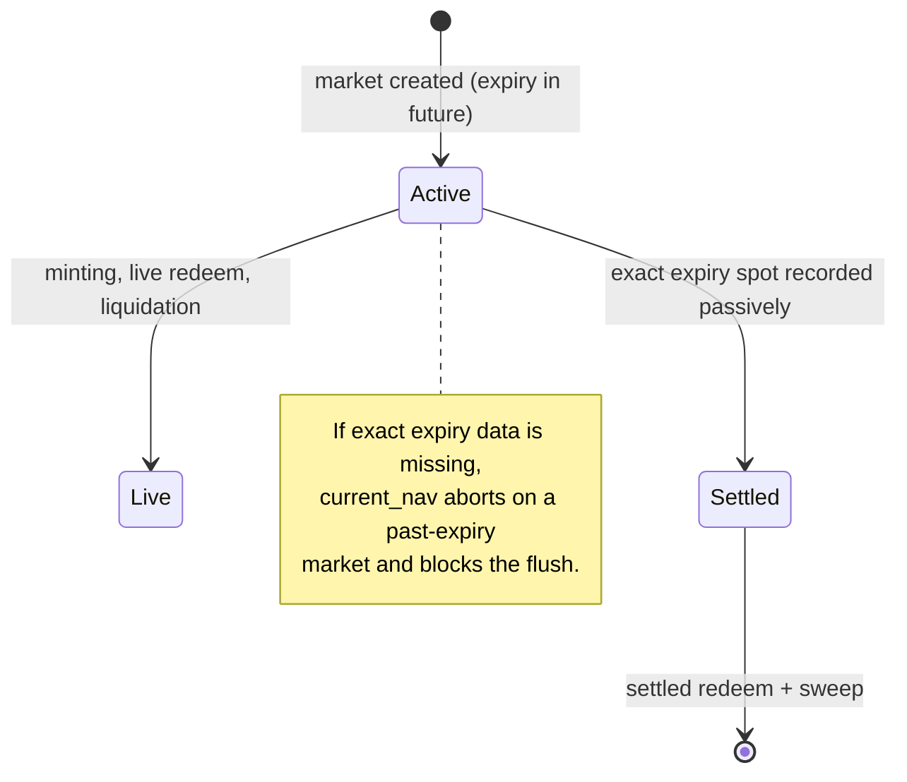

# Risks and limitations

This page is an honest account of the trust assumptions, economic risks, and known limitations of the Predict protocol. It is intended for anyone deciding whether and how to use the protocol — traders taking leveraged range positions, liquidity providers supplying the pool, and evaluators reading the contracts. Predict is in development and not yet deployed; some behaviour described here is still changing, and several limitations are properties of the current implementation rather than permanent design choices. Where a value is tunable, the mechanism is described and the magnitude is governed by [configuration](./design/configuration.md).

For the mechanisms this page evaluates, see [pricing and oracles](./concepts/pricing-and-oracles.md), [leverage and the floor](./concepts/leverage-and-floor.md), [liquidation](./concepts/liquidation.md), [liquidity and NAV](./concepts/liquidity-and-nav.md), and the object/capability model in [architecture](./design/architecture.md).

## Trust model at a glance

| Actor / input | What it controls | What it cannot do |
| --- | --- | --- |
| Pyth Lazer feed (propbook `PythFeed`) | The spot price live pricing is built on | Cannot write Block Scholes data; missing/unavailable source fields abort during decode; non-advancing or future timestamps are no-ops; absent, stale, or unusable normalized spot goes unused (falls back to the surface forward) |
| Block Scholes source (propbook `BlockScholesFeed`) | The volatility surface (SVI) and the spot/forward basis used to price every range | Cannot move custody, mint/redeem, create markets, or start a flush; stale, missing, or Predict-unsafe surfaces abort at live pricing |
| Market-lifecycle operator (`MarketLifecycleCap`) | Creating future expiry markets and starting the pool flush (the sole flush authority) | Cannot write prices or any oracle data, move custody, or mint/redeem; admin-revocable on the registry allowlist |
| `AdminCap` holder | Fees, LTV, freshness thresholds, cadence allocation caps, profit share, pause switches, underlying registration, lifecycle-cap minting, and genesis-bootstrapping the pool | Cannot touch a holder's position, a manager's balance, or pool custody directly |
| Flush starter (`MarketLifecycleCap`) | When the pool is valued and the LP queues drain, i.e. the oracle state at which PLP is priced | Cannot set the mark to anything but the pool's exact NAV at that instant, or fill at an off-mark price |
| `PauseCap` holder | Emergency one-way pauses: disable a version, pause global trading, pause one market's minting | Cannot unpause anything, change config, or move funds |
| Liquidation keepers | Trigger permissionless, bounded liquidation passes | Cannot liquidate an order that is above its liquidation threshold |

The remainder of this page expands each row and adds the rounding, settlement, and maturity caveats.

## Oracle trust

Every live price in Predict is built from two external **propbook** feeds — objects in a separate, Predict-unaware package — and both are trusted to different degrees.

**Pyth Lazer spot.** A `PythFeed` stores the latest source-native payload from one Pyth Lazer feed, updated permissionlessly from a verified Lazer payload. The feed aborts on missing/unavailable source fields, while future, zero, stale, or duplicate source timestamps are no-ops. Its normalized spot read returns `none` if the stored source value cannot be represented as a positive normalized spot. These checks reject malformed payloads and replayed latest-state updates, but they do not — and cannot — judge whether the price Pyth published is *correct*. If the underlying Lazer feed is manipulated, halted, or returns a thin print, Predict consumes whatever it delivers while the normalized spot is fresh and usable. The structural defence is freshness and fallback: when the Pyth spot is absent, stale, or unusable, live pricing stops using it and falls back to the Block Scholes surface forward rather than serving an old or non-positive spot.

**Block Scholes volatility surface.** Range probabilities are not read directly from spot. They come from a pricing curve built on a forward and an SVI volatility surface, both written to a `BlockScholesFeed` through Propbook. This is the protocol's most concentrated trust assumption: the SVI parameters and the forward shape the probability of every range, and therefore every entry price, live NAV mark, and liquidation decision. Propbook stores source-native BS payloads; Predict applies its pricing-safe envelope at read time — positive spot and forward, bounded basis, bounded SVI inputs, `|rho| <= 1`, and sigma inside Predict's accepted range. A correct-but-adversarial source can still steer prices anywhere that passes those consumer-side checks; until the real BS verifier replaces the current stub verifier, permissionless BS updates are not production-safe.

**Staleness only mitigates, it does not authenticate.** Freshness windows guarantee Predict acts on recent data, not on honest data. A stale surface blocks pricing entirely; a stale Pyth spot merely switches the forward source. Neither check can detect a value that is recent and wrong.

**The live mark switches forward sources at the Pyth staleness boundary.** While the Pyth spot is fresh, live pricing anchors the forward to it (`spot × basis`); the moment it crosses the staleness threshold, pricing falls back to the Block Scholes surface forward. That switch is discontinuous and externally observable, so a trader can time a mint or redeem to whichever side of the boundary gives the more favorable mark. The jump is bounded by the current spot-vs-surface-forward divergence, Predict's pricing-safe basis envelope, and the trade fee on both legs; it is accepted behavior, not a defect.

## The privileged flush

The single most important LP-facing trust assumption is **who decides when the pool is valued**. PLP is not priced against a continuously-published pool price; it is priced only during a **flush**, and a flush can be started only by a market deployer (`MarketLifecycleCap`) — a revocable cap, not the root `AdminCap`. It is intended to be a cron-driven operation.

- **The flush is privileged by design.** Making it permissionless would let anyone time the valuation to a favourable oracle state and capture mispriced fills. Gating it behind the operator caps closes that timing attack. The cost is a trust assumption: the flush starter chooses the oracle snapshot at which every queued supply and withdraw is priced, so the **cap-holders must not manipulate the live oracle around a flush**. They cannot set the mark to anything but the pool's exact NAV at that instant — the mark is `idle + Σ current_nav` and each `current_nav` is exact — but they do choose the instant.
- **A single exact mark prices both directions.** Because the same `pool_nav` prices supply and withdraw, it must equal true NAV in both directions or one side is systematically advantaged. It does: each market's `current_nav` is the exact recoverable value (free cash minus the exact per-order live liability), with no conservative band, so a supplier priced at the mark mints fair shares (never over-minting to dilute incumbents) and a withdrawer is paid fair value. The exactness is what makes the dual-use mark safe; there is no approximation knob to mis-set.
- **Fills are FIFO and isolated.** The flush fills supplies first, then withdrawals FIFO until idle is dry, each queue bounded by its own operator-supplied budget (independent, so a supply backlog can't starve withdrawals), with per-request failure isolation (a request that prices to dust is refunded its escrow rather than reverting the flush). A withdrawer can be deferred to a later flush if idle is exhausted, and an LP can cancel a still-pending request at any time before it fills.
- **Liveness depends on the operator running flushes.** Because LP fills happen only at a flush, an operator that stops flushing freezes supply and withdraw fills (escrowed funds are safe and cancellable, but not filled). Flush cadence is therefore an operator responsibility, and an LP's effective exit latency is one flush interval.

## Settlement exact-data liveness

Terminal settlement is implemented as a passive transition inside normal flows. When a settled branch is needed, Predict validates the supplied Propbook Pyth feed and reads the exact normalized spot at the market's expiry timestamp. If that exact timestamp row exists, the market settles, settled redeem can pay winners, and the settled sweep can deactivate the market from pool valuation.

The remaining risk is liveness, not payout solvency:

- **Exact timestamp data is required.** If Propbook has no normalized Pyth spot exactly at the expiry timestamp, the market remains unsettled. A past-expiry market cannot be live-valued, so a flush that still has that market in the active set aborts until the exact timestamp data is inserted and a normal flow passively settles it.
- **No substitute mark is safe.** There is no solvency-safe NAV for a past-expiry-but-unsettled market: the one PLP mark prices both supply and withdraw, so it must equal a settlement-dependent true value. Valuing at zero would dilute incumbents on supply; valuing at free cash would overpay withdrawals.
- **Expiry is grid-aligned on-chain, and the settling print is exact.** Settlement is an exact whole-millisecond lookup: `ensure_settled` reads the Pyth observation keyed at exactly `market.expiry`, and `pyth_feed::insert_at` accepts only a verified Lazer print whose signed publisher timestamp is exactly that millisecond — a sub-millisecond or off-grid timestamp is rejected (`EInsertTimestampNotExactMillisecond`), and the key is derived from the signed payload, so no keeper can forge or round it onto the grid. `market_manager::record_expiry_creation` requires each expiry to land on its cadence period (`expiry % cadence_period_ms == 0`), and every supported cadence period is a multiple of `resolution_period_ms!()` (a 60s grid). The off-chain resolution relayer sources that exact key from **Pyth Lazer's dedicated resolution endpoints, which publish verified prints at exact, grid-aligned timestamps**. The settling row for an on-grid expiry is thus always producible (cadence-period alignment makes the key representable, and the resolution endpoints supply a print at exactly that microsecond); an off-grid expiry — which could never receive a print at its exact millisecond and would block the flush permanently — is rejected at creation rather than left as an operator footgun.
- **Bounded, keeper-managed window.** A market is unsettled only between its expiry and the next resolution insert (seconds at the grid cadence). The flush keeper retries and does not flush while an active market is in that window, so the abort is a transient retry, not a stuck pool. Pool-wide flush liveness therefore depends on the resolution relayer staying live: a prolonged relayer outage blocks LP supply/withdraw for the whole vault until it recovers.

## Admin powers

A single `AdminCap` (created at package init and transferred to the deployer, intended to be a multisig) governs the protocol's economic parameters and lifecycle. Holders should understand both what it can and what it cannot do.

The `AdminCap` can:

- tune fee parameters and the protocol's share of expiry profit (`protocol_reserve_profit_share`);
- set the liquidation LTV and floor schedule inputs that determine when leveraged positions are liquidated;
- set the freshness thresholds that gate the Pyth spot and the Block Scholes surface;
- set future-market cadence terms, including tick size, allocation cap, and deployment window;
- mint and revoke `PauseCap`s, enable and disable package versions, and register Propbook underlyings Predict can build markets on;
- mint and revoke the `MarketLifecycleCap`s that gate market creation and starting a flush as a deployer;
- **start a pool flush**, choosing the oracle snapshot at which PLP is priced;

The `AdminCap` cannot:

- move a holder's position, a manager's balance, or pool custody — there is no admin path that splits, transfers, or seizes user funds or `PoolVault` balances; admin authority is over *parameters and lifecycle*, not over *custody*;
- price a flush at anything but the pool's exact NAV — it chooses *when* a flush runs, not the mark;
- write or alter oracle data — the propbook feeds are a separate package and Predict's `AdminCap` is not a Propbook feed/update authority.

`PauseCap` is a deliberately narrow emergency key: admin mints it for trusted operators, and it can disable a package version, force global trading to paused, or pause one market's minting. Every `PauseCap` action is **one-way** — only the `AdminCap` can re-enable a version or unpause trading/minting. This means a misconfigured or compromised `PauseCap` can halt new risk creation (a denial-of-service on minting/trading) but cannot unlock anything, change parameters, or move funds. Pausing blocks new risk; exits, valuation, and the flush are governed by the separate valuation lock, not by the trading pause.

The honest framing: admin trust is real but bounded. The funds-custody boundary is enforced by the module structure (balances live in modules that expose no admin transfer path), while economic-parameter trust and flush-timing trust are open-ended — an admin can make the protocol uneconomic through bad parameter choices, and can choose the oracle instant at which LPs are priced, even though it can never directly take a position or a balance, nor set the mark off true NAV.

## Holder and leverage risk

Leverage in Predict is not a separate loan; it is a deterministic, rising **floor** baked into the contract's terms (see [leverage and the floor](./concepts/leverage-and-floor.md)). A leveraged order's live value is its range probability value minus a floor value, clamped at zero. The floor is `floor_shares × floor_index`, and the floor index rises over time toward its terminal value over a fixed pre-expiry window. The risks that follow from this:

- **The floor rises, so a position can decay even if the price does not move against it.** As the floor index increases, the deduction from live value grows. A position that is comfortably above water early can drift below its liquidation threshold purely through the passage of time.
- **Liquidation can take the position to zero.** A leveraged order is liquidatable once its live gross value falls to or below `floor_amount / liquidation_ltv` for the current floor index. When that condition is met the order is removed from the live indexes and the holder's recoverable value for that order is effectively wiped — leverage is full-recourse to the order's own value, capped at it. The floor can offset only that order's value or payout, never more.
- **Liquidation is permissionless and bounded.** Anyone can run a liquidation pass; each pass is bounded by a per-transaction candidate budget. This is good for fairness (no privileged liquidator) but it means liquidation is only as timely as the keepers and flows that trigger it — see [Bounded liquidation](#bounded-liquidation-and-keeper-dependence).
- **Higher leverage is gated by entry price.** The protocol restricts how much leverage a low-probability range may take: below one price threshold only 1x is allowed, below a second threshold leverage is capped at 2x, and the discrete allowed set is 1x, 1.5x, 2x, 2.5x, and 3x. This caps the most fragile combinations but does not remove time-decay or liquidation risk from any leveraged tier. At creation, an order must satisfy `terminal_floor < quantity × liquidation_ltv` — the floor evaluated at expiry must be strictly below the order's quantity scaled by the liquidation LTV — so a leveraged order can never be created already at or beyond its own liquidation point.

A 1x order is the special case where the floor is zero: it carries no liquidation risk and pays the plain range outcome.

## Liquidity-provider (PLP) risk

PLP holders supply DUSDC to `PoolVault` and receive shares whose value tracks pool net asset value (NAV). The pool is the counterparty to traders, so LP risk is fundamentally directional and path-dependent. LP actions are **asynchronous**: a supply or withdraw is a queued, escrowed, cancellable request that fills only at the next flush, priced at one exact pool mark (see [The privileged flush](#the-privileged-flush)).

- **The pool is effectively short trader payoffs.** Pool NAV includes the current value of every open position as a *liability*. When traders' positions gain value (the market moves their way), pool NAV falls; when they lose value, pool NAV rises. Fees accrue to LPs over time, but mark-to-market losses on open trader positions can accrue at the same time, so growing fee income does not guarantee a rising NAV. Realized outcomes are path-dependent: an LP who supplies and withdraws across a period of adverse marks can lose principal even while cumulative fees were positive.
- **Fills are deferred and priced at the operator's chosen instant.** Because the flush is privileged and periodic, an LP does not control the moment its request is priced — the operator does. Escrowed funds are safe and cancellable until filled, but the effective entry/exit price is the pool NAV at whichever flush fills the request. An LP supplying or withdrawing is implicitly trusting the operator to flush on a sane cadence and not around a manipulated oracle.
- **Live NAV is exact and unconditional on book health.** Each market's `current_nav` subtracts the leveraged book's floor correction from the range value **per order**, capped at each order's own range value (`min(range_value, floor)`), so an underwater leveraged order nets to exactly zero rather than overstating value. The mark is therefore the exact recoverable value in every book state — it needs no valuation-time liquidation pass and does not depend on keepers having cleared under-floor orders first. The remaining LP-facing dependence is on the *operator running flushes* and on the *oracle feeds being fresh* at the flush instant, not on liquidation throughput keeping the mark honest.
- **Valuation requires valuing every active market.** A flush must process each active expiry exactly once; it aborts if any active market is skipped or cannot be valued. This means LP fills depend on every active market's feeds being fresh enough to value at the flush instant — a stale surface on any one active market blocks the whole flush. It is also the mechanism behind [settlement exact-data liveness](#settlement-exact-data-liveness): a past-expiry-but-unsettled active market aborts the flush outright.
- **The protocol-profit exclusion can floor LP value at zero.** The pool excludes the protocol's not-yet-materialized profit share (the unmaterialized-profit exclusion) — plus any already-materialized cut not yet moved to the reserve (carried in `pending_protocol_profit`) — from PLP value. The realized side of that exclusion is sticky — it does not shrink when LPs withdraw against a high active mark — so if active NAV later collapses, the held-out total can exceed gross pool value. Both subtractions are clamped, so this cannot abort the flush; the consequence is that LP-attributable value reads as zero (withdrawals pay nothing, supply mints nothing) until marks recover. A one-time genesis lock (`plp::lock_capital`, operator-only) mints a permanent minimum-liquidity slug of PLP that is held by the pool and never withdrawable, so `total_supply` stays above the withdraw dust band for the life of the pool. This is a structural on-chain guarantee (not an operational one): supply/withdraw cannot be reached before the lock, and a full LP exit can never drive `total_supply` to zero, so the residual-idle-dust re-bootstrap brick is unreachable and the dust simply accrues to the locked position.
- **Protocol profit-taking is one-directional across expiries.** When an expiry materializes terminal profit, prior terminal losses are netted first — but the netting only looks backward. A profitable expiry that resolves before a later loss-making one pays the protocol its full share, and that share is not clawed back against the later loss, so across a sequence of expiries the protocol can end up over-taken relative to aggregate P&L. The protocol's reserve is also **write-only by design**: there is no withdrawal path in the current package; any future use (such as a buy-and-burn or a solvency backstop) would arrive via a package upgrade.
- **Pool cash funded into live markets is not directly withdrawable.** DUSDC sent into an expiry backs that market's reserve and returns to idle only through rebalancing sweeps or settlement. The rebalancer tops each active market toward its reserve target during every flush, and a flush always runs before withdrawals are paid, so an exit cannot front-run the refill of a live market. LPs may withdraw only against whatever idle remains after that rebalance; a withdrawal larger than the available idle is deferred or partially filled by the FIFO drain.
- **PLP supply and withdraw carry no fee, and there is no valuation halt gate.** Both sides price at the one exact mark, so there is no uncertainty band to charge for and nothing to attenuate — the protocol deliberately ships without any stress brake on exits, and exits stay live in every market state. This is safe precisely because the mark is *exact* rather than approximate: a withdrawer is paid exact recoverable value, never an overstated slice, so a withdrawing LP cannot extract value from the LPs who stay. Trader payouts are separately backed by each expiry's cash reserve, so an LP exit is never a solvency event for holders. (An earlier design priced an uncertainty-band withdraw fee against approximate NAV; both the band and the fee were removed with the exact-NAV rework.)
- **Reward incentives are outside the pool.** The current `PoolVault` holds no LP-owned SUI/DEEP incentive balance and reads no incentive-price oracle. DEEP held by the vault is custodial trading stake for manager benefits, not PLP capital.
- **DEEP staking is not LP capital and is freely withdrawable.** Manager-staked DEEP is held in custody for trading benefits but is excluded from PLP redemption; it can be unstaked at any time (both active and inactive amounts) with no penalty.

## Rounding and dust

Predict's monetary math rounds down by convention, and the rounding direction is chosen so the protocol — not the user, and not the pool's solvency — absorbs sub-unit dust.

- **Payouts and live redeems round down; the holder eats at most one unit (ulp).** A live redeem deducts a round-down floor amount with a saturating floor at zero, and the settled payout is `quantity − floor(floor_shares × terminal_floor_index)`. The winner can lose at most one fixed-point unit to rounding.
- **The exact live NAV rounds the floor correction toward a higher liability.** `current_nav` is exact per order; where rounding is unavoidable it is taken so that one unit of fixed-point dust never makes the mark overstate recoverable value. The mark biases toward the protocol/incumbent LPs, never toward an over-payment on withdraw.
- **Reserved backing is computed bit-exactly so payouts never exceed it.** Live-index terms for an order are recomputed with the same round-down formulas at mint and partial close, so the reserve seeded for an order equals what is later recomputed. A partial close removes the full order's live-index terms and reinserts the survivor's exact terms specifically to avoid leaving the reserve one unit short (round-down multiplication is sub-additive over the floor-share split). The net effect is that a payout can never exceed the cash reserved to back it; rounding error is biased toward the protocol retaining dust, not toward over-paying.

The practical takeaway: dust accrues to the protocol, never against solvency. Users should expect occasional one-unit shortfalls in their favour-rounded amounts, never one-unit shortfalls in backing.

## Cash-backing invariant

Predict enforces solvency in two layers — one per expiry, one across the pool.

**Per expiry.** Each expiry holds its own DUSDC in `ExpiryCash`, and the invariant the protocol maintains is that an expiry's cash always covers its **payout liability plus its unresolved trading-loss rebate reserve**. For a live market the payout liability is a **settlement floor plus a liquidity buffer**. The floor is the maximum summed payout at any *single* settlement price (`max_live_backing`); because exactly one settlement price resolves a market and ranges that share no price can never all win together, the floor alone guarantees that **every winning position is paid in full at settlement** — a structural guarantee, not a statistical one. The buffer is a configured fraction (`backing_buffer_lambda`, default 25%) of the gap between that floor and the sum of every open order's maximum live payout; it funds **early** (pre-settlement) exits of positions that do not overlap the book's worst-case price point. Early exits are therefore not unconditionally guaranteed in full: a live redeem that would push cash below the reserve aborts, and the holder can close a smaller quantity now, retry after the next rebalance or any offsetting flow, and always collects the full payout at settlement. Closing a position releases that position's own share of the buffer, so one trader's exit cannot consume the liquidity backing everyone else's. Setting the buffer fraction to 1.0 restores the fully self-contained reserve in which every position can be live-redeemed at its own peak, in any order. Both terms are read from maintained aggregates (no runtime scan or clock), and the reserve is conservative because it uses each order's open-index floor (its largest possible future live payout). Surplus above the required amount is the only cash the pool may sweep back, and the rebalancer keeps a buffer above the requirement plus a fixed cash floor.

**Across the pool.** A per-expiry allocation cap, snapshotted from cadence config when the market is created, bounds the LP capital a single expiry can absorb. It is checked on every funding move. The pool holds **no standing idle earmark** for live markets: each market's own cash covers its reserve, so a market that never receives another top-up still pays every settlement winner in full — solvency is self-contained per expiry at the floor. The rebalancer tops markets up toward their reserve target during every flush, and a flush (including every market's top-up) always runs **before** an LP withdrawal pays out, so exits cannot front-run the refill of a live market.

Three limitations follow:

- The per-expiry reserve is conservative (it uses each order's open-index floor), so an expiry may hold more cash than its exact current liability requires.
- Backing is only as good as funding. A mint that would push an expiry's reserve above the cash it can hold is **rejected** rather than admitted-and-topped-up-later; opening new risk depends on the pool having pre-positioned enough cash within the per-expiry cap and idle liquidity, which is itself refilled only on a flush.
- Early-exit liveness is bounded by the buffer. A live redeem that would push the expiry's cash below its reserve aborts (`EInsufficientCash`); the holder can close a smaller quantity, retry after the next rebalance or offsetting flow. An adversary cannot extract pool principal through exit sequencing (every redemption pays mark value the trader already owned, minus fees), but exit liquidity in a stressed market is first-come-first-served until the next refill.

## Bounded liquidation and keeper dependence

Liquidation passes are bounded by a per-transaction candidate budget: each call selects at most `budget` candidates and liquidates those that are under floor. There is no unbounded sweep. This keeps any single transaction's gas predictable, but it means **the protocol relies on keepers and ordinary flows to keep the book healthy**:

- Liquidation runs only as an inline bounded pass before each mint and live redeem (`trade_liquidation_budget`); there is no separate valuation-time pass. The exact `current_nav` does not require the book to be swept first — an underwater order nets to zero per-order — so a lagging sweep delays *clearing exhausted positions*, not the correctness of the LP mark.
- Liquidation is permissionless, which is the right incentive design (no privileged liquidator can be bribed or censored), but it transfers timeliness risk to whoever runs the passes. In a stress scenario with many simultaneously-decaying leveraged orders, liquidation throughput is whatever the keepers collectively supply, multiplied by the budget per pass.
- **Trading-loss rebates are keeper-resolved.** Rebate claims are permissionless by design so a keeper can sweep every manager's settled rebate. Two consequences: if the sweep stops, owed rebate cash sits escrowed inside expiries (safe, but invisible to pool NAV) until it resumes; and a prompt sweep means the rebate resolves at whatever active stake the manager holds when the keeper claims — managers do not choose their claim timing.
- **Flush cadence is also an exit-liquidity lever.** The rebalancer that refills each market's reserve (and with it the early-exit buffer) runs inside the flush, and the flush is privileged. So unlike liquidation (permissionless), exit-buffer refill and LP fills are gated on the operator running flushes — see [The privileged flush](#the-privileged-flush).

The settlement-floor reserve is the cushion that makes this safe: the floor counts every open order's payout at each settlement price it can win, so a lagging liquidator does not by itself make the expiry under-backed — a position that should have been liquidated still has its (future) settlement payout covered, and removing it late can only release reserve. Because the per-order NAV correction already nets an exhausted order to zero, a lagging liquidator does not overstate the LP mark either; its only cost is leaving worthless orders in the live indexes until a later pass clears them.

## Maturity and limitations

Predict is pre-deployment software. Beyond the per-topic caveats above:

- **Settlement depends on exact Propbook timestamp data.** As above, a past-expiry market cannot be valued or swept until Propbook has the exact normalized Pyth spot at that expiry timestamp. Operators must ensure exact settlement inserts are available around expiry.
- **The interface is still changing.** Module boundaries, function signatures, events, and config shapes are not frozen. Integrations built against the current code should expect breaking changes. In particular, the off-chain indexer/server is not yet rewired for the current event set (new LP/flush events, `CadenceConfigUpdated`, the `(lower_tick, higher_tick)` fields on `OrderMinted`, `MarketCreated` carrying `propbook_underlying_id`, `tick_size`, and `max_expiry_allocation`, and the removed oracle events).
- **The package address is unset pre-deploy.** The indexer is wired to fail fast on an empty package address rather than silently index nothing; this is a development guard, not a runtime risk, but it reflects that the system has not yet been deployed end-to-end.
- **Liquidation flow test coverage is limited.** The bounded-liquidation and floor-decay paths are the most safety-critical and the least exercised. The NAV mark itself is exact regardless of sweep state, but the holder-facing knock-out flow (and the backing-buffer release when an order is removed) depends on this path, so its limited coverage is a real maturity risk until it is hardened.
- **Valuation quantity math has a documented u64 envelope.** The per-strike valuation accumulator multiplies quantity by strike price in u64: a maximum-size single mint overflows (and cleanly aborts) only at strikes above roughly $430k, and the aggregate valuation fold would need on the order of $123–184M of concentrated high-strike open interest in one expiry — far above normal cadence allocation caps — before it could abort valuation. Accepted and bounded by allocation caps rather than widened.

None of these are reasons the design is unsound; they are the difference between a designed protocol and an audited, deployed, battle-tested one. Anyone integrating before deployment should treat the economics as correct-by-design but unproven-in-production.

## Related reading

- [Pricing and oracles](./concepts/pricing-and-oracles.md) — how spot and the SVI surface form live prices, and the forward fallback.
- [Leverage and the floor](./concepts/leverage-and-floor.md) — the floor model behind holder/leverage risk.
- [Liquidation](./concepts/liquidation.md) — the trigger condition and what the holder receives.
- [Liquidity and NAV](./concepts/liquidity-and-nav.md) — the async queues, the privileged flush, and how pool NAV and PLP shares are computed.
- [Architecture](./design/architecture.md) — objects, capital ownership, and the capability model.
- [Configuration](./design/configuration.md) — every tunable value and who can change it.
