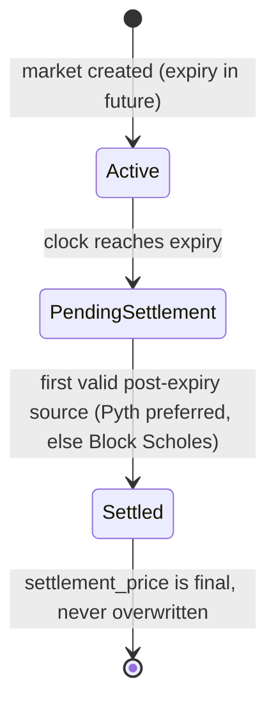

# Risks and limitations

This page is an honest account of the trust assumptions, economic risks, and known limitations of the Predict protocol. It is intended for anyone deciding whether and how to use the protocol — traders taking leveraged range positions, liquidity providers supplying the pool, and evaluators reading the contracts. Predict is in development and not yet deployed; some behaviour described here is still changing, and several limitations are properties of the current implementation rather than permanent design choices. Where a value is tunable, the mechanism is described and the magnitude is governed by [configuration](./design/configuration.md).

For the mechanisms this page evaluates, see [pricing and oracles](./concepts/pricing-and-oracles.md), [leverage and the floor](./concepts/leverage-and-floor.md), [liquidation](./concepts/liquidation.md), [liquidity and NAV](./concepts/liquidity-and-nav.md), and the object/capability model in [architecture](./design/architecture.md).

## Trust model at a glance

| Actor / input | What it controls | What it cannot do |
| --- | --- | --- |
| Pyth Lazer feed | The spot price every market and incentive valuation is built on, and the preferred settlement source | Cannot write Block Scholes data; rejected if stale, future-dated, zero, or negative |
| Block Scholes operator (`MarketOracleCap`) | The volatility surface (SVI) and the spot/forward basis used to price ranges; the fallback settlement source, and the cap that finalizes settlement | Cannot move custody, mint/redeem, push a price outside the bounded, deviation-checked write path, or settle before expiry or from a stale source |
| `AdminCap` holder | Fees, LTV, deviation/basis bounds, freshness thresholds, per-expiry funding caps, profit share, pause switches, market/feed/incentive creation | Cannot touch a holder's position, a manager's balance, or pool custody directly |
| `PauseCap` holder | Emergency one-way pauses: disable a version, pause global trading, pause one market's minting | Cannot unpause anything, change config, or move funds |
| Liquidation keepers | Trigger permissionless, bounded liquidation passes | Cannot liquidate an order that is above its liquidation threshold |

The remainder of this page expands each row and adds the rounding, settlement, and maturity caveats.

## Oracle trust

Every live price in Predict is built from two inputs, and both are trusted to different degrees.

**Pyth Lazer spot.** `PythSource` stores the latest normalized spot from one Pyth Lazer feed. An update is rejected if its decoded price is zero or negative, if its publisher timestamp is not strictly newer than the last accepted one, or if that timestamp is in the future relative to the on-chain clock. These checks reject stale, replayed, and future-dated updates, but they do not — and cannot — judge whether the price Pyth published is *correct*. If the underlying Lazer feed is manipulated, halted, or returns a thin/uncorroborated print, Predict consumes whatever it delivers. The protocol's only structural defence is freshness: pricing and settlement require the spot to be fresh within a configured window, and a feed that goes stale stops being usable rather than serving an old number.

**Block Scholes volatility surface.** Range probabilities are not read directly from spot. They come from a pricing curve built on a forward (spot × basis) and an SVI volatility surface, both written by a trusted off-chain operator holding a `MarketOracleCap`. This is the protocol's most concentrated trust assumption: the SVI parameters and the forward shape the probability of every range, and therefore every entry price, live NAV mark, and liquidation decision. The contracts constrain *how far* and *how fast* the operator can move these values — each price push must keep the basis within `[min_basis, max_basis]`, must not deviate from the previous spot or basis by more than the configured caps (the deviation cap is a fraction of the previous value), must advance the source timestamp, and must not be future-dated — but within those bounds the surface is the operator's to set. A correct-but-adversarial operator can still steer prices inside the allowed envelope; a compromised cap is bounded by these checks but not eliminated by them. The bounds themselves are admin-tunable (see [Admin powers](#admin-powers)), but each setter validates its input against a hard envelope in configuration, so a single bad admin call cannot widen the deviation or basis guards into a no-op.

**Staleness only mitigates, it does not authenticate.** Freshness windows guarantee Predict acts on recent data, not on honest data. A stale feed blocks pricing and (importantly) blocks the staleness-gated settlement source, but it cannot detect a value that is recent and wrong.

## Settlement

A market settles exactly once, from a single terminal price, and the outcome of each range is binary.

`MarketOracle` records settlement the first time a valid post-expiry source exists after the market enters pending-settlement state (the clock has passed `expiry`). It prefers the Pyth spot when that source is fresh and its source timestamp is strictly after expiry; otherwise it falls back to the Block Scholes spot under the same freshness-and-after-expiry test. Once `settlement_price` is set it is never overwritten, and the settlement source timestamp must be strictly after expiry. Consequences for users:

- **A single number decides everything.** Each open range pays `quantity` if the settlement price falls inside `(lower, higher]` and `0` otherwise (minus any leverage floor). There is no averaging, TWAP, or dispute window — the first valid post-expiry print is final.
- **The settlement source is one of two, with Pyth preferred.** Settlement can come from the trusted Block Scholes operator's spot when Pyth is unavailable. Because both paths drive the same terminal write and the privileged path is the fallback, a Pyth outage around expiry shifts the terminal price onto the operator, who is then trusted for the single number that resolves the market.
- **Settlement is gated on the operator's cap, and cannot be forced early or from a stale source.** Settlement is only recorded by a `MarketOracleCap` holder — either explicitly (the operator finalizes once a valid source exists) or implicitly inside the operator's own price push. Nobody can settle before expiry or with a stale source, and once recorded the price is immutable.

## Admin powers

A single `AdminCap` (created at package init and transferred to the deployer, intended to be a multisig) governs the protocol's economic parameters and lifecycle. Holders should understand both what it can and what it cannot do.

The `AdminCap` can:

- tune fee parameters and the protocol's share of expiry profit (`protocol_reserve_profit_share`);
- set the liquidation LTV and floor schedule inputs that determine when leveraged positions are liquidated;
- set per-oracle deviation and basis bounds and the settlement freshness threshold — the very guards that constrain the Block Scholes operator and the settlement source;
- set the maximum net DUSDC the pool may fund into any one expiry;
- mint and revoke `PauseCap`s, enable and disable package versions, and create markets, Pyth sources, and incentive-asset bindings;
- choose which feed prices each market and incentive asset, i.e. the Pyth feed each market binds to is admin-chosen at creation.

The `AdminCap` cannot:

- move a holder's position, a manager's balance, or pool custody — there is no admin path that splits, transfers, or seizes user funds or `PoolVault` balances; admin authority is over *parameters and lifecycle*, not over *custody*;
- overwrite a settlement price once recorded, or settle a market with a stale/future source;
- bypass the freshness, deviation, and basis checks on oracle writes.

`PauseCap` is a deliberately narrow emergency key: admin mints it for trusted operators, and it can disable a package version, force global trading to paused, or pause one market's minting. Every `PauseCap` action is **one-way** — only the `AdminCap` can re-enable a version or unpause trading/minting. This means a misconfigured or compromised `PauseCap` can halt new risk creation (a denial-of-service on minting/trading) but cannot unlock anything, change parameters, or move funds. Pausing blocks new risk; exits, settlement cleanup, and valuation are governed by the separate valuation lock, not by the trading pause, so a pause should not trap users who want to redeem.

The honest framing: admin trust is real but bounded. The funds-custody boundary is enforced by the module structure (balances live in modules that expose no admin transfer path), while economic-parameter trust is open-ended — an admin can make the protocol uneconomic or unsafe through bad parameter choices even though it can never directly take a position or a balance.

## Holder and leverage risk

Leverage in Predict is not a separate loan; it is a deterministic, rising **floor** baked into the contract's terms (see [leverage and the floor](./concepts/leverage-and-floor.md)). A leveraged order's live value is its range probability value minus a floor value, clamped at zero. The floor is `floor_shares × floor_index`, and the floor index rises over time toward its terminal value over a fixed pre-expiry window. The risks that follow from this:

- **The floor rises, so a position can decay even if the price does not move against it.** As the floor index increases, the deduction from live value grows. A position that is comfortably above water early can drift below its liquidation threshold purely through the passage of time.
- **Liquidation can take the position to zero.** A leveraged order is liquidatable once its live gross value falls to or below `floor_amount / liquidation_ltv` for the current floor index. When that condition is met the order is removed from the live indexes and the holder's recoverable value for that order is effectively wiped — leverage is full-recourse to the order's own value, capped at it. The floor can offset only that order's value or payout, never more.
- **Liquidation is permissionless and bounded.** Anyone can run a liquidation pass; each pass is bounded by a per-transaction candidate budget. This is good for fairness (no privileged liquidator) but it means liquidation is only as timely as the keepers and flows that trigger it — see [Bounded liquidation](#bounded-liquidation-and-keeper-dependence).
- **Higher leverage is gated by entry price.** The protocol restricts how much leverage a low-probability range may take: below one price threshold only 1x is allowed, below a second threshold leverage is capped at 2x, and the discrete allowed set is 1x, 1.5x, 2x, 2.5x, and 3x. This caps the most fragile combinations but does not remove time-decay or liquidation risk from any leveraged tier. At creation, an order must satisfy `terminal_floor < quantity × liquidation_ltv` — the floor evaluated at expiry must be strictly below the order's quantity scaled by the liquidation LTV — so a leveraged order can never be created already at or beyond its own liquidation point.

A 1x order is the special case where the floor is zero: it carries no liquidation risk and pays the plain range outcome.

## Liquidity-provider (PLP) risk

PLP holders supply DUSDC to `PoolVault` and receive shares whose value tracks pool net asset value (NAV). The pool is the counterparty to traders, so LP risk is fundamentally directional and path-dependent.

- **The pool is effectively short trader payoffs.** Pool NAV includes the current value of every open position as a *liability*. When traders' positions gain value (the market moves their way), pool NAV falls; when they lose value, pool NAV rises. Fees accrue to LPs over time, but mark-to-market losses on open trader positions can accrue at the same time, so growing fee income does not guarantee a rising NAV. Realized outcomes are path-dependent: an LP who supplies and withdraws across a period of adverse marks can lose principal even while cumulative fees were positive.
- **Live NAV is conditional on the liquidation policy keeping leveraged orders above their floors.** NAV is computed from aggregate floor accounting — the live valuation subtracts one aggregate floor value from the aggregate range value rather than proving every order is individually recoverable. This is only correct under an explicit precondition: every active leveraged order must be above its floor at valuation time. The sync flow maintains this by running a bounded liquidation pass before each active market is valued. If that health policy ever fails to keep the book above floor (for example, an underfunded keeper flow during a stress event combined with a too-small per-pass budget), the aggregate subtraction can **overstate** recoverable value, and a live NAV computed in that state would be too high. LPs should treat live NAV as valid *conditional on the book being healthy*, not as an unconditional solvency proof.
- **Valuation requires syncing every active market.** A supply or withdrawal must complete a full pool sync that processes each active expiry exactly once; the valuation aborts if any active market is skipped. This is correct but it means LP actions depend on every active market's oracle being fresh enough to value at that moment.
- **A known NAV-subtraction edge case can temporarily block supply/withdraw.** The pool excludes pending protocol profit from PLP value by subtracting it from gross value. This subtraction assumes gross ≥ the exclusion. The exclusion counts active-expiry NAV symmetrically with realized credits, so if active NAV later falls (traders win) after LPs exited at a higher mark, the exclusion can exceed gross and the subtraction underflows — blocking supply and withdraw until NAV recovers. This is flagged in the source as not yet guarded; it is operationally mitigated by keeping a permanent base PLP supply, and the minimal fix (clamping the exclusion to gross) is noted but not yet applied. LPs should be aware that exits are not guaranteed to be available in every market state.
- **Pool backing cash is not all withdrawable.** The pool earmarks each active expiry's funding cap and keeps idle DUSDC above the unfunded portion of those caps (`idle ≥ Σ active (max_funding − net_funding)`). LPs can withdraw only idle *above* that earmark; a withdrawal that would dip into backing for live markets aborts (`EInsufficientActiveAllocationBacking`). This is the cost of the self-contained solvency guarantee — backing capital is committed and only frees up as markets settle and deactivate.
- **Withdrawals carry an uncertainty-band fee.** A withdrawing LP pays a fee proportional to the pool's aggregate live-valuation uncertainty band (the unverified under-floor exposure surfaced during the sync), scaled by an admin-tunable multiplier (`withdraw_fee_alpha`) and the LP's share, capped at the payout. The fee is retained in idle for the LPs who remain, so exiting during a period of high valuation uncertainty cannot extract value at the expense of those who stay. It is zero when the book is fully verified. See [liquidity and NAV](./concepts/liquidity-and-nav.md) and [configuration](./design/configuration.md).
- **Incentives are paid in-kind, valued by their own feeds.** Admin-deposited SUI/DEEP incentives vest linearly and are folded into NAV (priced from their bound Pyth feeds) and paid out **in-kind, pro-rata** on withdrawal. The in-kind payout needs no oracle, so a stale incentive feed cannot block an exit — but a new depositor's share price *does* depend on those feeds being fresh, and a withdrawing LP receives SUI/DEEP rather than DUSDC for the incentive portion. A fresh depositor cannot capture already-vested incentive (pricing is against total NAV), and the still-vesting remainder stays with remaining holders.
- **DEEP staking is not LP capital and is freely withdrawable.** Manager-staked DEEP is held in custody for trading benefits but is excluded from PLP redemption; it can be unstaked at any time (both active and inactive amounts) with no penalty.

## Rounding and dust

Predict's monetary math rounds down by convention, and the rounding direction is chosen so the protocol — not the user, and not the pool's solvency — absorbs sub-unit dust.

- **Payouts and live redeems round down; the holder eats at most one unit (ulp).** Settled payout is `quantity − floor(floor_shares × terminal_floor_index)`, and live redeem deducts a round-down floor amount with a saturating floor at zero. The winner can lose at most one fixed-point unit to rounding.
- **Aggregate NAV rounds the floor down deliberately.** The live NAV valuation rounds the aggregate floor down so that one unit of fixed-point dust cannot make valuation abort, while the exact per-order redeem and settlement floors remain exact. The aggregate path is a valuation convenience, not an exact per-order recoverability proof.
- **Reserved backing is computed bit-exactly so payouts never exceed it.** Live-index terms for an order are recomputed with the same round-down formulas at mint, partial close, and settlement, so the reserve seeded for an order equals what is later recomputed — the settled-liability subtraction cannot underflow. A partial close removes the full order's live-index terms and reinserts the survivor's exact terms specifically to avoid leaving the reserve one unit short (round-down multiplication is sub-additive over the floor-share split). The net effect is that a payout can never exceed the cash reserved to back it; rounding error is biased toward the protocol retaining dust, not toward over-paying.

The practical takeaway: dust accrues to the protocol, never against solvency. Users should expect occasional one-unit shortfalls in their favour-rounded amounts, never one-unit shortfalls in backing.

## Cash-backing invariant

Predict enforces solvency in two layers — one per expiry, one across the pool.

**Per expiry.** Each expiry holds its own DUSDC in `ExpiryCash`, and the invariant the protocol maintains is that an expiry's cash always covers its **payout liability plus its unresolved trading-loss rebate reserve**. For a live market the payout liability is the **sum of every open order's maximum future live payout** — a self-contained reserve, not the worst-case liability at a single settlement point. Because each order can be live-redeemed at the moment its range is most in-the-money, and disjoint orders peak at different prices, the reserve must cover the *sum* so that every position can be redeemed in sequence without the expiry running dry. It is tracked as a running per-order total, so it needs no runtime scan or clock; it is conservative because it uses each order's open-index floor (its largest possible future live payout). Once a market settles, the liability collapses to the exact terminal payout at the settlement price. Surplus above the required amount is the only cash the pool may sweep back, and the rebalancer keeps a buffer above the requirement plus a fixed cash floor.

**Across the pool.** A per-expiry funding cap (`max_expiry_funding`, admin-set) bounds the LP capital a single expiry can put at risk, and the pool maintains a matching earmark: idle DUSDC always covers the unfunded portion of every active expiry's cap (`idle ≥ Σ active (max_funding − net_funding)`). This is enforced when a market is registered, when a cap is raised, on every funding move, and on LP withdrawal — so the pool can always fund each active market up to its cap, and **earmarked backing cash is not LP-withdrawable** (a withdrawal that would dip into it aborts). The pool never relies on a future sync to back positions it has already opened.

Two limitations follow:

- The per-expiry reserve is conservative (it uses each order's open-index floor), so an expiry may hold more cash than its exact current liability requires.
- Backing is only as good as funding. A mint that would push an expiry's reserve above the cash it can hold is **rejected** rather than admitted-and-topped-up-later; opening new risk depends on the pool having pre-positioned enough cash within the per-expiry cap and idle liquidity.

## Bounded liquidation and keeper dependence

Liquidation passes are bounded by a per-transaction candidate budget: each call selects at most `budget` candidates and liquidates those that are under floor. There is no unbounded sweep. This keeps any single transaction's gas predictable, but it means **the protocol relies on keepers and ordinary flows to keep the book healthy**:

- During the pool sync that values active markets, a bounded liquidation pass runs first to re-establish the above-floor precondition NAV depends on. If the budget is too small for the number of under-floor orders during a fast move, a single sync may not fully clean the book.
- Liquidation is permissionless, which is the right incentive design (no privileged liquidator can be bribed or censored), but it transfers timeliness risk to whoever runs the passes. In a stress scenario with many simultaneously-decaying leveraged orders, liquidation throughput is whatever the keepers collectively supply, multiplied by the budget per pass.

The summed live-backing reserve is the cushion that makes this safe: the expiry reserves the sum of every open order's maximum future live payout, so a lagging liquidator does not by itself make the expiry under-backed — a position that should have been liquidated still has its own backing held. The risk it does create is the NAV-overstatement described under LP risk if valuation runs while orders are still above the index but the per-order recoverability assumption is stale.

## Maturity and limitations

Predict is pre-deployment software. Beyond the per-topic caveats above:

- **The interface is still changing.** Module boundaries, function signatures, events, and config shapes are not frozen. Integrations built against the current code should expect breaking changes.
- **The package address is unset pre-deploy.** The indexer is wired to fail fast on an empty package address rather than silently index nothing; this is a development guard, not a runtime risk, but it reflects that the system has not yet been deployed end-to-end.
- **Liquidation flow test coverage is limited.** The bounded-liquidation and floor-decay paths are the most safety-critical and the least exercised; the aggregate-NAV correctness depends on this flow, so its limited coverage is a real maturity risk until it is hardened.
- **Two source-flagged accounting edges remain unguarded.** The pending-protocol-profit exclusion underflow (LP supply/withdraw availability) and the reliance on the above-floor precondition for aggregate NAV are documented in the code as known and not yet fully guarded. Both are mitigated operationally rather than structurally today.

None of these are reasons the design is unsound; they are the difference between a designed protocol and an audited, deployed, battle-tested one. Anyone integrating before deployment should treat the economics as correct-by-design but unproven-in-production.

## Related reading

- [Pricing and oracles](./concepts/pricing-and-oracles.md) — how spot and the SVI surface form live prices, and how settlement price is chosen.
- [Leverage and the floor](./concepts/leverage-and-floor.md) — the floor model behind holder/leverage risk.
- [Liquidation](./concepts/liquidation.md) — the trigger condition and what the holder receives.
- [Liquidity and NAV](./concepts/liquidity-and-nav.md) — how pool NAV and PLP shares are computed.
- [Architecture](./design/architecture.md) — objects, capital ownership, and the capability model.
- [Configuration](./design/configuration.md) — every tunable value and who can change it.