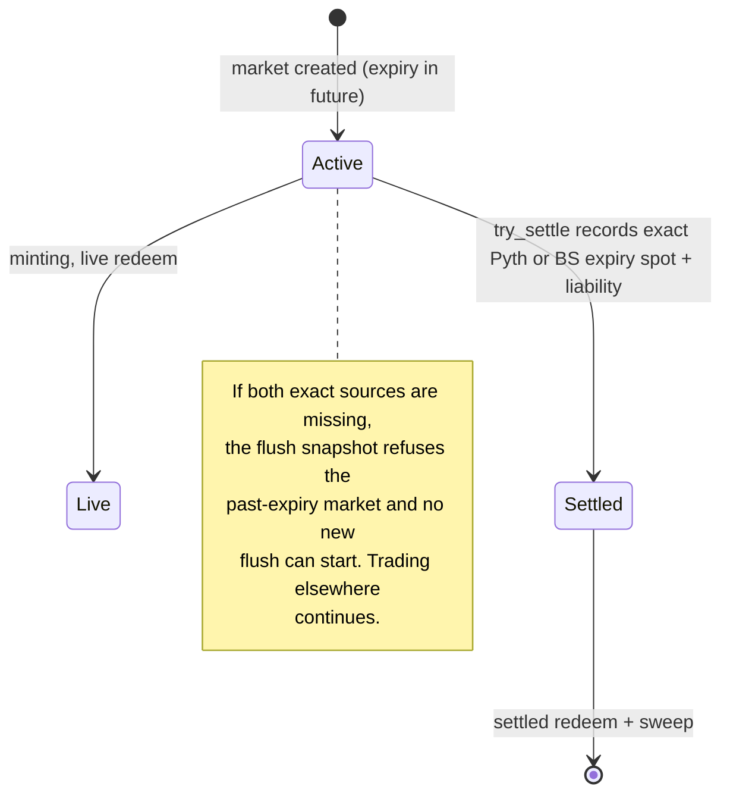

# Risks and limitations

This page is an honest account of the trust assumptions, economic risks, and known limitations of the Predict protocol. It is intended for anyone deciding whether and how to use the protocol — traders taking range positions, liquidity providers supplying the pool, and evaluators reading the contracts. Predict is in development and not yet deployed; some behaviour described here is still changing, and several limitations are properties of the current implementation rather than permanent design choices. Where a value is tunable, the mechanism is described and the magnitude is governed by [configuration](./design/configuration.md).

For the mechanisms this page evaluates, see [pricing and oracles](./concepts/pricing-and-oracles.md), [liquidity and NAV](./concepts/liquidity-and-nav.md), and the object/capability model in [architecture](./design/architecture.md).

## Trust model at a glance

| Actor / input | What it controls | What it cannot do |
| --- | --- | --- |
| Pyth Lazer feed (propbook `PythFeed`) | The spot price live pricing is built on while `use_pyth_spot_for_forward` is set, and the preferred exact settlement price with a 30-second exclusive window | Cannot write Block Scholes data; missing/unavailable source fields abort during decode; non-advancing or future timestamps are no-ops; absent, stale, or unusable normalized spot goes unused for live re-anchoring and unavailable exact history leaves settlement to retry or use Block Scholes after the grace period |
| Block Scholes source set (propbook BS spot/forward/SVI feeds) | The SVI curve and spot/forward basis used to price every range, plus exact terminal settlement after the Pyth-exclusive window | Cannot move custody, mint/redeem, create markets, or start a flush; stale, missing, or Predict-unsafe BS inputs abort at live pricing, while missing, zero, or over-wide exact settlement spot remains retryable |
| Market-lifecycle operator (`MarketLifecycleCap`) | Creating future expiry markets | Cannot start a flush, write prices or any oracle data, move custody, or mint/redeem; admin-revocable on the registry allowlist |
| `AdminCap` holder | Fees, the live-forward source, freshness thresholds, cadence allocation caps, profit share, the trading-pause and emergency-freeze switches (sole authority to lift either), underlying registration, lifecycle-cap and pool-valuation-cap minting, and genesis-bootstrapping the pool | Cannot touch a holder's position, an account balance, or pool custody directly |
| Flush starter (`PoolValuationCap`) | When the pool is valued and the LP queues drain, i.e. the oracle state at which PLP is priced | Cannot create markets, set the mark to anything but the pool's exact NAV at that instant, or fill at an off-mark price; admin-revocable on the registry allowlist |
| `PauseCap` holder | Emergency one-way switches: pause global trading, pause one market's minting, or force a protocol-wide freeze that halts the whole version-gated surface | Cannot unpause/unfreeze anything, change config, or move funds |

The remainder of this page expands each row and adds the rounding, settlement, and maturity caveats.

## Oracle trust

Every live price in Predict is built from external **propbook** feeds — objects in a separate, Predict-unaware package — and the feed families are trusted to different degrees.

**Pyth Lazer spot.** A `PythFeed` stores the latest source-native payload from one Pyth Lazer feed, updated permissionlessly from a verified Lazer payload. The feed aborts on missing/unavailable source fields, while future, zero, stale, or duplicate source timestamps are no-ops. Its normalized spot read returns `none` if the stored source value cannot be represented as a positive normalized spot. These checks reject malformed payloads and replayed latest-state updates, but they do not — and cannot — judge whether the price Pyth published is *correct*. If the underlying Lazer feed is manipulated, halted, or returns a thin print, Predict consumes whatever it delivers while the normalized spot is fresh and usable. The structural defence is freshness and fallback: when the Pyth spot is absent, stale, or unusable, live pricing stops using it and falls back to the Block Scholes forward feed rather than serving an old or non-positive spot. An admin can also take the Pyth spot out of live pricing entirely by clearing `use_pyth_spot_for_forward`, which removes this exposure at the cost of pricing off a lower-frequency forward.

**Block Scholes source set.** Range probabilities are not read directly from spot. They come from a pricing curve built on a forward and SVI parameters, written into two per-underlying Propbook stores keyed by the series id Block Scholes signs, and writable only through batch types the external `bs_oracle` signature verifier mints. Each pair is immutably bound to the provider base asset selected by the Propbook admin, and its typed write functions derive the only accepted spot, forward, and SVI ids through the provider-owned `bs_sid` package; the ids commit to the oracle package and complete subscription descriptor. This is the protocol's most concentrated trust assumption: the SVI parameters and the forward shape the probability of every range, and therefore every entry price and live NAV mark. The signature moves authenticity from the writer to the data — the relayer that lands a batch is untrusted, and a signed observation can only land in the descriptor slot it was signed for — so the residual trust is in Block Scholes itself: data quality, signer-key custody, and pause discretion (pausing the verifier halts ingestion, and stale stores then halt pricing). Predict applies its pricing-safe envelope at read time — positive spot and forward, bounded basis, bounded SVI magnitudes, `|rho| <= 1`, sigma inside Predict's accepted range, and positive analytical minimum total variance. Before that envelope, every provider-native magnitude must fit Predict's `u64` pricing domain; an over-wide signed observation aborts with `EBlockScholesInputTooWide` before narrowing, including in the flush's atomic snapshot stage, and keeps the pool-wide flush from starting until Block Scholes publishes a representable replacement. Block Scholes additionally guarantees that every published SVI surface is monotone and butterfly-arbitrage-free. Predict does not duplicate that global surface validation on chain; if active NAV boundaries nevertheless expose an inversion, that market's valuation transaction aborts before the payout-tree netting can overstate NAV — its frozen pricer cannot heal, so the flush stalls until it is discarded (bounded by the abort window) and a later flush snapshots a corrected surface. A signer violating the provider's data-quality commitments can still steer single-order prices anywhere that passes Predict's consumer-side checks.

**Staleness only mitigates, it does not authenticate.** Freshness windows guarantee Predict acts on recent data, not on honest data. Stale BS spot/forward or SVI blocks pricing entirely; a stale Pyth spot merely switches the forward source. Neither check can detect a value that is recent and wrong.

**The live mark switches forward sources at the Pyth staleness boundary.** While `use_pyth_spot_for_forward` is on and the Pyth spot is fresh, live pricing anchors the forward to it (`spot × basis`); the moment it crosses the staleness threshold, pricing falls back to the Block Scholes forward feed. That switch is discontinuous and externally observable, so a trader can time a mint or redeem to whichever side of the boundary gives the more favorable mark. The jump is bounded by the current spot-vs-BS-forward divergence, Predict's pricing-safe basis envelope, and the trade fee on both legs; one-sided mark selection across that boundary remains accepted behavior. With the setting off there is one forward source and no such boundary, at the cost of pricing off a lower-frequency forward.

**Atomic same-transaction oracle writes are rejected.** Propbook feeds are permissionless to write once a caller holds a verifier-produced payload. A live `Pricer` may not be built from an observation written in the current transaction: `pricing::resolve_live_pricer` compares each price-feeding read's `writer_digest` to `tx_context::digest()` and aborts `EOracleWrittenInThisTransaction` on a match (response policy RP-24). This closes the risk-free atomic path — mint against a stale forward, push a fresher signed update, mint the complement or redeem a seasoned position in the same PTB. It does **not** close cross-transaction timing: a trader can still write in tx N and trade in N+1, or sandwich the updater's own push (~1.4–1.8s cadence), but then carries inventory and races an honest update rather than extracting risk-free. A clock-timestamp guard was rejected because Sui's `Clock` advances per checkpoint, not per transaction.

**The live-forward source is an admin setting.** `use_pyth_spot_for_forward` selects which price feed moves live quotes, so an admin holding the `AdminCap` can change every live mark protocol-wide in one transaction, in either direction, without a package upgrade. The flip cannot be made mid-valuation, and each formula's inputs stay inside the pricing-safe envelope, but no on-chain guard bounds how far the two formulas may disagree at the instant of the flip — the envelope constrains inputs, not the gap between two admissible outputs, and the re-anchored forward is deliberately not re-checked against it (its own bound is the basis factor, `forward <= 100 × pyth_spot`). See the Block Scholes source-set entry and response policy RP-5: cross-feed deviation guards were deliberately removed. Settlement is unaffected by this setting: it checks the exact-timestamp Pyth print first under either setting, then may use the exact Block Scholes spot after the 30-second grace period.

## The privileged flush

The single most important LP-facing trust assumption is **who decides when the pool is valued**. PLP is not priced against a continuously-published pool price; it is priced only during a **flush**, and a flush can be started only by a pool-valuation operator (`PoolValuationCap`) — a revocable cap, not the root `AdminCap`. It is intended to be a cron-driven operation.

- **The flush is privileged by design.** Making it permissionless would let anyone time the valuation to a favourable oracle state and capture mispriced fills. Gating it behind the operator caps closes that timing attack. The cost is a trust assumption: the flush starter chooses the snapshot instant at which every queued supply and withdraw is priced, so the **cap-holders must not manipulate the live oracle around a flush**. They cannot set the mark to anything but the pool's exact NAV at that instant — the mark is `idle + Σ snapshot-instant market NAV`, every pricer is frozen in one atomic snapshot transaction, and each market's snapshot state is captured at that instant so post-snapshot trades cannot reach it — but they do choose the instant.
- **A single exact mark prices both directions.** Because the same `pool_nav` prices supply and withdraw, it must equal true NAV in both directions or one side is systematically advantaged. It does: each market contributes its exact recoverable value at the snapshot instant (snapshot-captured free cash minus the boundary-linear walk over the tree's captured shadows), so a supplier priced at the mark mints fair shares and a withdrawer is paid fair value. The exactness is what makes the dual-use mark safe; there is no approximation knob to mis-set.
- **Fills are FIFO.** The flush fills supplies first, then withdrawals FIFO until idle is dry, each queue bounded by its own operator-supplied budget (independent, so a supply backlog can't starve withdrawals). A request with a live executable quote but a missed user limit is protocol-cancelled and refunded by the flush that reaches it, and the drain moves straight on — a limit no mark can satisfy cannot hold up the requests behind it. The attempt count is admin-tunable and ships at one (fill-or-kill); raising it lets a request rest at the head across flushes, which stops that queue each time it misses. A withdrawer can still be deferred to a later flush if idle is exhausted. An LP can cancel a still-pending request while no flush is in flight; cancels are gated for the flush window, because the frozen mark is on-chain readable once the snapshot lands and an ungated cancel of an already-eligible request would be a free option on it — keep the fill if the mark favors you, cancel if not. Requests submitted after the snapshot are quarantined to the next mark, so submitting stays ungated.
- **Non-executable LP queue heads are isolated.** A head request whose fill is not executable at the frozen mark — PLP price outside the executable band, zero output, or a quote that does not fit in u64 — is protocol-cancelled and refunded instead of aborting the flush. Filled and protocol-refunded heads both spend that queue's flush budget. This avoids a single degenerate request blocking the pool-wide valuation and drain.
- **The pool can be closed to new capital.** An admin-set ceiling on LP-attributable pool value (`max_lp_pool_value`, uncapped by default) is applied to the supply pass at the frozen mark: a supply larger than the remaining headroom is filled up to the cap and its unfilled balance keeps its place at the head of the queue, counting the supplies already filled in that flush so a run of them cannot collectively overshoot; a supply with no room left simply waits, and the pass stops rather than emptying the queue. It bounds pool *value*, not cumulative deposits — trading profit alone can carry a capped pool above its ceiling, after which supplies wait until NAV falls back. Withdrawals and issued PLP are never gated by it, so a cap set below current pool value closes the door without trapping anyone inside — though because supplies fund same-flush exits, refusing them leaves less idle and can push a large withdrawal to a later flush.
- **Liveness depends on the operator running flushes.** Because LP fills happen only at a flush, an operator that stops flushing freezes supply and withdraw fills (escrowed funds are safe, and cancellable while no flush is in flight, but not filled). Flush cadence is therefore an operator responsibility, and an LP's effective exit latency is one flush interval.
- **A stalled flush never pauses trading; its residual costs are bounded.** A keeper that dies mid-flush leaves trading fully live — mint and close continue on every market, with no budget and no per-trade record (snapshotted markets' frozen state is already captured). What it does cost, until the flush is finished or superseded: queued LP fills wait and the flush-set markets' settlement is deferred, both bounded by `max_valuation_window_ms` — `finish_flush` refuses a flush older than that window (for everyone, including the operator), and recovery is to start a fresh flush, which discards the stalled one and re-snapshots. LP request cancels stay gated for the window; and the mark queued fills execute at is the snapshot-instant NAV, so its staleness at fill time is operator-controlled and capped by the same finish deadline.

## Settlement exact-data liveness and fallback authority

Terminal settlement is implemented by the permissionless `try_settle` transition. It reads Propbook exact history at the market expiry and atomically records one terminal price plus exact payout liability; settled redeem and the later sweep consume only that recorded state.

The remaining risks are exact-data liveness and source disagreement:

- **Exact timestamp data is still required.** There is no latest, nearest, rounded, interpolated, or at-or-after settlement read. If neither exact source is usable, `try_settle` returns false, standalone rebalance moves no cash, and the flush's snapshot stage refuses the expired-unsettled market — a new flush cannot start until settlement succeeds. A market that expires after a flush's snapshot is instead valued at its frozen pre-expiry mark, and its settlement is not blocked by the flush — `try_settle` no longer refuses a stamped market, so it settles the instant it expires.
- **No substitute NAV mark is safe.** There is no solvency-safe NAV for a past-expiry-but-unsettled market: the one PLP mark prices both supply and withdraw, so it must equal a settlement-dependent true value. Valuing at zero would dilute incumbents on supply; valuing at free cash would overpay withdrawals. The fallback performs terminal settlement; it does not value an unsettled market approximately.
- **Pyth has a 30-second exclusive window.** Every attempt reads the canonical exact Pyth row first. Before `expiry + 30_000`, its absence returns false even if an exact Block Scholes row exists. At or after that boundary, an absent Pyth row permits the exact Block Scholes spot at `expiry`; a missing, zero, or wider-than-`u64` Block Scholes value remains unavailable and retryable.
- **Block Scholes becomes terminal settlement authority after the grace period.** Each call still prefers Pyth, but execution order decides the terminal writer: Block Scholes may settle before a Pyth observation that lands later, and settlement is not revised. `MarketSettled.settlement_source` identifies which provider won. A signed but economically wrong Block Scholes exact spot therefore has payout impact, not merely live-pricing impact.
- **Both exact histories are insert-only.** Pyth `insert_at` keys a verified exact-millisecond Lazer envelope and rejects excessive carried-price age. Block Scholes `apply_spot_batch` automatically retains a verified spot at a whole-minute `source_timestamp_ms`, while its dedicated `insert_at` writes the same exact history without changing latest; non-minute timestamps are ignored for exact history. The first valid row at either source key is permanent.
- **Expiry alignment makes both keys representable, not guaranteed.** Market creation aligns every expiry to a cadence that is a multiple of the 60-second resolution. A prolonged failure to land both exact observations still keeps the whole pool's LP flush from starting (trading continues); the second independent source removes the former Pyth-only permanent brick but does not manufacture data when both providers or relayers fail.

```mermaid
stateDiagram-v2
    [*] --> Active: market created (expiry in future)
    Active --> Live: minting, live redeem
    Active --> Settled: try_settle records exact Pyth or BS expiry spot + liability
    Settled --> [*]: settled redeem + sweep
    note right of Active
      If both exact sources are missing,
      the flush snapshot refuses the
      past-expiry market and no new
      flush can start. Trading elsewhere
      continues.
    end note
```

## Admin powers

A single `AdminCap` (created at package init and transferred to the deployer, intended to be a multisig) governs the protocol's economic parameters and lifecycle. Holders should understand both what it can and what it cannot do.

The `AdminCap` can:

- tune fee parameters and the protocol's share of expiry profit (`protocol_reserve_profit_share`);
- set the mint-admission entry-probability band and minimum net premium that gate which positions may be minted;
- set the freshness thresholds that gate Pyth spot, Block Scholes spot/forward, and Block Scholes SVI;
- select which source builds the live forward (`use_pyth_spot_for_forward`): the Pyth spot carrying the Block Scholes basis, or the Block Scholes forward directly. This moves every live quote and NAV mark protocol-wide in one transaction, in either direction, and is bounded by no cross-source deviation guard — see the oracle-trust section above. It cannot be changed mid-valuation, and it does not affect settlement;
- set future-market cadence terms, including tick size, allocation cap, and deployment window;
- mint and revoke `PauseCap`s, advance the package-version watermark (`bump_version_watermark` — monotonic, no disable or re-enable), and register Propbook underlyings Predict can build markets on;
- engage or lift the trading pause and the protocol-wide emergency freeze; `set_frozen` is deliberately ungated, so an engaged freeze is always liftable without a package upgrade;
- mint and revoke the `MarketLifecycleCap`s that gate market creation and the `PoolValuationCap`s that gate starting a flush;

The `AdminCap` cannot:

- move a holder's position, an account balance, or pool custody — there is no admin path that splits, transfers, or seizes user funds or `PoolVault` balances; admin authority is over *parameters and lifecycle*, not over *custody*;
- price a flush at anything but the pool's exact NAV — it chooses *when* a flush runs, not the mark;
- write or alter oracle data — the propbook feeds are a separate package and Predict's `AdminCap` is not a Propbook feed/update authority. Selecting *which* feed live pricing reads is an admin power (above); changing *what any feed says* is not.

`PauseCap` is a deliberately narrow emergency key: admin mints it for trusted operators, and it can force global trading to paused, pause one market's minting, or engage a **protocol-wide freeze**. Every `PauseCap` action is **one-way** — only the `AdminCap` can unpause trading/minting or lift the freeze. The freeze is the broadest switch: it halts every version-gated flow (mint, redeem, settlement, valuation, and LP flush/supply/withdraw) — the same blast radius as a package-version disable, but reversible by admin without a package upgrade. Unlike the trading pause, the freeze **does** stop exits, valuation, and the flush; account-package custody withdrawals and builder-fee claims are not version-gated, so already-credited custody balances and already-earned builder fees stay withdrawable while frozen. Unredeemed positions and pending LP-queue escrow are not retrievable until admin lifts the freeze (funds are safe and reversible, not lost). (Versioning is a separate, admin-only concern: a monotonic watermark advanced by `bump_version_watermark`, with no disable or re-enable — recovery from a version *disable* is by package upgrade, whereas the freeze recovers by admin.) This means a misconfigured or compromised `PauseCap` can halt the protocol (a denial-of-service) but cannot unlock anything, change parameters, or move funds. Trading pause alone blocks new risk; exits are never gated on a flush, and fee-incentive sponsorship, config setters, and LP-request cancels are governed by the separate valuation flag, not by the trading pause; cash rebalancing runs at any time; its in-window moves cannot reach the mark, whose every figure was frozen at the seal.

The honest framing: admin trust is real but bounded. The funds-custody boundary is enforced by the module structure (balances live in modules that expose no admin transfer path), while economic-parameter trust and flush-timing trust are open-ended — an admin can make the protocol uneconomic through bad parameter choices, and can choose the oracle instant at which LPs are priced, even though it can never directly take a position or a balance, nor set the mark off true NAV.

## Holder risk

Every position is 1x: its live value is `quantity × range_probability`, and a winning position settles for its full `quantity`. There is no floor, no financing, and no liquidation — a position can lose value as the range probability moves against it, down to zero, but it can never be extinguished before expiry or settlement, and it never owes more than the premium the holder already paid.

- **Range value can fall to zero pre-settlement.** A position that is comfortably in the money at mint can lose most or all of its live value if the range probability reprices lower; the holder's maximum loss is bounded by what they paid to mint it.
- **Mint admission is a price-and-size gate, not a leverage gate.** The protocol only mints a position whose `entry_probability` lies inside a configured `[min_entry_probability, max_entry_probability]` band and whose net premium (`entry_probability × quantity`) is at least the configured minimum. This declines tail-probability and dust-sized orders.

## Liquidity-provider (PLP) risk

PLP holders supply DUSDC to `PoolVault` and receive shares whose value tracks pool net asset value (NAV). The pool is the counterparty to traders, so LP risk is fundamentally directional and path-dependent. LP actions are **asynchronous**: a supply or withdraw is a queued, escrowed request (cancellable while no flush is in flight) that can fill only during a flush, priced at one exact snapshot-instant pool mark (see [The privileged flush](#the-privileged-flush)).

- **The pool is effectively short trader payoffs.** Pool NAV includes the current value of every open position as a *liability*. When traders' positions gain value (the market moves their way), pool NAV falls; when they lose value, pool NAV rises. Fees accrue to LPs over time, but mark-to-market losses on open trader positions can accrue at the same time, so growing fee income does not guarantee a rising NAV. Realized outcomes are path-dependent: an LP who supplies and withdraws across a period of adverse marks can lose principal even while cumulative fees were positive.
- **Fills are deferred and priced at the operator's chosen instant.** Because the flush's snapshot is privileged and periodic, an LP does not control the moment its request is priced — the operator does. Escrowed funds are safe while pending (and cancellable while no flush is in flight), and request-time minimum-output limits can reject an unfavorable mark, but the effective entry/exit price is the pool NAV at the snapshot instant of whichever flush fills the request — a fill executes at finish time against that already-frozen mark, with the gap bounded by the finish deadline (`max_valuation_window_ms`). At the shipped attempt count of one, a too-tight or stale limit is not a resting order: the first flush to reach it refunds the request, and the LP must submit a new one. An LP supplying or withdrawing is implicitly trusting the operator to flush on a sane cadence and not around a manipulated oracle.
- **Live NAV is exact.** Each market's `current_nav` is free cash minus the payout tree's boundary-linear walk (`Σ quantity × P(range)` over active boundaries), floored at zero — the walk carries no per-order correction and nothing for a keeper to sweep first. The flush values each market as of its snapshot instant from state captured at that instant — the same walk over captured terms, not a correction term. The LP-facing dependence is on the *operator running flushes* and on the *oracle feeds being fresh* at the snapshot instant.
- **Valuation requires valuing every active market.** A flush must fold each snapshotted market exactly once before it can finish, and its snapshot stage must freeze a fresh pricer for every active market in one atomic transaction — stale BS price/SVI data on any one active market aborts that transaction, and a past-expiry-but-unsettled market makes it refuse outright (settle first), so either condition keeps the pool-wide flush from starting and defers every queued LP fill (see [settlement exact-data liveness](#settlement-exact-data-liveness)); trading is unaffected. After the seal, valuation reads no oracle; a market whose valuation transaction keeps failing (for example a non-monotone active-book surface at its frozen pricer) stalls the flush until it is discarded, bounded by the abort window. The active pre-expiry market count is bounded on-chain by PLP at market registration; per-market valuation cost is bounded by one `value_expiry` per transaction under the payout-tree node cap (snapshot husks are existing nodes inside that cap, released by the same transaction).
- **A stopped Block Scholes source blocks a flush even if batch transport continues.** Freshness keys on `value_timestamp` for spot/forward and `svi_timestamp` for SVI, and the SVI source timestamp also anchors roll-down. Retransmitting an unchanged update in a newer batch does not renew freshness or re-anchor the surface. Once any required source timestamp leaves its freshness window, the flush's snapshot stage aborts stale on that market, which keeps the pool-wide flush from starting and defers every queued LP fill until Block Scholes emits a newer source update and the operator retries; trading on markets with fresh feeds continues. Batch timestamps remain observable off-chain but cannot prove data freshness. The freshness bound caps roll-down attenuation at the source age, so the floor-to-zero terminal-variance interruption is unreachable; residual `ENonPositiveVariance` cases are sign/cancellation surfaces, which the same guard still aborts.
- **The protocol-profit exclusion can floor LP value at zero.** The pool excludes the protocol's not-yet-materialized profit share (the unmaterialized-profit exclusion) — plus any already-materialized cut not yet moved to the reserve (carried in `pending_protocol_profit`) — from PLP value. The realized side of that exclusion is sticky — it does not shrink when LPs withdraw against a high active mark — so if active NAV later collapses, the held-out total can exceed gross pool value. Both subtractions are clamped, so the valuation itself can finish at zero. LP requests that are not executable at that mark are protocol-cancelled and refunded rather than bricking the flush. A one-time genesis lock (`plp::lock_capital`, operator-only) mints a permanent minimum-liquidity slug of PLP that is held by the pool and never withdrawable. This is a structural on-chain guarantee (not an operational one): supply/withdraw cannot be reached before the lock, and a full LP exit can never drive `total_supply` to zero, so the residual-idle re-bootstrap brick is unreachable and dust simply accrues to the locked position.
- **Protocol profit-taking is one-directional across expiries, and the reserve is write-only — both accepted.** When an expiry materializes terminal profit, prior terminal losses are netted first — but the netting only looks backward: a profitable expiry swept before a loss-making one is booked pays the protocol its full share, and that share is not clawed back against the later loss. The over-take is a timing effect, not a permanent extraction: cumulative protocol profit is capped at the share of the running *peak* of booked net P&L, so a front-loaded cut is repaid one-for-one by suppressed cuts on later profits, and it becomes permanent only if the pool winds down (or stays loss-making) before the loss carry refills. LPs who withdraw between a front-loaded cut and that refill bear the timing difference; a material front-load requires a sweep backlog holding profits and losses concurrently, while coinciding settlement grids leave a small ever-present window whose booking order is permissionlessly choosable, bounded by the protocol share of losses settling in that window. The protocol's reserve is **write-only in this package by decision**: no withdrawal path exists, the reserve's eventual use (for example a buy-and-burn or a solvency backstop) is deliberately undecided, and the entrypoint ships with the package upgrade that decides it (response policy RP-16).
- **Pool cash funded into live markets is not directly withdrawable.** DUSDC sent into an expiry backs that market's reserve and returns to idle only through rebalancing sweeps or settlement. The rebalancer tops each active market toward its reserve target during every flush, and a flush always runs before withdrawals are paid, so an exit cannot front-run the refill of a live market. LPs may withdraw only against whatever idle remains after that rebalance; a withdrawal larger than the available idle is paid as much as idle covers and keeps the balance queued at the head, never skipped around.
- **PLP supply and withdraw carry a flat fee, and there is no valuation halt gate.** Both sides still price at the one exact mark — there is no uncertainty band and nothing attenuates under stress, so the protocol ships without any brake on exits and they stay live at every executable positive mark. A flat fee is charged on the DUSDC leg *after* the mark and retained by the pool, so it accrues to the LPs who stay rather than to the protocol; request limits are measured net of it. The two legs are independently tunable within a hard `0..5%` and ship asymmetric — **entry free, exit 20 bps** — because an exit concentrates the pool's risk on whoever stays while a deposit dilutes it. The mark itself remains exact, so a withdrawer is paid exact recoverable value less that fee, never an overstated slice. Trader payouts are separately backed by each expiry's cash reserve, so an LP exit is never a solvency event for holders. (An earlier design priced an *uncertainty-band* withdraw fee inside approximate NAV; both the band and that fee were removed with the exact-NAV rework, and this flat charge is a different object — it never enters the mark. Whether it should be enabled, and at what rate, is open: `predeploy/open-items.md` P-27.)
- **Reward incentives are outside the pool.** The current `PoolVault` holds no SUI/DEEP balance and reads no incentive-price oracle.

## Rounding and dust

Predict's monetary math rounds down by convention, and the rounding direction is chosen so the protocol — not the user, and not the pool's solvency — absorbs sub-unit dust.

- **Payouts and live redeems round down.** A live redeem pays `close_quantity × range_probability`, rounded down; the settled payout is the full `quantity` for a winning position and zero otherwise.
- **The exact live NAV rounds toward a higher liability.** `current_nav` is exact; where rounding is unavoidable it is taken so that one unit of fixed-point dust never makes the mark overstate recoverable value. The mark biases toward the protocol/incumbent LPs, never toward an over-payment on withdraw.
- **Reserved backing is computed from the same atom as payouts.** The payout tree stores each boundary's `quantity` for both reserve and settlement. A partial close removes the closed slice's quantity, leaving the survivor's terms in the tree. The net effect is that a payout can never exceed the cash reserved to back it; rounding error is biased toward the protocol retaining dust, not toward over-paying.

The practical takeaway: dust accrues to the protocol, never against solvency. Users should expect occasional one-unit shortfalls in their favour-rounded amounts, never one-unit shortfalls in backing.

## Cash-backing invariant

Predict enforces solvency in two layers — one per expiry, one across the pool.

**Per expiry.** Each expiry holds its own DUSDC in `ExpiryCash`, and the invariant the protocol maintains is that an expiry's cash always covers its **payout liability plus its isolated inventory-impact reserve**. For a live market the payout liability is a **settlement floor plus a liquidity buffer**. The floor is the maximum summed payout at any *single* settlement price (`max_payout`); because exactly one settlement price resolves a market and ranges that share no price can never all win together, the floor alone guarantees that **every winning position is paid in full at settlement** — a structural guarantee, not a statistical one. The buffer is a configured fraction (`backing_buffer_lambda`, default 31%) of the gap between that floor and the sum of every open order's maximum payout; it funds **early** (pre-settlement) exits of positions that do not overlap the book's worst-case price point. Early exits are therefore not unconditionally guaranteed in full: a live redeem that would push cash below the reserve aborts, and the holder can close a smaller quantity now, retry after the next rebalance or any offsetting flow, and always collects the full payout at settlement. Closing a position releases that position's own share of the buffer, so one trader's exit cannot consume the liquidity backing everyone else's. Setting the buffer fraction to 1.0 restores the fully self-contained reserve in which every position can be live-redeemed at its own peak, in any order. Both terms are read from maintained payout-tree aggregates. When inventory impact is enabled, the separate reserve must also cover the current book-level potential; it is excluded from NAV, live closes can spend only that reserve, and settlement releases any residual. Surplus above the combined required amount is the only cash the pool may sweep back, and the rebalancer keeps a buffer above the requirement plus a fixed cash floor.

**Across the pool.** A per-expiry allocation cap, snapshotted from cadence config when the market is created, bounds the LP capital a single expiry can absorb. It is checked on every funding move. The pool holds **no standing idle earmark** for live markets: each market's own cash covers its reserve, so a market that never receives another top-up still pays every settlement winner in full — solvency is self-contained per expiry at the floor. The rebalancer tops markets up toward their reserve target during every flush, and a flush (including every market's top-up) always runs **before** an LP withdrawal pays out, so exits cannot front-run the refill of a live market.

Three limitations follow:

- The per-expiry reserve is conservative relative to exact current NAV because it backs settlement and early exits from maintained payout-tree aggregates, so an expiry may hold more cash than its exact current liability requires.
- Backing is only as good as funding. A mint that would push an expiry's reserve above the cash it can hold is **rejected** rather than admitted-and-topped-up-later; opening new risk depends on the pool having pre-positioned enough cash within the per-expiry cap and idle liquidity, which is topped up by the permissionless rebalance and replenished by sweeps and settled-market returns.
- Early-exit liveness is bounded by the buffer. A live redeem that would push the expiry's cash below its reserve aborts (`EInsufficientCash`); the holder can close a smaller quantity, retry after the next rebalance or offsetting flow. An adversary cannot extract pool principal through exit sequencing (every redemption pays mark value the trader already owned, minus fees), but exit liquidity in a stressed market is first-come-first-served until the next refill.

## Batched transactions

Sui meters computation per transaction, and a command's cost grows with its position and the accumulated transaction state, so a large multi-command PTB costs far more than the sum of its commands run standalone. Measured on localnet before leverage was removed: a standalone mint cost about 2M MIST of computation, the hundredth identical mint in one PTB about 34M, and a 100-mint PTB consumed roughly 68% of the 5M computation-unit cap — an atomic ceiling around 110–150 mints per PTB, depending on book and transaction shape. This is platform-level metering, not a Predict code path, so the effect survives the removal even though the absolute figures were taken against a heavier per-mint path and should be re-measured; raising the gas budget does not bypass the computation wall.

Normal one-operation flows are unaffected. Routers, keepers, and integrators building atomic batches should chunk them into multiple transactions rather than assume standalone gas scales linearly, and should measure any flow designed near the ceiling — localnet gives the mechanism and direction, not a permanent production multiplier. Evidence and decision record: [`predeploy/evidence/c3-mint-batch-2026-07-01.md`](../predeploy/evidence/c3-mint-batch-2026-07-01.md) and the response-policy register (RP-10).

## Maturity and limitations

Predict is pre-deployment software. Beyond the per-topic caveats above:

- **Settlement depends on exact Propbook timestamp data.** As above, a past-expiry market cannot be valued or swept until exact Pyth succeeds or, after the 30-second grace period, exact Block Scholes succeeds at that expiry timestamp. Operators must keep both exact insertion paths available around expiry.
- **The interface is still changing.** Module boundaries, function signatures, events, and config shapes are not frozen. Integrations built against the current code should expect breaking changes. In particular, the off-chain indexer/server is not yet rewired for the current event set (async LP/flush events including request limits and limit-miss/cancel reasons, the `(lower_tick, higher_tick)`, inventory-impact charge/rebate, and SVI parameter-anchor provenance fields on pricing-derived order events, `MarketCreated` carrying `propbook_underlying_id`, `tick_size`, cadence terms, and the immutable policy snapshot including `inventory_impact_max_rate`, slimmer expiry-cash/profit events, full-post-state `StrikeExposureTemplateConfigUpdated`, `PricingConfigUpdated`, `EwmaConfigUpdated`, and `PlpFeeRatesUpdated` config-history events, and the removed oracle events).
- **The package address is unset pre-deploy.** The indexer is wired to fail fast on an empty package address rather than silently index nothing; this is a development guard, not a runtime risk, but it reflects that the system has not yet been deployed end-to-end.
- **Valuation quantity math has a documented u64 envelope.** The per-strike valuation accumulator multiplies quantity by strike price in u64: a maximum-size single mint overflows (and cleanly aborts) only at strikes above roughly $430k, and the aggregate valuation fold would need on the order of $123–184M of concentrated high-strike open interest in one expiry — far above normal cadence allocation caps — before it could abort valuation. Accepted and bounded by allocation caps rather than widened.

None of these are reasons the design is unsound; they are the difference between a designed protocol and an audited, deployed, battle-tested one. Anyone integrating before deployment should treat the economics as correct-by-design but unproven-in-production.

## Related reading

- [Pricing and oracles](./concepts/pricing-and-oracles.md) — how spot, BS forward, and SVI form live prices, and the forward fallback.
- [Liquidity and NAV](./concepts/liquidity-and-nav.md) — the async queues, the privileged flush, and how pool NAV and PLP shares are computed.
- [Architecture](./design/architecture.md) — objects, capital ownership, and the capability model.
- [Configuration](./design/configuration.md) — every tunable value and who can change it.
